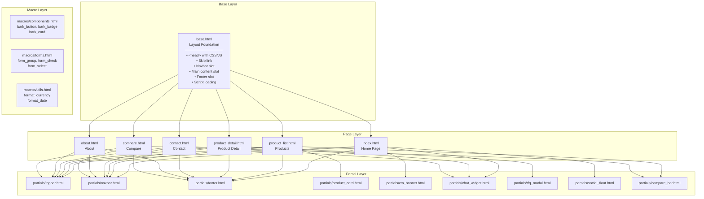
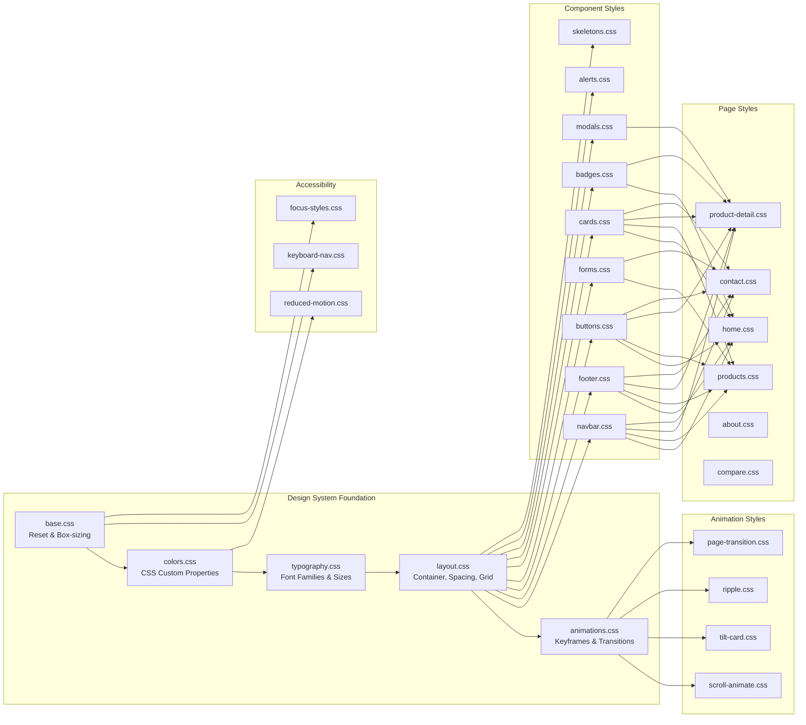
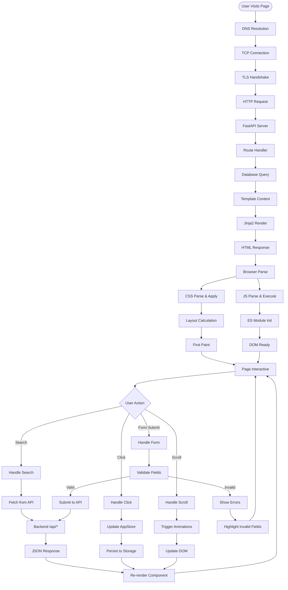
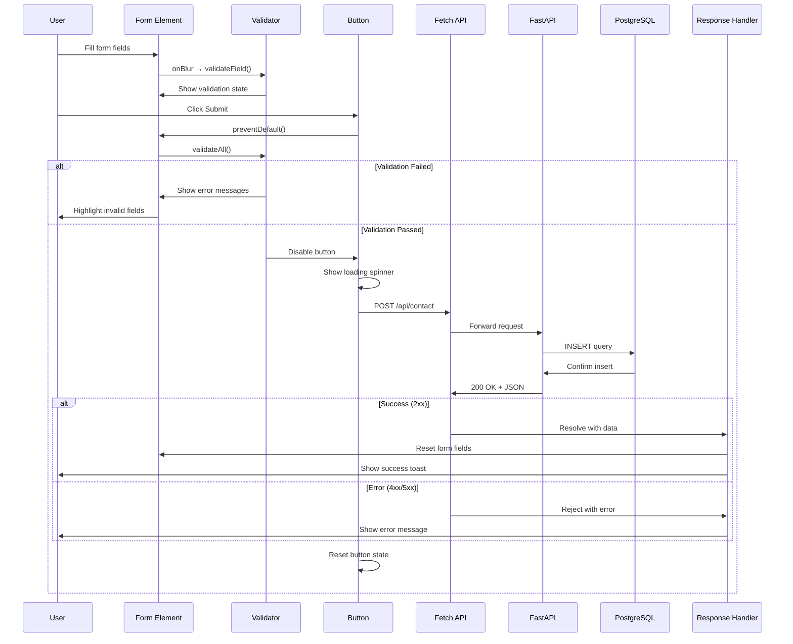
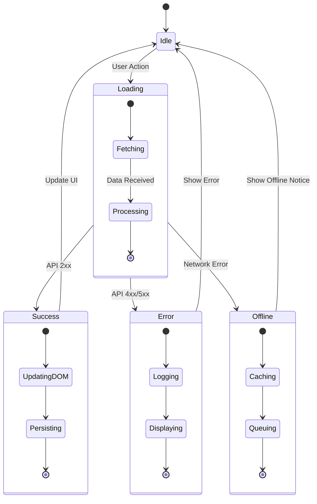
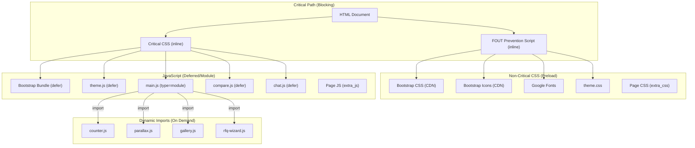

# Frontend Design Plan — Bark Technologies

**Version:** 2.0
**Date:** July 2026
**Purpose:** Comprehensive frontend architecture document with HLD/LLD principles, SOLID principles, and modern design patterns for FastAPI + Jinja2 + Bootstrap 5 + Vanilla JS stack

---

## Table of Contents

1. [HIGH-LEVEL UI ARCHITECTURE (HLD)](#1-high-level-ui-architecture-hld)
2. [LOW-LEVEL COMPONENT DESIGN (LLD)](#2-low-level-component-design-lld)
3. [SOLID PRINCIPLES IN FRONTEND](#3-solid-principles-in-frontend)
4. [MERMAID DIAGRAMS](#4-mermaid-diagrams)
5. [DESIGN SYSTEM](#5-design-system)
6. [IMPLEMENTATION DETAILS](#6-implementation-details)
7. [TEMPLATE INHERITANCE STRUCTURE](#7-template-inheritance-structure)
8. [COMPONENT COMPOSITION PATTERNS](#8-component-composition-patterns)
9. [CSS ARCHITECTURE (BEM METHODOLOGY)](#9-css-architecture-bem-methodology)
10. [JAVASCRIPT MODULE SYSTEM](#10-javascript-module-system)
11. [FORM HANDLING PATTERNS](#11-form-handling-patterns)
12. [RESPONSIVE DESIGN SYSTEM](#12-responsive-design-system)
13. [ACCESSIBILITY FRAMEWORK](#13-accessibility-framework)
14. [STATE MANAGEMENT APPROACH](#14-state-management-approach)
15. [ASSET PIPELINE STRATEGY](#15-asset-pipeline-strategy)
16. [PERFORMANCE OPTIMIZATION](#16-performance-optimization)
17. [SECURITY CONSIDERATIONS](#17-security-considerations)
18. [TESTING STRATEGY](#18-testing-strategy)
19. [DEPLOYMENT CHECKLIST](#19-deployment-checklist)
20. [APPENDIX](#20-appendix)

---

## 1. HIGH-LEVEL UI ARCHITECTURE (HLD)

### 1.1 Component Hierarchy

The frontend architecture follows a hierarchical component model where each layer has clear responsibilities and single ownership.

**Architecture Layers:**

1. **Base Layer** (`base.html`) — The layout skeleton that defines `<head>`, navigation slots, footer, and script loading order. Every page template extends this.
2. **Page Layer** (`index.html`, `product_list.html`, etc.) — Full pages that fill the `content`, `extra_css`, and `extra_js` blocks defined by base.
3. **Partial Layer** (`partials/navbar.html`, `partials/footer.html`, etc.) — Reusable HTML fragments included via ``. No inheritance, just composition.
4. **Macro Layer** (`macros/components.html`, `macros/forms.html`) — Parameterized, callable template functions for truly reusable UI primitives (buttons, cards, form groups).
5. **CSS Layer** — Organized by concern: design-system foundations, component styles, page-specific styles, animation styles, and accessibility overrides.
6. **JavaScript Layer** — ES Module system with entry point (`main.js`), state management, component modules, animation modules, and utility modules.

**Key Design Decisions:**

- Template inheritance is limited to 2 levels (base → page) to keep the hierarchy shallow and maintainable.
- Partials are used for repeated fragments that appear across multiple pages (navbar, footer, chat widget).
- Macros are used for parameterized, reusable UI atoms (buttons, badges, form groups, cards).
- CSS is split by concern, not by page, to maximize reuse and minimize duplication.
- JavaScript uses native ES Modules with dynamic imports for code splitting.

### 1.2 State Management Approach

The application uses a **hybrid state management** approach combining server-side rendering with client-side interactivity:

#### Server-Side State (Primary — FastAPI + Jinja2)

| State Type | Storage | Lifetime | Example |
|---|---|---|---|
| Template Context | Python dict passed to `TemplateResponse()` | Per-request | Product list, categories, user profile |
| Session State | Signed cookie / server session | Per-session | Auth token, user preferences |
| Flash Messages | Session + one-time read | One request | "Product added to compare" notification |

**Best Practice:** Keep business logic in Python. Templates only render — no complex calculations, no database calls, no API requests from Jinja2.

```python
# bark/app/routes/products.py
@router.get("/products")
async def product_list(request: Request, category: str = None):
    products = await get_products(category=category)
    categories = await get_categories()

    return templates.TemplateResponse(
        "product_list.html",
        {
            "request": request,
            "products": products,
            "categories": categories,
            "current_category": category
        }
    )
```

#### Client-Side State (Secondary — Vanilla JS)

| State Type | Storage | Lifetime | Example |
|---|---|---|---|
| App Store | JavaScript singleton object | Tab session | Compare list, UI state, notifications |
| LocalStorage | Browser persistent | Until cleared | Theme preference, compare list |
| SessionStorage | Browser session | Tab lifetime | Form drafts, temporary UI state |
| Event Bus | In-memory pub/sub | Tab session | Cross-component communication |

```javascript
// bark/app/static/js/state/store.js
export const AppStore = {
    _state: {},
    _listeners: {},

    init() {
        this._state = {
            theme: localStorage.getItem('bark_theme') || 'light',
            compareList: JSON.parse(localStorage.getItem('bark_compare') || '[]'),
            cartCount: 0,
            notifications: []
        };
    },

    get(key) {
        return this._state[key];
    },

    set(key, value) {
        const oldValue = this._state[key];
        this._state[key] = value;
        this._persist(key, value);
        this._emit(key, value, oldValue);
    },

    subscribe(key, callback) {
        if (!this._listeners[key]) {
            this._listeners[key] = [];
        }
        this._listeners[key].push(callback);
        return () => {
            this._listeners[key] = this._listeners[key].filter(cb => cb !== callback);
        };
    },

    _persist(key, value) {
        if (['theme', 'compareList'].includes(key)) {
            localStorage.setItem(`bark_${key}`, JSON.stringify(value));
        }
    },

    _emit(key, newValue, oldValue) {
        if (this._listeners[key]) {
            this._listeners[key].forEach(cb => cb(newValue, oldValue));
        }
        document.dispatchEvent(new CustomEvent('store:change', {
            detail: { key, newValue, oldValue }
        }));
    }
};
```

### 1.3 Asset Pipeline Strategy

The asset pipeline is designed for maximum performance with minimal tooling:

#### CSS Loading Order (in `<head>`)

1. **Critical CSS** — Inline `<style>` block with above-the-fold styles (hero section, navbar, body fonts)
2. **Bootstrap 5.3.3** — CDN (compressed, cached globally)
3. **Bootstrap Icons** — CDN
4. **Google Fonts** — `Barlow Semi Condensed` (headings) + `Inter` (body) via `display=swap`
5. **Design System CSS** — `theme.css` which imports `colors.css`, `typography.css`, `layout.css`, `animations.css`
6. **Component CSS** — `navbar.css`, `footer.css`, `buttons.css`, `forms.css`, `cards.css`
7. **Page CSS** — Loaded per-page via `` (e.g., `home.css`, `products.css`)

#### JavaScript Loading Order (before `</body>`)

1. **Bootstrap Bundle** — CDN with Popper.js (for dropdowns, modals, tooltips)
2. **Theme Toggle** — `theme.js` (synchronous, prevents flash of wrong theme)
3. **Main Entry Point** — `main.js` loaded as `type="module"` (ES Modules)
4. **Global Utilities** — `compare.js`, `chat.js` loaded with `defer`
5. **Page-Specific** — Via `` (e.g., `counter.js`, `parallax.js`)

### 1.4 Responsive Design System

**Mobile-First Approach:** All styles are written for mobile first, with progressive enhancement via `min-width` media queries.

**Breakpoints (Bootstrap 5 Compatible):**

| Breakpoint | Width | Target |
|---|---|---|
| `xs` | < 576px | Mobile portrait |
| `sm` | ≥ 576px | Mobile landscape |
| `md` | ≥ 768px | Tablet portrait |
| `lg` | ≥ 992px | Tablet landscape / desktop |
| `xl` | ≥ 1200px | Desktop |
| `xxl` | ≥ 1400px | Large desktop |

**Grid Strategy:**

- Bootstrap 12-column grid for page layouts
- CSS Grid for complex component layouts (product galleries, compare tables, filter panels)
- Flexbox for component-level alignment (buttons, badges, form groups)

### 1.5 Accessibility Framework

**WCAG 2.1 AA Compliance:**

| Requirement | Implementation |
|---|---|
| Semantic HTML | Proper heading hierarchy (h1→h6), landmarks (`<header>`, `<main>`, `<footer>`), lists for navigation |
| ARIA Labels | For icon-only buttons, form inputs, interactive elements without visible text |
| Keyboard Navigation | Tab order, focus management, skip links, visible focus indicators |
| Color Contrast | Minimum 4.5:1 for normal text, 3:1 for large text (verified for all color combinations) |
| Screen Reader Support | `alt` text, `aria-live` regions for dynamic content, proper form labels |
| Reduced Motion | `prefers-reduced-motion` media query disables all animations |
| Focus Management | `:focus-visible` for keyboard users, `:focus:not(:focus-visible)` for mouse users |

---

## 2. LOW-LEVEL COMPONENT DESIGN (LLD)

### 2.1 Template Inheritance Structure

**Base Template Block Inventory:**

| Block Name | Purpose | Required |
|---|---|---|
| `title` | Page title in `<title>` tag | Yes (default provided) |
| `meta_description` | SEO meta description | Yes (default provided) |
| `meta_keywords` | SEO keywords | Optional |
| `extra_css` | Page-specific CSS | Optional |
| `extra_js` | Page-specific JavaScript | Optional |
| `content` | Main page content | Yes |
| `json_ld` | Structured data for SEO | Optional |
| `og_title` | Open Graph title | Optional |
| `og_description` | Open Graph description | Optional |

**Base Template Structure:**

```html
<!DOCTYPE html>
<html lang="en">
<head>
    <meta charset="UTF-8">
    <meta name="viewport" content="width=device-width, initial-scale=1">

    <script>
        (function () {
            var stored = localStorage.getItem("bark_theme");
            var theme = stored === "dark" || stored === "light"
                ? stored
                : (window.matchMedia("(prefers-color-scheme: dark)").matches ? "dark" : "light");
            document.documentElement.setAttribute("data-bs-theme", theme);
        })();
    </script>

    <title>{{ settings.app_name }}</title>
    <meta name="description" content="Bark Technologies — corrugated machinery">

    <link rel="icon" type="image/png" href="/static/images/favicon.png">
    <link href="https://cdn.jsdelivr.net/npm/bootstrap@5.3.3/dist/css/bootstrap.min.css" rel="stylesheet">
    <link href="https://cdn.jsdelivr.net/npm/bootstrap-icons@1.11.3/font/bootstrap-icons.min.css" rel="stylesheet">
    <link href="https://fonts.googleapis.com/css2?family=Barlow+Semi+Condensed:wght@600;700&family=Inter:wght@400;500;600&display=swap" rel="stylesheet">
    <link href="/static/css/theme.css" rel="stylesheet">
    
    
</head>
<body>
    <a href="#main-content" class="skip-link">Skip to main content</a>

    
    

    <main id="main-content" role="main" class="site-main">
        
    </main>

    
    
    
    
    

    <script src="https://cdn.jsdelivr.net/npm/bootstrap@5.3.3/dist/js/bootstrap.bundle.min.js"></script>
    <script src="/static/js/theme.js" defer></script>
    <script type="module" src="/static/js/main.js"></script>
    <script src="/static/js/compare.js" defer></script>
    <script src="/static/js/chat.js" defer></script>
    
</body>
</html>
```

### 2.2 Component Composition Patterns

#### Pattern 1: Template Inheritance (Page → Base)

Pages extend base and fill blocks:

```html

Products | {{ settings.app_name }}
<link rel="stylesheet" href="/static/css/pages/products.css">

    <section class="section">
        <div class="container">
            {# Page content here #}
        </div>
    </section>

```

#### Pattern 2: Inclusion (Partials)

Shared fragments included in base or pages:

```html
{# In base.html #}



{# In page template #}

```

#### Pattern 3: Macros (Parameterized Components)

Reusable UI atoms with parameters:

```html
{# macros/components.html #}


<a href="{{ href }}" class="bark-btn bark-btn--{{ variant }} bark-btn--{{ size }}">
    <i class="bi bi-{{ icon }}"></i>
    {{ text }}
</a>

<button type="button" class="bark-btn bark-btn--{{ variant }} bark-btn--{{ size }}">
    <i class="bi bi-{{ icon }}"></i>
    {{ text }}
</button>




<div class="form-group">
    <label for="{{ name }}" class="form-label">
        {{ label }}
        <span class="text-danger" aria-hidden="true">*</span>
    </label>
    <input type="{{ type }}" class="bark-input is-invalid"
           id="{{ name }}" name="{{ name }}"
           required aria-required="true"
           placeholder="{{ placeholder }}">
    <div class="invalid-feedback" role="alert">{{ error }}</div>
</div>

```

#### Pattern 4: Block Composition (Parent + Child)

Parent defines structure, child fills slots:

```html
{# components/card.html #}
<div class="bark-card bark-card--{{ variant }}">
    
    
    
</div>
```

### 2.3 CSS Architecture (BEM Methodology)

**BEM Naming Convention:**

```
Block              Element              Modifier             State
.bark-card     →   .bark-card__header  .bark-card--primary  .bark-card.is-active
                   .bark-card__body    .bark-card--lg       .bark-card.is-loading
                   .bark-card__footer  .bark-card--flat     .bark-card.is-hidden

.product-card  →   .product-card__image     .product-card--featured
                   .product-card__title     .product-card--compact
                   .product-card__price
                   .product-card__actions

.nav           →   .nav__list               .nav--fixed
                   .nav__item               .nav--vertical
                   .nav__link               .nav__item.is-active
```

**CSS File Organization by Concern:**

```
css/
├── design-system/        ← Foundation (shared across all pages)
│   ├── base.css          ← Reset, box-sizing, body defaults
│   ├── colors.css        ← All CSS custom properties
│   ├── typography.css    ← Font families, sizes, line heights
│   ├── layout.css        ← Container, spacing, grid utilities
│   └── animations.css    ← Keyframe definitions, transition utilities
│
├── components/           ← Reusable UI components (appear on multiple pages)
│   ├── navbar.css
│   ├── footer.css
│   ├── buttons.css
│   ├── forms.css
│   ├── cards.css
│   ├── badges.css
│   ├── modals.css
│   ├── alerts.css
│   └── skeletons.css
│
├── pages/                ← Page-specific styles (loaded via extra_css block)
│   ├── home.css
│   ├── products.css
│   ├── product-detail.css
│   ├── contact.css
│   ├── about.css
│   └── compare.css
│
├── animations/           ← Animation-specific styles
│   ├── scroll-animate.css
│   ├── tilt-card.css
│   ├── ripple.css
│   └── page-transition.css
│
├── accessibility/        ← Accessibility overrides
│   ├── keyboard-nav.css
│   ├── focus-styles.css
│   └── reduced-motion.css
│
└── theme.css             ← Entry point (imports all design-system files)
```

**Import Order in theme.css:**

```css
@import url('design-system/base.css');
@import url('design-system/colors.css');
@import url('design-system/typography.css');
@import url('design-system/layout.css');
@import url('design-system/animations.css');

@import url('components/navbar.css');
@import url('components/footer.css');
@import url('components/buttons.css');
@import url('components/forms.css');
@import url('components/cards.css');
@import url('components/badges.css');
@import url('components/modals.css');
@import url('components/alerts.css');
@import url('components/skeletons.css');

@import url('animations/scroll-animate.css');
@import url('animations/tilt-card.css');
@import url('animations/ripple.css');
@import url('animations/page-transition.css');

@import url('accessibility/keyboard-nav.css');
@import url('accessibility/focus-styles.css');
@import url('accessibility/reduced-motion.css');
```

### 2.4 JavaScript Module System

**Module Organization:**

```
js/
├── main.js               ← Entry point (DOMContentLoaded)
├── theme.js              ← Theme toggle (non-module, runs early)
├── compare.js            ← Compare functionality (non-module)
├── chat.js               ← Chat widget (non-module)
│
├── state/
│   ├── store.js          ← Global state singleton (AppStore)
│   └── actions.js        ← State mutation functions
│
├── components/
│   ├── theme-toggle.js   ← Theme switcher component
│   ├── compare-slider.js ← Image comparison slider
│   ├── swipe-carousel.js ← Touch-friendly carousel
│   ├── gallery.js        ← Product image gallery
│   ├── quick-view.js     ← Quick view modal
│   └── rfq-wizard.js     ← Quote request wizard
│
├── animations/
│   ├── scroll-animate.js ← IntersectionObserver scroll animations
│   ├── tilt-card.js      ← 3D card tilt effect
│   ├── ripple.js         ← Button ripple effect
│   ├── counter.js        ← Animated number counter
│   ├── parallax.js       ← Parallax scrolling effect
│   └── page-transition.js← Page transition overlay
│
└── utils/
    ├── event-bus.js      ← Pub/sub event system
    ├── api.js            ← Fetch wrapper with error handling
    ├── helpers.js        ← Utility functions (debounce, throttle, etc.)
    ├── validators.js     ← Form validation functions
    ├── form-handler.js   ← Form submission handler
    └── lazy-load.js      ← Lazy loading utility
```

**Key Module Patterns:**

1. **ES Modules (ESM)** — All new JS uses `import`/`export` syntax
2. **Dynamic Imports** — Page-specific modules loaded via `import()` for code splitting
3. **Pub/Sub Event Bus** — Components communicate via events, not direct references
4. **Singleton State** — `AppStore` is a single instance shared across modules
5. **Class-based Components** — Each component is a class with `init()`, `destroy()` methods

### 2.5 Form Handling Patterns

**Client-Side Validation:**

```javascript
export const Validators = {
    required(value) {
        return value.trim() !== '' || 'This field is required';
    },
    email(value) {
        const regex = /^[^\s@]+@[^\s@]+\.[^\s@]+$/;
        return regex.test(value) || 'Please enter a valid email';
    },
    phone(value) {
        const regex = /^[\+]?[(]?[0-9]{3}[)]?[-\s\.]?[0-9]{3}[-\s\.]?[0-9]{4,6}$/;
        return regex.test(value) || 'Please enter a valid phone number';
    },
    minLength(value, min) {
        return value.length >= min || `Minimum ${min} characters required`;
    }
};
```

**Form Handler Class:**

```javascript
export class FormHandler {
    constructor(formElement) {
        this.form = formElement;
        this.errors = {};
        this.init();
    }

    init() {
        this.form.addEventListener('submit', (e) => this.handleSubmit(e));
        const inputs = this.form.querySelectorAll('input, textarea, select');
        inputs.forEach(input => {
            input.addEventListener('blur', () => this.validateField(input));
            input.addEventListener('input', () => this.clearError(input));
        });
    }

    validateField(field) {
        const rules = field.dataset.validate?.split('|') || [];
        const value = field.value;

        for (const rule of rules) {
            const [validator, ...params] = rule.split(':');
            const result = Validators[validator]?.(value, ...params);
            if (result !== true) {
                this.showError(field, result);
                return false;
            }
        }

        this.clearError(field);
        return true;
    }

    showError(field, message) {
        this.errors[field.name] = message;
        field.classList.add('is-invalid');
        const feedback = field.nextElementSibling;
        if (feedback?.classList.contains('invalid-feedback')) {
            feedback.textContent = message;
        }
    }

    clearError(field) {
        delete this.errors[field.name];
        field.classList.remove('is-invalid');
    }

    async handleSubmit(e) {
        e.preventDefault();
        const fields = this.form.querySelectorAll('input, textarea, select');
        let isValid = true;
        fields.forEach(field => {
            if (!this.validateField(field)) isValid = false;
        });
        if (!isValid) return;

        const submitBtn = this.form.querySelector('[type="submit"]');
        const originalText = submitBtn.innerHTML;
        submitBtn.innerHTML = '<i class="bi bi-arrow-repeat spin"></i> Sending...';
        submitBtn.disabled = true;

        try {
            const formData = new FormData(this.form);
            const response = await fetch(this.form.action, {
                method: 'POST',
                body: formData
            });
            const result = await response.json();
            if (result.success) {
                this.form.reset();
                EventBus.emit('form:success', result);
            } else {
                EventBus.emit('form:error', result);
            }
        } catch (error) {
            EventBus.emit('form:error', { message: 'An error occurred' });
        } finally {
            submitBtn.innerHTML = originalText;
            submitBtn.disabled = false;
        }
    }
}
```

---

## 3. SOLID PRINCIPLES IN FRONTEND

### 3.1 Single Responsibility Principle (SRP)

Each component, module, and function does exactly one thing.

**Good Examples:**

```javascript
// GOOD: ThemeToggle only handles theme switching
export class ThemeToggle {
    constructor() {
        this.button = document.querySelector('.theme-toggle-btn');
        this.init();
    }
    init() {
        this.button?.addEventListener('click', () => this.toggle());
    }
    toggle() {
        const current = document.documentElement.getAttribute('data-bs-theme');
        const next = current === 'dark' ? 'light' : 'dark';
        document.documentElement.setAttribute('data-bs-theme', next);
        localStorage.setItem('bark_theme', next);
    }
}

// GOOD: EmailValidator only validates email format
export class EmailValidator {
    validate(value) {
        return /^[^\s@]+@[^\s@]+\.[^\s@]+$/.test(value);
    }
    getMessage() {
        return 'Please enter a valid email address';
    }
}

// GOOD: EventBus only handles event pub/sub
export const EventBus = {
    _listeners: {},
    on(event, callback) { /* ... */ },
    off(event, callback) { /* ... */ },
    emit(event, data) { /* ... */ }
};
```

**Bad Example:**

```javascript
// BAD: UserManager does too many unrelated things
class UserManager {
    toggleTheme() { /* ... */ }
    validateEmail() { /* ... */ }
    submitForm() { /* ... */ }
    loadProducts() { /* ... */ }
    animateCards() { /* ... */ }
}
```

### 3.2 Open/Closed Principle (OCP)

Components are open for extension but closed for modification. New behavior is added through configuration, not by editing source code.

**Extensible via Data Attributes:**

```javascript
// Base Component — closed for modification
export class BaseComponent {
    constructor(element) {
        this.element = element;
        this.options = this.parseDataAttributes();
    }

    parseDataAttributes() {
        const options = {};
        for (const attr of this.element.attributes) {
            if (attr.name.startsWith('data-')) {
                const key = attr.name.slice(5).replace(/-./g, x => x[1].toUpperCase());
                options[key] = attr.value;
            }
        }
        return options;
    }
}

// ProductCard — open for extension via options
export class ProductCard extends BaseComponent {
    constructor(element) {
        super(element);
        if (this.options.tilt) this.initTilt();
        if (this.options.quickView) this.initQuickView();
        if (this.options.animate) this.initAnimate();
    }
}
```

```html
<!-- HTML — new features enabled via data attributes, no JS changes needed -->
<div class="product-card" data-animate data-tilt data-quick-view>
</div>
```

### 3.3 Interface Segregation Principle (ISP)

Interfaces are small and focused. Clients only depend on the methods they actually use.

**Good: Focused Interfaces**

```javascript
export const Animatable = {
    animate(element, type = 'fade-up') {
        element.classList.add('is-visible');
    },
    reset(element) {
        element.classList.remove('is-visible');
    }
};

export const Clickable = {
    onClick(element, callback) {
        element.addEventListener('click', callback);
    },
    offClick(element, callback) {
        element.removeEventListener('click', callback);
    }
};

export const Formattable = {
    currency(value) {
        return new Intl.NumberFormat('en-IN', {
            style: 'currency', currency: 'INR'
        }).format(value);
    },
    date(value) {
        return new Date(value).toLocaleDateString('en-IN');
    }
};
```

**Bad: Fat Interface**

```javascript
export const UIComponent = {
    animate() { /* ... */ },
    click() { /* ... */ },
    format() { /* ... */ },
    validate() { /* ... */ },
    submit() { /* ... */ },
    fetch() { /* ... */ },
    render() { /* ... */ },
    destroy() { /* ... */ },
    // ... 20 more unrelated methods
};
```

### 3.4 Dependency Inversion Principle (DIP)

High-level modules depend on abstractions, not concrete implementations.

```javascript
// Abstraction — API interface
export const ApiService = {
    async get(endpoint) {
        const response = await fetch(endpoint);
        return response.json();
    },
    async post(endpoint, data) {
        const response = await fetch(endpoint, {
            method: 'POST',
            headers: { 'Content-Type': 'application/json' },
            body: JSON.stringify(data)
        });
        return response.json();
    }
};

// High-level module — depends on abstraction
export class ProductManager {
    constructor(api = ApiService) {
        this.api = api;
    }
    async loadProducts() {
        return this.api.get('/api/products');
    }
}

// Low-level module — can be swapped for testing
export const MockApiService = {
    async get(endpoint) { return { data: [] }; },
    async post(endpoint, data) { return { success: true }; }
};

// Dependency injection at runtime
const api = process.env.NODE_ENV === 'test' ? MockApiService : ApiService;
const productManager = new ProductManager(api);
```

---

## 4. MERMAID DIAGRAMS

### 4.1 Component Tree — Template Inheritance



### 4.2 CSS Dependency Graph



### 4.3 User Interaction Flow



### 4.4 Form Submission Flow



### 4.5 State Management Flow



### 4.6 Asset Loading Strategy



---

## 5. DESIGN SYSTEM

### 5.1 Color Palette with CSS Variables

```css
/* bark/app/static/css/design-system/colors.css */

:root {
    /* === Brand Colors === */
    --bark-navy: #243559;
    --bark-navy-dark: #1a2640;
    --bark-navy-light: #3d5a80;
    --bark-red: #db2017;
    --bark-red-dark: #b91b13;
    --bark-red-light: #ff4d44;

    /* === Neutral Palette === */
    --bark-white: #ffffff;
    --bark-gray-50: #f8f9fa;
    --bark-gray-100: #f1f3f5;
    --bark-gray-200: #e9ecef;
    --bark-gray-300: #dee2e6;
    --bark-gray-400: #ced4da;
    --bark-gray-500: #adb5bd;
    --bark-gray-600: #868e96;
    --bark-gray-700: #495057;
    --bark-gray-800: #343a40;
    --bark-gray-900: #212529;
    --bark-black: #0d1117;

    /* === Semantic Colors === */
    --bark-success: #40c057;
    --bark-success-light: #d3f9d8;
    --bark-warning: #fab005;
    --bark-warning-light: #fff3bf;
    --bark-info: #339af0;
    --bark-info-light: #d0ebff;
    --bark-error: #db2017;
    --bark-error-light: #ffe3e3;

    /* === Surface Colors === */
    --bark-surface: #ffffff;
    --bark-surface-elevated: #ffffff;
    --bark-surface-overlay: rgba(0, 0, 0, 0.5);
    --bark-surface-muted: #f8f9fa;
    --bark-surface-inverse: #212529;

    /* === Border Colors === */
    --bark-border: #e9ecef;
    --bark-border-subtle: rgba(0, 0, 0, 0.06);
    --bark-border-strong: #ced4da;
    --bark-border-focus: #339af0;

    /* === Shadow System === */
    --bark-shadow-xs: 0 1px 2px rgba(0, 0, 0, 0.05);
    --bark-shadow-sm: 0 1px 3px rgba(0, 0, 0, 0.1), 0 1px 2px rgba(0, 0, 0, 0.06);
    --bark-shadow-md: 0 4px 6px -1px rgba(0, 0, 0, 0.1), 0 2px 4px -1px rgba(0, 0, 0, 0.06);
    --bark-shadow-lg: 0 10px 15px -3px rgba(0, 0, 0, 0.1), 0 4px 6px -2px rgba(0, 0, 0, 0.05);
    --bark-shadow-xl: 0 20px 25px -5px rgba(0, 0, 0, 0.1), 0 10px 10px -5px rgba(0, 0, 0, 0.04);
    --bark-shadow-2xl: 0 25px 50px -12px rgba(0, 0, 0, 0.25);
    --bark-shadow-inner: inset 0 2px 4px rgba(0, 0, 0, 0.06);

    /* === Gradient System === */
    --bark-gradient-primary: linear-gradient(135deg, var(--bark-navy) 0%, var(--bark-navy-dark) 100%);
    --bark-gradient-accent: linear-gradient(135deg, var(--bark-red) 0%, var(--bark-red-dark) 100%);
    --bark-gradient-surface: linear-gradient(180deg, var(--bark-gray-50) 0%, var(--bark-white) 100%);
    --bark-gradient-hero: linear-gradient(135deg, #1a2640 0%, #243559 50%, #3d5a80 100%);

    /* === Typography === */
    --bark-font-heading: "Barlow Semi Condensed", "Inter", system-ui, sans-serif;
    --bark-font-body: "Inter", system-ui, sans-serif;
    --bark-font-mono: "JetBrains Mono", "Fira Code", monospace;

    /* === Fluid Font Sizes === */
    --bark-text-xs: clamp(0.75rem, 0.7rem + 0.25vw, 0.875rem);
    --bark-text-sm: clamp(0.875rem, 0.8rem + 0.35vw, 1rem);
    --bark-text-base: clamp(1rem, 0.9rem + 0.5vw, 1.125rem);
    --bark-text-lg: clamp(1.125rem, 1rem + 0.6vw, 1.25rem);
    --bark-text-xl: clamp(1.25rem, 1.1rem + 0.75vw, 1.5rem);
    --bark-text-2xl: clamp(1.5rem, 1.2rem + 1.5vw, 2rem);
    --bark-text-3xl: clamp(1.875rem, 1.5rem + 1.875vw, 2.5rem);
    --bark-text-4xl: clamp(2.25rem, 1.8rem + 2.25vw, 3rem);
    --bark-text-5xl: clamp(3rem, 2.4rem + 3vw, 4rem);
    --bark-text-6xl: clamp(3.5rem, 3rem + 3.5vw, 6rem);

    /* === Spacing Scale (4px base) === */
    --bark-space-0: 0;
    --bark-space-px: 1px;
    --bark-space-0-5: 0.125rem;
    --bark-space-1: 0.25rem;
    --bark-space-1-5: 0.375rem;
    --bark-space-2: 0.5rem;
    --bark-space-3: 0.75rem;
    --bark-space-4: 1rem;
    --bark-space-5: 1.25rem;
    --bark-space-6: 1.5rem;
    --bark-space-8: 2rem;
    --bark-space-10: 2.5rem;
    --bark-space-12: 3rem;
    --bark-space-16: 4rem;
    --bark-space-20: 5rem;
    --bark-space-24: 6rem;
    --bark-space-32: 8rem;

    /* === Border Radius === */
    --bark-radius-none: 0;
    --bark-radius-sm: 0.25rem;
    --bark-radius-md: 0.375rem;
    --bark-radius-lg: 0.5rem;
    --bark-radius-xl: 0.75rem;
    --bark-radius-2xl: 1rem;
    --bark-radius-3xl: 1.5rem;
    --bark-radius-full: 9999px;

    /* === Transitions === */
    --bark-transition-fast: 150ms ease;
    --bark-transition-base: 250ms ease;
    --bark-transition-slow: 350ms ease;
    --bark-transition-spring: 500ms cubic-bezier(0.34, 1.56, 0.64, 1);

    /* === Z-Index Scale === */
    --bark-z-dropdown: 1000;
    --bark-z-sticky: 1020;
    --bark-z-fixed: 1030;
    --bark-z-modal-backdrop: 1040;
    --bark-z-modal: 1050;
    --bark-z-popover: 1060;
    --bark-z-tooltip: 1070;
    --bark-z-toast: 1080;
}

/* === Dark Mode Overrides === */
[data-bs-theme="dark"] {
    --bark-surface: #1c212b;
    --bark-surface-elevated: #21252b;
    --bark-surface-overlay: rgba(0, 0, 0, 0.7);
    --bark-surface-muted: #1c212b;
    --bark-surface-inverse: #f8f9fa;

    --bark-border: #2f3542;
    --bark-border-subtle: rgba(255, 255, 255, 0.08);
    --bark-border-strong: #495057;

    --bark-shadow-xs: 0 1px 2px rgba(0, 0, 0, 0.2);
    --bark-shadow-sm: 0 1px 3px rgba(0, 0, 0, 0.3), 0 1px 2px rgba(0, 0, 0, 0.2);
    --bark-shadow-md: 0 4px 6px -1px rgba(0, 0, 0, 0.3), 0 2px 4px -1px rgba(0, 0, 0, 0.2);
    --bark-shadow-lg: 0 10px 15px -3px rgba(0, 0, 0, 0.3), 0 4px 6px -2px rgba(0, 0, 0, 0.2);

    --bark-gradient-primary: linear-gradient(135deg, #1a2640 0%, #0d1118 100%);
    --bark-gradient-hero: linear-gradient(135deg, #0d1118 0%, #1a2640 50%, #243559 100%);
}
```

### 5.2 Typography System

```css
/* bark/app/static/css/design-system/typography.css */

body {
    font-family: var(--bark-font-body);
    font-size: var(--bark-text-base);
    line-height: 1.6;
    color: var(--bark-gray-800);
    -webkit-font-smoothing: antialiased;
    -moz-osx-font-smoothing: grayscale;
}

h1, h2, h3, h4, h5, h6,
.h1, .h2, .h3, .h4, .h5, .h6 {
    font-family: var(--bark-font-heading);
    font-weight: 700;
    line-height: 1.2;
    color: var(--bark-navy);
    letter-spacing: -0.02em;
    margin-top: 0;
}

h1, .h1 { font-size: var(--bark-text-5xl); }
h2, .h2 { font-size: var(--bark-text-4xl); }
h3, .h3 { font-size: var(--bark-text-3xl); }
h4, .h4 { font-size: var(--bark-text-2xl); }
h5, .h5 { font-size: var(--bark-text-xl); }
h6, .h6 { font-size: var(--bark-text-lg); }

.display-1 {
    font-size: clamp(3.5rem, 3rem + 3.5vw, 6rem);
    font-weight: 700;
    line-height: 1.05;
    letter-spacing: -0.03em;
}

.display-2 {
    font-size: clamp(3rem, 2.5rem + 3vw, 5rem);
    font-weight: 700;
    line-height: 1.1;
    letter-spacing: -0.025em;
}

.text-lead {
    font-size: var(--bark-text-xl);
    line-height: 1.7;
    color: var(--bark-gray-600);
}

.text-small {
    font-size: var(--bark-text-sm);
    line-height: 1.5;
}

.text-caption {
    font-size: var(--bark-text-xs);
    line-height: 1.4;
    color: var(--bark-gray-500);
    text-transform: uppercase;
    letter-spacing: 0.05em;
    font-weight: 600;
}

.section-heading {
    text-align: center;
    margin-bottom: var(--bark-space-12);
}

.section-heading .text-caption {
    display: block;
    margin-bottom: var(--bark-space-3);
    color: var(--bark-red);
}

.section-heading h2 {
    margin-bottom: var(--bark-space-4);
}

.section-heading p {
    max-width: 600px;
    margin: 0 auto;
    color: var(--bark-gray-600);
    font-size: var(--bark-text-lg);
}
```

### 5.3 Spacing and Layout System

```css
/* bark/app/static/css/design-system/layout.css */

.container {
    width: 100%;
    max-width: 1200px;
    margin-left: auto;
    margin-right: auto;
    padding-left: var(--bark-space-4);
    padding-right: var(--bark-space-4);
}

@media (min-width: 768px) {
    .container { padding-left: var(--bark-space-6); padding-right: var(--bark-space-6); }
}

.section {
    padding-top: var(--bark-space-16);
    padding-bottom: var(--bark-space-16);
}

@media (min-width: 768px) {
    .section {
        padding-top: var(--bark-space-24);
        padding-bottom: var(--bark-space-24);
    }
}

.section--sm { padding-top: var(--bark-space-8); padding-bottom: var(--bark-space-8); }
.section--lg { padding-top: var(--bark-space-24); padding-bottom: var(--bark-space-24); }

@media (min-width: 768px) {
    .section--lg { padding-top: var(--bark-space-32); padding-bottom: var(--bark-space-32); }
}

.flex-center { display: flex; align-items: center; justify-content: center; }
.flex-between { display: flex; align-items: center; justify-content: space-between; }
.flex-column-center { display: flex; flex-direction: column; align-items: center; text-align: center; }
```

### 5.4 Component Library

**Button Components:**

```css
/* bark/app/static/css/components/buttons.css */

.bark-btn {
    display: inline-flex;
    align-items: center;
    justify-content: center;
    gap: var(--bark-space-2);
    padding: var(--bark-space-3) var(--bark-space-6);
    font-family: var(--bark-font-body);
    font-size: var(--bark-text-sm);
    font-weight: 600;
    line-height: 1.5;
    text-decoration: none;
    border: 2px solid transparent;
    border-radius: var(--bark-radius-lg);
    cursor: pointer;
    transition: all var(--bark-transition-fast);
    position: relative;
    overflow: hidden;
    white-space: nowrap;
    user-select: none;
}

.bark-btn--primary { background: var(--bark-navy); color: var(--bark-white); }
.bark-btn--primary:hover { background: var(--bark-navy-dark); transform: translateY(-1px); box-shadow: var(--bark-shadow-md); }

.bark-btn--accent { background: var(--bark-red); color: var(--bark-white); }
.bark-btn--accent:hover { background: var(--bark-red-dark); transform: translateY(-1px); box-shadow: var(--bark-shadow-md); }

.bark-btn--outline { background: transparent; border-color: var(--bark-navy); color: var(--bark-navy); }
.bark-btn--outline:hover { background: var(--bark-navy); color: var(--bark-white); }

.bark-btn--ghost { background: transparent; border-color: transparent; color: var(--bark-navy); }
.bark-btn--ghost:hover { background: var(--bark-gray-100); }

.bark-btn--sm { padding: var(--bark-space-2) var(--bark-space-4); font-size: var(--bark-text-xs); }
.bark-btn--lg { padding: var(--bark-space-4) var(--bark-space-8); font-size: var(--bark-text-base); border-radius: var(--bark-radius-xl); }
.bark-btn--icon { width: 44px; height: 44px; padding: 0; border-radius: var(--bark-radius-full); }

.bark-btn:focus-visible { outline: 3px solid var(--bark-border-focus); outline-offset: 2px; }
.bark-btn:disabled, .bark-btn.is-disabled { opacity: 0.5; pointer-events: none; cursor: not-allowed; }
.bark-btn.is-loading { pointer-events: none; }
.bark-btn.is-loading::after { content: ''; width: 16px; height: 16px; border: 2px solid transparent; border-top-color: currentColor; border-radius: 50%; animation: spin 0.6s linear infinite; }

@keyframes spin { to { transform: rotate(360deg); } }
```

**Card Components:**

```css
/* bark/app/static/css/components/cards.css */

.bark-card {
    background: var(--bark-surface);
    border: 1px solid var(--bark-border);
    border-radius: var(--bark-radius-xl);
    padding: var(--bark-space-6);
    box-shadow: var(--bark-shadow-sm);
    transition: all var(--bark-transition-base);
}

.bark-card:hover { box-shadow: var(--bark-shadow-lg); transform: translateY(-4px); }

.bark-card__header { margin-bottom: var(--bark-space-4); padding-bottom: var(--bark-space-4); border-bottom: 1px solid var(--bark-border); }
.bark-card__body { flex: 1; }
.bark-card__footer { margin-top: var(--bark-space-4); padding-top: var(--bark-space-4); border-top: 1px solid var(--bark-border); }

.bark-card--primary { border-color: var(--bark-navy); background: linear-gradient(135deg, var(--bark-navy) 0%, var(--bark-navy-dark) 100%); color: var(--bark-white); }
.bark-card--accent { border-color: var(--bark-red); background: linear-gradient(135deg, var(--bark-red) 0%, var(--bark-red-dark) 100%); color: var(--bark-white); }
.bark-card--flat { box-shadow: none; border: none; }
.bark-card--flat:hover { transform: none; box-shadow: var(--bark-shadow-md); }

.product-card {
    background: var(--bark-surface);
    border: 1px solid var(--bark-border);
    border-radius: var(--bark-radius-xl);
    overflow: hidden;
    transition: all var(--bark-transition-base);
}

.product-card:hover { box-shadow: var(--bark-shadow-xl); transform: translateY(-8px); }

.product-card__image { position: relative; aspect-ratio: 4/3; overflow: hidden; background: var(--bark-surface-muted); }
.product-card__image img { width: 100%; height: 100%; object-fit: cover; transition: transform var(--bark-transition-slow); }
.product-card:hover .product-card__image img { transform: scale(1.05); }
.product-card__badge { position: absolute; top: var(--bark-space-3); left: var(--bark-space-3); }
.product-card__body { padding: var(--bark-space-4); }
.product-card__title { font-size: var(--bark-text-lg); font-weight: 600; margin-bottom: var(--bark-space-2); color: var(--bark-navy); }
.product-card__price { font-size: var(--bark-text-xl); font-weight: 700; color: var(--bark-red); }
.product-card__actions { display: flex; gap: var(--bark-space-2); margin-top: var(--bark-space-4); }
```

**Form Components:**

```css
/* bark/app/static/css/components/forms.css */

.form-group { margin-bottom: var(--bark-space-4); }

.form-label {
    display: block;
    font-size: var(--bark-text-sm);
    font-weight: 600;
    color: var(--bark-gray-700);
    margin-bottom: var(--bark-space-2);
}

.bark-input {
    width: 100%;
    padding: var(--bark-space-3) var(--bark-space-4);
    font-family: var(--bark-font-body);
    font-size: var(--bark-text-base);
    line-height: 1.5;
    color: var(--bark-gray-800);
    background: var(--bark-surface);
    border: 2px solid var(--bark-border);
    border-radius: var(--bark-radius-lg);
    transition: all var(--bark-transition-fast);
}

.bark-input:hover { border-color: var(--bark-gray-400); }
.bark-input:focus { outline: none; border-color: var(--bark-border-focus); box-shadow: 0 0 0 3px rgba(51, 154, 240, 0.15); }
.bark-input::placeholder { color: var(--bark-gray-400); }
.bark-input.is-valid { border-color: var(--bark-success); }
.bark-input.is-invalid { border-color: var(--bark-error); }
.bark-input:disabled { background: var(--bark-gray-100); opacity: 0.7; cursor: not-allowed; }

textarea.bark-input { min-height: 120px; resize: vertical; }

select.bark-input {
    appearance: none;
    background-image: url("data:image/svg+xml,%3csvg xmlns='http://www.w3.org/2000/svg' viewBox='0 0 16 16'%3e%3cpath fill='none' stroke='%23343a40' stroke-linecap='round' stroke-linejoin='round' stroke-width='2' d='m2 5 6 6 6-6'/%3e%3c/svg%3e");
    background-repeat: no-repeat;
    background-position: right var(--bark-space-3) center;
    background-size: 16px 12px;
    padding-right: var(--bark-space-10);
}

.invalid-feedback { display: none; font-size: var(--bark-text-sm); color: var(--bark-error); margin-top: var(--bark-space-1); }
.is-invalid ~ .invalid-feedback { display: block; }
```

### 5.5 Animation Library

```css
/* bark/app/static/css/design-system/animations.css */

/* Scroll-triggered animations */
[data-animate] { opacity: 0; transform: translateY(30px); transition: opacity 0.6s ease, transform 0.6s ease; }
[data-animate].is-visible { opacity: 1; transform: translateY(0); }
[data-animate="fade-up"] { transform: translateY(30px); }
[data-animate="fade-down"] { transform: translateY(-30px); }
[data-animate="fade-left"] { transform: translateX(30px); }
[data-animate="fade-right"] { transform: translateX(-30px); }
[data-animate="scale-up"] { transform: scale(0.9); }
[data-animate="scale-down"] { transform: scale(1.1); }
[data-animate].is-visible { transform: none; }

/* Transition utilities */
.transition-all { transition: all var(--bark-transition-base); }
.transition-fast { transition: all var(--bark-transition-fast); }
.transition-slow { transition: all var(--bark-transition-slow); }
.transition-spring { transition: all var(--bark-transition-spring); }

/* Keyframe animations */
@keyframes fadeIn { from { opacity: 0; } to { opacity: 1; } }
@keyframes fadeInUp { from { opacity: 0; transform: translateY(20px); } to { opacity: 1; transform: translateY(0); } }
@keyframes fadeInDown { from { opacity: 0; transform: translateY(-20px); } to { opacity: 1; transform: translateY(0); } }
@keyframes fadeInLeft { from { opacity: 0; transform: translateX(20px); } to { opacity: 1; transform: translateX(0); } }
@keyframes fadeInRight { from { opacity: 0; transform: translateX(-20px); } to { opacity: 1; transform: translateX(0); } }
@keyframes scaleIn { from { opacity: 0; transform: scale(0.9); } to { opacity: 1; transform: scale(1); } }
@keyframes slideInUp { from { transform: translateY(100%); } to { transform: translateY(0); } }
@keyframes pulse { 0%, 100% { opacity: 1; } 50% { opacity: 0.5; } }
@keyframes spin { to { transform: rotate(360deg); } }
@keyframes bounce { 0%, 100% { transform: translateY(0); } 50% { transform: translateY(-10px); } }
@keyframes shake { 0%, 100% { transform: translateX(0); } 10%, 30%, 50%, 70%, 90% { transform: translateX(-5px); } 20%, 40%, 60%, 80% { transform: translateX(5px); } }

/* Animation utilities */
.animate-fade-in { animation: fadeIn 0.3s ease forwards; }
.animate-fade-in-up { animation: fadeInUp 0.3s ease forwards; }
.animate-scale-in { animation: scaleIn 0.3s ease forwards; }
.animate-pulse { animation: pulse 2s ease-in-out infinite; }
.animate-spin { animation: spin 1s linear infinite; }
.animate-bounce { animation: bounce 1s ease infinite; }

/* Reduced motion */
@media (prefers-reduced-motion: reduce) {
    *, *::before, *::after {
        animation-duration: 0.01ms !important;
        animation-iteration-count: 1 !important;
        transition-duration: 0.01ms !important;
        scroll-behavior: auto !important;
    }
    [data-animate] { opacity: 1; transform: none; }
}
```

### 5.6 Badge Components

```css
/* bark/app/static/css/components/badges.css */

.bark-badge {
    display: inline-flex;
    align-items: center;
    padding: var(--bark-space-1) var(--bark-space-3);
    font-size: var(--bark-text-xs);
    font-weight: 600;
    line-height: 1.5;
    border-radius: var(--bark-radius-full);
}

.bark-badge--primary { background: rgba(36, 53, 89, 0.1); color: var(--bark-navy); }
.bark-badge--accent { background: rgba(219, 32, 23, 0.1); color: var(--bark-red); }
.bark-badge--success { background: rgba(64, 192, 87, 0.1); color: var(--bark-success); }
.bark-badge--warning { background: rgba(250, 176, 5, 0.1); color: var(--bark-warning); }
.bark-badge--info { background: rgba(51, 154, 240, 0.1); color: var(--bark-info); }

[data-bs-theme="dark"] .bark-badge--primary { background: rgba(91, 126, 196, 0.2); }
[data-bs-theme="dark"] .bark-badge--accent { background: rgba(242, 85, 74, 0.2); }
```

---

## 6. IMPLEMENTATION DETAILS

### 6.1 Complete Page Template Examples

#### Home Page

```html
<!-- bark/app/templates/index.html -->


Home | {{ settings.app_name }}
Bark Technologies — packaging machines, creasing matrix, die cutting, laminating, and nationwide service across India.


<link rel="stylesheet" href="/static/css/pages/home.css">



<!-- Hero Section with Video Background -->
<section class="hero-section" data-parallax>
    <div class="hero-bg">
        <video autoplay muted loop playsinline class="hero-video">
            <source src="/static/videos/hero-bg.mp4" type="video/mp4">
        </video>
        <div class="hero-overlay"></div>
    </div>

    <div class="hero-content container">
        <div class="row align-items-center min-vh-75">
            <div class="col-lg-8" data-animate="fade-up">
                <span class="bark-badge bark-badge--accent mb-4">India's Trusted Partner</span>
                <h1 class="display-1 text-white mb-4">
                    Industrial Machinery for <span class="text-accent">Corrugated Board</span> Manufacturing
                </h1>
                <p class="text-lead text-white-50 mb-6">
                    Die cutting, laminating, stitching, and post-press equipment with nationwide service and 24/7 support.
                </p>
                <div class="d-flex flex-wrap gap-4">
                    <a href="/products" class="bark-btn bark-btn--accent bark-btn--lg">
                        <i class="bi bi-grid"></i> Explore Products
                    </a>
                    <button type="button" class="bark-btn bark-btn--outline bark-btn--lg text-white border-white" data-rfq-trigger>
                        <i class="bi bi-chat-dots"></i> Request Quote
                    </button>
                </div>
            </div>
        </div>
    </div>

    <div class="hero-scroll-indicator" data-animate="fade-up" data-delay="1000">
        <div class="mouse"><div class="mouse-wheel"></div></div>
        <span>Scroll to explore</span>
    </div>
</section>

<!-- Stats Counter Section -->
<section class="section bg-light" data-parallax data-speed="0.3">
    <div class="container">
        <div class="row g-4 text-center">
            <div class="col-6 col-md-3" data-animate="fade-up" data-delay="0">
                <div class="stat-item">
                    <span class="stat-number" data-count="500">0</span>+
                    <span class="stat-label">Machines Installed</span>
                </div>
            </div>
            <div class="col-6 col-md-3" data-animate="fade-up" data-delay="100">
                <div class="stat-item">
                    <span class="stat-number" data-count="15">0</span>+
                    <span class="stat-label">Years Experience</span>
                </div>
            </div>
            <div class="col-6 col-md-3" data-animate="fade-up" data-delay="200">
                <div class="stat-item">
                    <span class="stat-number" data-count="50">0</span>+
                    <span class="stat-label">Cities Covered</span>
                </div>
            </div>
            <div class="col-6 col-md-3" data-animate="fade-up" data-delay="300">
                <div class="stat-item">
                    <span class="stat-number" data-count="24">0</span>/7
                    <span class="stat-label">Support Available</span>
                </div>
            </div>
        </div>
    </div>
</section>

<!-- Products Showcase -->
<section class="section">
    <div class="container">
        <div class="section-heading" data-animate="fade-up">
            <span class="text-caption">Our Products</span>
            <h2>Explore Our Product Range</h2>
            <p>Industry-leading machinery for corrugated board manufacturing</p>
        </div>

        <div class="row g-4">
            
            <div class="col-md-6 col-lg-4" data-animate="fade-up" data-delay="{{ loop.index0 * 100 }}">
                
            </div>
            
        </div>

        <div class="text-center mt-8" data-animate="fade-up">
            <a href="/products" class="bark-btn bark-btn--primary bark-btn--lg">
                View All Products <i class="bi bi-arrow-right"></i>
            </a>
        </div>
    </div>
</section>

<!-- About Section with Parallax Image -->
<section class="section about-section" data-parallax>
    <div class="container">
        <div class="row align-items-center g-8">
            <div class="col-lg-6" data-animate="fade-right">
                <div class="about-image-wrapper">
                    
                    <div class="about-image-accent"></div>
                    <div class="experience-badge">
                        <span class="experience-number">15</span>
                        <span class="experience-text">Years of Excellence</span>
                    </div>
                </div>
            </div>
            <div class="col-lg-6" data-animate="fade-left">
                <span class="text-caption text-accent">About Bark Technologies</span>
                <h2 class="mb-4">Your Trusted Partner in Packaging Machinery</h2>
                <p class="text-lead mb-6">
                    Emerging and growing partner in post-press equipment solutions and machinery across India and neighbouring countries.
                </p>
                <div class="about-features">
                    <div class="about-feature" data-animate="fade-up" data-delay="100">
                        <div class="about-feature-icon"><i class="bi bi-award"></i></div>
                        <div><h4>Certified Company</h4><p>ISO certified with all necessary licenses</p></div>
                    </div>
                    <div class="about-feature" data-animate="fade-up" data-delay="200">
                        <div class="about-feature-icon"><i class="bi bi-people"></i></div>
                        <div><h4>Expert Team</h4><p>50+ skilled professionals</p></div>
                    </div>
                    <div class="about-feature" data-animate="fade-up" data-delay="300">
                        <div class="about-feature-icon"><i class="bi bi-geo-alt"></i></div>
                        <div><h4>Pan-India Presence</h4><p>Service centers across 50+ cities</p></div>
                    </div>
                </div>
                <a href="/about" class="bark-btn bark-btn--primary mt-6">
                    Learn More About Us <i class="bi bi-arrow-right"></i>
                </a>
            </div>
        </div>
    </div>
</section>

<!-- Video Section -->
<section class="section bg-dark text-white">
    <div class="container">
        <div class="row align-items-center g-8">
            <div class="col-lg-6" data-animate="fade-right">
                <span class="text-caption text-accent">Watch Our Story</span>
                <h2 class="text-white mb-4">See Our Machinery in Action</h2>
                <p class="text-white-50 mb-6">
                    Get a glimpse of our state-of-the-art manufacturing facility and precision machinery.
                </p>
                <ul class="video-features">
                    <li><i class="bi bi-check-circle-fill text-accent me-2"></i>Live manufacturing demos</li>
                    <li><i class="bi bi-check-circle-fill text-accent me-2"></i>Quality testing process</li>
                    <li><i class="bi bi-check-circle-fill text-accent me-2"></i>Customer testimonials</li>
                </ul>
            </div>
            <div class="col-lg-6" data-animate="fade-left">
                <div class="video-wrapper">
                    <div class="ratio ratio-16x9 rounded-2xl overflow-hidden">
                        <iframe src="{{ youtube_embed_url }}" title="Bark Technologies video" allowfullscreen loading="lazy"></iframe>
                    </div>
                </div>
            </div>
        </div>
    </div>
</section>

<!-- Testimonials Section -->
<section class="section">
    <div class="container">
        <div class="section-heading" data-animate="fade-up">
            <span class="text-caption">Testimonials</span>
            <h2>What Our Clients Say</h2>
            <p>Trusted by leading packaging companies across India</p>
        </div>
        <div class="testimonials-slider" data-animate="fade-up">
            <div class="testimonial-card">
                <div class="testimonial-rating">
                    <i class="bi bi-star-fill"></i><i class="bi bi-star-fill"></i><i class="bi bi-star-fill"></i><i class="bi bi-star-fill"></i><i class="bi bi-star-fill"></i>
                </div>
                <p class="testimonial-text">"Exceptional quality machinery and outstanding after-sales support. Bark Technologies has been our go-to partner for 5 years."</p>
                <div class="testimonial-author">
                    
                    <div><strong>Rajesh Kumar</strong><span>Director, ABC Packaging</span></div>
                </div>
            </div>
        </div>
    </div>
</section>

<!-- CTA Banner -->




<script src="/static/js/animations/counter.js" defer></script>
<script src="/static/js/animations/parallax.js" defer></script>

```

#### Product List Page

```html
<!-- bark/app/templates/product_list.html -->


Products | {{ settings.app_name }}
<link rel="stylesheet" href="/static/css/pages/products.css">


<section class="page-header">
    <div class="container">
        <div class="row align-items-center">
            <div class="col-lg-8" data-animate="fade-up">
                <span class="text-caption text-accent">Our Catalog</span>
                <h1 class="mb-3">Product Range</h1>
                <p class="text-lead mb-0">Explore our comprehensive range of corrugated board manufacturing machinery</p>
            </div>
            <div class="col-lg-4 text-lg-end" data-animate="fade-up" data-delay="200">
                <span class="text-muted">{{ products|length }} products found</span>
            </div>
        </div>
    </div>
</section>

<section class="section--sm">
    <div class="container">
        <div class="row g-6">
            <!-- Sidebar Filters -->
            <div class="col-lg-3">
                <div class="filter-sidebar" data-animate="fade-right">
                    <div class="filter-header">
                        <h4>Filters</h4>
                        <button type="button" class="btn-link" id="clearFilters">Clear All</button>
                    </div>
                    <div class="filter-group">
                        <label class="filter-label">Search</label>
                        <div class="search-input-wrapper">
                            <i class="bi bi-search"></i>
                            <input type="text" class="bark-input" placeholder="Search products..." id="productSearch">
                        </div>
                    </div>
                    <div class="filter-group">
                        <label class="filter-label">Category</label>
                        <div class="filter-options">
                            
                            <label class="filter-checkbox">
                                <input type="checkbox" name="category" value="{{ category.id }}">
                                <span class="checkbox-custom"></span>
                                <span class="checkbox-label">{{ category.name }}</span>
                                <span class="checkbox-count">{{ category.product_count }}</span>
                            </label>
                            
                        </div>
                    </div>
                    <div class="filter-group">
                        <label class="filter-label">Price Range</label>
                        <div class="price-range-slider">
                            <input type="range" min="0" max="100000" value="50000" class="range-slider" id="priceRange">
                            <div class="price-range-values">
                                <span id="priceMin">₹0</span>
                                <span id="priceMax">₹1,00,000</span>
                            </div>
                        </div>
                    </div>
                    <button type="button" class="bark-btn bark-btn--primary w-100">Apply Filters</button>
                </div>
            </div>

            <!-- Products Grid -->
            <div class="col-lg-9">
                <div class="products-toolbar" data-animate="fade-up">
                    <div class="view-toggle">
                        <button type="button" class="view-btn active" data-view="grid" aria-label="Grid view"><i class="bi bi-grid-3x3-gap"></i></button>
                        <button type="button" class="view-btn" data-view="list" aria-label="List view"><i class="bi bi-list"></i></button>
                    </div>
                    <div class="sort-dropdown">
                        <select class="bark-input" id="sortSelect">
                            <option value="featured">Featured</option>
                            <option value="name-asc">Name: A to Z</option>
                            <option value="name-desc">Name: Z to A</option>
                            <option value="price-asc">Price: Low to High</option>
                            <option value="price-desc">Price: High to Low</option>
                        </select>
                    </div>
                </div>

                <div class="products-grid" id="productsGrid">
                    
                    <div class="product-card-wrapper" data-animate="fade-up" data-delay="{{ loop.index0 * 50 }}">
                        
                    </div>
                    
                    <div class="empty-state">
                        <i class="bi bi-box-seam"></i>
                        <h3>No products found</h3>
                        <p>Try adjusting your filters or search terms</p>
                    </div>
                    
                </div>

                <nav class="pagination-wrapper" aria-label="Product pagination">
                    <ul class="pagination">
                        <li class="page-item disabled"><a class="page-link" href="#" aria-label="Previous"><i class="bi bi-chevron-left"></i></a></li>
                        <li class="page-item active"><a class="page-link" href="#">1</a></li>
                        <li class="page-item"><a class="page-link" href="#">2</a></li>
                        <li class="page-item"><a class="page-link" href="#">3</a></li>
                        <li class="page-item"><a class="page-link" href="#" aria-label="Next"><i class="bi bi-chevron-right"></i></a></li>
                    </ul>
                </nav>
            </div>
        </div>
    </div>
</section>

```

### 6.2 Main JavaScript Entry Point

```javascript
// bark/app/static/js/main.js
import { AppStore } from './state/store.js';
import { EventBus } from './utils/event-bus.js';
import { ScrollAnimate } from './animations/scroll-animate.js';
import { TiltCard } from './animations/tilt-card.js';
import { Ripple } from './animations/ripple.js';
import { ThemeToggle } from './components/theme-toggle.js';
import { CompareSlider } from './components/compare-slider.js';
import { SwipeCarousel } from './components/swipe-carousel.js';
import { FormHandler } from './utils/form-handler.js';
import { LazyLoad } from './utils/lazy-load.js';

document.addEventListener('DOMContentLoaded', () => {
    AppStore.init();
    EventBus.init();

    new ThemeToggle();
    new ScrollAnimate();
    new Ripple();
    new LazyLoad();

    initializePageComponents();
    initializeForms();
});

function initializePageComponents() {
    const productCards = document.querySelectorAll('.product-card');
    if (productCards.length) new TiltCard(productCards);

    document.querySelectorAll('.swipe-carousel').forEach(c => new SwipeCarousel(c));
    document.querySelectorAll('.compare-slider').forEach(s => new CompareSlider(s));

    const counters = document.querySelectorAll('[data-count]');
    if (counters.length) {
        import('./animations/counter.js').then(module => new module.CounterAnimation(counters));
    }

    const parallaxElements = document.querySelectorAll('[data-parallax]');
    if (parallaxElements.length) {
        import('./animations/parallax.js').then(module => new module.ParallaxEffect(parallaxElements));
    }
}

function initializeForms() {
    document.querySelectorAll('form[data-validate]').forEach(form => new FormHandler(form));
}
```

### 6.3 Scroll Animation Module

```javascript
// bark/app/static/js/animations/scroll-animate.js
export class ScrollAnimate {
    constructor() {
        this.elements = document.querySelectorAll('[data-animate]');
        this.observer = null;
        this.init();
    }

    init() {
        if ('IntersectionObserver' in window) {
            this.observer = new IntersectionObserver(
                (entries) => this.handleIntersect(entries),
                { threshold: 0.1, rootMargin: '0px 0px -50px 0px' }
            );
            this.elements.forEach(el => this.observer.observe(el));
        } else {
            this.elements.forEach(el => el.classList.add('is-visible'));
        }
    }

    handleIntersect(entries) {
        entries.forEach(entry => {
            if (entry.isIntersecting) {
                this.animateElement(entry.target);
                this.observer.unobserve(entry.target);
            }
        });
    }

    animateElement(el) {
        const delay = parseInt(el.dataset.delay) || 0;
        setTimeout(() => el.classList.add('is-visible'), delay);
    }

    destroy() {
        if (this.observer) this.observer.disconnect();
    }
}
```

### 6.4 Tilt Card Module

```javascript
// bark/app/static/js/animations/tilt-card.js
export class TiltCard {
    constructor(cards) {
        this.cards = cards || document.querySelectorAll('.tilt-card');
        this.init();
    }

    init() {
        this.cards.forEach(card => {
            card.addEventListener('mousemove', (e) => this.handleMove(e, card));
            card.addEventListener('mouseleave', (e) => this.handleLeave(e, card));
        });
    }

    handleMove(e, card) {
        const rect = card.getBoundingClientRect();
        const x = e.clientX - rect.left;
        const y = e.clientY - rect.top;
        const centerX = rect.width / 2;
        const centerY = rect.height / 2;
        const rotateX = ((y - centerY) / centerY) * -10;
        const rotateY = ((x - centerX) / centerX) * 10;
        card.style.transform = `perspective(1000px) rotateX(${rotateX}deg) rotateY(${rotateY}deg) scale3d(1.02, 1.02, 1.02)`;
    }

    handleLeave(e, card) {
        card.style.transform = 'perspective(1000px) rotateX(0) rotateY(0) scale3d(1, 1, 1)';
    }
}
```

### 6.5 Event Bus Module

```javascript
// bark/app/static/js/utils/event-bus.js
export const EventBus = {
    _listeners: {},

    init() {
        this._listeners = {};
    },

    on(event, callback) {
        if (!this._listeners[event]) this._listeners[event] = [];
        this._listeners[event].push(callback);
        return () => {
            this._listeners[event] = this._listeners[event].filter(cb => cb !== callback);
        };
    },

    off(event, callback) {
        if (!this._listeners[event]) return;
        this._listeners[event] = this._listeners[event].filter(cb => cb !== callback);
    },

    emit(event, data) {
        if (!this._listeners[event]) return;
        this._listeners[event].forEach(callback => callback(data));
    }
};
```

### 6.6 API Utility Module

```javascript
// bark/app/static/js/utils/api.js
export const Api = {
    baseUrl: '/api',

    async get(endpoint) {
        const response = await fetch(`${this.baseUrl}${endpoint}`, {
            headers: { 'Content-Type': 'application/json', 'X-Requested-With': 'XMLHttpRequest' }
        });
        return this.handleResponse(response);
    },

    async post(endpoint, data) {
        const response = await fetch(`${this.baseUrl}${endpoint}`, {
            method: 'POST',
            headers: { 'Content-Type': 'application/json', 'X-Requested-With': 'XMLHttpRequest' },
            body: JSON.stringify(data)
        });
        return this.handleResponse(response);
    },

    async handleResponse(response) {
        const data = await response.json();
        if (!response.ok) {
            throw new Error(data.message || 'Request failed');
        }
        return data;
    }
};
```

### 6.7 Lazy Loading Utility

```javascript
// bark/app/static/js/utils/lazy-load.js
export class LazyLoad {
    constructor() {
        this.init();
    }

    init() {
        const images = document.querySelectorAll('img[loading="lazy"]');
        if ('IntersectionObserver' in window) {
            const observer = new IntersectionObserver((entries) => {
                entries.forEach(entry => {
                    if (entry.isIntersecting) {
                        if (entry.target.dataset.src) {
                            entry.target.src = entry.target.dataset.src;
                        }
                        entry.target.classList.add('loaded');
                        observer.unobserve(entry.target);
                    }
                });
            });
            images.forEach(img => observer.observe(img));
        } else {
            images.forEach(img => img.classList.add('loaded'));
        }
    }
}
```

---

## 7. TEMPLATE INHERITANCE STRUCTURE

### 7.1 Base Template with All Blocks

```html
<!-- bark/app/templates/base.html (Complete Reference) -->
<!DOCTYPE html>
<html lang="en">
<head>
    <meta charset="UTF-8">
    <meta name="viewport" content="width=device-width, initial-scale=1">

    <!-- Theme flash prevention -->
    <script>
        (function () {
            var stored = localStorage.getItem("bark_theme");
            var theme = stored === "dark" || stored === "light"
                ? stored
                : (window.matchMedia("(prefers-color-scheme: dark)").matches ? "dark" : "light");
            document.documentElement.setAttribute("data-bs-theme", theme);
        })();
    </script>

    <title>{{ settings.app_name }}</title>
    <meta name="description" content="Bark Technologies — corrugated machinery">
    <meta name="keywords" content="corrugated machinery, packaging equipment, die cutting, laminating">

    <link rel="icon" type="image/png" href="/static/images/favicon.png">

    <link rel="preconnect" href="https://cdn.jsdelivr.net" crossorigin>
    <link rel="preconnect" href="https://fonts.googleapis.com" crossorigin>
    <link rel="preconnect" href="https://fonts.gstatic.com" crossorigin>

    <link href="https://cdn.jsdelivr.net/npm/bootstrap@5.3.3/dist/css/bootstrap.min.css" rel="stylesheet">
    <link href="https://cdn.jsdelivr.net/npm/bootstrap-icons@1.11.3/font/bootstrap-icons.min.css" rel="stylesheet">
    <link href="https://fonts.googleapis.com/css2?family=Barlow+Semi+Condensed:wght@600;700&family=Inter:wght@400;500;600&display=swap" rel="stylesheet">
    <link href="/static/css/theme.css" rel="stylesheet">

    
    

    
    <meta property="og:title" content="{{ settings.app_name }}">
    <meta property="og:description" content="{{ settings.app_name }} — corrugated machinery">
    <meta property="og:type" content="website">
    
</head>
<body>
    <a href="#main-content" class="skip-link">Skip to main content</a>

    
    

    <main id="main-content" role="main" class="site-main">
        
    </main>

    
    
    
    
    

    <script src="https://cdn.jsdelivr.net/npm/bootstrap@5.3.3/dist/js/bootstrap.bundle.min.js"></script>
    <script src="/static/js/theme.js" defer></script>
    <script type="module" src="/static/js/main.js"></script>
    <script src="/static/js/compare.js" defer></script>
    <script src="/static/js/chat.js" defer></script>
    

    <script>
        if ('serviceWorker' in navigator) {
            window.addEventListener('load', () => {
                navigator.serviceWorker.register('/sw.js').catch(() => {});
            });
        }
    </script>
</body>
</html>
```

### 7.2 Navbar Partial

```html
<!-- bark/app/templates/partials/navbar.html -->
<nav class="navbar navbar-expand-lg site-navbar fixed-top">
    <div class="container">
        <a class="navbar-brand" href="/">
            
        </a>
        <div class="d-flex align-items-center gap-3">
            <button type="button" class="theme-toggle-btn d-lg-none" aria-label="Toggle theme">
                <i class="bi bi-moon"></i>
            </button>
            <a href="/contact" class="bark-btn bark-btn--accent bark-btn--sm d-none d-md-inline-flex">Get Quote</a>
            <button class="navbar-toggler" type="button" data-bs-toggle="collapse" data-bs-target="#navbarNav">
                <span class="navbar-toggler-icon"></span>
            </button>
        </div>
        <div class="collapse navbar-collapse" id="navbarNav">
            <ul class="navbar-nav mx-auto">
                <li class="nav-item">
                    <a class="nav-link active" href="/">Home</a>
                </li>
                <li class="nav-item dropdown">
                    <a class="nav-link dropdown-toggle" href="#" data-bs-toggle="dropdown">Products</a>
                    <ul class="dropdown-menu">
                        <li><a class="dropdown-item" href="/products">All Products</a></li>
                        <li><hr class="dropdown-divider"></li>
                        
                        <li><a class="dropdown-item" href="/products?category={{ category.id }}">{{ category.name }}</a></li>
                        
                    </ul>
                </li>
                <li class="nav-item">
                    <a class="nav-link active" href="/compare">Compare</a>
                </li>
                <li class="nav-item">
                    <a class="nav-link active" href="/about">About</a>
                </li>
                <li class="nav-item">
                    <a class="nav-link active" href="/news">News</a>
                </li>
                <li class="nav-item">
                    <a class="nav-link active" href="/contact">Contact</a>
                </li>
            </ul>
        </div>
    </div>
</nav>
```

---

## 8. COMPONENT COMPOSITION PATTERNS

### 8.1 Macro-Based Reusable Components

```html
<!-- bark/app/templates/macros/components.html -->

{# Button Macro #}


<a href="{{ href }}" class="bark-btn bark-btn--{{ variant }} bark-btn--{{ size }}" {{ attrs }}>
    <i class="bi bi-{{ icon }}"></i>
    {{ text }}
</a>

<button type="{{ type }}" class="bark-btn bark-btn--{{ variant }} bark-btn--{{ size }}" {{ attrs }}>
    <i class="bi bi-{{ icon }}"></i>
    {{ text }}
</button>



{# Badge Macro #}

<span class="bark-badge bark-badge--{{ variant }}">{{ text }}</span>


{# Form Group Macro #}

<div class="form-group">
    <label for="{{ name }}" class="form-label">
        {{ label }}
        <span class="text-danger" aria-hidden="true">*</span>
    </label>
    <input type="{{ type }}" class="bark-input is-invalid"
           id="{{ name }}" name="{{ name }}"
           required aria-required="true"
           placeholder="{{ placeholder }}">
    <div class="invalid-feedback" role="alert">{{ error }}</div>
</div>


{# Product Card Macro #}

<article class="product-card tilt-card" data-product-id="{{ product.id }}">
    <div class="product-card__image">
        
        
        
        <div class="product-card__placeholder"><i class="bi bi-box-seam"></i></div>
        
        
        <span class="product-card__badge bark-badge bark-badge--accent">New</span>
        
        <div class="product-card__overlay">
            <button type="button" class="bark-btn bark-btn--primary bark-btn--sm" data-quick-view data-product-id="{{ product.id }}">
                Quick View
            </button>
        </div>
    </div>
    <div class="product-card__body">
        <span class="product-card__category">{{ product.category.name }}</span>
        <h3 class="product-card__title">
            <a href="/products/{{ product.slug }}">{{ product.name }}</a>
        </h3>
        <div class="product-card__price">
            Starting from ₹{{ product.price_range }}Price on Request
        </div>
        <p class="product-card__description">{{ product.short_description }}</p>
    </div>
    <div class="product-card__actions">
        <a href="/products/{{ product.slug }}" class="bark-btn bark-btn--primary bark-btn--sm flex-1">View Details</a>
        <button type="button" class="bark-btn bark-btn--accent bark-btn--sm" data-rfq-trigger data-product-id="{{ product.id }}">Get Quote</button>
        <button type="button" class="bark-btn bark-btn--ghost bark-btn--icon" data-compare-add data-product-id="{{ product.id }}" aria-label="Add to compare">
            <i class="bi bi-plus-circle"></i>
        </button>
    </div>
</article>

```

### 8.2 Contact Form with Validation

```html
<!-- bark/app/templates/contact.html (Form Section) -->

Contact Us | {{ settings.app_name }}
<link rel="stylesheet" href="/static/css/pages/contact.css">


<section class="page-header">
    <div class="container">
        <div class="row align-items-center">
            <div class="col-lg-8" data-animate="fade-up">
                <span class="text-caption text-accent">Get in Touch</span>
                <h1 class="mb-3">Contact Us</h1>
                <p class="text-lead mb-0">Have questions? We'd love to hear from you. Send us a message and we'll respond as soon as possible.</p>
            </div>
        </div>
    </div>
</section>

<section class="section">
    <div class="container">
        <div class="row g-8">
            <div class="col-lg-7" data-animate="fade-right">
                <div class="contact-form-wrapper">
                    <h2 class="mb-6">Send us a Message</h2>
                    <form id="contactForm" class="contact-form" data-validate action="/api/contact" method="POST">
                        <div class="row g-4">
                            <div class="col-md-6">
                                <div class="form-group">
                                    <label for="firstName" class="form-label">First Name <span class="text-danger" aria-hidden="true">*</span></label>
                                    <input type="text" class="bark-input" id="firstName" name="firstName" required aria-required="true" data-validate="required">
                                    <div class="invalid-feedback" role="alert"></div>
                                </div>
                            </div>
                            <div class="col-md-6">
                                <div class="form-group">
                                    <label for="lastName" class="form-label">Last Name <span class="text-danger" aria-hidden="true">*</span></label>
                                    <input type="text" class="bark-input" id="lastName" name="lastName" required aria-required="true" data-validate="required">
                                    <div class="invalid-feedback" role="alert"></div>
                                </div>
                            </div>
                            <div class="col-md-6">
                                <div class="form-group">
                                    <label for="email" class="form-label">Email Address <span class="text-danger" aria-hidden="true">*</span></label>
                                    <input type="email" class="bark-input" id="email" name="email" required aria-required="true" data-validate="required|email">
                                    <div class="invalid-feedback" role="alert"></div>
                                </div>
                            </div>
                            <div class="col-md-6">
                                <div class="form-group">
                                    <label for="phone" class="form-label">Phone Number</label>
                                    <input type="tel" class="bark-input" id="phone" name="phone" data-validate="phone">
                                    <div class="invalid-feedback" role="alert"></div>
                                </div>
                            </div>
                            <div class="col-12">
                                <div class="form-group">
                                    <label for="subject" class="form-label">Subject <span class="text-danger" aria-hidden="true">*</span></label>
                                    <select class="bark-input" id="subject" name="subject" required>
                                        <option value="">Select a subject</option>
                                        <option value="general">General Inquiry</option>
                                        <option value="sales">Sales Inquiry</option>
                                        <option value="support">Technical Support</option>
                                        <option value="service">Service Request</option>
                                    </select>
                                </div>
                            </div>
                            <div class="col-12">
                                <div class="form-group">
                                    <label for="message" class="form-label">Message <span class="text-danger" aria-hidden="true">*</span></label>
                                    <textarea class="bark-input textarea" id="message" name="message" rows="5" required aria-required="true" data-validate="required|minLength:10"></textarea>
                                    <div class="invalid-feedback" role="alert"></div>
                                </div>
                            </div>
                            <div class="col-12">
                                <div class="form-check">
                                    <input type="checkbox" class="form-check-input" id="privacy" required>
                                    <label class="form-check-label" for="privacy">I agree to the <a href="/privacy">Privacy Policy</a> and consent to being contacted.</label>
                                </div>
                            </div>
                            <div class="col-12">
                                <button type="submit" class="bark-btn bark-btn--primary bark-btn--lg">
                                    <span class="btn-text">Send Message</span>
                                    <span class="btn-loading d-none"><i class="bi bi-arrow-repeat spin"></i> Sending...</span>
                                </button>
                            </div>
                        </div>
                    </form>
                </div>
            </div>

            <div class="col-lg-5" data-animate="fade-left">
                <div class="contact-info">
                    <h2 class="mb-6">Contact Information</h2>
                    <div class="info-cards">
                        <div class="info-card" data-animate="fade-up" data-delay="100">
                            <div class="info-card-icon"><i class="bi bi-geo-alt"></i></div>
                            <div><h4>Our Office</h4><p>{{ site_settings.address }}</p></div>
                        </div>
                        <div class="info-card" data-animate="fade-up" data-delay="200">
                            <div class="info-card-icon"><i class="bi bi-telephone"></i></div>
                            <div><h4>Phone</h4><a href="tel:{{ site_settings.phone }}">{{ site_settings.phone }}</a></div>
                        </div>
                        <div class="info-card" data-animate="fade-up" data-delay="300">
                            <div class="info-card-icon"><i class="bi bi-envelope"></i></div>
                            <div><h4>Email</h4><a href="mailto:{{ site_settings.email }}">{{ site_settings.email }}</a></div>
                        </div>
                        <div class="info-card" data-animate="fade-up" data-delay="400">
                            <div class="info-card-icon"><i class="bi bi-clock"></i></div>
                            <div><h4>Working Hours</h4><p>Mon - Sat: 9:00 AM - 6:00 PM</p></div>
                        </div>
                    </div>
                    <div class="social-links" data-animate="fade-up" data-delay="500">
                        <h4>Follow Us</h4>
                        <div class="social-icons">
                            <a href="{{ site_settings.facebook }}" class="social-icon" aria-label="Facebook"><i class="bi bi-facebook"></i></a>
                            <a href="{{ site_settings.linkedin }}" class="social-icon" aria-label="LinkedIn"><i class="bi bi-linkedin"></i></a>
                            <a href="{{ site_settings.instagram }}" class="social-icon" aria-label="Instagram"><i class="bi bi-instagram"></i></a>
                        </div>
                    </div>
                </div>
            </div>
        </div>
    </div>
</section>

```

### 8.3 Product Detail with Gallery

```html
<!-- bark/app/templates/product_detail.html (Gallery Section) -->

{{ product.name }} | {{ settings.app_name }}
<link rel="stylesheet" href="/static/css/pages/product-detail.css">


<script type="application/ld+json">
{
    "@context": "https://schema.org",
    "@type": "Product",
    "name": "{{ product.name }}",
    "description": "{{ product.description }}",
    "image": "{{ product.images[0] }}",
    "brand": { "@type": "Brand", "name": "Bark Technologies" },
    "offers": { "@type": "Offer", "priceCurrency": "INR", "price": "{{ product.price }}" }
}
</script>



<nav class="breadcrumb-section" aria-label="Breadcrumb">
    <div class="container">
        <ol class="breadcrumb">
            <li class="breadcrumb-item"><a href="/">Home</a></li>
            <li class="breadcrumb-item"><a href="/products">Products</a></li>
            <li class="breadcrumb-item"><a href="/products?category={{ product.category.id }}">{{ product.category.name }}</a></li>
            <li class="breadcrumb-item active" aria-current="page">{{ product.name }}</li>
        </ol>
    </div>
</nav>

<section class="section--sm">
    <div class="container">
        <div class="row g-8">
            <div class="col-lg-7" data-animate="fade-right">
                <div class="product-gallery">
                    <div class="gallery-main" id="galleryMain">
                        <div class="gallery-main-image">
                            
                        </div>
                        <button type="button" class="gallery-nav gallery-prev" aria-label="Previous image"><i class="bi bi-chevron-left"></i></button>
                        <button type="button" class="gallery-nav gallery-next" aria-label="Next image"><i class="bi bi-chevron-right"></i></button>
                        <button type="button" class="gallery-zoom" aria-label="Zoom image" data-zoom><i class="bi bi-arrows-fullscreen"></i></button>
                        
                        <button type="button" class="gallery-video" data-video="{{ product.video_url }}"><i class="bi bi-play-circle"></i> Watch Video</button>
                        
                    </div>
                    <div class="gallery-thumbnails">
                        
                        <button type="button" class="gallery-thumb active" data-image="{{ image }}">
                            
                        </button>
                        
                    </div>
                </div>
            </div>

            <div class="col-lg-5" data-animate="fade-left">
                <div class="product-info">
                    <div class="product-meta">
                        <span class="bark-badge bark-badge--primary">{{ product.category.name }}</span>
                        <span class="bark-badge bark-badge--accent">New</span>
                    </div>
                    <h1 class="product-title">{{ product.name }}</h1>
                    <div class="product-price">
                        
                        <span class="price-label">Starting from</span>
                        <span class="price-value">₹{{ product.price_range }}</span>
                        
                        <span class="price-label">Price on request</span>
                        
                    </div>
                    <p class="product-description">{{ product.description }}</p>

                    <div class="product-actions">
                        <button type="button" class="bark-btn bark-btn--accent bark-btn--lg flex-1" data-rfq-trigger data-product-id="{{ product.id }}">
                            <i class="bi bi-chat-dots"></i> Request Quote
                        </button>
                        <button type="button" class="bark-btn bark-btn--outline bark-btn--lg" data-compare-add data-product-id="{{ product.id }}">
                            <i class="bi bi-plus-circle"></i> Compare
                        </button>
                    </div>

                    <div class="trust-badges">
                        <div class="trust-badge"><i class="bi bi-truck"></i><span>Pan-India Delivery</span></div>
                        <div class="trust-badge"><i class="bi bi-shield-check"></i><span>1 Year Warranty</span></div>
                        <div class="trust-badge"><i class="bi bi-headset"></i><span>24/7 Support</span></div>
                    </div>
                </div>
            </div>
        </div>
    </div>
</section>

```

### 8.4 RFQ Modal (Multi-Step Wizard)

```html
<!-- bark/app/templates/partials/rfq_modal.html -->
<div class="modal fade" id="rfqModal" tabindex="-1" aria-hidden="true">
    <div class="modal-dialog modal-lg modal-dialog-centered">
        <div class="modal-content">
            <button type="button" class="modal-close" data-bs-dismiss="modal" aria-label="Close"><i class="bi bi-x"></i></button>
            <div class="modal-body">
                <div class="rfq-progress">
                    <div class="rfq-step active" data-step="1"><span class="step-number">1</span><span class="step-label">Product</span></div>
                    <div class="rfq-step" data-step="2"><span class="step-number">2</span><span class="step-label">Details</span></div>
                    <div class="rfq-step" data-step="3"><span class="step-number">3</span><span class="step-label">Contact</span></div>
                    <div class="rfq-step" data-step="4"><span class="step-number">4</span><span class="step-label">Confirm</span></div>
                </div>

                <div class="rfq-wizard-step active" data-wizard-step="1">
                    <h3 class="mb-4">Select Product</h3>
                    <div class="rfq-product-search">
                        <i class="bi bi-search"></i>
                        <input type="text" class="bark-input" placeholder="Search products..." id="rfqProductSearch">
                    </div>
                    <div class="rfq-product-list" id="rfqProductList"></div>
                </div>

                <div class="rfq-wizard-step" data-wizard-step="2">
                    <h3 class="mb-4">Your Requirements</h3>
                    <div class="row g-4">
                        <div class="col-md-6"><label class="form-label">Quantity</label><input type="number" class="bark-input" min="1" value="1" id="rfqQuantity"></div>
                        <div class="col-md-6">
                            <label class="form-label">Budget Range</label>
                            <select class="bark-input" id="rfqBudget"><option value="">Select budget range</option><option value="below-5l">Below 5 Lakh</option><option value="5-10l">5-10 Lakh</option><option value="10-20l">10-20 Lakh</option><option value="above-20l">Above 20 Lakh</option></select>
                        </div>
                        <div class="col-12"><label class="form-label">Additional Requirements</label><textarea class="bark-input" rows="4" placeholder="Tell us about any specific requirements..." id="rfqRequirements"></textarea></div>
                    </div>
                </div>

                <div class="rfq-wizard-step" data-wizard-step="3">
                    <h3 class="mb-4">Contact Information</h3>
                    <div class="row g-4">
                        <div class="col-md-6"><label class="form-label">Full Name *</label><input type="text" class="bark-input" required id="rfqName"></div>
                        <div class="col-md-6"><label class="form-label">Email Address *</label><input type="email" class="bark-input" required id="rfqEmail"></div>
                        <div class="col-md-6"><label class="form-label">Phone Number *</label><input type="tel" class="bark-input" required id="rfqPhone"></div>
                        <div class="col-md-6"><label class="form-label">City *</label><input type="text" class="bark-input" required id="rfqCity"></div>
                    </div>
                </div>

                <div class="rfq-wizard-step" data-wizard-step="4">
                    <div class="rfq-success">
                        <div class="success-icon"><i class="bi bi-check-circle-fill"></i></div>
                        <h3>Thank You!</h3>
                        <p>Your quote request has been submitted successfully. Our team will contact you within 24 hours.</p>
                        <button type="button" class="bark-btn bark-btn--primary" data-bs-dismiss="modal">Close</button>
                    </div>
                </div>

                <div class="rfq-nav">
                    <button type="button" class="bark-btn bark-btn--ghost" id="rfqPrev" disabled><i class="bi bi-arrow-left"></i> Previous</button>
                    <button type="button" class="bark-btn bark-btn--primary" id="rfqNext">Next <i class="bi bi-arrow-right"></i></button>
                </div>
            </div>
        </div>
    </div>
</div>
```

### 8.5 Chat Widget

```html
<!-- bark/app/templates/partials/chat_widget.html -->
<div class="chat-widget" id="chatWidget">
    <button type="button" class="chat-toggle" id="chatToggle" aria-label="Open chat">
        <i class="bi bi-chat-dots-fill"></i>
        <span class="chat-badge" id="chatBadge">1</span>
    </button>

    <div class="chat-window" id="chatWindow">
        <div class="chat-header">
            <div class="chat-header-info">
                <div class="chat-avatar">
                    
                    <span class="online-indicator"></span>
                </div>
                <div><h4>Bark Assistant</h4><span class="chat-status">Online</span></div>
            </div>
            <div class="chat-header-actions">
                <button type="button" class="chat-action-btn" id="chatMinimize" aria-label="Minimize"><i class="bi bi-dash-lg"></i></button>
                <button type="button" class="chat-action-btn" id="chatClose" aria-label="Close"><i class="bi bi-x-lg"></i></button>
            </div>
        </div>

        <div class="chat-messages" id="chatMessages">
            <div class="chat-message bot">
                <div class="message-avatar"></div>
                <div class="message-content">
                    <p>Hello! I'm Bark Assistant. How can I help you today?</p>
                    <div class="quick-replies">
                        <button type="button" class="quick-reply">Product Information</button>
                        <button type="button" class="quick-reply">Get a Quote</button>
                        <button type="button" class="quick-reply">Technical Support</button>
                    </div>
                    <span class="message-time">Just now</span>
                </div>
            </div>
        </div>

        <div class="chat-input-wrapper">
            <form class="chat-form" id="chatForm">
                <input type="text" class="chat-input" placeholder="Type your message..." id="chatInput" autocomplete="off">
                <button type="submit" class="chat-send" aria-label="Send message"><i class="bi bi-send-fill"></i></button>
            </form>
        </div>
    </div>
</div>
```

### 8.6 WhatsApp Float Button

```html
<!-- bark/app/templates/partials/whatsapp_float.html -->
<a href="https://wa.me/{{ site_settings.whatsapp }}?text=Hi%20Bark%20Technologies%2C%20I%27m%20interested%20in%20your%20products"
   class="whatsapp-float" target="_blank" rel="noopener noreferrer" aria-label="Chat on WhatsApp">
    <svg viewBox="0 0 32 32" fill="currentColor" width="28" height="28">
        <path d="M16.004 0h-.008C7.174 0 0 7.176 0 16c0 3.5 1.132 6.744 3.054 9.378L1.054 31.25l6.148-1.988A15.907 15.907 0 0016.004 32C24.826 32 32 24.822 32 16S24.826 0 16.004 0z"/>
    </svg>
    <span class="whatsapp-tooltip">Chat with us</span>
</a>
```

---

## 9. CSS ARCHITECTURE (BEM METHODOLOGY)

### 9.1 Complete BEM Reference

```css
/* BEM Naming Convention Reference */

/* Block — standalone entity */
.bark-card { }
.product-card { }
.site-navbar { }
.chat-widget { }

/* Element — part of a block */
.bark-card__header { }
.bark-card__body { }
.bark-card__footer { }
.product-card__image { }
.product-card__title { }
.product-card__price { }
.site-navbar__brand { }
.site-navbar__nav { }
.chat-widget__header { }
.chat-widget__messages { }

/* Modifier — variation of a block or element */
.bark-card--primary { }
.bark-card--lg { }
.bark-card--flat { }
.product-card--featured { }
.product-card--compact { }
.site-navbar--fixed { }
.chat-widget--minimized { }

/* State — interaction state */
.bark-card.is-active { }
.bark-card.is-loading { }
.bark-card.is-hidden { }
.product-card.is-visible { }
.site-navbar.is-scrolled { }
.chat-widget.is-open { }
```

### 9.2 CSS Specificity Guidelines

```css
/* Specificity order (lowest to highest):
   1. Element selectors: p, div, a
   2. Class selectors: .bark-card, .btn
   3. Attribute selectors: [data-animate]
   4. ID selectors: #main-content (avoid)
   5. !important (avoid entirely)

/* Good: Single class selectors */
.bark-btn--primary { }
.product-card__title { }

/* Bad: Descendant selectors (high specificity) */
.site-navbar .nav-link { }          /* Avoid */
.product-card .bark-card__body { }  /* Avoid */

/* Bad: !important */
.bark-btn { color: red !important; } /* Never use */
```

### 9.3 Page-Specific CSS Examples

```css
/* bark/app/static/css/pages/home.css */

/* Hero Section */
.hero-section { position: relative; min-height: 100vh; display: flex; align-items: center; overflow: hidden; }
.hero-bg { position: absolute; inset: 0; z-index: -1; }
.hero-video { width: 100%; height: 100%; object-fit: cover; }
.hero-overlay { position: absolute; inset: 0; background: linear-gradient(135deg, rgba(26, 38, 64, 0.95) 0%, rgba(36, 53, 89, 0.85) 100%); }
.hero-content { position: relative; z-index: 1; }
.min-vh-75 { min-height: 75vh; }
.text-accent { color: var(--bark-red) !important; }

/* Scroll Indicator */
.hero-scroll-indicator { position: absolute; bottom: 40px; left: 50%; transform: translateX(-50%); display: flex; flex-direction: column; align-items: center; gap: 8px; color: rgba(255, 255, 255, 0.7); font-size: 12px; animation: bounce 2s infinite; }
.mouse { width: 26px; height: 40px; border: 2px solid rgba(255, 255, 255, 0.5); border-radius: 13px; display: flex; justify-content: center; padding-top: 8px; }
.mouse-wheel { width: 4px; height: 8px; background: var(--bark-red); border-radius: 2px; animation: scroll 1.5s infinite; }
@keyframes bounce { 0%, 100% { transform: translateX(-50%) translateY(0); } 50% { transform: translateX(-50%) translateY(10px); } }
@keyframes scroll { 0% { opacity: 1; transform: translateY(0); } 100% { opacity: 0; transform: translateY(12px); } }

/* Stats Section */
.stat-item { padding: var(--bark-space-6); }
.stat-number { display: block; font-family: var(--bark-font-heading); font-size: var(--bark-text-4xl); font-weight: 700; color: var(--bark-navy); line-height: 1; }
.stat-label { display: block; font-size: var(--bark-text-sm); color: var(--bark-gray-600); margin-top: var(--bark-space-2); }

/* About Section */
.about-image-wrapper { position: relative; }
.about-image { width: 100%; border-radius: var(--bark-radius-2xl); box-shadow: var(--bark-shadow-xl); }
.about-image-accent { position: absolute; bottom: -20px; right: -20px; width: 200px; height: 200px; background: var(--bark-red); border-radius: var(--bark-radius-2xl); z-index: -1; opacity: 0.2; }
.experience-badge { position: absolute; bottom: 30px; left: -30px; background: var(--bark-navy); color: var(--bark-white); padding: var(--bark-space-6); border-radius: var(--bark-radius-xl); text-align: center; box-shadow: var(--bark-shadow-xl); }
.experience-number { display: block; font-family: var(--bark-font-heading); font-size: var(--bark-text-4xl); font-weight: 700; line-height: 1; }
.experience-text { font-size: var(--bark-text-sm); opacity: 0.9; }

.about-features { display: flex; flex-direction: column; gap: var(--bark-space-6); }
.about-feature { display: flex; gap: var(--bark-space-4); }
.about-feature-icon { width: 56px; height: 56px; background: rgba(219, 32, 23, 0.1); border-radius: var(--bark-radius-lg); display: flex; align-items: center; justify-content: center; font-size: 24px; color: var(--bark-red); flex-shrink: 0; }
.about-feature h4 { font-size: var(--bark-text-lg); margin-bottom: var(--bark-space-1); }
.about-feature p { font-size: var(--bark-text-sm); color: var(--bark-gray-600); margin: 0; }

/* Video Section */
.video-features { list-style: none; padding: 0; margin: 0; }
.video-features li { padding: var(--bark-space-3) 0; font-size: var(--bark-text-lg); }

/* Testimonials */
.testimonial-card { background: var(--bark-surface); border: 1px solid var(--bark-border); border-radius: var(--bark-radius-xl); padding: var(--bark-space-8); box-shadow: var(--bark-shadow-sm); }
.testimonial-rating { color: #ffc107; margin-bottom: var(--bark-space-4); }
.testimonial-text { font-size: var(--bark-text-lg); font-style: italic; color: var(--bark-gray-700); margin-bottom: var(--bark-space-6); line-height: 1.8; }
.testimonial-author { display: flex; align-items: center; gap: var(--bark-space-4); }
.testimonial-avatar { width: 56px; height: 56px; border-radius: var(--bark-radius-full); object-fit: cover; }
.testimonial-author strong { display: block; font-size: var(--bark-text-base); color: var(--bark-navy); }
.testimonial-author span { font-size: var(--bark-text-sm); color: var(--bark-gray-500); }

/* Responsive */
@media (max-width: 991.98px) {
    .experience-badge { left: 20px; bottom: -20px; }
    .about-image-accent { display: none; }
}
```

```css
/* bark/app/static/css/pages/products.css */

.page-header { background: var(--bark-gradient-surface); padding: var(--bark-space-12) 0; border-bottom: 1px solid var(--bark-border); }

.filter-sidebar { background: var(--bark-surface); border: 1px solid var(--bark-border); border-radius: var(--bark-radius-xl); padding: var(--bark-space-6); position: sticky; top: 100px; }
.filter-header { display: flex; justify-content: space-between; align-items: center; margin-bottom: var(--bark-space-6); padding-bottom: var(--bark-space-4); border-bottom: 1px solid var(--bark-border); }
.filter-group { margin-bottom: var(--bark-space-6); }
.filter-label { display: block; font-weight: 600; font-size: var(--bark-text-sm); color: var(--bark-gray-700); margin-bottom: var(--bark-space-3); }

.search-input-wrapper { position: relative; }
.search-input-wrapper i { position: absolute; left: var(--bark-space-4); top: 50%; transform: translateY(-50%); color: var(--bark-gray-400); }
.search-input-wrapper .bark-input { padding-left: var(--bark-space-10); }

.filter-options { display: flex; flex-direction: column; gap: var(--bark-space-3); }
.filter-checkbox { display: flex; align-items: center; gap: var(--bark-space-3); cursor: pointer; font-size: var(--bark-text-sm); }
.filter-checkbox input { display: none; }
.checkbox-custom { width: 20px; height: 20px; border: 2px solid var(--bark-gray-300); border-radius: var(--bark-radius-sm); display: flex; align-items: center; justify-content: center; transition: all var(--bark-transition-fast); }
.filter-checkbox input:checked + .checkbox-custom { background: var(--bark-navy); border-color: var(--bark-navy); }
.filter-checkbox input:checked + .checkbox-custom::after { content: '\2713'; color: white; font-size: 12px; }

.price-range-slider { padding: var(--bark-space-2) 0; }
.range-slider { width: 100%; height: 6px; background: var(--bark-gray-200); border-radius: 3px; outline: none; -webkit-appearance: none; }
.range-slider::-webkit-slider-thumb { -webkit-appearance: none; width: 20px; height: 20px; background: var(--bark-navy); border-radius: 50%; cursor: pointer; box-shadow: var(--bark-shadow-md); }

.products-toolbar { display: flex; justify-content: space-between; align-items: center; margin-bottom: var(--bark-space-6); padding-bottom: var(--bark-space-4); border-bottom: 1px solid var(--bark-border); }
.view-toggle { display: flex; gap: var(--bark-space-2); }
.view-btn { width: 40px; height: 40px; display: flex; align-items: center; justify-content: center; background: var(--bark-surface-muted); border: 1px solid var(--bark-border); border-radius: var(--bark-radius-md); color: var(--bark-gray-500); cursor: pointer; transition: all var(--bark-transition-fast); }
.view-btn:hover, .view-btn.active { background: var(--bark-navy); border-color: var(--bark-navy); color: var(--bark-white); }

.products-grid { display: grid; grid-template-columns: repeat(auto-fill, minmax(300px, 1fr)); gap: var(--bark-space-6); }

.empty-state { text-align: center; padding: var(--bark-space-16); grid-column: 1 / -1; }
.empty-state i { font-size: 64px; color: var(--bark-gray-300); margin-bottom: var(--bark-space-4); }

.pagination-wrapper { display: flex; justify-content: center; margin-top: var(--bark-space-12); }
.pagination { display: flex; gap: var(--bark-space-2); }
.page-link { min-width: 44px; height: 44px; display: flex; align-items: center; justify-content: center; background: var(--bark-surface); border: 1px solid var(--bark-border); border-radius: var(--bark-radius-lg); color: var(--bark-gray-700); text-decoration: none; font-weight: 500; transition: all var(--bark-transition-fast); }
.page-link:hover { background: var(--bark-gray-100); border-color: var(--bark-gray-300); }
.page-item.active .page-link { background: var(--bark-navy); border-color: var(--bark-navy); color: var(--bark-white); }
.page-item.disabled .page-link { opacity: 0.5; pointer-events: none; }

@media (max-width: 991.98px) { .filter-sidebar { position: static; margin-bottom: var(--bark-space-6); } .products-grid { grid-template-columns: repeat(auto-fill, minmax(250px, 1fr)); } }
@media (max-width: 575.98px) { .products-toolbar { flex-direction: column; gap: var(--bark-space-4); align-items: stretch; } }
```

---

## 10. JAVASCRIPT MODULE SYSTEM

### 10.1 Full File Structure

```
js/
├── main.js                    ← Entry point, page initialization
├── theme.js                   ← Theme toggle (non-module, synchronous)
├── compare.js                 ← Compare bar functionality (non-module)
├── chat.js                    ← Chat widget (non-module)
│
├── state/
│   ├── store.js               ← Global state singleton (AppStore)
│   └── actions.js             ← State mutation helper functions
│
├── components/
│   ├── theme-toggle.js        ← Theme switcher component
│   ├── compare-slider.js      ← Image comparison slider
│   ├── swipe-carousel.js      ← Touch-friendly carousel
│   ├── gallery.js             ← Product image gallery
│   ├── quick-view.js          ← Quick view modal
│   └── rfq-wizard.js          ← Multi-step quote wizard
│
├── animations/
│   ├── scroll-animate.js      ← IntersectionObserver scroll animations
│   ├── tilt-card.js           ← 3D card tilt effect
│   ├── ripple.js              ← Button ripple effect
│   ├── counter.js             ← Animated number counter
│   ├── parallax.js            ← Parallax scrolling effect
│   └── page-transition.js     ← Page transition overlay
│
└── utils/
    ├── event-bus.js           ← Pub/sub event system
    ├── api.js                 ← Fetch wrapper with error handling
    ├── helpers.js             ← Utility functions
    ├── validators.js          ← Form validation functions
    ├── form-handler.js        ← Form submission handler
    └── lazy-load.js           ← Lazy loading utility
```

### 10.2 State Store Module

```javascript
// bark/app/static/js/state/store.js
export const AppStore = {
    _state: {},
    _listeners: {},

    init() {
        this._state = {
            theme: localStorage.getItem('bark_theme') || 'light',
            compareList: JSON.parse(localStorage.getItem('bark_compare') || '[]'),
            cartCount: 0,
            notifications: []
        };
    },

    get(key) {
        return this._state[key];
    },

    set(key, value) {
        const oldValue = this._state[key];
        this._state[key] = value;
        this._persist(key, value);
        this._emit(key, value, oldValue);
    },

    subscribe(key, callback) {
        if (!this._listeners[key]) this._listeners[key] = [];
        this._listeners[key].push(callback);
        return () => {
            this._listeners[key] = this._listeners[key].filter(cb => cb !== callback);
        };
    },

    addToCompare(productId) {
        const list = this.get('compareList');
        if (list.length >= 4) {
            EventBus.emit('notification:show', { type: 'warning', message: 'Maximum 4 products can be compared' });
            return;
        }
        if (!list.includes(productId)) {
            this.set('compareList', [...list, productId]);
            EventBus.emit('compare:updated', list);
        }
    },

    removeFromCompare(productId) {
        const list = this.get('compareList').filter(id => id !== productId);
        this.set('compareList', list);
        EventBus.emit('compare:updated', list);
    },

    _persist(key, value) {
        if (['theme', 'compareList'].includes(key)) {
            localStorage.setItem(`bark_${key}`, JSON.stringify(value));
        }
    },

    _emit(key, newValue, oldValue) {
        if (this._listeners[key]) {
            this._listeners[key].forEach(cb => cb(newValue, oldValue));
        }
        document.dispatchEvent(new CustomEvent('store:change', { detail: { key, newValue, oldValue } }));
    }
};
```

### 10.3 Form Validators Module

```javascript
// bark/app/static/js/utils/validators.js
export const Validators = {
    required(value) {
        return value.trim() !== '' || 'This field is required';
    },
    email(value) {
        const regex = /^[^\s@]+@[^\s@]+\.[^\s@]+$/;
        return regex.test(value) || 'Please enter a valid email address';
    },
    phone(value) {
        const regex = /^[\+]?[(]?[0-9]{3}[)]?[-\s\.]?[0-9]{3}[-\s\.]?[0-9]{4,6}$/;
        return regex.test(value) || 'Please enter a valid phone number';
    },
    minLength(value, min) {
        return value.length >= parseInt(min) || `Minimum ${min} characters required`;
    },
    maxLength(value, max) {
        return value.length <= parseInt(max) || `Maximum ${max} characters allowed`;
    }
};
```

---

## 11. FORM HANDLING PATTERNS

### 11.1 Contact Form

```html
<!-- bark/app/templates/contact.html (Form) -->
<form id="contactForm" class="contact-form" data-validate action="/api/contact" method="POST">
    <div class="row g-4">
        <div class="col-md-6">
            <div class="form-group">
                <label for="firstName" class="form-label">First Name <span class="text-danger" aria-hidden="true">*</span></label>
                <input type="text" class="bark-input" id="firstName" name="firstName" required aria-required="true" data-validate="required">
                <div class="invalid-feedback" role="alert"></div>
            </div>
        </div>
        <div class="col-md-6">
            <div class="form-group">
                <label for="lastName" class="form-label">Last Name <span class="text-danger" aria-hidden="true">*</span></label>
                <input type="text" class="bark-input" id="lastName" name="lastName" required aria-required="true" data-validate="required">
                <div class="invalid-feedback" role="alert"></div>
            </div>
        </div>
        <div class="col-md-6">
            <div class="form-group">
                <label for="email" class="form-label">Email Address <span class="text-danger" aria-hidden="true">*</span></label>
                <input type="email" class="bark-input" id="email" name="email" required aria-required="true" data-validate="required|email">
                <div class="invalid-feedback" role="alert"></div>
            </div>
        </div>
        <div class="col-md-6">
            <div class="form-group">
                <label for="phone" class="form-label">Phone Number</label>
                <input type="tel" class="bark-input" id="phone" name="phone" data-validate="phone">
                <div class="invalid-feedback" role="alert"></div>
            </div>
        </div>
        <div class="col-12">
            <div class="form-group">
                <label for="subject" class="form-label">Subject <span class="text-danger" aria-hidden="true">*</span></label>
                <select class="bark-input" id="subject" name="subject" required>
                    <option value="">Select a subject</option>
                    <option value="general">General Inquiry</option>
                    <option value="sales">Sales Inquiry</option>
                    <option value="support">Technical Support</option>
                    <option value="service">Service Request</option>
                    <option value="partnership">Partnership Opportunity</option>
                </select>
            </div>
        </div>
        <div class="col-12">
            <div class="form-group">
                <label for="message" class="form-label">Message <span class="text-danger" aria-hidden="true">*</span></label>
                <textarea class="bark-input textarea" id="message" name="message" rows="5" required aria-required="true" data-validate="required|minLength:10"></textarea>
                <div class="invalid-feedback" role="alert"></div>
            </div>
        </div>
        <div class="col-12">
            <div class="form-check">
                <input type="checkbox" class="form-check-input" id="privacy" required>
                <label class="form-check-label" for="privacy">I agree to the <a href="/privacy">Privacy Policy</a> and consent to being contacted.</label>
            </div>
        </div>
        <div class="col-12">
            <button type="submit" class="bark-btn bark-btn--primary bark-btn--lg">
                <span class="btn-text">Send Message</span>
                <span class="btn-loading d-none"><i class="bi bi-arrow-repeat spin"></i> Sending...</span>
            </button>
        </div>
    </div>
</form>
```

---

## 12. RESPONSIVE DESIGN SYSTEM

### 12.1 Breakpoint Strategy

```css
/* Mobile First Approach */
/* Base: < 576px (xs) — Mobile portrait */
/* Small: ≥ 576px (sm) — Mobile landscape */
/* Medium: ≥ 768px (md) — Tablet portrait */
/* Large: ≥ 992px (lg) — Tablet landscape / desktop */
/* Extra Large: ≥ 1200px (xl) — Desktop */
/* XXL: ≥ 1400px (xxl) — Large desktop */
```

### 12.2 Responsive Utilities

```css
/* bark/app/static/css/utilities/responsive.css */

.d-none { display: none !important; }
.d-inline { display: inline !important; }
.d-block { display: block !important; }
.d-flex { display: flex !important; }
.d-grid { display: grid !important; }

@media (max-width: 575.98px) { .d-sm-none { display: none !important; } }
@media (min-width: 576px) { .d-sm-block { display: block !important; } }
@media (max-width: 767.98px) { .d-md-none { display: none !important; } }
@media (min-width: 768px) { .d-md-block { display: block !important; } }
@media (max-width: 991.98px) { .d-lg-none { display: none !important; } }
@media (min-width: 992px) { .d-lg-block { display: block !important; } }
@media (max-width: 1199.98px) { .d-xl-none { display: none !important; } }
@media (min-width: 1200px) { .d-xl-block { display: block !important; } }

/* Flexbox */
.flex-row { flex-direction: row !important; }
.flex-column { flex-direction: column !important; }
.flex-wrap { flex-wrap: wrap !important; }
.justify-content-center { justify-content: center !important; }
.justify-content-between { justify-content: space-between !important; }
.align-items-center { align-items: center !important; }
.gap-2 { gap: var(--bark-space-2) !important; }
.gap-4 { gap: var(--bark-space-4) !important; }
.gap-6 { gap: var(--bark-space-6) !important; }
.gap-8 { gap: var(--bark-space-8) !important; }

/* Spacing */
.m-0 { margin: 0 !important; }
.mt-4 { margin-top: var(--bark-space-4) !important; }
.mt-6 { margin-top: var(--bark-space-6) !important; }
.mt-8 { margin-top: var(--bark-space-8) !important; }
.mb-4 { margin-bottom: var(--bark-space-4) !important; }
.mb-6 { margin-bottom: var(--bark-space-6) !important; }
.mb-8 { margin-bottom: var(--bark-space-8) !important; }
.p-4 { padding: var(--bark-space-4) !important; }
.p-6 { padding: var(--bark-space-6) !important; }
.p-8 { padding: var(--bark-space-8) !important; }

/* Width */
.w-100 { width: 100% !important; }
.flex-1 { flex: 1 1 0% !important; }
```

### 12.3 Mobile Navbar

```css
/* bark/app/static/css/components/navbar-mobile.css */

@media (max-width: 991.98px) {
    .navbar-collapse {
        position: fixed;
        top: 0; left: 0; right: 0; bottom: 0;
        background: var(--bark-surface);
        padding: var(--bark-space-20) var(--bark-space-6);
        z-index: var(--bark-z-modal);
        transform: translateX(-100%);
        transition: transform var(--bark-transition-base);
    }
    .navbar-collapse.show { transform: translateX(0); }
    .navbar-nav { flex-direction: column; gap: var(--bark-space-2); }
    .nav-link { padding: var(--bark-space-4) 0; font-size: var(--bark-text-xl); border-bottom: 1px solid var(--bark-border); }
    .dropdown-menu { position: static; background: transparent; border: none; padding-left: var(--bark-space-4); }
}

@media (min-width: 992px) {
    .navbar-collapse { display: flex !important; flex-basis: auto; }
    .navbar-nav { flex-direction: row; gap: var(--bark-space-1); }
    .nav-link { padding: var(--bark-space-2) var(--bark-space-3); }
    .dropdown-menu { position: absolute; top: 100%; left: 0; min-width: 200px; background: var(--bark-surface); border: 1px solid var(--bark-border); border-radius: var(--bark-radius-lg); box-shadow: var(--bark-shadow-lg); }
}
```

---

## 13. ACCESSIBILITY FRAMEWORK

### 13.1 Keyboard Navigation

```css
/* bark/app/static/css/accessibility/keyboard-nav.css */

:focus-visible { outline: 3px solid var(--bark-border-focus); outline-offset: 2px; }
:focus:not(:focus-visible) { outline: none; }

.skip-link {
    position: absolute; top: -100%; left: 0;
    background: var(--bark-navy); color: var(--bark-white);
    padding: var(--bark-space-3) var(--bark-space-6);
    z-index: 9999; transition: top 0.2s ease;
}
.skip-link:focus { top: 0; }

@media (prefers-reduced-motion: reduce) {
    *, *::before, *::after {
        animation-duration: 0.01ms !important;
        animation-iteration-count: 1 !important;
        transition-duration: 0.01ms !important;
        scroll-behavior: auto !important;
    }
    [data-animate] { opacity: 1; transform: none; }
}

@media (prefers-contrast: high) {
    :root { --bark-border: #000000; --bark-border-focus: #000000; }
    .bark-btn--primary { border: 2px solid #000000; }
    .bark-input { border-width: 2px; }
}
```

### 13.2 ARIA Labels Reference

```html
<!-- Skip Link -->
<a href="#main-content" class="skip-link">Skip to main content</a>

<!-- Landmarks -->
<header role="banner"><nav aria-label="Main navigation">...</nav></header>
<main id="main-content" role="main">...</main>
<footer role="contentinfo">...</footer>

<!-- Icon Buttons (screen reader text) -->
<button type="button" aria-label="Close menu"><i class="bi bi-x" aria-hidden="true"></i></button>
<button type="button" aria-label="Toggle theme"><i class="bi bi-moon" aria-hidden="true"></i></button>

<!-- Breadcrumb Navigation -->
<nav aria-label="Breadcrumb">
    <ol>
        <li><a href="/">Home</a></li>
        <li><a href="/products">Products</a></li>
        <li aria-current="page">Current Page</li>
    </ol>
</nav>

<!-- Form Labels -->
<div class="form-group">
    <label for="email">Email Address <span aria-hidden="true">*</span></label>
    <input type="email" id="email" required aria-required="true">
    <span id="email-error" class="error-message" role="alert"></span>
</div>

<!-- Live Regions for Dynamic Content -->
<div aria-live="polite" aria-atomic="true" class="sr-only" id="announcer"></div>

<!-- Modal -->
<div class="modal" role="dialog" aria-labelledby="modalTitle" aria-hidden="true">
    <h2 id="modalTitle">Modal Title</h2>
</div>
```

### 13.3 Color Contrast Verification

```css
/* WCAG 2.1 AA requires:
   - Normal text (< 18pt): 4.5:1 ratio
   - Large text (≥ 18pt or 14pt bold): 3:1 ratio
   - UI components & graphical objects: 3:1 ratio
*/

/* Verified color contrast ratios */
.text-navy-on-white { color: #243559; background: #ffffff; } /* 8.59:1 ✓ */
.text-red-on-white { color: #db2017; background: #ffffff; } /* 4.63:1 ✓ */
.text-white-on-navy { color: #ffffff; background: #243559; } /* 8.59:1 ✓ */
.text-gray-on-white { color: #495057; background: #ffffff; } /* 7.43:1 ✓ */

/* Dark mode verified */
.text-white-on-dark { color: #ffffff; background: #12151c; } /* 15.42:1 ✓ */
.text-navy-on-dark { color: #5b7ec4; background: #12151c; } /* 4.67:1 ✓ */
```

---

## 14. STATE MANAGEMENT APPROACH

### 14.1 Server-Side State

```python
# bark/app/routes/products.py
from fastapi import APIRouter, Request
from fastapi.templating import Jinja2Templates

router = APIRouter()
templates = Jinja2Templates(directory="bark/app/templates")

@router.get("/products")
async def product_list(request: Request, category: str = None):
    products = await get_products(category=category)
    categories = await get_categories()
    return templates.TemplateResponse(
        "product_list.html",
        {"request": request, "products": products, "categories": categories, "current_category": category}
    )
```

### 14.2 Client-Side State

```javascript
// State is managed through AppStore singleton + EventBus for cross-component communication
// See Section 10.2 for full implementation

// Usage pattern:
AppStore.set('theme', 'dark');
AppStore.subscribe('compareList', (newList, oldList) => {
    renderCompareBar(newList);
});
EventBus.emit('notification:show', { type: 'success', message: 'Product added' });
```

---

## 15. ASSET PIPELINE STRATEGY

### 15.1 CSS Loading Order

```
1. Critical CSS (inline <style>) — above-the-fold styles
2. Bootstrap 5.3.3 CSS (CDN) — layout and component foundation
3. Bootstrap Icons (CDN) — icon font
4. Google Fonts (CDN) — Barlow Semi Condensed + Inter
5. theme.css — design system imports (colors, typography, layout, animations)
6. Component CSS (navbar, footer, buttons, forms, cards)
7. Page CSS (extra_css block — home.css, products.css, etc.)
```

### 15.2 JavaScript Loading Order

```
1. Bootstrap Bundle (CDN, defer) — dropdowns, modals, tooltips
2. theme.js (defer, synchronous) — prevents theme flash
3. main.js (type="module") — ES module entry point
4. compare.js (defer) — compare bar functionality
5. chat.js (defer) — chat widget
6. Page JS (extra_js block) — counter.js, parallax.js, etc.
```

### 15.3 Image Optimization

```html
<!-- Responsive Image with WebP fallback -->
<picture>
    <source media="(min-width: 1200px)" srcset="/static/images/products/{{ product.slug }}-large.webp" type="image/webp">
    <source media="(min-width: 768px)" srcset="/static/images/products/{{ product.slug }}-medium.webp" type="image/webp">
    <source srcset="/static/images/products/{{ product.slug }}-small.webp" type="image/webp">
    
</picture>
```

### 15.4 Caching Strategy

```python
# bark/app/middleware/cache.py
from fastapi import Request, Response
from starlette.middleware.base import BaseHTTPMiddleware

class CacheMiddleware(BaseHTTPMiddleware):
    async def dispatch(self, request: Request, call_next):
        response = await call_next(request)

        if request.url.path.startswith("/static/"):
            response.headers["Cache-Control"] = "public, max-age=31536000, immutable"
            response.headers["Vary"] = "Accept-Encoding"
        elif not request.url.path.startswith("/api/"):
            response.headers["Cache-Control"] = "no-cache, no-store, must-revalidate"

        return response
```

### 15.5 Service Worker

```javascript
// bark/app/static/sw.js
const CACHE_NAME = 'bark-v1';
const STATIC_ASSETS = ['/', '/static/css/theme.css', '/static/js/main.js'];

self.addEventListener('install', (event) => {
    event.waitUntil(caches.open(CACHE_NAME).then((cache) => cache.addAll(STATIC_ASSETS)));
});

self.addEventListener('activate', (event) => {
    event.waitUntil(caches.keys().then((names) => Promise.all(names.filter(n => n !== CACHE_NAME).map(n => caches.delete(n)))));
});

self.addEventListener('fetch', (event) => {
    if (event.request.method !== 'GET' || event.request.url.includes('/api/')) return;
    event.respondWith(
        caches.match(event.request).then((response) =>
            response || fetch(event.request).then((resp) => {
                if (resp.status === 200) {
                    const clone = resp.clone();
                    caches.open(CACHE_NAME).then((cache) => cache.put(event.request, clone));
                }
                return resp;
            })
        )
    );
});
```

---

## 16. PERFORMANCE OPTIMIZATION

### 16.1 Target Metrics

| Metric | Target | Current (est.) | Priority |
|---|---|---|---|
| **Lighthouse Performance** | > 90 | ~60 | Critical |
| **First Contentful Paint (FCP)** | < 1.5s | ~3.2s | Critical |
| **Largest Contentful Paint (LCP)** | < 2.5s | ~4.8s | Critical |
| **Cumulative Layout Shift (CLS)** | < 0.1 | ~0.15 | High |
| **First Input Delay (FID)** | < 100ms | ~180ms | High |
| **Total Blocking Time (TBT)** | < 300ms | ~450ms | Medium |

### 16.2 Optimization Checklist

```markdown
## Performance Optimization Checklist

### Images
- [ ] Convert all images to WebP format
- [ ] Implement responsive images with srcset
- [ ] Add lazy loading to below-fold images
- [ ] Optimize image dimensions (no oversized images)
- [ ] Use CSS `aspect-ratio` for image containers

### CSS
- [ ] Remove unused CSS (PurgeCSS)
- [ ] Minify CSS files
- [ ] Use critical CSS inline
- [ ] Defer non-critical CSS
- [ ] Optimize font loading (font-display: swap)

### JavaScript
- [ ] Minify and compress JS files
- [ ] Use defer/async for non-critical scripts
- [ ] Implement code splitting via dynamic imports
- [ ] Remove unused JavaScript
- [ ] Tree-shake ES modules

### Caching
- [ ] Set proper cache headers (1 year for static assets)
- [ ] Implement service worker for offline support
- [ ] Use CDN for static assets
- [ ] Enable gzip/brotli compression

### Server
- [ ] Enable HTTP/2
- [ ] Implement server-side caching
- [ ] Optimize database queries
- [ ] Use connection pooling
- [ ] Enable Brotli compression
```

---

## 17. SECURITY CONSIDERATIONS

### 17.1 XSS Prevention

```html
{# Jinja2 auto-escaping is ON by default — prevents XSS #}
<p>{{ user_input }}</p>  {# SAFE: auto-escaped #}
{{ trusted_html|safe }}  {# DANGEROUS: only for trusted content #}
```

### 17.2 CSRF Protection

```python
# bark/app/middleware/csrf.py
import secrets
from fastapi import Request
from starlette.middleware.base import BaseHTTPMiddleware

class CSRFMiddleware(BaseHTTPMiddleware):
    async def dispatch(self, request, call_next):
        if request.method in ["POST", "PUT", "DELETE"]:
            token = request.headers.get("X-CSRF-Token")
            if not token or token != request.cookies.get("csrf_token"):
                from fastapi.responses import JSONResponse
                return JSONResponse({"error": "CSRF token mismatch"}, status_code=403)
        response = await call_next(request)
        if "csrf_token" not in request.cookies:
            response.set_cookie("csrf_token", secrets.token_hex(32), httponly=True, secure=True, samesite="strict")
        return response
```

### 17.3 Content Security Policy

```python
# bark/app/middleware/csp.py
from fastapi import Request
from starlette.middleware.base import BaseHTTPMiddleware

class CSPMiddleware(BaseHTTPMiddleware):
    async def dispatch(self, request, call_next):
        response = await call_next(request)
        response.headers["Content-Security-Policy"] = (
            "default-src 'self'; "
            "script-src 'self' 'unsafe-inline' https://cdn.jsdelivr.net; "
            "style-src 'self' 'unsafe-inline' https://cdn.jsdelivr.net https://fonts.googleapis.com; "
            "font-src 'self' https://fonts.gstatic.com; "
            "img-src 'self' data: https:; "
            "frame-src 'self' https://www.youtube.com https://www.google.com;"
        )
        response.headers["X-Content-Type-Options"] = "nosniff"
        response.headers["X-Frame-Options"] = "DENY"
        response.headers["X-XSS-Protection"] = "1; mode=block"
        return response
```

---

## 18. TESTING STRATEGY

### 18.1 Frontend Unit Tests

```javascript
// bark/app/static/js/__tests__/form-handler.test.js
import { describe, it, expect, beforeEach } from 'vitest';
import { FormHandler } from '../utils/form-handler.js';

describe('FormHandler', () => {
    let form, handler;

    beforeEach(() => {
        document.body.innerHTML = `
            <form id="testForm">
                <input type="text" name="email" data-validate="required|email">
                <input type="submit" value="Submit">
            </form>
        `;
        form = document.getElementById('testForm');
        handler = new FormHandler(form);
    });

    it('should validate required fields', () => {
        const input = form.querySelector('input[name="email"]');
        expect(handler.validateField(input)).toBe(false);
    });

    it('should validate email format', () => {
        const input = form.querySelector('input[name="email"]');
        input.value = 'invalid-email';
        expect(handler.validateField(input)).toBe(false);
    });

    it('should pass valid email', () => {
        const input = form.querySelector('input[name="email"]');
        input.value = 'test@example.com';
        expect(handler.validateField(input)).toBe(true);
    });
});
```

### 18.2 Visual Regression Testing

```javascript
// playwright.config.js
import { defineConfig } from '@playwright/test';

export default defineConfig({
    testDir: './tests/visual',
    snapshotDir: './tests/__snapshots__',
    use: {
        baseURL: 'http://localhost:8000',
        screenshot: 'only-on-failure',
    },
    projects: [
        { name: 'chromium', use: { browserName: 'chromium' } },
        { name: 'firefox', use: { browserName: 'firefox' } },
        { name: 'webkit', use: { browserName: 'webkit' } },
    ],
});
```

---

## 19. DEPLOYMENT CHECKLIST

### 19.1 Pre-Deployment

```markdown
## Pre-Deployment Checklist

### Code Quality
- [ ] All tests passing
- [ ] No linter errors
- [ ] No console errors in browser
- [ ] Cross-browser testing completed
- [ ] Mobile testing completed

### Performance
- [ ] Lighthouse score > 90
- [ ] Images optimized (WebP, lazy loaded)
- [ ] CSS minified
- [ ] JavaScript minified
- [ ] Gzip/Brotli enabled

### Security
- [ ] HTTPS enabled
- [ ] CSP headers configured
- [ ] CSRF protection enabled
- [ ] XSS prevention verified
- [ ] Third-party scripts audited

### Accessibility
- [ ] WCAG 2.1 AA compliance
- [ ] Keyboard navigation working
- [ ] Screen reader tested
- [ ] Color contrast verified
- [ ] Focus styles visible

### SEO
- [ ] Meta tags complete
- [ ] Structured data valid
- [ ] Sitemap generated
- [ ] Robots.txt configured
- [ ] Open Graph tags present
```

### 19.2 Deployment Pipeline

```yaml
# .github/workflows/deploy.yml
name: Deploy to Production

on:
  push:
    branches: [main]

jobs:
  deploy:
    runs-on: ubuntu-latest
    steps:
      - uses: actions/checkout@v3
      - uses: actions/setup-python@v4
        with:
          python-version: '3.11'
      - run: pip install -r requirements.txt
      - run: pytest
      - run: python manage.py collectstatic --noinput
      - uses: easingthemes/ssh-deploy@v4
        with:
          SSH_PRIVATE_KEY: ${{ secrets.SSH_PRIVATE_KEY }}
          REMOTE_HOST: ${{ secrets.REMOTE_HOST }}
          REMOTE_USER: ${{ secrets.REMOTE_USER }}
          SOURCE: "dist/"
          TARGET: "/var/www/bark/"
      - uses: appleboy/ssh-action@master
        with:
          host: ${{ secrets.REMOTE_HOST }}
          username: ${{ secrets.REMOTE_USER }}
          key: ${{ secrets.SSH_PRIVATE_KEY }}
          script: |
            cd /var/www/bark
            sudo systemctl restart bark
            sudo systemctl reload nginx
```

---

## 20. APPENDIX

### 20.1 CSS Variables Cheat Sheet

```css
/* Colors */
--bark-navy: #243559;
--bark-navy-dark: #1a2640;
--bark-navy-light: #3d5a80;
--bark-red: #db2017;
--bark-red-dark: #b91b13;
--bark-red-light: #ff4d44;

/* Typography */
--bark-font-heading: "Barlow Semi Condensed", sans-serif;
--bark-font-body: "Inter", sans-serif;

/* Spacing */
--bark-space-1: 0.25rem;
--bark-space-2: 0.5rem;
--bark-space-4: 1rem;
--bark-space-6: 1.5rem;
--bark-space-8: 2rem;
--bark-space-12: 3rem;
--bark-space-16: 4rem;

/* Shadows */
--bark-shadow-sm: 0 1px 3px rgba(0, 0, 0, 0.1);
--bark-shadow-md: 0 4px 6px -1px rgba(0, 0, 0, 0.1);
--bark-shadow-lg: 0 10px 15px -3px rgba(0, 0, 0, 0.1);
--bark-shadow-xl: 0 20px 25px -5px rgba(0, 0, 0, 0.1);

/* Transitions */
--bark-transition-fast: 150ms ease;
--bark-transition-base: 250ms ease;
--bark-transition-slow: 350ms ease;
```

### 20.2 JavaScript Quick Reference

```javascript
// Theme toggle
document.documentElement.setAttribute('data-bs-theme', 'dark');
localStorage.setItem('bark_theme', 'dark');

// Scroll animation
document.querySelectorAll('[data-animate]').forEach(el => {
    el.classList.add('is-visible');
});

// Lazy load images
const observer = new IntersectionObserver((entries) => {
    entries.forEach(entry => {
        if (entry.isIntersecting) {
            entry.target.src = entry.target.dataset.src;
            entry.target.classList.add('loaded');
            observer.unobserve(entry.target);
        }
    });
});
document.querySelectorAll('img[loading="lazy"]').forEach(img => observer.observe(img));

// Form validation
const validators = {
    required: (value) => value.trim() !== '',
    email: (value) => /^[^\s@]+@[^\s@]+\.[^\s@]+$/.test(value),
    phone: (value) => /^[\+]?[(]?[0-9]{3}[)]?[-\s\.]?[0-9]{3}[-\s\.]?[0-9]{4,6}$/.test(value)
};

// API call
const response = await fetch('/api/products', {
    method: 'GET',
    headers: { 'Content-Type': 'application/json' }
});
const data = await response.json();
```

### 20.3 Complete File Structure

```
bark/app/
├── templates/
│   ├── base.html
│   ├── index.html
│   ├── product_list.html
│   ├── product_detail.html
│   ├── contact.html
│   ├── about.html
│   ├── compare.html
│   ├── news.html
│   ├── 404.html
│   ├── partials/
│   │   ├── topbar.html
│   │   ├── navbar.html
│   │   ├── footer.html
│   │   ├── product_card.html
│   │   ├── cta_banner.html
│   │   ├── compare_bar.html
│   │   ├── rfq_modal.html
│   │   ├── social_float.html
│   │   └── chat_widget.html
│   └── macros/
│       ├── components.html
│       ├── forms.html
│       └── utils.html
│
├── static/
│   ├── css/
│   │   ├── design-system/
│   │   │   ├── base.css
│   │   │   ├── colors.css
│   │   │   ├── typography.css
│   │   │   ├── layout.css
│   │   │   └── animations.css
│   │   ├── components/
│   │   │   ├── navbar.css
│   │   │   ├── navbar-mobile.css
│   │   │   ├── footer.css
│   │   │   ├── buttons.css
│   │   │   ├── forms.css
│   │   │   ├── cards.css
│   │   │   ├── badges.css
│   │   │   ├── modals.css
│   │   │   ├── alerts.css
│   │   │   └── skeletons.css
│   │   ├── pages/
│   │   │   ├── home.css
│   │   │   ├── products.css
│   │   │   ├── product-detail.css
│   │   │   ├── contact.css
│   │   │   ├── about.css
│   │   │   └── compare.css
│   │   ├── animations/
│   │   │   ├── scroll-animate.css
│   │   │   ├── tilt-card.css
│   │   │   ├── ripple.css
│   │   │   └── page-transition.css
│   │   ├── accessibility/
│   │   │   ├── keyboard-nav.css
│   │   │   ├── focus-styles.css
│   │   │   └── reduced-motion.css
│   │   └── theme.css
│   │
│   ├── js/
│   │   ├── main.js
│   │   ├── theme.js
│   │   ├── compare.js
│   │   ├── chat.js
│   │   ├── state/
│   │   │   ├── store.js
│   │   │   └── actions.js
│   │   ├── components/
│   │   │   ├── theme-toggle.js
│   │   │   ├── compare-slider.js
│   │   │   ├── swipe-carousel.js
│   │   │   ├── gallery.js
│   │   │   ├── quick-view.js
│   │   │   └── rfq-wizard.js
│   │   ├── animations/
│   │   │   ├── scroll-animate.js
│   │   │   ├── tilt-card.js
│   │   │   ├── ripple.js
│   │   │   ├── counter.js
│   │   │   ├── parallax.js
│   │   │   └── page-transition.js
│   │   └── utils/
│   │       ├── event-bus.js
│   │       ├── api.js
│   │       ├── helpers.js
│   │       ├── validators.js
│   │       ├── form-handler.js
│   │       └── lazy-load.js
│   │
│   ├── images/
│   │   ├── products/
│   │   ├── icons/
│   │   ├── backgrounds/
│   │   ├── about/
│   │   ├── team/
│   │   └── testimonials/
│   │
│   ├── videos/
│   │   └── hero-bg.mp4
│   │
│   ├── manifest.json
│   └── sw.js
│
├── routes/
│   ├── __init__.py
│   ├── views.py
│   └── api.py
│
└── middleware/
    ├── cache.py
    ├── csrf.py
    └── csp.py
```

---

**Document Version:** 2.0
**Last Updated:** July 2026
**Author:** Bark Technologies Development Team
**Status:** Active
