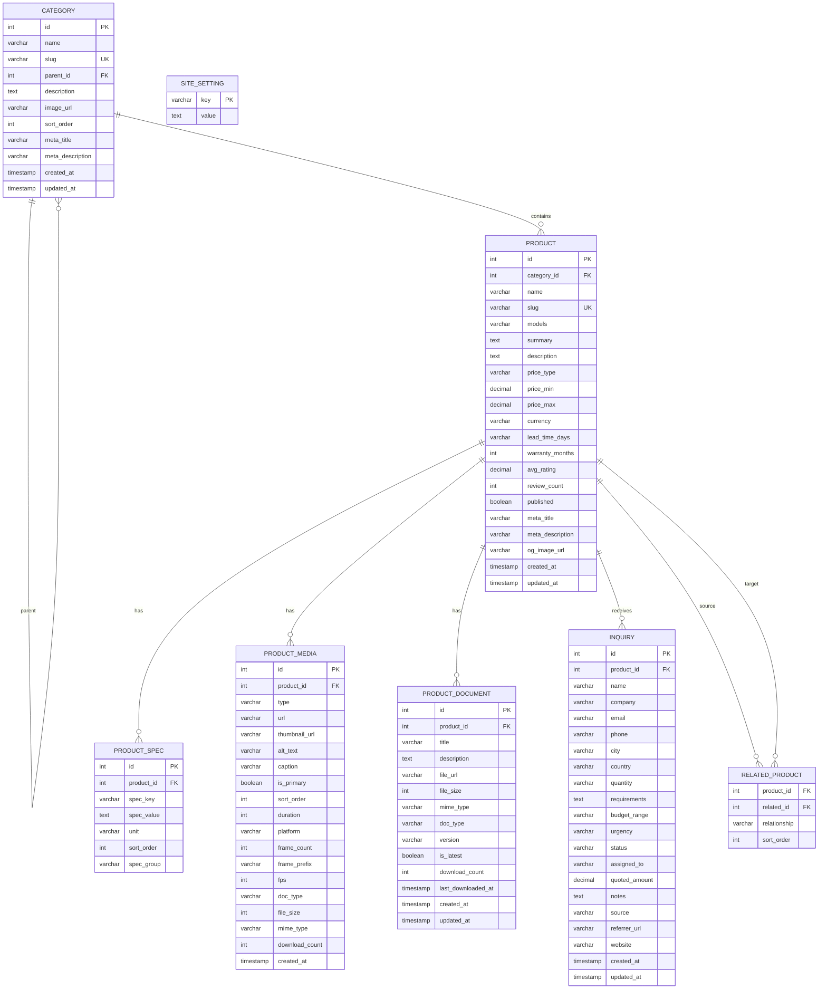
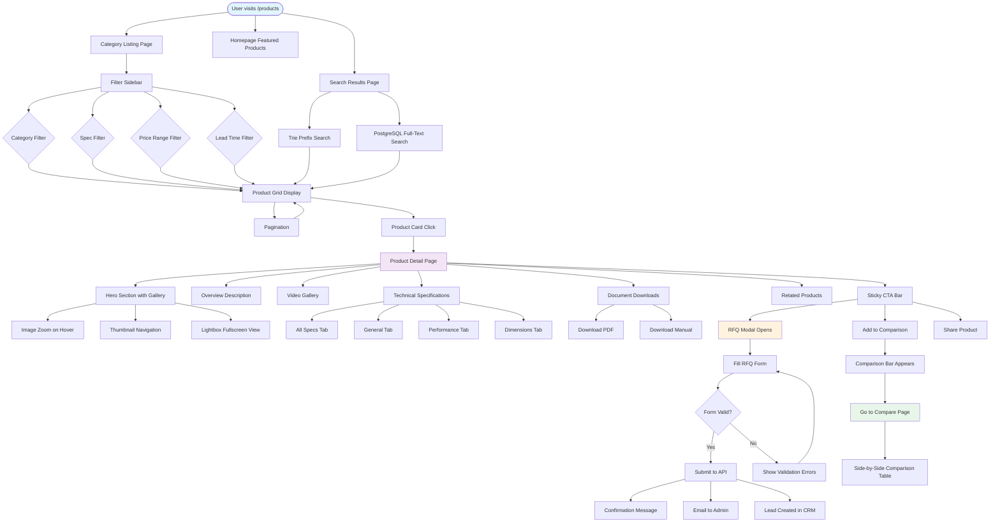
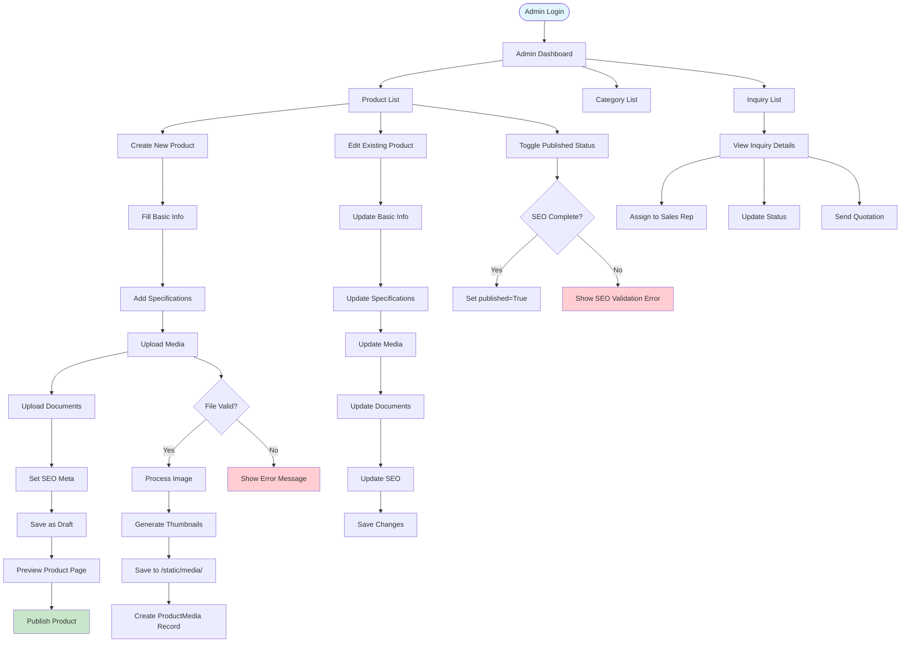
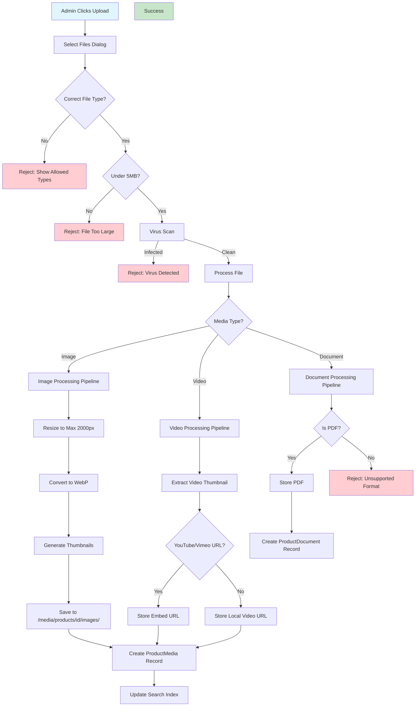
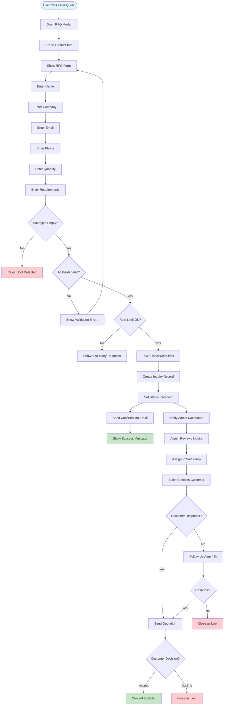

# Product Extension Plan — Bark Technologies

> **Scope:** Full product page redesign, media gallery, video integration, document downloads,
> RFQ workflow, analytics, and future e-commerce foundation.
>
> **Stack:** FastAPI + Jinja2 + Bootstrap 5 + vanilla JS (no React)
>
> **Architecture Pattern:** Service-Oriented with SOLID principles
>
> **Date:** July 2026

---

## Table of Contents

1. [Part I — High-Level Design (HLD)](#part-i--high-level-design-hld)
   - [1.1 System Overview](#11-system-overview)
   - [1.2 Product Data Model Overview](#12-product-data-model-overview)
   - [1.3 Media Management Strategy](#13-media-management-strategy)
   - [1.4 Search and Discovery System](#14-search-and-discovery-system)
   - [1.5 RFQ Workflow Design](#15-rfq-workflow-design)
   - [1.6 Deployment and Scaling Strategy](#16-deployment-and-scaling-strategy)
2. [Part II — Low-Level Design (LLD)](#part-ii--low-level-design-lld)
   - [2.1 Product Schema — Complete Field Reference](#21-product-schema--complete-field-reference)
   - [2.2 Media Handling — Images, Videos, Documents](#22-media-handling--images-videos-documents)
   - [2.3 Specification Management System](#23-specification-management-system)
   - [2.4 Related Products System](#24-related-products-system)
   - [2.5 Product Comparison Feature](#25-product-comparison-feature)
   - [2.6 SEO and Structured Data](#26-seo-and-structured-data)
3. [Part III — Mermaid Diagrams](#part-iii--mermaid-diagrams)
   - [3.1 ER Diagram — Product Relationships](#31-er-diagram--product-relationships)
   - [3.2 Flowchart — Product Operations](#32-flowchart--product-operations)
   - [3.3 Flowchart — Admin CRUD Flow](#33-flowchart--admin-crud-flow)
   - [3.4 Flowchart — Media Upload Flow](#34-flowchart--media-upload-flow)
   - [3.5 Flowchart — RFQ Workflow](#35-flowchart--rfq-workflow)
4. [Part IV — SOLID Principles Application](#part-iv--solid-principles-application)
   - [4.1 Single Responsibility Principle](#41-single-responsibility-principle)
   - [4.2 Open/Closed Principle](#42-openclosed-principle)
   - [4.3 Interface Segregation Principle](#43-interface-segregation-principle)
   - [4.4 Dependency Inversion Principle](#44-dependency-inversion-principle)
5. [Part V — Implementation Details](#part-v--implementation-details)
   - [5.1 Product Detail Page Structure](#51-product-detail-page-structure)
   - [5.2 Gallery Component Design](#52-gallery-component-design)
   - [5.3 Video Player Integration](#53-video-player-integration)
   - [5.4 Document Download System](#54-document-download-system)
   - [5.5 RFQ Modal Workflow](#55-rfq-modal-workflow)
   - [5.6 Comparison Feature](#56-comparison-feature)
   - [5.7 Analytics Integration](#57-analytics-integration)
6. [Part VI — File Structure and Implementation Timeline](#part-vi--file-structure-and-implementation-timeline)
   - [6.1 Complete File Structure](#61-complete-file-structure)
   - [6.2 Implementation Phases](#62-implementation-phases)

---

# Part I — High-Level Design (HLD)

## 1.1 System Overview

The product extension system is the core revenue-generating component of the Bark Technologies
website. It transforms a static product listing into a rich, interactive experience that serves
two primary personas:

1. **Technical Buyers (Engineers):** Need deep specifications, CAD files, performance data,
   comparison tools, and detailed product documentation.
2. **Procurement Teams:** Need pricing, lead times, warranty terms, RFQ workflows, and
   downloadable vendor documents.

The architecture follows a **layered approach** where each concern is isolated into dedicated
services, enabling independent testing, modification, and scaling.

### System Context Diagram

```
+-------------------------------------------------------------------+
|                        CLIENT LAYER                                |
|  +--------------+  +---------------+  +-------------------------+ |
|  |   Browser    |  |  Mobile App   |  |  Third-Party Scrapers   | |
|  +------+-------+  +-------+-------+  +-----------+-------------+ |
+---------+----------------+------------------------+----------------+
          |                |                        |
          v                v                        v
+-------------------------------------------------------------------+
|                        API LAYER                                   |
|  +------------------------------------------------------------+   |
|  |              FastAPI Application Server                     |   |
|  |  +------------+ +----------+ +-----------+ +-----------+   |   |
|  |  |  /api/v1/  | | /api/v1/ | | /api/v1/  | | /api/v1/  |   |   |
|  |  | products   | | media    | | inquiries | | compare   |   |   |
|  |  +-----+------+ +----+-----+ +-----+-----+ +-----+-----+   |   |
|  +--------+-------------+-------------+-------------+-----------+   |
+----------+-------------+-------------+-------------+---------------+
           |             |             |             |
           v             v             v             v
+-------------------------------------------------------------------+
|                     SERVICE LAYER                                  |
|  +--------------+ +--------------+ +--------------+               |
|  |ProductService| | MediaService | |InquiryService|               |
|  +------+-------+ +------+-------+ +------+-------+               |
|         |                |                |                         |
|  +------+-------+ +------+-------+ +------+-------+               |
|  |ProductSearch | |MediaStorage  | | LeadService  |               |
|  |    Service   | |   Service    | |              |               |
|  +------+-------+ +------+-------+ +------+-------+               |
+----------+-------------+-------------+------------------------------+
           |             |             |
           v             v             v
+-------------------------------------------------------------------+
|                     DATA LAYER                                    |
|  +--------------+ +--------------+ +--------------+               |
|  |  PostgreSQL  | |  Filesystem  | |    Redis     |               |
|  |   (Source    | |  (Media      | |   (Cache +   |               |
|  |   of Truth)  | |   Storage)   | |   Trie Index)|               |
|  +--------------+ +--------------+ +--------------+               |
+-------------------------------------------------------------------+
```

### Key Design Decisions

| Decision | Choice | Rationale |
|----------|--------|-----------|
| **Database** | PostgreSQL | ACID compliance, JSONB for flexible specs, full-text search |
| **Media Storage** | Local filesystem + CDN-ready URLs | Low cost for B2B catalog, easy migration to S3 later |
| **Search** | Trie (in-memory) + PostgreSQL FTS | Fast prefix search for product names, full-text for descriptions |
| **Caching** | Redis | Trie index, category trees, hot product pages |
| **Frontend** | Jinja2 + Bootstrap 5 + Vanilla JS | No build step, fast iteration, SEO-friendly server rendering |
| **API Pattern** | RESTful with JSON responses | Simple, well-understood, compatible with future mobile apps |

---

## 1.2 Product Data Model Overview

The product data model follows a **normalized relational design** with strategic denormalization
for read performance. The core entities form a star schema with `Product` at the center.

### Entity Relationships Summary

```
Category (self-referencing hierarchy)
    +-- Product (many)
            +-- ProductSpec (many) -- key/value pairs with sort order
            +-- ProductMedia (many) -- images, videos, 360 views
            +-- ProductDocument (many) -- datasheets, manuals, certificates
            +-- RelatedProduct (M:N self-join) -- explicit relationships
            +-- Inquiry (many) -- RFQ submissions
```

### Design Principles for the Data Model

1. **Normalized core, denormalized reads**: The `products` table stores canonical data.
   Materialized views or application-level caching handle read optimization.

2. **Flexible specifications via key-value pairs**: Instead of hardcoding spec columns,
   `ProductSpec` uses `spec_key` + `spec_value` + `unit` to support any product attribute
   without schema changes.

3. **Media as polymorphic references**: `ProductMedia.type` distinguishes images, videos,
   and 360-degree views. Each type has different metadata requirements but shares a
   common storage pattern.

4. **Document lifecycle management**: `ProductDocument` tracks file type, version, and
   download counts for analytics.

5. **Soft-delete ready**: All models use `created_at` and `updated_at` timestamps.
   Future phases can add `deleted_at` for soft deletes.

---

## 1.3 Media Management Strategy

The media management system follows the **PIM-DAM linked reference model** where the
product database stores references (URLs) rather than binary files.

### Media Types and Their Requirements

| Media Type | Storage | Metadata | Delivery |
|------------|---------|----------|----------|
| **Product Images** | Local FS / S3 | alt_text, caption, dimensions, is_primary | Static file, CDN-ready URL |
| **Product Videos** | YouTube / Vimeo / Local | duration, thumbnail_url, embed_url | Lazy-loaded iframe or video tag |
| **360-Degree Views** | Local FS (frame sequence) | frame_count, fps, frame_prefix | JS viewer with preloaded frames |
| **Documents** | Local FS / S3 | doc_type, file_size, version, download_count | Direct download with tracking |
| **CAD/STP Files** | Local FS (future) | file_format, version, compatibility | Gated download (authenticated) |

### Media Upload Pipeline

```
User Upload -> Validation -> Processing -> Storage -> Database Reference -> CDN Distribution
     |              |            |           |              |                |
     v              v            v           v              v                v
  File size     Format check  Resize/    Save to       Insert URL       Purge CDN
  type check    Virus scan    Compress   /media/        into DB         cache
  (5MB max)     (ClamAV)     (Pillow)   products/      product_media   (future)
```

### Media URL Strategy

Media URLs are stored as **relative paths** in the database to enable:

1. **Environment portability**: Different base URLs for dev/staging/production
2. **CDN migration**: Change the base URL without updating database records
3. **Multi-domain support**: Serve from `barktechnologies.in` or `cdn.barktechnologies.in`

```python
# Configuration for media base URL
MEDIA_BASE_URL = os.getenv("MEDIA_BASE_URL", "/static/media")
# Result: "/static/media/products/123/image-001.webp"
```

---

## 1.4 Search and Discovery System

The search system implements a **two-tier architecture** combining fast prefix search with
full-text search for comprehensive product discovery.

### Tier 1: Trie-Based Prefix Search (In-Memory)

The existing trie implementation handles **product name autocomplete** with multi-token AND
matching. This is ideal for the search bar experience.

```
User types "corr" -> Trie returns: ["Corrugated Board Machine", "Corrugator", "Corrugation Line"]
```

**Characteristics:**
- Response time: < 1ms (in-memory)
- Memory usage: ~50MB for 1000 products
- Rebuilt on application startup or admin product update
- No persistence needed (rebuild from database)

### Tier 2: PostgreSQL Full-Text Search (Database)

For **filtered browsing** and **advanced search**, PostgreSQL's built-in full-text search
provides:

```
Product listing -> Filter by category -> Filter by specs -> Sort by relevance -> Paginate
```

**Search configuration:**

```sql
-- Add tsvector column for full-text search
ALTER TABLE products ADD COLUMN search_vector tsvector;

-- Create GIN index for fast full-text queries
CREATE INDEX ix_products_search ON products USING GIN(search_vector);

-- Populate search vector from name + summary + description
UPDATE products SET search_vector =
  to_tsvector('english', coalesce(name, '') || ' ' || coalesce(summary, '') || ' ' || coalesce(description, ''));
```

### Faceted Navigation

Faceted filters allow users to narrow results by technical parameters:

| Facet Type | Source | Example Values |
|------------|--------|----------------|
| Category | `categories` table | "Corrugators", "Printing Machines" |
| Price Range | `products.price_type` | "On Request", "From X" |
| Lead Time | `products.lead_time_days` | "30-40 days", "Immediate" |
| Specifications | `product_specs` (dynamic) | "Speed: 200 m/min", "Width: 1450mm" |
| Warranty | `products.warranty_months` | "12 months", "24 months" |

### Search Result Ranking

Results are ranked using a weighted scoring system:

```
Score = (name_match x 3.0) + (summary_match x 2.0) + (description_match x 1.0)
       + (category_match x 1.5) + (published_boost x 0.5)
```

---

## 1.5 RFQ Workflow Design

The RFQ (Request for Quote) system converts product interest into qualified leads through
a structured workflow.

### RFQ State Machine

```
+----------+    Submit     +-----------+    Assign     +-----------+
|  Draft   |------------->| Received  |------------->| Assigned  |
+----------+               +-----------+               +-----------+
                               |                          |
                               | 48h no response          | Respond
                               v                          v
                         +-----------+               +-----------+
                         | Follow-up |               |  Quoted   |
                         +-----------+               +-----------+
                              |                          |
                              | 72h no response          | Accept
                              v                          v
                         +-----------+               +-----------+
                         |  Closed   |               | Accepted  |
                         +-----------+               +-----------+
```

### RFQ Submission Flow

1. User clicks "Get Quote" on product page
2. Modal opens with pre-filled product information
3. User fills: name, company, email, phone, quantity, requirements
4. Honeypot field validates against bots
5. Backend creates `Inquiry` record with status `received`
6. Confirmation email sent to user
7. Notification sent to admin dashboard
8. Admin assigns sales representative
9. Sales follows up with quotation

### RFQ Data Model

```python
class Inquiry(Base):
    __tablename__ = "inquiries"

    id = Column(Integer, primary_key=True, index=True)
    product_id = Column(Integer, ForeignKey("products.id"), nullable=True)

    name = Column(String(200), nullable=False)
    company = Column(String(300), nullable=True)
    email = Column(String(300), nullable=False)
    phone = Column(String(50), nullable=True)
    quantity = Column(String(100), nullable=True)
    message = Column(Text, nullable=True)

    status = Column(String(50), default="received")
    assigned_to = Column(String(200), nullable=True)

    created_at = Column(DateTime, server_default=func.now())
    updated_at = Column(DateTime, server_default=func.now(), onupdate=func.now())

    product = relationship("Product", back_populates="inquiries")
```

---

## 1.6 Deployment and Scaling Strategy

### Current Deployment

The application runs as a single FastAPI process with:

- **Nginx** reverse proxy serving static files directly
- **Gunicorn** with Uvicorn workers (2-4 workers)
- **PostgreSQL** on the same server
- **Redis** for trie cache and session storage

### Scaling Roadmap

| Phase | Trigger | Action |
|-------|---------|--------|
| **Phase 1** | < 1000 daily visitors | Single server, SQLite to PostgreSQL migration |
| **Phase 2** | 1000-5000 daily visitors | Redis caching, static file CDN, database connection pooling |
| **Phase 3** | 5000-20000 daily visitors | Read replicas, Elasticsearch for search, async task queue |
| **Phase 4** | 20000+ daily visitors | Microservices split, dedicated media CDN, load balancing |

### Performance Budget

| Metric | Target | Measurement |
|--------|--------|-------------|
| Time to First Byte (TTFB) | < 200ms | Server response time |
| Largest Contentful Paint (LCP) | < 2.5s | Core Web Vitals |
| First Input Delay (FID) | < 100ms | Interactivity |
| Cumulative Layout Shift (CLS) | < 0.1 | Visual stability |
| Product page load | < 3s | Full page render |
| Search response | < 100ms | Trie lookup |
| Image load (above fold) | < 1s | Lazy loading + CDN |

---

# Part II — Low-Level Design (LLD)

## 2.1 Product Schema — Complete Field Reference

### Products Table

```sql
CREATE TABLE products (
    id              SERIAL PRIMARY KEY,
    category_id     INTEGER REFERENCES categories(id) ON DELETE SET NULL,

    name            VARCHAR(300) NOT NULL,
    slug            VARCHAR(300) UNIQUE NOT NULL,

    -- THE canonical model code list -- single source rendered everywhere
    models          VARCHAR(500),           -- e.g. "FMZ-1450H,FMZ-1700H"

    -- Content
    summary         TEXT NOT NULL,           -- 1-2 sentence card/list blurb
    description     TEXT,                    -- long-form detail copy (Markdown)

    -- Commercial
    price_type      VARCHAR(50) DEFAULT 'on_request',
    price_min       DECIMAL(12,2),           -- minimum price (if fixed/range)
    price_max       DECIMAL(12,2),           -- maximum price (if range)
    currency        VARCHAR(3) DEFAULT 'INR',
    lead_time_days  VARCHAR(50),             -- e.g. "35-40" or "In Stock"
    warranty_months INTEGER,                 -- e.g. 12

    -- Ratings (denormalized for fast reads)
    avg_rating      DECIMAL(3,2) DEFAULT 0,
    review_count    INTEGER DEFAULT 0,

    -- SEO
    published       BOOLEAN DEFAULT FALSE NOT NULL,
    meta_title      VARCHAR(300),
    meta_description VARCHAR(500),
    og_image_url    VARCHAR(500),            -- OpenGraph image override

    -- Timestamps
    created_at      TIMESTAMP DEFAULT NOW() NOT NULL,
    updated_at      TIMESTAMP DEFAULT NOW() NOT NULL
);

-- Indexes
CREATE INDEX ix_products_published ON products(published);
CREATE INDEX ix_products_category ON products(category_id);
CREATE INDEX ix_products_slug ON products(slug);
```

### Categories Table

```sql
CREATE TABLE categories (
    id          SERIAL PRIMARY KEY,
    name        VARCHAR(200) NOT NULL,
    slug        VARCHAR(200) UNIQUE NOT NULL,
    parent_id   INTEGER REFERENCES categories(id) ON DELETE SET NULL,

    -- Display
    description TEXT,
    image_url   VARCHAR(500),
    sort_order  INTEGER DEFAULT 0,

    -- SEO
    meta_title      VARCHAR(300),
    meta_description VARCHAR(500),

    created_at  TIMESTAMP DEFAULT NOW() NOT NULL,
    updated_at  TIMESTAMP DEFAULT NOW() NOT NULL
);

CREATE INDEX ix_categories_slug ON categories(slug);
CREATE INDEX ix_categories_parent ON categories(parent_id);
```

### Product Specs Table

```sql
CREATE TABLE product_specs (
    id          SERIAL PRIMARY KEY,
    product_id  INTEGER NOT NULL REFERENCES products(id) ON DELETE CASCADE,

    spec_key    VARCHAR(200) NOT NULL,       -- English only -- validated at app layer
    spec_value  TEXT NOT NULL,
    unit        VARCHAR(50),                 -- e.g. "mm", "m/min", "kW"
    sort_order  INTEGER DEFAULT 0,

    -- Grouping for tabbed display
    spec_group  VARCHAR(100) DEFAULT 'general'
);

CREATE INDEX ix_specs_product ON product_specs(product_id);
CREATE INDEX ix_specs_group ON product_specs(spec_group);
```

### Product Media Table

```sql
CREATE TABLE product_media (
    id              SERIAL PRIMARY KEY,
    product_id      INTEGER NOT NULL REFERENCES products(id) ON DELETE CASCADE,

    type            VARCHAR(20) NOT NULL,     -- 'image' | 'video' | '360view' | 'document'
    url             VARCHAR(500) NOT NULL,    -- relative path or YouTube/Vimeo URL
    thumbnail_url   VARCHAR(500),             -- for videos and 360 views
    alt_text        VARCHAR(300),
    caption         VARCHAR(500),

    -- Display control
    is_primary      BOOLEAN DEFAULT FALSE,
    sort_order      INTEGER DEFAULT 0,

    -- Video-specific
    duration        INTEGER,                  -- seconds
    platform        VARCHAR(50),              -- 'youtube' | 'vimeo' | 'local'

    -- 360-view specific
    frame_count     INTEGER,                  -- number of frames
    frame_prefix    VARCHAR(500),             -- e.g. "/media/products/123/360/frame-"
    fps             INTEGER DEFAULT 30,

    -- Document-specific
    doc_type        VARCHAR(50),              -- 'datasheet' | 'manual' | 'certificate' | 'cad'
    file_size       INTEGER,                  -- bytes
    mime_type       VARCHAR(100),
    download_count  INTEGER DEFAULT 0,

    -- Timestamps
    created_at      TIMESTAMP DEFAULT NOW() NOT NULL,

    CONSTRAINT ck_media_type CHECK (type IN ('image','video','360view','document'))
);

CREATE INDEX ix_media_product ON product_media(product_id);
CREATE INDEX ix_media_type ON product_media(type);
```

### Product Documents Table

```sql
CREATE TABLE product_documents (
    id              SERIAL PRIMARY KEY,
    product_id      INTEGER NOT NULL REFERENCES products(id) ON DELETE CASCADE,

    title           VARCHAR(300),
    description     TEXT,
    file_url        VARCHAR(500) NOT NULL,
    file_size       INTEGER,                  -- bytes
    mime_type       VARCHAR(100) DEFAULT 'application/pdf',
    doc_type        VARCHAR(50) DEFAULT 'datasheet',

    -- Versioning
    version         VARCHAR(50),              -- e.g. "v2.1"
    is_latest       BOOLEAN DEFAULT TRUE,

    -- Analytics
    download_count  INTEGER DEFAULT 0,
    last_downloaded_at TIMESTAMP,

    created_at      TIMESTAMP DEFAULT NOW() NOT NULL,
    updated_at      TIMESTAMP DEFAULT NOW() NOT NULL
);

CREATE INDEX ix_docs_product ON product_documents(product_id);
CREATE INDEX ix_docs_type ON product_documents(doc_type);
```

### Related Products Table (M:N Self-Join)

```sql
CREATE TABLE related_products (
    product_id      INTEGER NOT NULL REFERENCES products(id) ON DELETE CASCADE,
    related_id      INTEGER NOT NULL REFERENCES products(id) ON DELETE CASCADE,
    relationship    VARCHAR(50) DEFAULT 'related',
    sort_order      INTEGER DEFAULT 0,

    PRIMARY KEY (product_id, related_id),
    CHECK (product_id != related_id)
);

CREATE INDEX ix_related_product ON related_products(product_id);
CREATE INDEX ix_related_related ON related_products(related_id);
```

### Inquiries Table (RFQ)

```sql
CREATE TABLE inquiries (
    id              SERIAL PRIMARY KEY,
    product_id      INTEGER REFERENCES products(id) ON DELETE SET NULL,

    -- Contact
    name            VARCHAR(200) NOT NULL,
    company         VARCHAR(300),
    email           VARCHAR(300) NOT NULL,
    phone           VARCHAR(50),
    city            VARCHAR(100),
    country         VARCHAR(100) DEFAULT 'India',

    -- RFQ Details
    quantity        VARCHAR(100),
    requirements    TEXT,
    budget_range    VARCHAR(100),
    urgency         VARCHAR(50),

    -- Workflow
    status          VARCHAR(50) DEFAULT 'received',
    assigned_to     VARCHAR(200),
    quoted_amount   DECIMAL(12,2),
    notes           TEXT,

    -- Source tracking
    source          VARCHAR(50) DEFAULT 'website',
    referrer_url    VARCHAR(500),

    -- Honeypot (bot detection)
    website         VARCHAR(100),            -- should be empty

    created_at      TIMESTAMP DEFAULT NOW() NOT NULL,
    updated_at      TIMESTAMP DEFAULT NOW() NOT NULL
);

CREATE INDEX ix_inquiries_product ON inquiries(product_id);
CREATE INDEX ix_inquiries_status ON inquiries(status);
CREATE INDEX ix_inquiries_created ON inquiries(created_at);
```

---

## 2.2 Media Handling — Images, Videos, Documents

### Image Processing Pipeline

```python
# bark/app/services/media_processor.py

from pathlib import Path
from PIL import Image
import hashlib
import io

class ImageProcessor:
    """
    Handles image upload, validation, resizing, and storage.

    SOLID: Single Responsibility -- only handles image processing.
    """

    MAX_FILE_SIZE = 5 * 1024 * 1024  # 5MB
    ALLOWED_TYPES = {'image/jpeg', 'image/png', 'image/webp'}
    THUMBNAIL_SIZES = {
        'small': (150, 150),
        'medium': (400, 400),
        'large': (800, 800),
    }

    def process_upload(self, file: UploadFile, product_id: int) -> dict:
        """Process uploaded image: validate, resize, store, return metadata."""
        self._validate_file(file)
        file_bytes = file.file.read()
        filename = self._generate_filename(file_bytes, product_id)

        # Save original
        original_path = self._save_file(file_bytes, product_id, filename, 'original')

        # Generate thumbnails
        thumbnails = {}
        for size_name, dimensions in self.THUMBNAIL_SIZES.items():
            thumb_path = self._create_thumbnail(
                file_bytes, product_id, filename, size_name, dimensions
            )
            thumbnails[size_name] = thumb_path

        return {
            'original_url': original_path,
            'thumbnails': thumbnails,
            'file_size': len(file_bytes),
            'mime_type': file.content_type,
        }

    def _validate_file(self, file: UploadFile):
        if file.content_type not in self.ALLOWED_TYPES:
            raise ValueError(f"Unsupported image type: {file.content_type}")
        if file.size and file.size > self.MAX_FILE_SIZE:
            raise ValueError(f"File too large: {file.size} bytes (max {self.MAX_FILE_SIZE})")

    def _generate_filename(self, file_bytes: bytes, product_id: int) -> str:
        hash_val = hashlib.md5(file_bytes).hexdigest()[:12]
        ext = 'webp'  # Convert everything to webp for consistency
        return f"product-{product_id}-{hash_val}.{ext}"

    def _save_file(self, data: bytes, product_id: int, filename: str, variant: str) -> str:
        base_dir = Path(f"static/media/products/{product_id}")
        base_dir.mkdir(parents=True, exist_ok=True)
        filepath = base_dir / variant / filename
        filepath.parent.mkdir(exist_ok=True)
        filepath.write_bytes(data)
        return f"/static/media/products/{product_id}/{variant}/{filename}"

    def _create_thumbnail(self, data: bytes, product_id: int, filename: str,
                          size_name: str, dimensions: tuple) -> str:
        img = Image.open(io.BytesIO(data))
        img.thumbnail(dimensions, Image.Resampling.LANCZOS)
        thumb_filename = f"{size_name}-{filename}"
        buffer = io.BytesIO()
        img.save(buffer, format='WEBP', quality=85)
        return self._save_file(buffer.getvalue(), product_id, thumb_filename, 'thumbnails')
```

### Video Embed Resolution

```python
# bark/app/services/video_resolver.py

import re
from urllib.parse import urlparse

class VideoResolver:
    """
    Resolves video URLs to embeddable URLs for various platforms.

    SOLID: Single Responsibility -- only handles URL parsing and embed generation.
    """

    YOUTUBE_PATTERNS = [
        r'(?:youtube\.com\/watch\?v=|youtu\.be\/|youtube\.com\/embed\/)([a-zA-Z0-9_-]{11})',
    ]
    VIMEO_PATTERNS = [
        r'vimeo\.com\/(\d+)',
    ]

    def resolve(self, url: str) -> dict:
        """Resolve a video URL to platform-specific embed information."""
        if self._is_youtube(url):
            video_id = self._extract_youtube_id(url)
            return {
                'platform': 'youtube',
                'embed_url': f'https://www.youtube.com/embed/{video_id}?rel=0',
                'thumbnail_url': f'https://img.youtube.com/vi/{video_id}/hqdefault.jpg',
                'video_id': video_id,
            }
        elif self._is_vimeo(url):
            video_id = self._extract_vimeo_id(url)
            return {
                'platform': 'vimeo',
                'embed_url': f'https://player.vimeo.com/video/{video_id}?byline=0&portrait=0',
                'thumbnail_url': None,
                'video_id': video_id,
            }
        elif self._is_direct_video(url):
            return {
                'platform': 'local',
                'embed_url': url,
                'thumbnail_url': None,
                'video_id': None,
            }
        else:
            raise ValueError(f"Unsupported video URL: {url}")

    def _is_youtube(self, url: str) -> bool:
        return any(re.search(p, url) for p in self.YOUTUBE_PATTERNS)

    def _is_vimeo(self, url: str) -> bool:
        return any(re.search(p, url) for p in self.VIMEO_PATTERNS)

    def _is_direct_video(self, url: str) -> bool:
        return bool(re.search(r'\.(mp4|webm|ogg)$', url, re.IGNORECASE))

    def _extract_youtube_id(self, url: str) -> str:
        for pattern in self.YOUTUBE_PATTERNS:
            match = re.search(pattern, url)
            if match:
                return match.group(1)
        raise ValueError(f"Could not extract YouTube ID from: {url}")

    def _extract_vimeo_id(self, url: str) -> str:
        for pattern in self.VIMEO_PATTERNS:
            match = re.search(pattern, url)
            if match:
                return match.group(1)
        raise ValueError(f"Could not extract Vimeo ID from: {url}")
```

### Document Download Tracking

```python
# bark/app/services/document_service.py

from datetime import datetime
from sqlalchemy.orm import Session

class DocumentDownloadService:
    """
    Manages document downloads with analytics tracking.

    SOLID: Single Responsibility -- only handles document download logic.
    """

    def track_download(self, db: Session, document_id: int, ip_address: str = None):
        """Increment download count and record analytics."""
        doc = db.query(ProductDocument).filter(ProductDocument.id == document_id).first()
        if not doc:
            raise ValueError(f"Document not found: {document_id}")

        doc.download_count = (doc.download_count or 0) + 1
        doc.last_downloaded_at = datetime.utcnow()
        db.commit()

        # Log analytics event
        self._log_analytics(doc.product_id, document_id, ip_address)

    def get_download_stats(self, db: Session, product_id: int) -> list:
        """Get download statistics for all documents of a product."""
        docs = db.query(ProductDocument).filter(
            ProductDocument.product_id == product_id
        ).all()

        return [{
            'id': doc.id,
            'title': doc.title or doc.doc_type.title(),
            'doc_type': doc.doc_type,
            'download_count': doc.download_count or 0,
            'last_downloaded': doc.last_downloaded_at,
        } for doc in docs]

    def _log_analytics(self, product_id: int, document_id: int, ip_address: str):
        """Log download event for analytics."""
        # Future: write to analytics_events table
        pass
```

---

## 2.3 Specification Management System

### Spec Group Classification

Specifications are grouped into categories for tabbed display on the product page.
The grouping uses a keyword-matching algorithm that maps spec keys to groups.

```python
# bark/app/services/spec_classifier.py

class SpecClassifier:
    """
    Classifies product specifications into display groups.

    SOLID: Single Responsibility -- only handles spec classification.
    Open/Closed -- new groups can be added via configuration without modifying logic.
    """

    GROUP_KEYWORDS = {
        'performance': [
            'speed', 'capacity', 'output', 'power', 'motor', 'efficiency',
            'production rate', 'throughput', 'rpm', 'kw', 'hp', 'voltage',
            'current', 'frequency', 'pressure', 'temperature',
        ],
        'dimensions': [
            'length', 'width', 'height', 'depth', 'weight', 'size',
            'diameter', 'thickness', 'diameter', 'mm', 'cm', 'meter',
            'kg', 'ton', 'footprint', 'clearance',
        ],
        'electrical': [
            'voltage', 'current', 'phase', 'frequency', 'power consumption',
            'motor rating', 'control system', ' plc', 'sensor',
        ],
        'general': [],  # fallback group
    }

    def classify(self, spec_key: str) -> str:
        """Determine the display group for a specification."""
        key_lower = spec_key.lower()
        for group, keywords in self.GROUP_KEYWORDS.items():
            if group == 'general':
                continue
            if any(keyword in key_lower for keyword in keywords):
                return group
        return 'general'

    def group_specs(self, specs: list) -> dict:
        """Group a list of specs by their display group."""
        groups = {'general': [], 'performance': [], 'dimensions': [], 'electrical': []}
        for spec in specs:
            group = self.classify(spec.spec_key)
            groups[group].append(spec)
        return groups
```

### Spec Validation

```python
# bark/app/services/spec_validator.py

import re
from typing import Optional

class SpecValidator:
    """
    Validates product specification data.

    SOLID: Single Responsibility -- only handles validation logic.
    """

    _CJK_PATTERN = re.compile(
        r'[\u3000-\u9fff\ua000-\ua48f\ua490-\ua4cf'
        r'\uf900-\ufaff\ufe30-\ufe4f\uff00-\uffef'
        r'\u4e00-\u9fff\u3400-\u4dbf]'
    )

    def validate_key(self, key: str) -> Optional[str]:
        """Validate spec key -- returns error message or None if valid."""
        if not key or not key.strip():
            return "Spec key cannot be empty"
        if len(key) > 200:
            return "Spec key too long (max 200 characters)"
        if self._CJK_PATTERN.search(key):
            return "Spec key contains non-English characters"
        return None

    def validate_value(self, value: str) -> Optional[str]:
        """Validate spec value -- returns error message or None if valid."""
        if not value or not value.strip():
            return "Spec value cannot be empty"
        if self._CJK_PATTERN.search(value):
            return "Spec value contains non-English characters"
        return None

    def validate_unit(self, unit: str) -> Optional[str]:
        """Validate spec unit -- returns error message or None if valid."""
        if unit and len(unit) > 50:
            return "Unit too long (max 50 characters)"
        return None
```

---

## 2.4 Related Products System

### Relationship Types

| Relationship | Display Location | Use Case |
|-------------|-----------------|----------|
| `related` | "Related Machines" section | General product associations |
| `accessory` | "Accessories & Parts" section | Add-on products |
| `alternative` | "Alternative Options" section | Competing models |
| `bought_together` | "Frequently Bought Together" | Cross-sell recommendations |

### Related Product Resolution Algorithm

```python
# bark/app/services/related_products.py

from sqlalchemy.orm import Session
from typing import List

class RelatedProductService:
    """
    Resolves related products using explicit relationships with fallback.

    SOLID: Single Responsibility -- only handles related product resolution.
    """

    def get_related(
        self,
        db: Session,
        product_id: int,
        limit: int = 4,
        relationship: str = 'related'
    ) -> List[dict]:
        """
        Get related products with fallback strategy:
        1. Explicit M:N relationships (highest priority)
        2. Same category products (fallback)
        3. Empty list (no matches)
        """
        # Strategy 1: Explicit relationships
        explicit = self._get_explicit_related(db, product_id, relationship, limit)
        if len(explicit) >= limit:
            return explicit[:limit]

        # Strategy 2: Same category fallback
        remaining = limit - len(explicit)
        existing_ids = {p['id'] for p in explicit} | {product_id}
        category_fallback = self._get_same_category(
            db, product_id, remaining, existing_ids
        )

        return explicit + category_fallback

    def _get_explicit_related(
        self, db: Session, product_id: int, relationship: str, limit: int
    ) -> List[dict]:
        """Fetch explicitly linked products."""
        from app.models.product import RelatedProduct, Product

        related = (
            db.query(RelatedProduct)
            .filter(
                RelatedProduct.product_id == product_id,
                RelatedProduct.relationship == relationship,
            )
            .order_by(RelatedProduct.sort_order)
            .limit(limit)
            .all()
        )

        return [
            self._product_to_dict(r.related)
            for r in related
            if r.related and r.related.published
        ]

    def _get_same_category(
        self, db: Session, product_id: int, limit: int, exclude_ids: set
    ) -> List[dict]:
        """Fallback: fetch products from the same category."""
        from app.models.product import Product

        product = db.query(Product).filter(Product.id == product_id).first()
        if not product or not product.category_id:
            return []

        same_cat = (
            db.query(Product)
            .filter(
                Product.category_id == product.category_id,
                Product.id.notin_(exclude_ids),
                Product.published == True,
            )
            .order_by(Product.name)
            .limit(limit)
            .all()
        )

        return [self._product_to_dict(p) for p in same_cat]

    def _product_to_dict(self, product) -> dict:
        """Convert a Product model to a lightweight dictionary."""
        primary_image = next(
            (m for m in product.media if m.type == 'image' and m.is_primary),
            next((m for m in product.media if m.type == 'image'), None),
        )
        return {
            'id': product.id,
            'name': product.name,
            'slug': product.slug,
            'models': product.models,
            'summary': product.summary,
            'image_url': primary_image.url if primary_image else '/static/images/placeholder-product.png',
            'category': product.category.name if product.category else None,
        }
```

---

## 2.5 Product Comparison Feature

### Comparison API Endpoint

```python
# bark/app/routers/api_products.py -- comparison endpoint

from fastapi import APIRouter, HTTPException, Depends
from sqlalchemy.orm import Session
from typing import List

router = APIRouter(prefix="/api/v1/compare", tags=["compare"])

@router.get("")
async def compare_products(ids: str, db: Session = Depends(get_db)):
    """
    Compare multiple products side by side.

    Query params:
        ids: comma-separated product IDs (max 3)
    """
    product_ids = [int(x) for x in ids.split(',') if x.strip()]
    if len(product_ids) < 2:
        raise HTTPException(400, "At least 2 product IDs required")
    if len(product_ids) > 3:
        raise HTTPException(400, "Maximum 3 products for comparison")

    products = db.query(Product).filter(
        Product.id.in_(product_ids),
        Product.published == True,
    ).all()

    if len(products) != len(product_ids):
        raise HTTPException(404, "One or more products not found")

    # Build comparison matrix
    all_spec_keys = set()
    product_specs = {}
    for p in products:
        specs = {s.spec_key: f"{s.spec_value} {s.unit or ''}".strip() for s in p.specs}
        product_specs[p.id] = specs
        all_spec_keys.update(specs.keys())

    return {
        'products': [_product_summary(p) for p in products],
        'spec_keys': sorted(all_spec_keys),
        'specs': product_specs,
    }
```

### Client-Side Comparison Manager

```javascript
// bark/app/static/js/product-comparison.js

export class ComparisonManager {
  constructor(maxProducts = 3) {
    this.maxProducts = maxProducts;
    this.storageKey = 'bark_compare_ids';
    this.init();
  }

  init() {
    this.bindCompareButtons();
    this.updateComparisonBar();
  }

  getSelectedIds() {
    try {
      return JSON.parse(localStorage.getItem(this.storageKey)) || [];
    } catch {
      return [];
    }
  }

  saveIds(ids) {
    localStorage.setItem(this.storageKey, JSON.stringify(ids));
    this.updateComparisonBar();
  }

  addProduct(productId) {
    const ids = this.getSelectedIds();
    if (ids.includes(productId)) return { added: false, reason: 'already_added' };
    if (ids.length >= this.maxProducts) return { added: false, reason: 'limit_reached' };

    ids.push(productId);
    this.saveIds(ids);
    return { added: true };
  }

  removeProduct(productId) {
    const ids = this.getSelectedIds().filter(id => id !== productId);
    this.saveIds(ids);
  }

  clearAll() {
    this.saveIds([]);
  }

  bindCompareButtons() {
    document.querySelectorAll('[data-compare-toggle]').forEach(btn => {
      btn.addEventListener('click', (e) => {
        e.preventDefault();
        const productId = parseInt(btn.dataset.productId);
        const ids = this.getSelectedIds();

        if (ids.includes(productId)) {
          this.removeProduct(productId);
          btn.classList.remove('active');
          btn.textContent = 'Compare';
        } else {
          const result = this.addProduct(productId);
          if (result.added) {
            btn.classList.add('active');
            btn.textContent = 'Added to Compare';
          } else if (result.reason === 'limit_reached') {
            this.showNotification('Maximum 3 products can be compared', 'warning');
          }
        }
      });
    });
  }

  updateComparisonBar() {
    const ids = this.getSelectedIds();
    const bar = document.getElementById('comparisonBar');
    if (!bar) return;

    if (ids.length >= 2) {
      bar.classList.add('active');
      bar.querySelector('.compare-count').textContent = ids.length;
      bar.querySelector('.compare-btn').href = `/compare?ids=${ids.join(',')}`;
    } else {
      bar.classList.remove('active');
    }
  }

  showNotification(message, type) {
    const toast = document.createElement('div');
    toast.className = `toast toast-${type}`;
    toast.textContent = message;
    document.body.appendChild(toast);
    setTimeout(() => toast.remove(), 3000);
  }
}
```

---

## 2.6 SEO and Structured Data

### JSON-LD Product Schema

```html
<!-- bark/app/templates/partials/json_ld_product.html -->
<script type="application/ld+json">
{
  "@context": "https://schema.org",
  "@type": "Product",
  "name": "{{ product.name }}",
  "description": "{{ product.summary | e }}",
  "brand": {
    "@type": "Brand",
    "name": "Bark Technologies"
  },
  "manufacturer": {
    "@type": "Organization",
    "name": "Bark Technologies"
  },
  
  "image": [
    
    "{{ settings.base_url }}{{ img.url }}",
    
  ],
  
  "sku": "{{ product.models.split(',')[0].strip() if product.models else product.slug }}",
  "category": "{{ product.category.name if product.category else 'Industrial Machinery' }}",
  "offers": {
    "@type": "Offer",
    "availability": "https://schema.org/InStock",
    "priceCurrency": "{{ product.currency or 'INR' }}",
    "url": "{{ settings.base_url }}/products/{{ product.slug }}"
  }
}
</script>
```

### Meta Tag Strategy

```html
<!-- bark/app/templates/partials/meta_tags.html -->
<title>{{ product.meta_title or product.name ~ ' | ' ~ settings.app_name }}</title>
<meta name="description" content="{{ product.meta_description or product.summary }}">

<!-- OpenGraph -->
<meta property="og:title" content="{{ product.meta_title or product.name }}">
<meta property="og:description" content="{{ product.meta_description or product.summary }}">
<meta property="og:type" content="product">
<meta property="og:url" content="{{ settings.base_url }}/products/{{ product.slug }}">

<meta property="og:image" content="{{ settings.base_url }}{{ product.og_image_url }}">

<meta property="og:image" content="{{ settings.base_url }}{{ product.media | selectattr('type', 'equalto', 'image') | first | attr('url') }}">


<!-- Twitter Card -->
<meta name="twitter:card" content="summary_large_image">
<meta name="twitter:title" content="{{ product.name }}">
<meta name="twitter:description" content="{{ product.summary }}">
```

---

# Part III — Mermaid Diagrams

## 3.1 ER Diagram — Product Relationships



---

## 3.2 Flowchart — Product Operations



---

## 3.3 Flowchart — Admin CRUD Flow



---

## 3.4 Flowchart — Media Upload Flow



---

## 3.5 Flowchart — RFQ Workflow



---

# Part IV — SOLID Principles Application

## 4.1 Single Responsibility Principle

Each service class handles **one and only one** concern. This makes the system
easier to test, modify, and reason about.

### Service Responsibility Map

| Service | Single Responsibility | Key Methods |
|---------|----------------------|-------------|
| `ProductService` | Product CRUD operations | `create()`, `update()`, `get_by_slug()`, `list_published()` |
| `ProductSearchService` | Search indexing and querying | `build_trie()`, `search()`, `autocomplete()` |
| `MediaProcessor` | Image upload, validation, resizing | `process_upload()`, `_validate_file()`, `_create_thumbnail()` |
| `VideoResolver` | Video URL parsing and embed resolution | `resolve()`, `_extract_youtube_id()` |
| `DocumentDownloadService` | Document download tracking | `track_download()`, `get_download_stats()` |
| `SpecClassifier` | Spec key to group mapping | `classify()`, `group_specs()` |
| `SpecValidator` | Spec data validation | `validate_key()`, `validate_value()` |
| `RelatedProductService` | Related product resolution | `get_related()`, `_get_explicit_related()` |
| `ComparisonService` | Product comparison data | `compare_products()`, `_build_comparison_matrix()` |
| `InquiryService` | RFQ submission and tracking | `create()`, `update_status()`, `assign()` |

### Example: ProductService

```python
# bark/app/services/products.py

from sqlalchemy.orm import Session
from typing import Optional, List
from app.models.product import Product, Category

class ProductService:
    """
    Handles all product CRUD operations.

    SOLID -- Single Responsibility: Only manages product lifecycle.
    """

    def __init__(self, db: Session):
        self.db = db

    def get_by_slug(self, slug: str) -> Optional[Product]:
        """Fetch a published product by slug."""
        return self.db.query(Product).filter(
            Product.slug == slug,
            Product.published == True,
        ).first()

    def list_published(
        self,
        category_slug: str = None,
        page: int = 1,
        per_page: int = 12,
    ) -> dict:
        """List published products with filtering and pagination."""
        query = self.db.query(Product).filter(Product.published == True)

        if category_slug:
            query = query.join(Product.category).filter(
                Category.slug == category_slug
            )

        total = query.count()
        products = (
            query
            .order_by(Product.name)
            .offset((page - 1) * per_page)
            .limit(per_page)
            .all()
        )

        return {
            'products': products,
            'total': total,
            'page': page,
            'per_page': per_page,
            'total_pages': (total + per_page - 1) // per_page,
        }

    def create(self, data: dict) -> Product:
        """Create a new product."""
        product = Product(**data)
        self.db.add(product)
        self.db.commit()
        self.db.refresh(product)
        return product

    def update(self, product_id: int, data: dict) -> Product:
        """Update an existing product."""
        product = self.db.query(Product).filter(Product.id == product_id).first()
        if not product:
            raise ValueError(f"Product not found: {product_id}")

        for key, value in data.items():
            if hasattr(product, key):
                setattr(product, key, value)

        self.db.commit()
        self.db.refresh(product)
        return product
```

---

## 4.2 Open/Closed Principle

The specification system is designed to be **open for extension** (new spec types,
groups, validation rules) but **closed for modification** (existing code does not
change when adding new types).

### Extensible Spec Group Configuration

```python
# bark/app/config/spec_groups.py

from dataclasses import dataclass, field
from typing import List, Dict

@dataclass
class SpecGroupConfig:
    """
    Configurable specification groups.

    SOLID -- Open/Closed: New groups are added by configuration,
    not by modifying classification logic.
    """
    name: str
    display_name: str
    keywords: List[str] = field(default_factory=list)
    icon: str = 'bi-list'
    sort_order: int = 0

# Default groups -- extend by adding new entries
SPEC_GROUPS: Dict[str, SpecGroupConfig] = {
    'general': SpecGroupConfig(
        name='general',
        display_name='General',
        keywords=[],
        icon='bi-info-circle',
        sort_order=0,
    ),
    'performance': SpecGroupConfig(
        name='performance',
        display_name='Performance',
        keywords=['speed', 'capacity', 'output', 'power', 'motor', 'efficiency',
                  'production rate', 'throughput', 'rpm', 'kw', 'hp'],
        icon='bi-speedometer2',
        sort_order=1,
    ),
    'dimensions': SpecGroupConfig(
        name='dimensions',
        display_name='Dimensions',
        keywords=['length', 'width', 'height', 'depth', 'weight', 'size',
                  'diameter', 'thickness', 'mm', 'cm', 'meter', 'kg'],
        icon='bi-rulers',
        sort_order=2,
    ),
    'electrical': SpecGroupConfig(
        name='electrical',
        display_name='Electrical',
        keywords=['voltage', 'current', 'phase', 'frequency', 'power consumption',
                  'motor rating', 'control system', 'plc', 'sensor'],
        icon='bi-lightning',
        sort_order=3,
    ),
    # EXTEND: Add new groups here without modifying classification logic
    # 'material': SpecGroupConfig(
    #     name='material',
    #     display_name='Materials',
    #     keywords=['steel', 'aluminum', 'plastic', 'rubber', 'grade'],
    #     icon='bi-box',
    #     sort_order=4,
    # ),
}

def get_group_for_spec(spec_key: str) -> str:
    """Classify a spec key into a group based on configuration."""
    key_lower = spec_key.lower()
    for group_name, config in SPEC_GROUPS.items():
        if group_name == 'general':
            continue
        if any(keyword in key_lower for keyword in config.keywords):
            return group_name
    return 'general'
```

---

## 4.3 Interface Segregation Principle

Each service exposes only the methods its consumers need. Large interfaces are
split into focused, role-specific interfaces.

### Service Interface Contracts

```python
# bark/app/services/interfaces.py

from abc import ABC, abstractmethod
from typing import Optional, List, Dict

class IProductReader(ABC):
    """Read-only product operations -- used by templates and public API."""

    @abstractmethod
    def get_by_slug(self, slug: str) -> Optional[dict]:
        """Fetch a single product by slug."""

    @abstractmethod
    def list_published(self, **filters) -> dict:
        """List published products with filtering."""

    @abstractmethod
    def get_related(self, product_id: int, limit: int = 4) -> List[dict]:
        """Get related products."""


class IProductWriter(ABC):
    """Write operations -- used by admin panel only."""

    @abstractmethod
    def create(self, data: dict) -> dict:
        """Create a new product."""

    @abstractmethod
    def update(self, product_id: int, data: dict) -> dict:
        """Update an existing product."""

    @abstractmethod
    def delete(self, product_id: int) -> bool:
        """Delete a product."""

    @abstractmethod
    def toggle_publish(self, product_id: int) -> bool:
        """Toggle published status."""


class IMediaProcessor(ABC):
    """Media processing operations -- used by admin upload."""

    @abstractmethod
    def process_upload(self, file, product_id: int) -> dict:
        """Process and store an uploaded file."""

    @abstractmethod
    def delete_media(self, media_id: int) -> bool:
        """Delete a media file."""


class ISearchIndexer(ABC):
    """Search index operations -- used by admin and product services."""

    @abstractmethod
    def build_index(self) -> int:
        """Rebuild the search index. Returns number of indexed items."""

    @abstractmethod
    def search(self, query: str, limit: int = 20) -> List[dict]:
        """Search products by query."""

    @abstractmethod
    def autocomplete(self, prefix: str, limit: int = 10) -> List[str]:
        """Get autocomplete suggestions for a prefix."""


class IInquiryProcessor(ABC):
    """Inquiry processing -- used by API and admin."""

    @abstractmethod
    def create(self, data: dict) -> dict:
        """Create a new inquiry."""

    @abstractmethod
    def update_status(self, inquiry_id: int, status: str) -> bool:
        """Update inquiry status."""

    @abstractmethod
    def assign(self, inquiry_id: int, sales_rep: str) -> bool:
        """Assign inquiry to a sales representative."""
```

---

## 4.4 Dependency Inversion Principle

High-level modules (services) depend on abstractions (interfaces), not on
concrete implementations. This enables testing with mocks and swapping
implementations without code changes.

### Abstract Media Storage

```python
# bark/app/services/media_storage.py

from abc import ABC, abstractmethod
from typing import Optional
import os

class IMediaStorage(ABC):
    """
    Abstract media storage interface.

    SOLID -- Dependency Inversion: Services depend on this abstraction,
    not on concrete filesystem or S3 implementations.
    """

    @abstractmethod
    def save(self, data: bytes, path: str, content_type: str) -> str:
        """Save file and return accessible URL."""

    @abstractmethod
    def delete(self, path: str) -> bool:
        """Delete file at path."""

    @abstractmethod
    def get_url(self, path: str) -> str:
        """Get public URL for a stored file."""

    @abstractmethod
    def exists(self, path: str) -> bool:
        """Check if file exists."""


class LocalFileStorage(IMediaStorage):
    """
    Local filesystem storage -- default implementation.
    Used in development and single-server deployments.
    """

    def __init__(self, base_dir: str = "static/media"):
        self.base_dir = base_dir

    def save(self, data: bytes, path: str, content_type: str) -> str:
        from pathlib import Path
        full_path = Path(self.base_dir) / path
        full_path.parent.mkdir(parents=True, exist_ok=True)
        full_path.write_bytes(data)
        return f"/{self.base_dir}/{path}"

    def delete(self, path: str) -> bool:
        from pathlib import Path
        full_path = Path(self.base_dir) / path
        if full_path.exists():
            full_path.unlink()
            return True
        return False

    def get_url(self, path: str) -> str:
        return f"/{self.base_dir}/{path}"

    def exists(self, path: str) -> bool:
        from pathlib import Path
        return (Path(self.base_dir) / path).exists()


class S3MediaStorage(IMediaStorage):
    """
    AWS S3 storage -- for production deployments.
    Swapped in via configuration without changing service code.
    """

    def __init__(self, bucket: str, region: str = 'ap-south-1'):
        self.bucket = bucket
        self.region = region

    def save(self, data: bytes, path: str, content_type: str) -> str:
        # S3 upload logic with boto3
        pass

    def delete(self, path: str) -> bool:
        # S3 delete logic
        pass

    def get_url(self, path: str) -> str:
        return f"https://{self.bucket}.s3.{self.region}.amazonaws.com/{path}"

    def exists(self, path: str) -> bool:
        # S3 head_object logic
        pass


def create_media_storage() -> IMediaStorage:
    """
    Factory function -- selects implementation based on configuration.
    DIP in action: service code never imports concrete classes directly.
    """
    storage_type = os.getenv("MEDIA_STORAGE_TYPE", "local")

    if storage_type == "s3":
        return S3MediaStorage(
            bucket=os.getenv("S3_BUCKET", "bark-media"),
            region=os.getenv("S3_REGION", "ap-south-1"),
        )
    else:
        return LocalFileStorage(
            base_dir=os.getenv("MEDIA_BASE_DIR", "static/media")
        )
```

### Dependency Injection in FastAPI

```python
# bark/app/dependencies.py

from functools import lru_cache
from sqlalchemy.orm import Session
from app.services.media_storage import IMediaStorage, create_media_storage
from app.services.product_search import ProductSearchService
from app.services.products import ProductService

@lru_cache()
def get_media_storage() -> IMediaStorage:
    """Singleton media storage -- created once, reused across requests."""
    return create_media_storage()

def get_product_service(db: Session) -> ProductService:
    """Create a ProductService with injected database session."""
    return ProductService(db)

def get_search_service() -> ProductSearchService:
    """Create a ProductSearchService."""
    return ProductSearchService()
```

---

# Part V — Implementation Details

## 5.1 Product Detail Page Structure

### Page Sections Layout

The product detail page is composed of modular sections, each rendered as a
Jinja2 partial template for maintainability and reuse.

```
+------------------------------------------------------------------+
|  BREADCRUMB NAVIGATION                                           |
|  Home > Products > Category > Product Name                       |
+---------------------------------+--------------------------------+
|                                 |                                |
|      PRODUCT GALLERY            |     PRODUCT INFO (STICKY)      |
|                                 |                                |
|  +---------------------------+ |  Product Name                  |
|  |                           | |  Model: FMZ-1450H              |
|  |    Main Image             | |  Rating: 4/5 (12 reviews)     |
|  |    (Zoom on hover)        | |                                |
|  |                           | |  Quick Specs:                  |
|  |    [Zoom] [360] [Play]    | |  Speed: 200 m/min             |
|  +---------------------------+ |  Width: 1450 mm                |
|                                 |  Power: 45 kW                  |
|  [img1] [img2] [img3] [img4]   |                                |
|  Thumbnails                     |  Lead Time: 35-40 days         |
|                                 |  Warranty: 12 months           |
|                                 |                                |
|                                 |  [Get Quote]                   |
|                                 |  [Download Brochure]           |
|                                 |  [Add to Compare]              |
|                                 |                                |
|                                 |  Pan-India Delivery            |
|                                 |  Installation & Training       |
|                                 |  24/7 Support                  |
|                                 |                                |
+---------------------------------+--------------------------------+
|  OVERVIEW SECTION                                               |
|  Detailed product description (Markdown rendered)                |
+------------------------------------------------------------------+
|  VIDEO GALLERY                                                  |
|  +----------+ +----------+ +----------+                         |
|  | Featured | | Video 2  | | Video 3  |                         |
|  | Video    | |          | |          |                         |
|  +----------+ +----------+ +----------+                         |
+------------------------------------------------------------------+
|  TECHNICAL SPECIFICATIONS                                       |
|  [All] [General] [Performance] [Dimensions] [Electrical]        |
|  +------------------------------------------------------------+ |
|  | Specification              | Value                         | |
|  +------------------------------------------------------------+ |
|  | Production Speed           | 200 m/min                     | |
|  | Working Width              | 1450 mm                       | |
|  | Motor Power                | 45 kW                         | |
|  +------------------------------------------------------------+ |
+------------------------------------------------------------------+
|  DOWNLOADS                                                      |
|  +----------+ +----------+ +----------+ +----------+           |
|  | Datasheet| | Manual   | |Certifi-  | | CAD File |           |
|  | (PDF)    | | (PDF)    | |cate (PDF)| | (STP)    |           |
|  +----------+ +----------+ +----------+ +----------+           |
+------------------------------------------------------------------+
|  RELATED MACHINES                                               |
|  +----------+ +----------+ +----------+ +----------+           |
|  | Product  | | Product  | | Product  | | Product  |           |
|  | Card 1   | | Card 2   | | Card 3   | | Card 4   |           |
|  +----------+ +----------+ +----------+ +----------+           |
+------------------------------------------------------------------+
|  STICKY CTA BAR (bottom)                                        |
|  Product Name     [Get Quote]  [Download Brochure]              |
+------------------------------------------------------------------+
```

### Template Composition

```html
<!-- bark/app/templates/product_detail.html -->


{{ product.meta_title or product.name }} | {{ settings.app_name }}
{{ product.meta_description or product.summary }}






<link href="/static/css/product-detail.css" rel="stylesheet">



{# -- 1. Hero Section with Gallery + Info -- #}


{# -- 2. Overview Description -- #}
<section class="product-section mt-5" id="overview">
  <div class="container">
    <h2 class="section-heading">Overview</h2>
    
    <div class="product-description">
      {{ product.description | markdown | safe }}
    </div>
    
    <p class="text-muted">Detailed description coming soon.</p>
    
  </div>
</section>

{# -- 3. Video Gallery -- #}


{# -- 4. Technical Specifications -- #}




{# -- 5. Document Downloads -- #}




{# -- 6. Related Products -- #}




{# -- 7. Sticky CTA Bar -- #}




<script src="/static/js/product-gallery.js" defer></script>
<script src="/static/js/product-video.js" defer></script>
<script src="/static/js/product-comparison.js" defer></script>
<script src="/static/js/product-analytics.js" defer></script>
<script src="/static/js/product-detail.js" defer></script>

```

---

## 5.2 Gallery Component Design

### Hero Gallery Partial

```html
<!-- bark/app/templates/partials/product_hero.html -->
<section class="product-hero">
  <div class="container">
    <div class="row g-4">
      {# -- Left: Gallery -- #}
      <div class="col-lg-7">
        <div class="product-gallery-wrapper" id="productGallery">
          {# Main image with zoom on hover #}
          <div class="product-main-image" id="mainImageContainer">
            
            
            

            

            <div class="gallery-overlay-btns">
              <button type="button" class="btn-overlay" id="btnZoom" title="Zoom image">
                <i class="bi bi-zoom-in"></i>
              </button>
              
              
              <button type="button" class="btn-overlay" id="btn360" title="360 View">
                <i class="bi bi-arrow-repeat"></i> 360
              </button>
              
              
              
              <button type="button" class="btn-overlay" id="btnPlayVideo" title="Play video">
                <i class="bi bi-play-circle"></i>
              </button>
              
              <button type="button" class="btn-overlay" id="btnFullscreen" title="Fullscreen">
                <i class="bi bi-fullscreen"></i>
              </button>
            </div>
          </div>

          
          <div class="product-thumbnails" id="thumbnailStrip" role="tablist">
            
            <button
              type="button"
              class="thumbnail-item active"
              data-src="{{ img.url }}"
              data-zoom-src="{{ img.url }}"
              data-index="{{ loop.index0 }}"
              role="tab"
              aria-selected="{{ 'true' if loop.first else 'false' }}"
              aria-label="View image {{ loop.index }}"
            >
              
            </button>
            
          </div>
          
        </div>
      </div>

      {# -- Right: Product Info (sticky) -- #}
      <div class="col-lg-5">
        <div class="product-info-sticky">
          <nav aria-label="breadcrumb" class="mb-2">
            <ol class="breadcrumb breadcrumb-sm">
              <li class="breadcrumb-item"><a href="/">Home</a></li>
              <li class="breadcrumb-item"><a href="/products">Products</a></li>
              
              <li class="breadcrumb-item">
                <a href="/products?category={{ product.category.slug }}">{{ product.category.name }}</a>
              </li>
              
              <li class="breadcrumb-item active" aria-current="page">{{ product.name }}</li>
            </ol>
          </nav>

          <h1 class="product-title">{{ product.name }}</h1>
          
          <p class="product-models">
            <span class="label">Models:</span>
            
            <span class="model-badge">{{ model.strip() }}</span>
            
          </p>
          

          <div class="product-rating" id="productRating">
            <div class="stars" aria-label="Rating: {{ product.avg_rating or 0 }} out of 5">
              
              <i class="bi bi-star-fill"></i>
              
            </div>
            <span class="rating-text">
              {{ product.avg_rating | default('--') }}
              ({{ product.review_count }} reviews)
            </span>
          </div>

          
          <div class="product-quick-specs">
            
            <div class="spec-chip">
              <span class="spec-label">{{ spec.spec_key }}</span>
              <span class="spec-value">{{ spec.spec_value }} {{ spec.unit }}</span>
            </div>
            
          </div>
          

          <div class="product-meta-row">
            <div class="meta-tile">
              <span class="meta-icon"><i class="bi bi-clock"></i></span>
              <div>
                <div class="meta-label">Lead Time</div>
                <div class="meta-value">
                  {{ product.lead_time_days or 'On request' }} days
                </div>
              </div>
            </div>
            <div class="meta-tile">
              <span class="meta-icon"><i class="bi bi-shield-check"></i></span>
              <div>
                <div class="meta-label">Warranty</div>
                <div class="meta-value">{{ product.warranty_months or 12 }} months</div>
              </div>
            </div>
          </div>

          <div class="product-actions">
            <button
              type="button"
              class="btn btn-accent btn-lg w-100"
              data-rfq-trigger
              data-product-id="{{ product.id }}"
              data-product-slug="{{ product.slug }}"
            >
              <i class="bi bi-chat-left-text me-2"></i>Get Quote
            </button>
            
            
            <a
              href="{{ docs[0].file_url }}"
              class="btn btn-outline-primary btn-lg w-100"
              download
              data-track-download="{{ docs[0].id }}"
            >
              <i class="bi bi-download me-2"></i>Download Brochure
            </a>
            
          </div>

          <div class="product-compare-add">
            <button
              type="button"
              class="btn btn-outline-secondary w-100"
              data-compare-toggle
              data-product-id="{{ product.id }}"
            >
              <i class="bi bi-bar-chart me-2"></i>Add to Compare
            </button>
          </div>

          <div class="product-trust-signals">
            <div class="trust-item">
              <i class="bi bi-truck"></i>
              <span>Pan-India Delivery</span>
            </div>
            <div class="trust-item">
              <i class="bi bi-tools"></i>
              <span>Installation & Training</span>
            </div>
            <div class="trust-item">
              <i class="bi bi-headset"></i>
              <span>24/7 Support</span>
            </div>
          </div>
        </div>
      </div>
    </div>
  </div>
</section>
```

### Gallery JavaScript Module

```javascript
// bark/app/static/js/product-gallery.js

/**
 * ProductGallery -- handles image display, thumbnails, zoom, and lightbox.
 *
 * SOLID -- Single Responsibility: Only manages gallery interactions.
 */
export class ProductGallery {
  constructor(container) {
    this.container = container;
    this.mainImage = container.querySelector('#mainImage');
    this.thumbnails = container.querySelectorAll('.thumbnail-item');
    this.currentIndex = 0;
    this.zoomEnabled = false;
    this.lightbox = null;
    this.init();
  }

  init() {
    this.bindThumbnailClicks();
    this.bindKeyboardNav();
    this.initZoom();
    this.initLightbox();
    this.initSwipeGestures();
  }

  bindThumbnailClicks() {
    this.thumbnails.forEach((thumb, index) => {
      thumb.addEventListener('click', () => this.goToImage(index));
    });
  }

  goToImage(index) {
    if (index < 0 || index >= this.thumbnails.length) return;

    this.thumbnails[this.currentIndex]?.classList.remove('active');
    this.thumbnails[this.currentIndex]?.setAttribute('aria-selected', 'false');

    this.currentIndex = index;

    this.thumbnails[this.currentIndex].classList.add('active');
    this.thumbnails[this.currentIndex].setAttribute('aria-selected', 'true');

    const src = this.thumbnails[this.currentIndex].dataset.src;
    const zoomSrc = this.thumbnails[this.currentIndex].dataset.zoomSrc;

    this.mainImage.style.opacity = '0';
    setTimeout(() => {
      this.mainImage.src = src;
      this.mainImage.dataset.zoomSrc = zoomSrc || src;
      this.mainImage.style.opacity = '1';
    }, 150);

    this.thumbnails[this.currentIndex].scrollIntoView({
      behavior: 'smooth',
      block: 'nearest',
      inline: 'center',
    });
  }

  bindKeyboardNav() {
    this.container.addEventListener('keydown', (e) => {
      if (e.key === 'ArrowLeft') {
        e.preventDefault();
        this.goToImage(this.currentIndex - 1);
      }
      if (e.key === 'ArrowRight') {
        e.preventDefault();
        this.goToImage(this.currentIndex + 1);
      }
    });
  }

  initZoom() {
    const wrapper = this.container.querySelector('#mainImageContainer');
    if (!wrapper) return;

    const zoomBtn = this.container.querySelector('#btnZoom');
    if (zoomBtn) {
      zoomBtn.addEventListener('click', () => this.toggleZoom());
    }

    wrapper.addEventListener('mousemove', (e) => {
      if (!this.zoomEnabled) return;
      this.handleZoomMove(e);
    });

    wrapper.addEventListener('mouseleave', () => this.hideZoomLens());
  }

  toggleZoom() {
    this.zoomEnabled = !this.zoomEnabled;
    const container = this.container.querySelector('#mainImageContainer');
    container.classList.toggle('zoom-mode', this.zoomEnabled);

    const zoomBtn = this.container.querySelector('#btnZoom');
    if (zoomBtn) {
      zoomBtn.classList.toggle('active', this.zoomEnabled);
    }
  }

  handleZoomMove(e) {
    const container = this.container.querySelector('#mainImageContainer');
    const rect = container.getBoundingClientRect();
    const x = ((e.clientX - rect.left) / rect.width) * 100;
    const y = ((e.clientY - rect.top) / rect.height) * 100;
    const zoomSrc = this.mainImage.dataset.zoomSrc || this.mainImage.src;

    container.style.setProperty('--zoom-x', x + '%');
    container.style.setProperty('--zoom-y', y + '%');
    container.style.setProperty('--zoom-url', `url(${zoomSrc})`);
  }

  hideZoomLens() {
    const container = this.container.querySelector('#mainImageContainer');
    if (container) container.style.removeProperty('--zoom-url');
  }

  initLightbox() {
    const fullscreenBtn = this.container.querySelector('#btnFullscreen');
    if (fullscreenBtn) {
      fullscreenBtn.addEventListener('click', () => this.openLightbox());
    }
    this.mainImage?.addEventListener('click', () => this.openLightbox());
  }

  openLightbox() {
    const images = Array.from(this.thumbnails).map(thumb => ({
      url: thumb.dataset.src,
      alt: thumb.querySelector('img')?.alt || '',
    }));

    if (typeof ProductLightbox !== 'undefined') {
      this.lightbox = new ProductLightbox();
      this.lightbox.open(images, this.currentIndex);
    }
  }

  initSwipeGestures() {
    let touchStartX = 0;
    const wrapper = this.container.querySelector('#mainImageContainer');
    if (!wrapper) return;

    wrapper.addEventListener('touchstart', (e) => {
      touchStartX = e.touches[0].clientX;
    }, { passive: true });

    wrapper.addEventListener('touchend', (e) => {
      const touchEndX = e.changedTouches[0].clientX;
      const diff = touchStartX - touchEndX;

      if (Math.abs(diff) > 50) {
        if (diff > 0) {
          this.goToImage(this.currentIndex + 1);
        } else {
          this.goToImage(this.currentIndex - 1);
        }
      }
    }, { passive: true });
  }
}
```

---

## 5.3 Video Player Integration

### Video Section Template

```html
<!-- bark/app/templates/partials/video_section.html -->


<section class="product-section mt-5" id="videos">
  <div class="container">
    <div class="section-header">
      <h2 class="section-heading">Product Videos</h2>
      <span class="section-count">{{ videos | length }} video{{ 's' if videos | length > 1 }}</span>
    </div>

    
    <div class="video-featured" id="featuredVideo">
      <div class="video-embed" data-video-url="{{ featured.url }}">
        
        <div class="video-poster" data-video-url="{{ featured.url }}">
          
          <button type="button" class="play-btn-large" aria-label="Play video">
            <i class="bi bi-play-fill"></i>
          </button>
        </div>
        
      </div>
      <p class="video-caption mt-2">{{ featured.alt_text or 'Product demonstration video' }}</p>
      
      <span class="video-duration">
        <i class="bi bi-clock"></i> {{ (featured.duration // 60) }}:{{ '%02d' | format(featured.duration % 60) }}
      </span>
      
    </div>

    
    <div class="video-grid mt-4">
      
      <div class="video-card" data-video-url="{{ video.url }}">
        <div class="video-thumbnail-wrapper">
          
          
          
          <div class="video-placeholder"><i class="bi bi-camera-video"></i></div>
          
          <button type="button" class="play-btn" aria-label="Play video">
            <i class="bi bi-play-fill"></i>
          </button>
          
          <span class="video-duration-badge">
            {{ (video.duration // 60) }}:{{ '%02d' | format(video.duration % 60) }}
          </span>
          
        </div>
        <h3 class="video-card-title">{{ video.alt_text or 'Product Video' }}</h3>
      </div>
      
    </div>
    
  </div>
</section>

```

### Video Player JavaScript

```javascript
// bark/app/static/js/product-video.js

/**
 * VideoPlayer -- handles lazy-loading of video embeds.
 *
 * Videos are NOT loaded until the user clicks play.
 * This prevents loading YouTube/Vimeo iframes on page load.
 *
 * SOLID -- Single Responsibility: Only manages video playback.
 */
export class VideoPlayer {
  constructor(container) {
    this.container = container;
    this.init();
  }

  init() {
    this.container.querySelectorAll('.video-poster').forEach(poster => {
      poster.addEventListener('click', () => this.loadVideo(poster));
    });

    this.container.querySelectorAll('.video-card').forEach(card => {
      card.addEventListener('click', () => this.loadVideo(card));
    });
  }

  loadVideo(element) {
    const url = element.dataset.videoUrl;
    if (!url) return;

    const embedUrl = this.getEmbedUrl(url);
    if (!embedUrl) return;

    const wrapper = element.closest('.video-embed') || element.closest('.video-card');
    if (!wrapper) return;

    const iframe = document.createElement('iframe');
    iframe.src = embedUrl;
    iframe.title = element.querySelector('img')?.alt || 'Product video';
    iframe.frameBorder = '0';
    iframe.allow = 'accelerometer; autoplay; clipboard-write; encrypted-media; gyroscope; picture-in-picture';
    iframe.allowFullscreen = true;
    iframe.loading = 'lazy';
    iframe.className = 'video-iframe';

    wrapper.innerHTML = '';
    wrapper.appendChild(iframe);
  }

  getEmbedUrl(url) {
    const ytMatch = url.match(
      /(?:youtube\.com\/(?:watch\?v=|embed\/)|youtu\.be\/)([a-zA-Z0-9_-]{11})/
    );
    if (ytMatch) {
      return `https://www.youtube.com/embed/${ytMatch[1]}?rel=0&autoplay=1`;
    }

    const vimeoMatch = url.match(/vimeo\.com\/(\d+)/);
    if (vimeoMatch) {
      return `https://player.vimeo.com/video/${vimeoMatch[1]}?autoplay=1`;
    }

    if (url.match(/\.(mp4|webm|ogg)$/i)) {
      return null;
    }

    return url;
  }
}
```

---

## 5.4 Document Download System

### Document Downloads Partial

```html
<!-- bark/app/templates/partials/document_downloads.html -->

<section class="product-section mt-5" id="downloads">
  <div class="container">
    <div class="section-header">
      <h2 class="section-heading">Downloads</h2>
      <span class="section-count">{{ product.documents | length }} document{{ 's' if product.documents | length > 1 }}</span>
    </div>

    <div class="downloads-grid">
      
      <a
        href="{{ doc.file_url }}"
        class="download-card"
        download
        data-track-download="{{ doc.id }}"
        data-doc-type="{{ doc.doc_type }}"
      >
        <div class="download-icon">
          
          <i class="bi bi-file-earmark-bar-graph"></i>
          
          <i class="bi bi-file-earmark-text"></i>
          
          <i class="bi bi-file-earmark-check"></i>
          
          <i class="bi bi-box"></i>
          
          <i class="bi bi-file-earmark-image"></i>
          
          <i class="bi bi-file-earmark"></i>
          
        </div>
        <div class="download-info">
          <span class="download-title">{{ doc.title or doc.doc_type | title }}</span>
          <span class="download-meta">
            {{ doc.doc_type | title }}
             -- {{ doc.version }}
             -- {{ (doc.file_size / 1024) | round(0) }} KB
          </span>
        </div>
        <div class="download-action">
          <i class="bi bi-download"></i>
        </div>
      </a>
      
    </div>
  </div>
</section>

```

---

## 5.5 RFQ Modal Workflow

### RFQ Modal Template

```html
<!-- bark/app/templates/partials/rfq_modal.html -->
<div class="modal fade" id="rfqModal" tabindex="-1" aria-labelledby="rfqModalLabel" aria-hidden="true">
  <div class="modal-dialog modal-lg">
    <div class="modal-content">
      <div class="modal-header">
        <h5 class="modal-title" id="rfqModalLabel">
          <i class="bi bi-chat-left-text me-2"></i>Request a Quote
        </h5>
        <button type="button" class="btn-close" data-bs-dismiss="modal" aria-label="Close"></button>
      </div>
      <div class="modal-body">
        <div class="rfq-product-info" id="rfqProductInfo">
          <div class="rfq-product-name"></div>
          <div class="rfq-product-model"></div>
        </div>

        <form id="rfqForm" novalidate>
          <div class="d-none" aria-hidden="true">
            <label for="rfqWebsite">Website</label>
            <input type="text" id="rfqWebsite" name="website" tabindex="-1" autocomplete="off">
          </div>

          <div class="row g-3">
            <div class="col-md-6">
              <label for="rfqName" class="form-label">Full Name <span class="text-danger">*</span></label>
              <input type="text" class="form-control" id="rfqName" name="name" required
                     placeholder="John Smith">
              <div class="invalid-feedback">Please enter your name.</div>
            </div>

            <div class="col-md-6">
              <label for="rfqCompany" class="form-label">Company</label>
              <input type="text" class="form-control" id="rfqCompany" name="company"
                     placeholder="ABC Packaging Ltd.">
            </div>

            <div class="col-md-6">
              <label for="rfqEmail" class="form-label">Email <span class="text-danger">*</span></label>
              <input type="email" class="form-control" id="rfqEmail" name="email" required
                     placeholder="john@company.com">
              <div class="invalid-feedback">Please enter a valid email address.</div>
            </div>

            <div class="col-md-6">
              <label for="rfqPhone" class="form-label">Phone</label>
              <input type="tel" class="form-control" id="rfqPhone" name="phone"
                     placeholder="+91 98765 43210">
            </div>

            <div class="col-md-6">
              <label for="rfqQuantity" class="form-label">Quantity</label>
              <input type="text" class="form-control" id="rfqQuantity" name="quantity"
                     placeholder="e.g. 2 units">
            </div>

            <div class="col-md-6">
              <label for="rfqBudget" class="form-label">Budget Range</label>
              <select class="form-select" id="rfqBudget" name="budget_range">
                <option value="">Select range</option>
                <option value="under_5l">Under 5 Lakh</option>
                <option value="5l_20l">5 - 20 Lakh</option>
                <option value="20l_50l">20 - 50 Lakh</option>
                <option value="above_50l">Above 50 Lakh</option>
              </select>
            </div>

            <div class="col-md-6">
              <label for="rfqUrgency" class="form-label">Urgency</label>
              <select class="form-select" id="rfqUrgency" name="urgency">
                <option value="">Select urgency</option>
                <option value="immediate">Immediate (within 2 weeks)</option>
                <option value="within_month">Within 1 month</option>
                <option value="within_quarter">Within 3 months</option>
                <option value="exploring">Just exploring</option>
              </select>
            </div>

            <div class="col-12">
              <label for="rfqMessage" class="form-label">Requirements</label>
              <textarea class="form-control" id="rfqMessage" name="requirements" rows="4"
                        placeholder="Tell us about your specific requirements, paper types, production volume, etc."></textarea>
            </div>
          </div>
        </form>
      </div>
      <div class="modal-footer">
        <button type="button" class="btn btn-secondary" data-bs-dismiss="modal">Cancel</button>
        <button type="button" class="btn btn-accent" id="rfqSubmitBtn">
          <i class="bi bi-send me-2"></i>Submit Quote Request
        </button>
      </div>
    </div>
  </div>
</div>
```

### RFQ Modal JavaScript

```javascript
// bark/app/static/js/rfq-modal.js

/**
 * RFQModal -- handles the RFQ form submission workflow.
 *
 * SOLID -- Single Responsibility: Only manages RFQ modal interactions.
 */
export class RFQModal {
  constructor() {
    this.modal = null;
    this.form = null;
    this.submitBtn = null;
    this.isSubmitting = false;
    this.init();
  }

  init() {
    this.modal = document.getElementById('rfqModal');
    this.form = document.getElementById('rfqForm');
    this.submitBtn = document.getElementById('rfqSubmitBtn');

    if (!this.modal || !this.form) return;

    document.querySelectorAll('[data-rfq-trigger]').forEach(btn => {
      btn.addEventListener('click', (e) => {
        e.preventDefault();
        this.open({
          productId: btn.dataset.productId,
          productSlug: btn.dataset.productSlug,
        });
      });
    });

    this.submitBtn?.addEventListener('click', () => this.submit());

    this.form.querySelectorAll('input, select, textarea').forEach(field => {
      field.addEventListener('blur', () => this.validateField(field));
      field.addEventListener('input', () => {
        if (field.classList.contains('is-invalid')) {
          this.validateField(field);
        }
      });
    });
  }

  open(productInfo) {
    const productInfoEl = document.getElementById('rfqProductInfo');
    if (productInfoEl) {
      const nameEl = productInfoEl.querySelector('.rfq-product-name');
      if (nameEl) nameEl.textContent = document.querySelector('.product-title')?.textContent || '';
    }

    this.productId = productInfo.productId;
    this.productSlug = productInfo.productSlug;

    const bsModal = new bootstrap.Modal(this.modal);
    bsModal.show();
  }

  validateField(field) {
    const isValid = field.checkValidity();
    field.classList.toggle('is-invalid', !isValid);
    field.classList.toggle('is-valid', isValid && field.value.trim() !== '');
    return isValid;
  }

  validateForm() {
    let isValid = true;
    this.form.querySelectorAll('[required]').forEach(field => {
      if (!this.validateField(field)) {
        isValid = false;
      }
    });

    const email = this.form.querySelector('#rfqEmail');
    if (email && email.value) {
      const emailRegex = /^[^\s@]+@[^\s@]+\.[^\s@]+$/;
      if (!emailRegex.test(email.value)) {
        email.classList.add('is-invalid');
        isValid = false;
      }
    }

    return isValid;
  }

  async submit() {
    if (this.isSubmitting) return;
    if (!this.validateForm()) return;

    const honeypot = this.form.querySelector('#rfqWebsite');
    if (honeypot && honeypot.value) {
      this.showSuccess();
      return;
    }

    this.isSubmitting = true;
    this.submitBtn.disabled = true;
    this.submitBtn.innerHTML = '<i class="bi bi-hourglass-split me-2"></i>Submitting...';

    try {
      const formData = new FormData(this.form);
      const data = Object.fromEntries(formData.entries());
      data.product_id = this.productId ? parseInt(this.productId) : null;

      const response = await fetch('/api/v1/inquiries', {
        method: 'POST',
        headers: { 'Content-Type': 'application/json' },
        body: JSON.stringify(data),
      });

      if (!response.ok) {
        const error = await response.json();
        throw new Error(error.detail || 'Submission failed');
      }

      this.showSuccess();
    } catch (err) {
      this.showError(err.message);
    } finally {
      this.isSubmitting = false;
      this.submitBtn.disabled = false;
      this.submitBtn.innerHTML = '<i class="bi bi-send me-2"></i>Submit Quote Request';
    }
  }

  showSuccess() {
    const body = this.modal.querySelector('.modal-body');
    body.innerHTML = `
      <div class="text-center py-5">
        <div class="mb-3">
          <i class="bi bi-check-circle-fill text-success" style="font-size: 4rem;"></i>
        </div>
        <h4 class="mb-3">Quote Request Submitted!</h4>
        <p class="text-muted">
          Thank you for your interest. Our team will review your requirements
          and get back to you within 24-48 hours.
        </p>
      </div>
    `;

    setTimeout(() => {
      const bsModal = bootstrap.Modal.getInstance(this.modal);
      bsModal?.hide();
    }, 5000);
  }

  showError(message) {
    const existingAlert = this.modal.querySelector('.alert-danger');
    if (existingAlert) existingAlert.remove();

    const alert = document.createElement('div');
    alert.className = 'alert alert-danger mt-3';
    alert.innerHTML = `<i class="bi bi-exclamation-triangle me-2"></i>${message}`;
    this.form.prepend(alert);
  }
}
```

---

## 5.6 Comparison Feature

### Comparison Page Template

```html
<!-- bark/app/templates/compare.html -->


Compare Products | {{ settings.app_name }}


<section class="compare-section py-5">
  <div class="container">
    <h1 class="page-title mb-4">Compare Products</h1>

    
    <div class="compare-table-wrapper">
      <table class="table compare-table">
        <thead>
          <tr>
            <th class="compare-label-col">Feature</th>
            
            <th class="compare-product-col">
              <div class="compare-product-header">
                
                <h3 class="compare-product-name">
                  <a href="/products/{{ product.slug }}">{{ product.name }}</a>
                </h3>
                
                <p class="compare-product-models">{{ product.models }}</p>
                
              </div>
            </th>
            
          </tr>
        </thead>
        <tbody>
          <tr class="compare-section-row">
            <td class="compare-label">Category</td>
            
            <td>{{ product.category or '--' }}</td>
            
          </tr>
          <tr class="compare-section-row">
            <td class="compare-label">Lead Time</td>
            
            <td>{{ product.lead_time_days or 'On request' }} days</td>
            
          </tr>
          <tr class="compare-section-row">
            <td class="compare-label">Warranty</td>
            
            <td>{{ product.warranty_months or 12 }} months</td>
            
          </tr>

          
          <tr>
            <td class="compare-label">{{ spec_key }}</td>
            
            <td>
              
              {{ product.specs_dict[spec_key] }}
              
              <span class="text-muted">--</span>
              
            </td>
            
          </tr>
          

          <tr class="compare-actions-row">
            <td class="compare-label">Action</td>
            
            <td>
              <a href="/products/{{ product.slug }}" class="btn btn-accent btn-sm w-100 mb-2">
                View Details
              </a>
            </td>
            
          </tr>
        </tbody>
      </table>
    </div>

    
    <div class="text-center py-5">
      <i class="bi bi-bar-chart display-1 text-muted"></i>
      <h3 class="mt-3">No products to compare</h3>
      <p class="text-muted">Add products to compare from the product listing page.</p>
      <a href="/products" class="btn btn-accent">Browse Products</a>
    </div>
    
  </div>
</section>

```

---

## 5.7 Analytics Integration

### Product View Tracking

```javascript
// bark/app/static/js/product-analytics.js

/**
 * ProductAnalytics -- tracks product page interactions.
 *
 * Events tracked:
 * - page_view: product page loaded
 * - image_view: thumbnail clicked
 * - video_play: video started
 * - document_download: document downloaded
 * - rfq_open: RFQ modal opened
 * - rfq_submit: RFQ submitted
 * - compare_add: product added to comparison
 *
 * SOLID -- Single Responsibility: Only handles analytics events.
 */
export class ProductAnalytics {
  constructor(productId, productSlug) {
    this.productId = productId;
    this.productSlug = productSlug;
    this.init();
  }

  init() {
    this.track('page_view', {
      product_id: this.productId,
      product_slug: this.productSlug,
      page_url: window.location.href,
      referrer: document.referrer,
    });

    this.trackImageViews();
    this.trackVideoPlays();
    this.trackDownloads();
    this.trackRFQEvents();
    this.trackComparison();
  }

  track(eventName, data = {}) {
    const event = {
      event: eventName,
      timestamp: new Date().toISOString(),
      ...data,
    };

    if (navigator.sendBeacon) {
      navigator.sendBeacon('/api/v1/analytics/events', JSON.stringify(event));
    }

    if (typeof gtag !== 'undefined') {
      gtag('event', eventName, data);
    }
  }

  trackImageViews() {
    document.querySelectorAll('.thumbnail-item').forEach(thumb => {
      thumb.addEventListener('click', () => {
        this.track('image_view', {
          product_id: this.productId,
          image_index: parseInt(thumb.dataset.index),
        });
      });
    });
  }

  trackVideoPlays() {
    document.querySelectorAll('.video-poster, .video-card').forEach(el => {
      el.addEventListener('click', () => {
        this.track('video_play', {
          product_id: this.productId,
          video_url: el.dataset.videoUrl,
        });
      });
    });
  }

  trackDownloads() {
    document.querySelectorAll('[data-track-download]').forEach(link => {
      link.addEventListener('click', () => {
        this.track('document_download', {
          product_id: this.productId,
          document_id: parseInt(link.dataset.trackDownload),
          doc_type: link.dataset.docType,
        });
      });
    });
  }

  trackRFQEvents() {
    document.querySelectorAll('[data-rfq-trigger]').forEach(btn => {
      btn.addEventListener('click', () => {
        this.track('rfq_open', {
          product_id: this.productId,
          source: btn.dataset.rfqSource || 'product_page',
        });
      });
    });
  }

  trackComparison() {
    document.querySelectorAll('[data-compare-toggle]').forEach(btn => {
      btn.addEventListener('click', () => {
        this.track('compare_add', {
          product_id: this.productId,
        });
      });
    });
  }
}
```

---

# Part VI — File Structure and Implementation Timeline

## 6.1 Complete File Structure

```
bark/
+-- app/
|   +-- models/
|   |   +-- __init__.py
|   |   +-- product.py              # Core product models
|   |   +-- lead.py                 # Lead/inquiry model
|   |   +-- chat.py                 # Chat model
|   |
|   +-- schemas/
|   |   +-- __init__.py
|   |   +-- product.py              # Pydantic schemas for API
|   |   +-- lead.py                 # Lead validation schemas
|   |   +-- errors.py               # Error response schemas
|   |
|   +-- services/
|   |   +-- __init__.py
|   |   +-- products.py             # ProductService -- CRUD operations
|   |   +-- product_search.py       # Trie-based search
|   |   +-- media_processor.py      # Image upload/processing
|   |   +-- video_resolver.py       # Video URL resolution
|   |   +-- document_service.py     # Document download tracking
|   |   +-- spec_classifier.py      # Spec group classification
|   |   +-- spec_validator.py       # Spec data validation
|   |   +-- related_products.py     # Related product resolution
|   |   +-- leads.py                # Lead management
|   |   +-- seo.py                  # SEO utilities
|   |   +-- media_storage.py        # Abstract storage interface
|   |   +-- interfaces.py           # Service interface contracts
|   |
|   +-- config/
|   |   +-- spec_groups.py          # Extensible spec group config
|   |
|   +-- routers/
|   |   +-- __init__.py
|   |   +-- pages.py                # HTML page routes
|   |   +-- api_products.py         # Product API endpoints
|   |   +-- api_inquiries.py        # Inquiry/RFQ API endpoints
|   |   +-- api_admin.py            # Admin API endpoints
|   |   +-- api_analytics.py        # Analytics event endpoints
|   |   +-- admin.py                # Admin panel routes
|   |
|   +-- templates/
|   |   +-- base.html
|   |   +-- product_list.html
|   |   +-- product_detail.html     # Main product page
|   |   +-- compare.html            # Comparison page
|   |   +-- partials/
|   |       +-- product_hero.html   # Hero gallery + info
|   |       +-- video_section.html  # Video gallery
|   |       +-- spec_table.html     # Specifications table
|   |       +-- document_downloads.html
|   |       +-- related_products.html
|   |       +-- product_cta_bar.html
|   |       +-- rfq_modal.html      # RFQ form modal
|   |       +-- product_card.html   # Product grid card
|   |       +-- json_ld_product.html
|   |       +-- meta_tags.html
|   |
|   +-- dependencies.py             # DI container
|   +-- main.py
|   +-- config.py
|   +-- database.py
|   +-- auth.py
|   +-- limiter.py
|   |
|   +-- static/
|       +-- css/
|       |   +-- product-detail.css
|       |   +-- compare.css
|       |   +-- rfq-modal.css
|       +-- js/
|       |   +-- product-gallery.js
|       |   +-- product-lightbox.js
|       |   +-- product-video.js
|       |   +-- product-comparison.js
|       |   +-- product-analytics.js
|       |   +-- product-downloads.js
|       |   +-- product-detail.js
|       |   +-- rfq-modal.js
|       +-- images/
|           +-- placeholder-product.png
|
+-- static/
|   +-- media/
|       +-- products/
|           +-- {product_id}/
|               +-- images/
|               |   +-- original/
|               |   +-- thumbnails/
|               +-- 360/
|               +-- documents/
|
+-- tests/
|   +-- test_models.py
|   +-- test_services_products.py
|   +-- test_product_search.py
|   +-- test_api_products.py
|   +-- test_compare.py
|   +-- test_api_inquiries.py
|   +-- test_seo.py
|   +-- test_media_processor.py
|   +-- test_spec_classifier.py
|   +-- test_related_products.py
|   +-- conftest.py
|   +-- factories.py
|
+-- alembic/                        # Database migrations
|   +-- versions/
|   +-- alembic.ini
|
+-- seed.py
+-- requirements.txt
+-- README.md
+-- MIGRATION-NOTES.md
```

---

## 6.2 Implementation Phases

### Phase 1: Core Foundation (Week 1-2)

| Task | Files | Priority |
|------|-------|----------|
| Database schema migration | `alembic/versions/` | P0 |
| Enhanced ProductMedia model | `models/product.py` | P0 |
| ProductDocument with versioning | `models/product.py` | P0 |
| Spec group classification | `services/spec_classifier.py` | P1 |
| ProductService CRUD | `services/products.py` | P0 |
| Service interfaces | `services/interfaces.py` | P1 |
| Spec validation | `services/spec_validator.py` | P1 |

### Phase 2: Media & Gallery (Week 2-3)

| Task | Files | Priority |
|------|-------|----------|
| Image processor (resize, thumbnails) | `services/media_processor.py` | P0 |
| Video resolver (YouTube, Vimeo) | `services/video_resolver.py` | P0 |
| Media storage abstraction | `services/media_storage.py` | P1 |
| Gallery JavaScript module | `static/js/product-gallery.js` | P0 |
| Lightbox component | `static/js/product-lightbox.js` | P0 |
| Hero section template | `templates/partials/product_hero.html` | P0 |
| Product detail CSS | `static/css/product-detail.css` | P0 |

### Phase 3: Specifications & Documents (Week 3-4)

| Task | Files | Priority |
|------|-------|----------|
| Tabbed spec table template | `templates/partials/spec_table.html` | P0 |
| Spec group configuration | `config/spec_groups.py` | P1 |
| Document download tracking | `services/document_service.py` | P1 |
| Document downloads template | `templates/partials/document_downloads.html` | P0 |
| Download analytics JS | `static/js/product-downloads.js` | P1 |
| Spec filtering in product list | `routers/pages.py` | P1 |

### Phase 4: Video & RFQ (Week 4-5)

| Task | Files | Priority |
|------|-------|----------|
| Video section template | `templates/partials/video_section.html` | P0 |
| Video player JS | `static/js/product-video.js` | P0 |
| RFQ modal template | `templates/partials/rfq_modal.html` | P0 |
| RFQ modal JS | `static/js/rfq-modal.js` | P0 |
| Inquiry API endpoints | `routers/api_inquiries.py` | P0 |
| RFQ email notifications | `services/leads.py` | P1 |
| Rate limiting for RFQ | `limiter.py` | P1 |

### Phase 5: Comparison & SEO (Week 5-6)

| Task | Files | Priority |
|------|-------|----------|
| Related products service | `services/related_products.py` | P1 |
| Comparison API endpoint | `routers/api_products.py` | P1 |
| Comparison page template | `templates/compare.html` | P1 |
| Comparison JS manager | `static/js/product-comparison.js` | P1 |
| JSON-LD structured data | `templates/partials/json_ld_product.html` | P0 |
| Meta tags partial | `templates/partials/meta_tags.html` | P0 |
| SEO utilities | `services/seo.py` | P1 |

### Phase 6: Analytics & Polish (Week 6-7)

| Task | Files | Priority |
|------|-------|----------|
| Product analytics JS | `static/js/product-analytics.js` | P2 |
| Analytics API endpoint | `routers/api_analytics.py` | P2 |
| Sticky CTA bar | `templates/partials/product_cta_bar.html` | P1 |
| Related products template | `templates/partials/related_products.html` | P1 |
| Mobile responsive testing | `static/css/` | P0 |
| Performance optimization | All | P1 |
| Admin media upload UI | `templates/admin/` | P1 |

### Phase 7: Testing & Deployment (Week 7-8)

| Task | Files | Priority |
|------|-------|----------|
| Unit tests for services | `tests/` | P0 |
| API integration tests | `tests/` | P0 |
| E2E testing (Playwright) | `tests/` | P1 |
| Performance testing | Load testing | P2 |
| Production deployment | Infrastructure | P0 |
| Monitoring setup | Logging, metrics | P1 |
| SEO audit | External tools | P1 |

---

## Appendix A -- API Endpoints Reference

### Product Endpoints

| Method | Endpoint | Description |
|--------|----------|-------------|
| `GET` | `/api/v1/products` | List published products |
| `GET` | `/api/v1/products/{slug}` | Get product by slug |
| `GET` | `/api/v1/products/{id}/related` | Get related products |
| `GET` | `/api/v1/compare?ids=1,2,3` | Compare products |
| `GET` | `/api/v1/search?q=corrugated` | Search products |
| `GET` | `/api/v1/autocomplete?q=corr` | Autocomplete suggestions |

### Inquiry Endpoints

| Method | Endpoint | Description |
|--------|----------|-------------|
| `POST` | `/api/v1/inquiries` | Submit RFQ inquiry |
| `GET` | `/api/v1/inquiries/{id}` | Get inquiry details (admin) |
| `PATCH` | `/api/v1/inquiries/{id}` | Update inquiry status (admin) |

### Admin Endpoints

| Method | Endpoint | Description |
|--------|----------|-------------|
| `GET` | `/admin/` | Admin dashboard |
| `POST` | `/admin/products` | Create product |
| `PUT` | `/admin/products/{id}` | Update product |
| `DELETE` | `/admin/products/{id}` | Delete product |
| `POST` | `/admin/products/{id}/media` | Upload media |
| `DELETE` | `/admin/products/{id}/media/{media_id}` | Delete media |
| `POST` | `/admin/products/{id}/documents` | Upload document |

### Analytics Endpoints

| Method | Endpoint | Description |
|--------|----------|-------------|
| `POST` | `/api/v1/analytics/events` | Track product interaction event |
| `GET` | `/api/v1/analytics/products/{id}` | Get product analytics (admin) |

---

## Appendix B -- Key Metrics and KPIs

### Product Page Performance

| Metric | Current | Target | Measurement |
|--------|---------|--------|-------------|
| Page load time | ~4s | < 2s | Lighthouse |
| Time to Interactive | ~6s | < 3s | Core Web Vitals |
| Image load (above fold) | ~3s | < 1s | Custom timer |
| Search response | ~50ms | < 20ms | Trie benchmark |
| RFQ submission rate | Unknown | > 2% | Analytics |
| Bounce rate | Unknown | < 40% | Analytics |

### Content Completeness Score

Each product should achieve a completeness score based on:

| Field | Weight | Current Coverage |
|-------|--------|-----------------|
| Name + Slug | Required | 100% |
| Summary | Required | 100% |
| Description | 15% | 80% |
| Primary Image | 15% | 90% |
| 3+ Images | 10% | 60% |
| Specs (5+) | 15% | 70% |
| Brochure/PDF | 10% | 40% |
| Video | 10% | 20% |
| SEO Meta | 10% | 75% |
| Related Products | 5% | 50% |

### Conversion Funnel

```
Product Page Visit
    |
    v
Gallery Interaction (image_view) -- 60% target
    |
    v
Spec Review (scroll to specs) -- 45% target
    |
    v
Document Download -- 15% target
    |
    v
RFQ Modal Open -- 8% target
    |
    v
RFQ Submission -- 3% target
    |
    v
Sales Follow-up -- 100% of submissions
    |
    v
Quote Sent -- 80% of follow-ups
    |
    v
Order Closed -- 25% of quotes
```

---

## Appendix C -- Migration Notes

### Schema Changes Required

1. **Add `spec_group` column** to `product_specs` table
2. **Add `price_min`, `price_max`, `currency`** columns to `products` table
3. **Add `og_image_url`** column to `products` table
4. **Add `version`, `is_latest`, `download_count`, `last_downloaded_at`** to `product_documents`
5. **Add `platform`, `duration`** columns to `product_media`
6. **Add `relationship`** column to `related_products`
7. **Add `budget_range`, `urgency`, `source`, `referrer_url`, `website`** to `inquiries`

### Data Migration Steps

```sql
-- Step 1: Add new columns to products
ALTER TABLE products ADD COLUMN price_min DECIMAL(12,2);
ALTER TABLE products ADD COLUMN price_max DECIMAL(12,2);
ALTER TABLE products ADD COLUMN currency VARCHAR(3) DEFAULT 'INR';
ALTER TABLE products ADD COLUMN og_image_url VARCHAR(500);

-- Step 2: Enhance product_media
ALTER TABLE product_media ADD COLUMN duration INTEGER;
ALTER TABLE product_media ADD COLUMN platform VARCHAR(50);
ALTER TABLE product_media ADD COLUMN caption VARCHAR(500);

-- Step 3: Enhance product_documents
ALTER TABLE product_documents ADD COLUMN version VARCHAR(50);
ALTER TABLE product_documents ADD COLUMN is_latest BOOLEAN DEFAULT TRUE;
ALTER TABLE product_documents ADD COLUMN download_count INTEGER DEFAULT 0;
ALTER TABLE product_documents ADD COLUMN last_downloaded_at TIMESTAMP;
ALTER TABLE product_documents ADD COLUMN description TEXT;
ALTER TABLE product_documents ADD COLUMN file_size INTEGER;
ALTER TABLE product_documents ADD COLUMN mime_type VARCHAR(100) DEFAULT 'application/pdf';

-- Step 4: Enhance product_specs
ALTER TABLE product_specs ADD COLUMN spec_group VARCHAR(100) DEFAULT 'general';

-- Step 5: Enhance related_products
ALTER TABLE related_products ADD COLUMN relationship VARCHAR(50) DEFAULT 'related';
ALTER TABLE related_products ADD COLUMN sort_order INTEGER DEFAULT 0;

-- Step 6: Enhance inquiries
ALTER TABLE inquiries ADD COLUMN budget_range VARCHAR(100);
ALTER TABLE inquiries ADD COLUMN urgency VARCHAR(50);
ALTER TABLE inquiries ADD COLUMN source VARCHAR(50) DEFAULT 'website';
ALTER TABLE inquiries ADD COLUMN referrer_url VARCHAR(500);
ALTER TABLE inquiries ADD COLUMN website VARCHAR(100);

-- Step 7: Create analytics_events table
CREATE TABLE analytics_events (
    id SERIAL PRIMARY KEY,
    event_type VARCHAR(100) NOT NULL,
    product_id INTEGER REFERENCES products(id) ON DELETE SET NULL,
    session_id VARCHAR(100),
    data JSONB,
    created_at TIMESTAMP DEFAULT NOW() NOT NULL
);

CREATE INDEX ix_analytics_product ON analytics_events(product_id);
CREATE INDEX ix_analytics_type ON analytics_events(event_type);
CREATE INDEX ix_analytics_created ON analytics_events(created_at);
```

---

*Document version: 2.0*
*Last updated: July 2026*
*Author: Bark Technologies Engineering Team*
*Architecture pattern: Service-Oriented with SOLID principles*
*Stack: FastAPI + Jinja2 + Bootstrap 5 + PostgreSQL + Redis*
