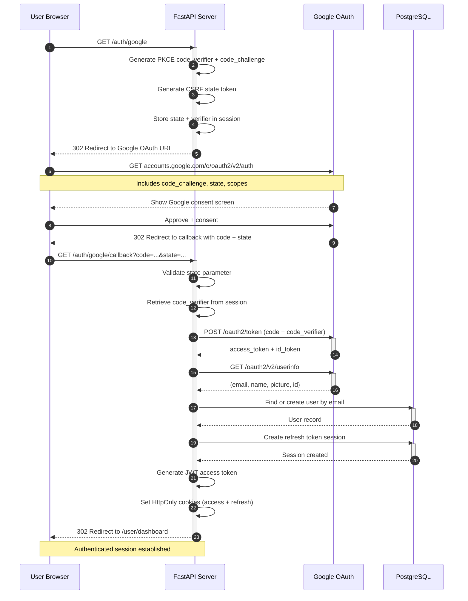
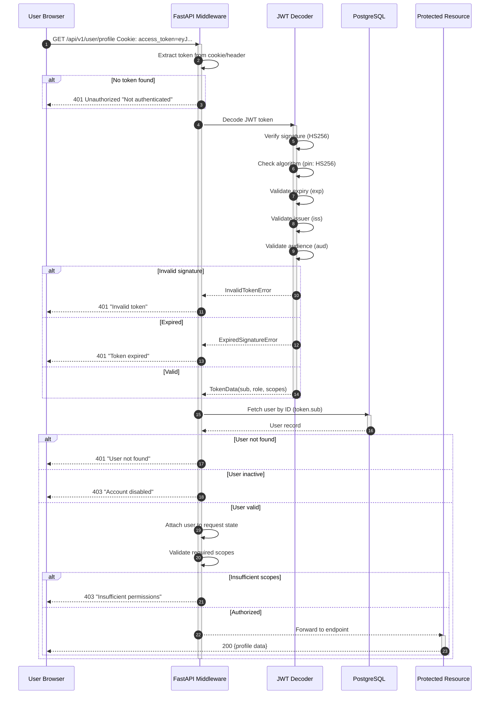
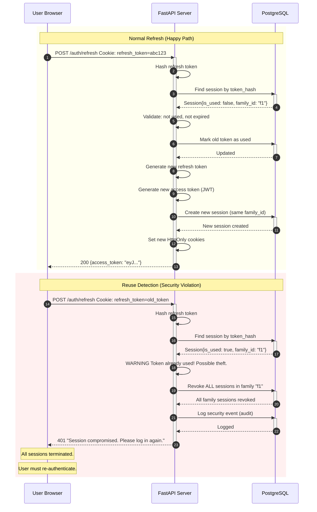
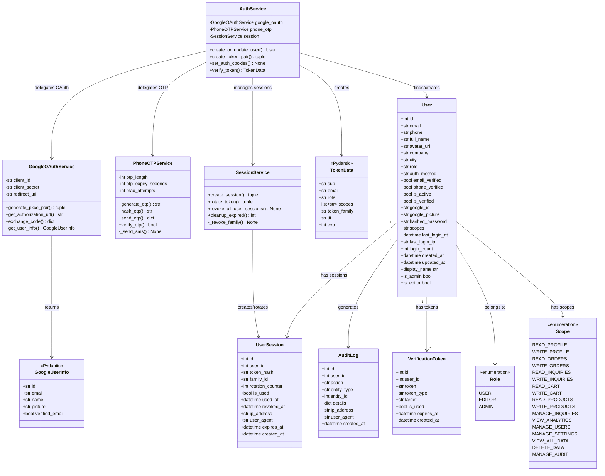

# User Panel & Admin Panel — System Design Document

> **Version:** 2.0 — HLD/LLD Redesign
> **Date:** July 2026
> **Stack:** FastAPI + SQLAlchemy + JWT + Google OAuth + Phone OTP
> **Domain:** barktechnologies.in
> **Status:** Production-Ready Design

---

## Table of Contents

1. [Executive Summary](#1-executive-summary)
2. [High-Level Authentication Architecture (HLD)](#2-high-level-authentication-architecture-hld)
   - 2.1 [System Overview](#21-system-overview)
   - 2.2 [Authentication Flow Overview](#22-authentication-flow-overview)
   - 2.3 [Authorization System Design](#23-authorization-system-design)
   - 2.4 [Session Management Strategy](#24-session-management-strategy)
   - 2.5 [Security Architecture](#25-security-architecture)
   - 2.6 [Data Isolation Architecture](#26-data-isolation-architecture)
3. [Low-Level Authentication Design (LLD)](#3-low-level-authentication-design-lld)
   - 3.1 [JWT Token Structure](#31-jwt-token-structure)
   - 3.2 [RBAC Implementation](#32-rbac-implementation)
   - 3.3 [Google OAuth Flow](#33-google-oauth-flow)
   - 3.4 [Phone OTP System](#34-phone-otp-system)
   - 3.5 [Session Management Implementation](#35-session-management-implementation)
   - 3.6 [Refresh Token Rotation](#36-refresh-token-rotation)
4. [Mermaid Diagrams](#4-mermaid-diagrams)
   - 4.1 [Sequence Diagrams](#41-sequence-diagrams)
   - 4.2 [Class Diagram](#42-class-diagram)
5. [SOLID Principles Applied](#5-solid-principles-applied)
   - 5.1 [Single Responsibility Principle](#51-single-responsibility-principle)
   - 5.2 [Open/Closed Principle](#52-openclosed-principle)
   - 5.3 [Interface Segregation Principle](#53-interface-segregation-principle)
   - 5.4 [Dependency Inversion Principle](#54-dependency-inversion-principle)
   - 5.5 [Liskov Substitution Principle](#55-liskov-substitution-principle)
6. [Implementation Details](#6-implementation-details)
   - 6.1 [FastAPI Dependency Injection for Auth](#61-fastapi-dependency-injection-for-auth)
   - 6.2 [JWT Middleware](#62-jwt-middleware)
   - 6.3 [Role-Based Access Control](#63-role-based-access-control)
   - 6.4 [Data Isolation Middleware](#64-data-isolation-middleware)
   - 6.5 [Admin Dashboard](#65-admin-dashboard)
7. [Database Schema](#7-database-schema)
8. [API Endpoints Reference](#8-api-endpoints-reference)
9. [Security Hardening](#9-security-hardening)
10. [Implementation Roadmap](#10-implementation-roadmap)
11. [Configuration Reference](#11-configuration-reference)
12. [Summary](#12-summary)

---

## 1. Executive Summary

This document presents the complete system design for the Bark Technologies user panel and admin panel, restructured following HLD (High-Level Design) and LLD (Low-Level Design) principles. The system supports multi-provider authentication (Google OAuth 2.0, Phone OTP, Email/Password), role-based access control (RBAC), and strict data isolation between user and admin panels.

### Key Design Decisions

| Decision | Choice | Rationale |
|----------|--------|-----------|
| Token Storage | HttpOnly Secure cookies | Prevents XSS token theft; industry standard for browser apps |
| Token Format | JWT (HS256) with rotation | Stateless validation with secure refresh token rotation |
| Auth Providers | Google OAuth + Phone OTP | Primary user auth methods; email/password for admin only |
| RBAC Model | Role + Scope based | Fine-grained permissions with role inheritance |
| Session State | Database-backed refresh tokens | Enables token revocation and reuse detection |
| Algorithm Pinning | HS256 with `algorithms=["HS256"]` | Prevents `alg=none` and algorithm confusion attacks |

### 2026 Best Practices Incorporated

- **Refresh token rotation with reuse detection** (Auth0/Okta consensus pattern)
- **HttpOnly + Secure + SameSite=Lax cookies** for all token transport
- **Algorithm pinning** to prevent JWT bypass attacks
- **PKCE for Google OAuth** even for server-side apps (defense in depth)
- **Token family tracking** to detect and revoke compromised token chains
- **Rate limiting** on auth endpoints per-IP and per-user

---

## 2. High-Level Authentication Architecture (HLD)

### 2.1 System Overview

The authentication system is built on a layered architecture with clear separation of concerns:

```
+-------------------------------------------------------------------------+
|                         CLIENT LAYER                                    |
|                                                                         |
|   +------------------+  +------------------+  +---------------------+   |
|   |   User Panel      |  |  Admin Panel      |  |  Public Site         |   |
|   |   (Jinja2 + JS)   |  |  (Jinja2 + JS)   |  |  (Jinja2)            |   |
|   |   /user/*          |  |  /admin/*         |  |  /*                  |   |
|   +--------+----------+  +--------+----------+  +---------------------+   |
|            |                       |                                      |
+------------+-----------------------+--------------------------------------+
             |                       |
             v                       v
+-------------------------------------------------------------------------+
|                    API GATEWAY (FastAPI)                                  |
|                                                                         |
|   +---------------------------------------------------------------+    |
|   |                  AUTH MIDDLEWARE PIPELINE                       |    |
|   |                                                                 |    |
|   |  +--------------+  +--------------+  +--------------------+    |    |
|   |  | 1. JWT Verify |-> | 2. Role Check |-> | 3. Scope Validate |    |    |
|   |  |   (signature  |  |   (RBAC       |  |   (permission      |    |    |
|   |  |    + expiry)  |  |    hierarchy) |  |    matrix)         |    |    |
|   |  +--------------+  +--------------+  +--------------------+    |    |
|   |                                                                 |    |
|   |  +--------------------------------------------------------+    |    |
|   |  | 4. Data Isolation Filter (user_id == token.sub)        |    |    |
|   |  +--------------------------------------------------------+    |    |
|   +---------------------------------------------------------------+    |
|                                                                         |
|   +--------------+  +--------------+  +----------------------------+    |
|   | /api/v1/auth  |  | /api/v1/user |  | /api/v1/admin              |    |
|   | (login, OTP,  |  | (profile,    |  | (user mgmt, analytics,     |    |
|   |  OAuth,       |  |  orders,     |  |  audit logs, settings)     |    |
|   |  refresh)     |  |  inquiries)  |  |                            |    |
|   +--------------+  +--------------+  +----------------------------+    |
|                                                                         |
+-------------------------------------------------------------------------+
                              |
                              v
+-------------------------------------------------------------------------+
|                        SERVICE LAYER                                     |
|                                                                         |
|   +--------------+  +--------------+  +----------------------------+    |
|   | AuthService   |  | UserService  |  | AdminService                |    |
|   | (JWT, OAuth,  |  | (CRUD,       |  | (User mgmt, analytics,     |    |
|   |  OTP, Token)  |  |  isolation)  |  |  audit)                     |    |
|   +------+--------+  +------+--------+  +----------+----------------+    |
|          |                  |                      |                     |
+----------+------------------+----------------------+--------------------+
           |                  |                      |
           v                  v                      v
+-------------------------------------------------------------------------+
|                        DATA LAYER                                        |
|                                                                         |
|   +--------------+  +--------------+  +----------------------------+    |
|   | PostgreSQL    |  | Redis        |  | External APIs               |    |
|   | (users,       |  | (session     |  | (Google OAuth, MSG91/Twilio  |    |
|   |  sessions,    |  |  cache,      |  |  SMS)                       |    |
|   |  audit logs)  |  |  rate limit) |  |                            |    |
|   +--------------+  +--------------+  +----------------------------+    |
|                                                                         |
+-------------------------------------------------------------------------+
```

### 2.2 Authentication Flow Overview

The system supports three authentication methods, each following established security patterns:

#### Authentication Method Comparison

| Method | Flow | Security Model | Use Case | Token Storage |
|--------|------|---------------|----------|---------------|
| **Google OAuth 2.0 + PKCE** | Authorization Code + PKCE | OAuth 2.1 compliant | Primary user login | HttpOnly cookie |
| **Phone OTP** | SMS 6-digit code | Time-limited, attempt-limited | Secondary/alternative login | HttpOnly cookie |
| **Email + Password** | Traditional form | bcrypt + rate limiting | Admin login only | HttpOnly cookie |
| **JWT Refresh** | Token rotation + reuse detection | Server-side validation | Session persistence | HttpOnly cookie |

#### Authentication State Machine

```
                    +-------------+
                    |  Anonymous   |
                    |  (no token)  |
                    +------+------+
                           |
              +------------+------------+
              |            |            |
              v            v            v
        +----------+ +----------+ +----------+
        | Google   | | Phone    | | Email+   |
        | OAuth    | | OTP      | | Password |
        | Init     | | Request  | | (Admin)  |
        +----+-----+ +----+-----+ +----+-----+
             |             |             |
             v             v             v
        +----------+ +----------+ +----------+
        | Google   | | OTP      | | Verify   |
        | Callback | | Verify   | | Password |
        +----+-----+ +----+-----+ +----+-----+
             |             |             |
             +-------------+-------------+
                           |
                           v
                    +-------------+
                    |   User      |
                    | Authenticated|
                    | (JWT issued) |
                    +------+------+
                           |
              +------------+------------+
              |            |            |
              v            v            v
        +----------+ +----------+ +----------+
        | User     | | Editor   | | Admin    |
        | Panel    | | Panel    | | Panel    |
        +----------+ +----------+ +----------+
```

### 2.3 Authorization System Design

#### Role Hierarchy

```
+-------------------------------------------------------------------------+
|                    ROLE HIERARCHY                                         |
|                                                                           |
|                    +--------------+                                      |
|                    |    ADMIN      |                                      |
|                    |  (full access) |                                     |
|                    +-------+--------+                                     |
|                            |                                              |
|                            | inherits all                                 |
|                            | editor permissions                           |
|                            v                                              |
|                    +--------------+                                      |
|                    |   EDITOR     |                                      |
|                    | (content mgmt)|                                     |
|                    +-------+--------+                                     |
|                            |                                              |
|                            | inherits all                                 |
|                            | user permissions                             |
|                            v                                              |
|                    +--------------+                                      |
|                    |    USER      |                                      |
|                    | (self-service)|                                     |
|                    +--------------+                                      |
|                                                                           |
|  Permission Inheritance:                                                 |
|  admin = user perms union editor perms union admin perms                 |
|  editor = user perms union editor perms                                  |
|  user = own data only                                                    |
+-------------------------------------------------------------------------+
```

#### RBAC Permission Matrix

| Resource | Anonymous | User | Editor | Admin |
|----------|:---------:|:----:|:------:|:-----:|
| Public pages | YES | YES | YES | YES |
| Product catalog | YES | YES | YES | YES |
| Submit inquiry | YES | YES | YES | YES |
| **---** | --- | --- | --- | --- |
| User dashboard | NO | YES | YES | YES |
| Own profile | NO | YES | YES | YES |
| Own orders | NO | YES | YES | YES |
| Own inquiries | NO | YES | YES | YES |
| **---** | --- | --- | --- | --- |
| Product CRUD | NO | NO | YES | YES |
| Inquiry management | NO | NO | YES | YES |
| Analytics dashboard | NO | NO | YES | YES |
| **---** | --- | --- | --- | --- |
| User management | NO | NO | NO | YES |
| Admin settings | NO | NO | NO | YES |
| Delete products | NO | NO | NO | YES |
| System config | NO | NO | NO | YES |
| Audit log access | NO | NO | NO | YES |

#### Scope-Based Permission Model

Scopes provide fine-grained permission control beyond roles. Each API endpoint declares its required scopes, and the middleware validates that the user's token contains the necessary scopes.

```python
# Scope definitions organized by domain
USER_SCOPES = [
    "read:profile",        # View own profile
    "write:profile",       # Update own profile
    "read:orders",         # View own orders
    "write:orders",        # Place new orders
    "read:inquiries",      # View own inquiries
    "write:inquiries",     # Submit new inquiries
    "read:cart",           # View shopping cart
    "write:cart",          # Modify shopping cart
]

EDITOR_SCOPES = USER_SCOPES + [
    "read:products",       # View all products
    "write:products",      # Create/edit products
    "manage:inquiries",    # Manage all inquiries
    "view:analytics",      # View analytics data
]

ADMIN_SCOPES = EDITOR_SCOPES + [
    "manage:users",        # User management
    "manage:settings",     # System settings
    "view:all_data",       # Cross-user data access
    "delete:data",         # Soft/hard delete operations
    "manage:audit",        # Audit log access
]
```

### 2.4 Session Management Strategy

The session management strategy follows the 2026 consensus pattern of refresh token rotation with reuse detection:

#### Session Lifecycle

```
+-------------------------------------------------------------------------+
|                    SESSION LIFECYCLE                                      |
|                                                                           |
|  1. LOGIN                                                                 |
|     +---------------------------------------------------------------+    |
|     | User authenticates (Google/OTP/Password)                       |    |
|     | Server generates:                                              |    |
|     |   - Access token (JWT, 30 min expiry)                         |    |
|     |   - Refresh token (opaque, 30 day expiry)                     |    |
|     |   - Token family ID (UUID for rotation tracking)              |    |
|     | Server stores: token hash + family ID in DB                   |    |
|     | Server sets: HttpOnly cookies for both tokens                  |    |
|     +---------------------------------------------------------------+    |
|                                                                           |
|  2. REFRESH (every 30 min)                                                |
|     +---------------------------------------------------------------+    |
|     | Client sends refresh token cookie                              |    |
|     | Server validates token hash in DB                              |    |
|     | Server marks old token as used                                 |    |
|     | Server issues NEW access + refresh token pair                  |    |
|     | Server updates token hash in DB                                |    |
|     | Old token is immediately invalid                               |    |
|     +---------------------------------------------------------------+    |
|                                                                           |
|  3. REUSE DETECTION (security trigger)                                    |
|     +---------------------------------------------------------------+    |
|     | If a used refresh token is presented again:                    |    |
|     |   -> STRONG signal of token theft                              |    |
|     |   -> Revoke ENTIRE token family (all sessions)                |    |
|     |   -> Force user to re-authenticate                             |    |
|     |   -> Log security event in audit log                           |    |
|     +---------------------------------------------------------------+    |
|                                                                           |
|  4. LOGOUT                                                                |
|     +---------------------------------------------------------------+    |
|     | Client sends logout request                                    |    |
|     | Server marks current refresh token as revoked                  |    |
|     | Server clears HttpOnly cookies                                 |    |
|     | All sessions for this token family are terminated              |    |
|     +---------------------------------------------------------------+    |
|                                                                           |
|  5. CONCURRENT SESSIONS                                                   |
|     +---------------------------------------------------------------+    |
|     | Each login creates a new token family                          |    |
|     | Users can have multiple active sessions                        |    |
|     | Admin can view/revoke all sessions                             |    |
|     | Maximum sessions per user: configurable (default: 5)           |    |
|     +---------------------------------------------------------------+    |
|                                                                           |
+-------------------------------------------------------------------------+
```

#### Token Storage Security

| Token Type | Storage | Attributes | Rationale |
|------------|---------|------------|-----------|
| Access Token | HttpOnly cookie | `secure=True, samesite="lax"` | Prevents XSS theft; Lax allows same-site navigation |
| Refresh Token | HttpOnly cookie | `secure=True, samesite="strict", path="/auth/refresh"` | Scoped to refresh endpoint only; strict prevents CSRF |
| Session ID | Server-side DB | Indexed, with family ID | Enables revocation and reuse detection |

### 2.5 Security Architecture

#### Defense-in-Depth Layers

```
+-------------------------------------------------------------------------+
|                    SECURITY LAYERS                                        |
|                                                                           |
|  Layer 1: TRANSPORT SECURITY                                             |
|  +---------------------------------------------------------------+      |
|  | * HTTPS enforced (HSTS header)                                  |      |
|  | * TLS 1.3 minimum                                              |      |
|  | * Certificate pinning for mobile (future)                      |      |
|  +---------------------------------------------------------------+      |
|                                                                           |
|  Layer 2: TOKEN SECURITY                                                  |
|  +---------------------------------------------------------------+      |
|  | * Algorithm pinning (HS256 only)                                |      |
|  | * Short-lived access tokens (30 min)                           |      |
|  | * Refresh token rotation with reuse detection                   |      |
|  | * HttpOnly cookies (no JavaScript access)                       |      |
|  | * Token hash stored in DB (raw token never stored)             |      |
|  +---------------------------------------------------------------+      |
|                                                                           |
|  Layer 3: AUTHORIZATION                                                   |
|  +---------------------------------------------------------------+      |
|  | * RBAC with role hierarchy                                      |      |
|  | * Scope-based fine-grained permissions                          |      |
|  | * Data isolation (user_id == token.sub for user routes)         |      |
|  | * Admin-only route protection                                   |      |
|  +---------------------------------------------------------------+      |
|                                                                           |
|  Layer 4: RATE LIMITING                                                   |
|  +---------------------------------------------------------------+      |
|  | * Login: 5 attempts/min per IP                                 |      |
|  | * OTP: 3 requests/5 min per phone                              |      |
|  | * API: 60 requests/min per user                                |      |
|  | * Admin: 120 requests/min per admin                            |      |
|  | * Brute force: exponential backoff after 3 failures            |      |
|  +---------------------------------------------------------------+      |
|                                                                           |
|  Layer 5: CSRF PROTECTION                                                 |
|  +---------------------------------------------------------------+      |
|  | * SameSite cookie attribute                                     |      |
|  | * State parameter in OAuth flow                                 |      |
|  | * Origin header validation                                      |      |
|  | * Double-submit cookie pattern for state-changing ops           |      |
|  +---------------------------------------------------------------+      |
|                                                                           |
|  Layer 6: AUDIT & MONITORING                                              |
|  +---------------------------------------------------------------+      |
|  | * All auth events logged                                        |      |
|  | * Admin actions tracked with IP and user agent                  |      |
|  | * Failed login attempts monitored                               |      |
|  | * Token reuse events trigger alerts                             |      |
|  +---------------------------------------------------------------+      |
|                                                                           |
+-------------------------------------------------------------------------+
```

#### Threat Mitigation Matrix

| Threat | Mitigation | Layer |
|--------|-----------|-------|
| XSS token theft | HttpOnly cookies | Token Security |
| CSRF attack | SameSite cookies + state param | CSRF Protection |
| Token replay | Short expiry + rotation | Token Security |
| Brute force | Rate limiting + backoff | Rate Limiting |
| Algorithm confusion | Pin `algorithms=["HS256"]` | Token Security |
| Token theft (refresh) | Reuse detection + family revocation | Token Security |
| Privilege escalation | RBAC + scope validation | Authorization |
| Data leakage | Data isolation middleware | Authorization |
| Session fixation | Regenerate session on login | Session Management |
| Open redirect | Validate redirect_uri against whitelist | Transport Security |

### 2.6 Data Isolation Architecture

Data isolation ensures users can only access their own data, while admins have full access:

```
+-------------------------------------------------------------------------+
|                    DATA ISOLATION RULES                                   |
|                                                                           |
|  RULE 1: USER DATA ISOLATION                                             |
|  ---------------------------                                             |
|  Users can ONLY see their own data.                                      |
|                                                                           |
|  GET /api/v1/user/profile      -> Returns current user only             |
|  GET /api/v1/user/orders       -> Returns current user's orders         |
|  GET /api/v1/user/inquiries    -> Returns current user's inquiries      |
|  PUT /api/v1/user/profile      -> Updates current user only             |
|                                                                           |
|  Enforcement:                                                             |
|  - JWT token.sub == current_user.id                                     |
|  - Service layer filters by user_id (mandatory parameter)               |
|  - SQL queries always include WHERE user_id = :current_user_id          |
|                                                                           |
|  RULE 2: ADMIN FULL ACCESS                                               |
|  -------------------------                                               |
|  Admins can see ALL data across the system.                              |
|                                                                           |
|  GET /api/v1/admin/users       -> Returns all users                     |
|  GET /api/v1/admin/users/{id}  -> Returns any user's details            |
|  GET /api/v1/admin/orders      -> Returns all orders                    |
|  GET /api/v1/admin/inquiries   -> Returns all inquiries                 |
|                                                                           |
|  Enforcement:                                                             |
|  - JWT token.role == "admin"                                             |
|  - Admin dependency validates role before data access                     |
|  - Service layer skips user_id filter for admin queries                  |
|                                                                           |
|  RULE 3: EDITOR CONTENT MANAGEMENT                                       |
|  -------------------------------                                         |
|  Editors can manage content but NOT users.                               |
|                                                                           |
|  GET /api/v1/admin/products    -> CRUD products                         |
|  GET /api/v1/admin/inquiries   -> View/manage inquiries                 |
|  GET /api/v1/admin/users       -> FORBIDDEN                             |
|                                                                           |
|  Enforcement:                                                             |
|  - JWT token.role in ["admin", "editor"]                                 |
|  - User management endpoints require admin role specifically             |
|  - Editor scope includes content but excludes user management            |
|                                                                           |
|  RULE 4: SCOPE-BASED VALIDATION                                          |
|  ----------------------------                                            |
|  JWT scope contains fine-grained permissions.                            |
|                                                                           |
|  Token payload:                                                           |
|  {                                                                        |
|    "sub": "user_123",                                                     |
|    "role": "user",                                                        |
|    "scopes": ["read:profile", "write:profile", "read:orders"]            |
|  }                                                                        |
|                                                                           |
|  Middleware validates:                                                     |
|  - token.sub == resource.user_id (for user endpoints)                   |
|  - token.role in allowed_roles (for admin endpoints)                    |
|  - token.scopes superset required_scopes (for all endpoints)            |
|                                                                           |
+-------------------------------------------------------------------------+
```

---

## 3. Low-Level Authentication Design (LLD)

### 3.1 JWT Token Structure

#### Access Token (JWT)

```json
{
  "header": {
    "alg": "HS256",
    "typ": "JWT",
    "kid": "2026-07-01"
  },
  "payload": {
    "sub": "123",
    "email": "user@gmail.com",
    "phone": "+918810597980",
    "role": "user",
    "scopes": [
      "read:profile",
      "write:profile",
      "read:orders",
      "write:orders",
      "read:inquiries",
      "write:inquiries",
      "read:cart",
      "write:cart"
    ],
    "email_verified": true,
    "phone_verified": true,
    "auth_method": "google",
    "token_family": "a1b2c3d4-e5f6-7890-abcd-ef1234567890",
    "iat": 1751635200,
    "exp": 1751637000,
    "iss": "barktechnologies.in",
    "aud": "barktechnologies.in",
    "jti": "unique-token-id-12345"
  }
}
```

#### Refresh Token (Opaque)

```json
{
  "token": "opaque_random_string_64_chars",
  "token_hash": "sha256_hash_of_token",
  "user_id": 123,
  "family_id": "a1b2c3d4-e5f6-7890-abcd-ef1234567890",
  "rotation_counter": 1,
  "is_used": false,
  "revoked_at": null,
  "expires_at": "2026-08-03T18:30:00Z",
  "created_at": "2026-07-04T18:30:00Z"
}
```

#### Token Configuration

| Parameter | Access Token | Refresh Token |
|-----------|-------------|---------------|
| Format | JWT (signed) | Opaque string |
| Algorithm | HS256 (pinned) | SHA-256 hash |
| Expiry | 30 minutes | 30 days |
| Storage | HttpOnly cookie | HttpOnly cookie |
| Cookie Path | `/` | `/auth/refresh` |
| SameSite | Lax | Strict |
| Rotation | No (short-lived) | Yes (on every use) |
| Revocation | N/A (expires quickly) | Yes (DB + family revocation) |

### 3.2 RBAC Implementation

#### Role-Permission Mapping

```python
from enum import Enum


class Role(str, Enum):
    USER = "user"
    EDITOR = "editor"
    ADMIN = "admin"


class Scope(str, Enum):
    # User scopes
    READ_PROFILE = "read:profile"
    WRITE_PROFILE = "write:profile"
    READ_ORDERS = "read:orders"
    WRITE_ORDERS = "write:orders"
    READ_INQUIRIES = "read:inquiries"
    WRITE_INQUIRIES = "write:inquiries"
    READ_CART = "read:cart"
    WRITE_CART = "write:cart"

    # Editor scopes
    READ_PRODUCTS = "read:products"
    WRITE_PRODUCTS = "write:products"
    MANAGE_INQUIRIES = "manage:inquiries"
    VIEW_ANALYTICS = "view:analytics"

    # Admin scopes
    MANAGE_USERS = "manage:users"
    MANAGE_SETTINGS = "manage:settings"
    VIEW_ALL_DATA = "view:all_data"
    DELETE_DATA = "delete:data"
    MANAGE_AUDIT = "manage:audit"


# Role -> Scopes mapping (inheritance built-in)
ROLE_SCOPES: dict[Role, list[Scope]] = {
    Role.USER: [
        Scope.READ_PROFILE, Scope.WRITE_PROFILE,
        Scope.READ_ORDERS, Scope.WRITE_ORDERS,
        Scope.READ_INQUIRIES, Scope.WRITE_INQUIRIES,
        Scope.READ_CART, Scope.WRITE_CART,
    ],
    Role.EDITOR: [
        # All user scopes plus:
        Scope.READ_PRODUCTS, Scope.WRITE_PRODUCTS,
        Scope.MANAGE_INQUIRIES, Scope.VIEW_ANALYTICS,
    ],
    Role.ADMIN: [
        # All editor scopes plus:
        Scope.MANAGE_USERS, Scope.MANAGE_SETTINGS,
        Scope.VIEW_ALL_DATA, Scope.DELETE_DATA,
        Scope.MANAGE_AUDIT,
    ],
}


def get_scopes_for_role(role: Role) -> list[str]:
    """Get flat list of scope strings for a role."""
    return [s.value for s in ROLE_SCOPES.get(role, [])]


def has_scope(user_scopes: list[str], required: str) -> bool:
    """Check if user has a specific scope."""
    return required in user_scopes


def has_any_scope(user_scopes: list[str], required: list[str]) -> bool:
    """Check if user has at least one of the required scopes."""
    return any(s in user_scopes for s in required)


def has_all_scopes(user_scopes: list[str], required: list[str]) -> bool:
    """Check if user has all required scopes."""
    return all(s in user_scopes for s in required)
```

#### Route-Level Permission Declaration

```python
from fastapi import Depends, Security
from fastapi.security import SecurityScopes

from app.core.auth import get_current_user
from app.core.scopes import Scope


@router.get("/admin/users")
async def list_users(
    current_user: User = Security(
        get_current_user,
        scopes=[Scope.MANAGE_USERS.value],
    ),
    db: Session = Depends(get_db),
):
    """Admin-only: List all users."""
    # current_user is guaranteed to have MANAGE_USERS scope
    ...


@router.get("/user/orders")
async def get_my_orders(
    current_user: User = Security(
        get_current_user,
        scopes=[Scope.READ_ORDERS.value],
    ),
    db: Session = Depends(get_db),
):
    """User: Get own orders (data isolation enforced)."""
    # Service layer filters by current_user.id
    ...
```

### 3.3 Google OAuth Flow

#### Complete OAuth 2.0 + PKCE Implementation

```python
# bark/app/services/google_oauth.py

"""Google OAuth 2.0 integration with PKCE for user authentication."""

from __future__ import annotations

import hashlib
import base64
import secrets
from urllib.parse import urlencode

import httpx
from fastapi import HTTPException
from pydantic import BaseModel

from app.config import get_settings

settings = get_settings()

GOOGLE_TOKEN_URL = "https://oauth2.googleapis.com/token"
GOOGLE_USERINFO_URL = "https://www.googleapis.com/oauth2/v2/userinfo"
GOOGLE_AUTH_URL = "https://accounts.google.com/o/oauth2/v2/auth"


class GoogleUserInfo(BaseModel):
    """User info returned by Google."""
    id: str
    email: str
    name: str
    picture: str | None = None
    verified_email: bool = False


class GoogleOAuthService:
    """
    Handles Google OAuth 2.0 authentication with PKCE.

    Security measures:
    - PKCE (Proof Key for Code Exchange) for code interception protection
    - State parameter for CSRF protection
    - Algorithm pinning for token verification
    - Redirect URI validation
    """

    def __init__(self):
        self.client_id = settings.google_client_id
        self.client_secret = settings.google_client_secret
        self.redirect_uri = f"{settings.base_url}/api/v1/auth/google/callback"

    def generate_pkce_pair(self) -> tuple[str, str]:
        """
        Generate PKCE code verifier and challenge.

        Returns:
            Tuple of (code_verifier, code_challenge)
        """
        code_verifier = base64.urlsafe_b64encode(
            secrets.token_bytes(32)
        ).rstrip(b"=").decode("ascii")

        digest = hashlib.sha256(code_verifier.encode("ascii")).digest()
        code_challenge = base64.urlsafe_b64encode(digest).rstrip(b"=").decode("ascii")

        return code_verifier, code_challenge

    def get_authorization_url(self, state: str, code_challenge: str) -> str:
        """
        Generate Google OAuth authorization URL with PKCE.

        Args:
            state: CSRF protection state parameter
            code_challenge: PKCE code challenge (S256)

        Returns:
            Full authorization URL
        """
        params = {
            "client_id": self.client_id,
            "redirect_uri": self.redirect_uri,
            "response_type": "code",
            "scope": "openid email profile",
            "access_type": "offline",
            "prompt": "consent",
            "state": state,
            "code_challenge": code_challenge,
            "code_challenge_method": "S256",
        }
        return f"{GOOGLE_AUTH_URL}?{urlencode(params)}"

    async def exchange_code(self, code: str, code_verifier: str) -> dict:
        """
        Exchange authorization code for tokens using PKCE.

        Args:
            code: Authorization code from Google
            code_verifier: PKCE code verifier

        Returns:
            Token response with access_token and refresh_token
        """
        async with httpx.AsyncClient() as client:
            response = await client.post(
                GOOGLE_TOKEN_URL,
                data={
                    "code": code,
                    "client_id": self.client_id,
                    "client_secret": self.client_secret,
                    "redirect_uri": self.redirect_uri,
                    "grant_type": "authorization_code",
                    "code_verifier": code_verifier,
                },
            )
            if response.status_code != 200:
                raise HTTPException(
                    status_code=400,
                    detail="Failed to exchange authorization code",
                )
            return response.json()

    async def get_user_info(self, access_token: str) -> GoogleUserInfo:
        """
        Get user info from Google using access token.

        Args:
            access_token: Google OAuth access token

        Returns:
            User info from Google
        """
        async with httpx.AsyncClient() as client:
            response = await client.get(
                GOOGLE_USERINFO_URL,
                headers={"Authorization": f"Bearer {access_token}"},
            )
            if response.status_code != 200:
                raise HTTPException(
                    status_code=400,
                    detail="Failed to get user info from Google",
                )
            return GoogleUserInfo(**response.json())


google_oauth = GoogleOAuthService()
```

#### OAuth Flow Endpoint

```python
# bark/app/routers/v1/auth.py

from fastapi import APIRouter, Request, Response, Depends
from fastapi.responses import RedirectResponse
from sqlalchemy.orm import Session

from app.database import get_db
from app.services.google_oauth import google_oauth
from app.services.auth import auth_service
from app.core.security import generate_state_token

router = APIRouter(prefix="/auth", tags=["Authentication"])


@router.get("/google")
async def google_login(request: Request):
    """
    Initiate Google OAuth login with PKCE.

    1. Generate PKCE code verifier/challenge
    2. Generate CSRF state token
    3. Store both in session
    4. Redirect to Google authorization URL
    """
    code_verifier, code_challenge = google_oauth.generate_pkce_pair()
    state = generate_state_token()

    # Store in session (server-side)
    request.session["oauth_state"] = state
    request.session["pkce_verifier"] = code_verifier

    auth_url = google_oauth.get_authorization_url(
        state=state,
        code_challenge=code_challenge,
    )

    return RedirectResponse(url=auth_url)


@router.get("/google/callback")
async def google_callback(
    request: Request,
    code: str,
    state: str,
    db: Session = Depends(get_db),
):
    """
    Handle Google OAuth callback.

    1. Validate state token (CSRF protection)
    2. Exchange code for tokens (with PKCE verifier)
    3. Get user info from Google
    4. Create/update user in database
    5. Generate JWT tokens
    6. Set HttpOnly cookies
    7. Redirect to user dashboard
    """
    # Validate state
    stored_state = request.session.pop("oauth_state", None)
    if not stored_state or stored_state != state:
        raise HTTPException(status_code=400, detail="Invalid OAuth state")

    # Get PKCE verifier
    code_verifier = request.session.pop("pkce_verifier", None)
    if not code_verifier:
        raise HTTPException(status_code=400, detail="Missing PKCE verifier")

    # Exchange code for tokens
    token_data = await google_oauth.exchange_code(code, code_verifier)

    # Get user info
    user_info = await google_oauth.get_user_info(token_data["access_token"])

    # Create/update user
    user = auth_service.create_or_update_user(
        db,
        email=user_info.email,
        full_name=user_info.name,
        avatar_url=user_info.picture,
        google_id=user_info.id,
        auth_method="google",
    )

    # Generate JWT tokens
    access_token, refresh_token = auth_service.create_token_pair(
        user=user,
        db=db,
    )

    # Set cookies and redirect
    response = RedirectResponse(url="/user/dashboard")
    auth_service.set_auth_cookies(response, access_token, refresh_token)

    return response
```

### 3.4 Phone OTP System

#### OTP Service Implementation

```python
# bark/app/services/phone_otp.py

"""Phone OTP authentication service with rate limiting."""

from __future__ import annotations

import hashlib
import secrets
import time
from datetime import datetime, timedelta, timezone

import httpx
from fastapi import HTTPException

from app.config import get_settings

settings = get_settings()


class PhoneOTPService:
    """
    Handles phone number OTP generation and verification.

    Security measures:
    - 6-digit OTP (1M combinations)
    - 5-minute expiry
    - Max 3 attempts per OTP
    - 1-minute cooldown between OTP requests
    - OTP hashed before storage
    - Rate limiting per phone number
    """

    def __init__(self):
        self.otp_length = 6
        self.otp_expiry_seconds = 300  # 5 minutes
        self.max_attempts = 3
        self.cooldown_seconds = 60  # 1 minute between requests
        self.sms_api_key = settings.sms_api_key
        self.sms_sender = settings.sms_sender_id

    def generate_otp(self) -> str:
        """Generate a cryptographically random 6-digit OTP."""
        return "".join(secrets.choice("0123456789") for _ in range(self.otp_length))

    def hash_otp(self, otp: str) -> str:
        """Hash OTP using SHA-256 for secure storage."""
        return hashlib.sha256(otp.encode()).hexdigest()

    async def send_otp(self, phone_number: str) -> dict:
        """
        Generate and send OTP to phone number.

        Args:
            phone_number: E.164 formatted phone number

        Returns:
            Status dict with expiry info

        Raises:
            HTTPException: If rate limited
        """
        # Check cooldown
        stored = _otp_store.get(phone_number)
        if stored:
            time_since_last = time.time() - stored.get("last_attempt", 0)
            if time_since_last < self.cooldown_seconds:
                remaining = int(self.cooldown_seconds - time_since_last)
                raise HTTPException(
                    status_code=429,
                    detail=f"Please wait {remaining} seconds before requesting a new OTP",
                )

        # Generate OTP
        otp = self.generate_otp()
        otp_hash = self.hash_otp(otp)

        # Store OTP with metadata
        _otp_store[phone_number] = {
            "otp_hash": otp_hash,
            "created_at": time.time(),
            "expires_at": time.time() + self.otp_expiry_seconds,
            "attempts": 0,
            "last_attempt": time.time(),
        }

        # Send SMS
        await self._send_sms(phone_number, otp)

        return {
            "status": "sent",
            "message": f"OTP sent to {phone_number}",
            "expires_in": self.otp_expiry_seconds,
        }

    async def verify_otp(self, phone_number: str, otp: str) -> bool:
        """
        Verify OTP against stored hash.

        Args:
            phone_number: Phone number to verify
            otp: OTP entered by user

        Returns:
            True if OTP is valid

        Raises:
            HTTPException: If OTP expired, not found, or max attempts exceeded
        """
        if phone_number not in _otp_store:
            raise HTTPException(
                status_code=400,
                detail="No OTP found. Please request a new one.",
            )

        stored = _otp_store[phone_number]

        # Check expiry
        if time.time() > stored["expires_at"]:
            del _otp_store[phone_number]
            raise HTTPException(
                status_code=400,
                detail="OTP has expired. Please request a new one.",
            )

        # Check max attempts
        stored["attempts"] += 1
        stored["last_attempt"] = time.time()

        if stored["attempts"] > self.max_attempts:
            del _otp_store[phone_number]
            raise HTTPException(
                status_code=429,
                detail="Too many failed attempts. Please request a new OTP.",
            )

        # Verify hash
        otp_hash = self.hash_otp(otp)
        if otp_hash != stored["otp_hash"]:
            remaining = self.max_attempts - stored["attempts"]
            raise HTTPException(
                status_code=400,
                detail=f"Invalid OTP. {remaining} attempts remaining.",
            )

        # OTP verified - clean up
        del _otp_store[phone_number]
        return True

    async def _send_sms(self, phone_number: str, otp: str) -> None:
        """Send SMS via MSG91 provider."""
        message = (
            f"Your Bark Technologies verification code is: {otp}. "
            f"Valid for 5 minutes. Do not share this code."
        )

        try:
            async with httpx.AsyncClient() as client:
                await client.post(
                    "https://api.msg91.com/api/v5/flow",
                    headers={"authkey": self.sms_api_key},
                    json={
                        "flow_id": settings.msg91_flow_id,
                        "mobiles": phone_number,
                        "VAR1": otp,
                    },
                    timeout=10.0,
                )
        except Exception as e:
            # Log error but don't fail auth
            # In production, use structured logging
            print(f"SMS send failed for {phone_number}: {e}")


# In-memory store (replace with Redis in production)
_otp_store: dict[str, dict] = {}

phone_otp_service = PhoneOTPService()
```

### 3.5 Session Management Implementation

```python
# bark/app/services/session.py

"""Session management with refresh token rotation."""

from __future__ import annotations

import hashlib
import secrets
import uuid
from datetime import datetime, timedelta, timezone

from sqlalchemy.orm import Session
from sqlalchemy import select, update

from app.models.user import UserSession
from app.config import get_settings

settings = get_settings()


class SessionService:
    """
    Manages user sessions with refresh token rotation.

    Features:
    - Token family tracking for reuse detection
    - Hashed token storage (raw token never stored)
    - Concurrent session limits
    - Automatic cleanup of expired tokens
    """

    def create_session(
        self,
        db: Session,
        user_id: int,
        ip_address: str | None = None,
        user_agent: str | None = None,
    ) -> tuple[str, str]:
        """
        Create a new session with token pair.

        Args:
            db: Database session
            user_id: User ID
            ip_address: Client IP
            user_agent: Client user agent

        Returns:
            Tuple of (raw_refresh_token, token_hash)
        """
        # Generate refresh token
        raw_token = secrets.token_urlsafe(48)
        token_hash = hashlib.sha256(raw_token.encode()).hexdigest()

        # Generate family ID for rotation tracking
        family_id = str(uuid.uuid4())

        # Create session record
        session = UserSession(
            user_id=user_id,
            token_hash=token_hash,
            family_id=family_id,
            rotation_counter=0,
            ip_address=ip_address,
            user_agent=user_agent,
            expires_at=datetime.now(timezone.utc) + timedelta(
                days=settings.refresh_token_expire_days
            ),
        )

        db.add(session)
        db.commit()

        return raw_token, token_hash

    def rotate_token(
        self,
        db: Session,
        current_token_hash: str,
    ) -> tuple[str, str] | None:
        """
        Rotate refresh token (invalidate old, issue new).

        Args:
            db: Database session
            current_token_hash: Hash of current refresh token

        Returns:
            Tuple of (new_raw_token, new_token_hash) or None if invalid
        """
        # Find current session
        session = db.scalar(
            select(UserSession).where(
                UserSession.token_hash == current_token_hash,
                UserSession.is_used == False,
                UserSession.expires_at > datetime.now(timezone.utc),
            )
        )

        if not session:
            return None

        # Check for reuse (security violation)
        if session.is_used:
            # Token reuse detected - revoke entire family
            self._revoke_family(db, session.family_id)
            return None

        # Mark current token as used
        session.is_used = True
        session.used_at = datetime.now(timezone.utc)

        # Generate new token
        new_raw_token = secrets.token_urlsafe(48)
        new_token_hash = hashlib.sha256(new_raw_token.encode()).hexdigest()

        # Create new session with same family
        new_session = UserSession(
            user_id=session.user_id,
            token_hash=new_token_hash,
            family_id=session.family_id,
            rotation_counter=session.rotation_counter + 1,
            ip_address=session.ip_address,
            user_agent=session.user_agent,
            expires_at=datetime.now(timezone.utc) + timedelta(
                days=settings.refresh_token_expire_days
            ),
        )

        db.add(new_session)
        db.commit()

        return new_raw_token, new_token_hash

    def _revoke_family(self, db: Session, family_id: str) -> None:
        """Revoke all tokens in a family (security violation response)."""
        db.execute(
            update(UserSession)
            .where(UserSession.family_id == family_id)
            .values(
                is_used=True,
                revoked_at=datetime.now(timezone.utc),
            )
        )
        db.commit()

    def revoke_all_user_sessions(self, db: Session, user_id: int) -> None:
        """Revoke all sessions for a user (e.g., on password change)."""
        db.execute(
            update(UserSession)
            .where(
                UserSession.user_id == user_id,
                UserSession.is_used == False,
            )
            .values(
                is_used=True,
                revoked_at=datetime.now(timezone.utc),
            )
        )
        db.commit()

    def cleanup_expired(self, db: Session) -> int:
        """Remove expired sessions. Run daily via cron."""
        result = db.execute(
            select(UserSession).where(
                UserSession.expires_at < datetime.now(timezone.utc)
            )
        )
        expired = result.scalars().all()
        count = len(expired)
        for session in expired:
            db.delete(session)
        db.commit()
        return count


session_service = SessionService()
```

### 3.6 Refresh Token Rotation

#### Token Rotation Flow

```
+-------------------------------------------------------------------------+
|                 REFRESH TOKEN ROTATION FLOW                              |
|                                                                           |
|  Client                    Server                  Database               |
|    |                         |                        |                   |
|    |  POST /auth/refresh     |                        |                   |
|    |  Cookie: refresh_token  |                        |                   |
|    +------------------------>|                        |                   |
|    |                         |  Hash token            |                   |
|    |                         |  Look up in DB         |                   |
|    |                         +----------------------->|                   |
|    |                         |                        |                   |
|    |                         |  Token found?          |                   |
|    |                         |  Not used?             |                   |
|    |                         |  Not expired?          |                   |
|    |                         |<-----------------------+                   |
|    |                         |                        |                   |
|    |                    +----+                        |                   |
|    |                    |    |  Mark old as used      |                   |
|    |                    |    +----------------------->|                   |
|    |                    |    |                        |                   |
|    |                    |    |  Generate new token    |                   |
|    |                    |    |  Create new session    |                   |
|    |                    |    |  (same family_id)      |                   |
|    |                    |    +----------------------->|                   |
|    |                    |    |                        |                   |
|    |  Set new cookies   |<---+                        |                   |
|    |  (access + refresh)|                             |                   |
|    |<-------------------+                             |                   |
|    |                    |                             |                   |
|    |  - - - - - - - - -|- - - - - - - - - - - - - - -|- - - - - - - -  |
|    |                    |                             |                   |
|    |                    |  REUSE DETECTION            |                   |
|    |                    |                             |                   |
|    |  POST /auth/refresh|                             |                   |
|    |  (old token again) |                             |                   |
|    |------------------------>|                        |                   |
|    |                         |  Token already used!   |                   |
|    |                         |  SECURITY VIOLATION    |                   |
|    |                         +----------------------->|                   |
|    |                         |  Revoke ALL in family  |                   |
|    |                         |  Log security event    |                   |
|    |                         |                        |                   |
|    |  401 Unauthorized       |                        |                   |
|    |  "Session compromised"  |                        |                   |
|    |<------------------------+                        |                   |
|    |                         |                        |                   |
+-------------------------------------------------------------------------+
```

---

## 4. Mermaid Diagrams

### 4.1 Sequence Diagrams

#### Google OAuth 2.0 + PKCE Flow



#### Phone OTP Authentication Flow

```mermaid
sequenceDiagram
    autonumber
    participant U as User Browser
    participant S as FastAPI Server
    participant R as Redis/Cache
    participant SMS as SMS Provider (MSG91)
    participant DB as PostgreSQL

    rect rgb(240, 248, 255)
    Note over U,DB: Phase 1: OTP Request
    U->>S: POST /auth/phone/send-otp {phone: "+918810597980"}
    activate S
    S->>R: Check rate limit for phone
    R-->>S: Rate limit OK

    S->>S: Generate 6-digit OTP
    S->>S: Hash OTP (SHA-256)
    S->>R: Store hash + expiry (5 min)
    R-->>S: Stored

    S->>SMS: Send OTP via MSG91 API
    activate SMS
    SMS-->>S: Message sent
    deactivate SMS

    S-->>U: {status: "sent", expires_in: 300}
    deactivate S

    Note over U: User receives SMS with OTP
    end

    rect rgb(255, 248, 240)
    Note over U,DB: Phase 2: OTP Verification
    U->>S: POST /auth/phone/verify {phone: "+918810597980", otp: "456123"}
    activate S

    S->>R: Get stored OTP hash
    R-->>S: Stored hash + metadata

    S->>S: Hash input OTP
    S->>S: Compare hashes

    alt OTP Valid
        S->>R: Delete OTP (one-time use)
        R-->>S: Deleted

        S->>DB: Find or create user by phone
        activate DB
        DB-->>S: User record
        deactivate DB

        S->>DB: Create refresh token session
        activate DB
        DB-->>S: Session created
        deactivate DB

        S->>S: Generate JWT access token
        S->>S: Set HttpOnly cookies

        S-->>U: {access_token: "eyJ...", user: {...}}
        deactivate S
    else OTP Invalid
        S->>S: Increment attempt counter
        S-->>U: 400 {detail: "Invalid OTP. 2 attempts remaining."}
        deactivate S
    end

    rect rgb(255, 240, 240)
    Note over U,S: Phase 3: Rate Limiting
    S->>S: If attempts > 3 then 429 Too Many Requests
    S->>S: If cooldown active then 429 Wait Required
    end
```

#### JWT Validation Flow



#### Token Refresh + Reuse Detection Flow



### 4.2 Class Diagram



---

## 5. SOLID Principles Applied

### 5.1 Single Responsibility Principle

Each service class handles exactly one concern:

| Class | Responsibility | Does NOT Handle |
|-------|---------------|-----------------|
| `AuthService` | Token generation, cookie management | HTTP endpoints, DB queries |
| `GoogleOAuthService` | Google OAuth flow only | User creation, token generation |
| `PhoneOTPService` | OTP generation, verification, SMS | User management, JWT creation |
| `SessionService` | Refresh token lifecycle | Authentication, authorization |
| `JWTDecoder` | Token validation and decoding | Token creation, user lookup |
| `RBACMiddleware` | Role/scope checking | Token verification, data access |

```python
# Each class has a single, well-defined responsibility

class AuthService:
    """ONLY responsible for token management and cookie handling."""
    def create_token_pair(self, user: User, db: Session) -> tuple[str, str]: ...
    def set_auth_cookies(self, response: Response, access: str, refresh: str) -> None: ...
    def verify_token(self, token: str) -> TokenData: ...

class GoogleOAuthService:
    """ONLY responsible for Google OAuth communication."""
    def get_authorization_url(self, state: str, code_challenge: str) -> str: ...
    async def exchange_code(self, code: str, code_verifier: str) -> dict: ...
    async def get_user_info(self, access_token: str) -> GoogleUserInfo: ...

class PhoneOTPService:
    """ONLY responsible for OTP lifecycle."""
    def generate_otp(self) -> str: ...
    async def send_otp(self, phone_number: str) -> dict: ...
    async def verify_otp(self, phone_number: str, otp: str) -> bool: ...

class SessionService:
    """ONLY responsible for refresh token management."""
    def create_session(self, db: Session, user_id: int) -> tuple[str, str]: ...
    def rotate_token(self, db: Session, token_hash: str) -> tuple[str, str] | None: ...
    def revoke_all_user_sessions(self, db: Session, user_id: int) -> None: ...
```

### 5.2 Open/Closed Principle

The system is open for extension but closed for modification:

```python
# NEW auth providers can be added without modifying existing code

class AuthProvider(ABC):
    """Abstract base for auth providers."""
    @abstractmethod
    async def authenticate(self, request: Request) -> AuthResult: ...

class GoogleOAuthProvider(AuthProvider):
    async def authenticate(self, request: Request) -> AuthResult: ...

class PhoneOTPProvider(AuthProvider):
    async def authenticate(self, request: Request) -> AuthResult: ...

class EmailPasswordProvider(AuthProvider):
    async def authenticate(self, request: Request) -> AuthResult: ...

# NEW roles can be added without modifying existing code
ROLE_SCOPES: dict[Role, list[Scope]] = {
    Role.USER: [...],
    Role.EDITOR: [...],
    Role.ADMIN: [...],
    # Add new roles here without changing existing code
}

# NEW scopes can be added without modifying existing code
class Scope(str, Enum):
    # Existing scopes...
    READ_PROFILE = "read:profile"
    # Add new scopes here without changing existing code
    MANAGE_BLOG = "manage:blog"  # NEW
    PUBLISH_CONTENT = "publish:content"  # NEW
```

### 5.3 Interface Segregation Principle

Clients depend only on the interfaces they need:

```python
# User panel only needs user-related auth interfaces
class UserAuthProvider(Protocol):
    """Interface for user authentication only."""
    async def authenticate(self, request: Request) -> User: ...
    def get_current_user(self, token: str) -> User: ...

# Admin panel needs admin-specific interfaces
class AdminAuthProvider(Protocol):
    """Interface for admin authentication only."""
    async def authenticate_admin(self, credentials: HTTPBasicCredentials) -> str: ...
    def require_role(self, *roles: str) -> Callable: ...
    def require_scope(self, scope: Scope) -> Callable: ...

# Public site only needs basic auth check
class PublicAuthProvider(Protocol):
    """Interface for optional authentication."""
    def get_optional_user(self, token: str | None) -> User | None: ...

# FastAPI dependencies follow ISP:
CurrentUser = Annotated[User, Depends(get_current_user)]
AdminUser = Annotated[User, Depends(require_admin)]
EditorUser = Annotated[User, Depends(require_editor)]
OptionalUser = Annotated[User | None, Depends(get_optional_user)]
```

### 5.4 Dependency Inversion Principle

High-level modules depend on abstractions, not concretions:

```python
# Abstract interfaces (abstractions)
class TokenStorage(Protocol):
    """Abstract token storage - can be DB, Redis, etc."""
    async def store(self, token_hash: str, metadata: dict) -> None: ...
    async def retrieve(self, token_hash: str) -> dict | None: ...
    async def invalidate(self, token_hash: str) -> None: ...

class SMSProvider(Protocol):
    """Abstract SMS provider - can be MSG91, Twilio, etc."""
    async def send(self, phone: str, message: str) -> bool: ...

class OAuthProvider(Protocol):
    """Abstract OAuth provider - can be Google, GitHub, etc."""
    async def get_authorization_url(self, state: str) -> str: ...
    async def exchange_code(self, code: str) -> dict: ...
    async def get_user_info(self, token: str) -> dict: ...

# High-level module depends on abstractions
class AuthService:
    """Depends on abstractions, not concrete implementations."""
    def __init__(
        self,
        token_storage: TokenStorage,      # Injected
        sms_provider: SMSProvider,          # Injected
        oauth_provider: OAuthProvider,      # Injected
    ):
        self._token_storage = token_storage
        self._sms_provider = sms_provider
        self._oauth_provider = oauth_provider

# Concrete implementations injected at runtime
class PostgresTokenStorage(TokenStorage):
    async def store(self, token_hash: str, metadata: dict) -> None: ...

class MSG91SMSProvider(SMSProvider):
    async def send(self, phone: str, message: str) -> bool: ...

class GoogleOAuthProvider(OAuthProvider):
    async def get_authorization_url(self, state: str) -> str: ...

# FastAPI dependency injection wiring
def get_auth_service(db: Session = Depends(get_db)) -> AuthService:
    return AuthService(
        token_storage=PostgresTokenStorage(db),
        sms_provider=MSG91SMSProvider(settings),
        oauth_provider=GoogleOAuthProvider(settings),
    )
```

### 5.5 Liskov Substitution Principle

All auth providers can be used interchangeably:

```python
# Any AuthProvider subclass can be used where AuthProvider is expected
async def process_login(provider: AuthProvider, request: Request) -> Response:
    """Works with ANY auth provider implementation."""
    result = await provider.authenticate(request)
    # ... process result
    return response

# Test with mock provider
class MockAuthProvider(AuthProvider):
    async def authenticate(self, request: Request) -> AuthResult:
        return AuthResult(user_id=1, role="user")

# Mock works exactly like real provider
process_login(MockAuthProvider(), mock_request)  # Same behavior
process_login(GoogleOAuthProvider(), real_request)  # Same behavior
```

---

## 6. Implementation Details

### 6.1 FastAPI Dependency Injection for Auth

```python
# bark/app/core/auth.py

"""Authentication and authorization dependencies using FastAPI DI."""

from __future__ import annotations

from typing import Annotated

from fastapi import Cookie, Depends, HTTPException, Security, status
from fastapi.security import HTTPAuthorizationCredentials, HTTPBearer, SecurityScopes
from sqlalchemy.orm import Session

from app.core.security import decode_token, TokenData
from app.core.scopes import Scope, has_scope, has_all_scopes
from app.database import get_db
from app.models.user import User

security = HTTPBearer(auto_error=False)


async def get_current_user(
    credentials: HTTPAuthorizationCredentials | None = Depends(security),
    access_token: str | None = Cookie(None),
    db: Session = Depends(get_db),
) -> User:
    """
    Extract and validate JWT from Authorization header or cookie.

    Priority:
    1. Authorization: Bearer <token> header
    2. access_token cookie

    Raises:
        401: If no token, invalid token, or user not found
        403: If user account is disabled
    """
    # Extract token
    token = None
    if credentials:
        token = credentials.credentials
    elif access_token:
        token = access_token

    if not token:
        raise HTTPException(
            status_code=status.HTTP_401_UNAUTHORIZED,
            detail="Not authenticated",
            headers={"WWW-Authenticate": "Bearer"},
        )

    # Decode and validate
    token_data = decode_token(token)
    if token_data is None:
        raise HTTPException(
            status_code=status.HTTP_401_UNAUTHORIZED,
            detail="Invalid or expired token",
            headers={"WWW-Authenticate": "Bearer"},
        )

    # Fetch user
    user = db.query(User).filter(User.id == int(token_data.sub)).first()
    if user is None:
        raise HTTPException(
            status_code=status.HTTP_401_UNAUTHORIZED,
            detail="User not found",
        )

    if not user.is_active:
        raise HTTPException(
            status_code=status.HTTP_403_FORBIDDEN,
            detail="Account is disabled",
        )

    return user


def require_role(*allowed_roles: str):
    """
    Dependency factory that checks user role.

    Usage:
        @router.get("/admin/users")
        async def list_users(user: User = Depends(require_role("admin"))): ...

        @router.get("/editor/content")
        async def edit_content(user: User = Depends(require_role("admin", "editor"))): ...
    """
    async def role_checker(
        current_user: User = Depends(get_current_user),
    ) -> User:
        if current_user.role not in allowed_roles:
            raise HTTPException(
                status_code=status.HTTP_403_FORBIDDEN,
                detail=f"Required role: {', '.join(allowed_roles)}",
            )
        return current_user

    return role_checker


def require_scope(required_scope: Scope):
    """
    Dependency factory that checks user scope.

    Usage:
        @router.get("/admin/analytics")
        async def analytics(user: User = Depends(require_scope(Scope.VIEW_ANALYTICS))): ...
    """
    async def scope_checker(
        current_user: User = Depends(get_current_user),
    ) -> User:
        user_scopes = current_user.scopes or []
        if not has_scope(user_scopes, required_scope.value):
            raise HTTPException(
                status_code=status.HTTP_403_FORBIDDEN,
                detail=f"Required scope: {required_scope.value}",
            )
        return current_user

    return scope_checker


# Pre-built role dependencies
require_admin = require_role("admin")
require_editor = require_role("admin", "editor")
require_user = require_role("admin", "editor", "user")


async def get_optional_user(
    credentials: HTTPAuthorizationCredentials | None = Depends(security),
    access_token: str | None = Cookie(None),
    db: Session = Depends(get_db),
) -> User | None:
    """
    Optional authentication - returns None if not authenticated.
    Useful for endpoints that behave differently for authenticated users.
    """
    try:
        return await get_current_user(credentials, access_token, db)
    except HTTPException:
        return None


# Type aliases for cleaner endpoint signatures
CurrentUser = Annotated[User, Depends(get_current_user)]
AdminUser = Annotated[User, Depends(require_admin)]
EditorUser = Annotated[User, Depends(require_editor)]
OptionalCurrentUser = Annotated[User | None, Depends(get_optional_user)]
```

### 6.2 JWT Middleware

```python
# bark/app/core/security.py

"""JWT token creation, validation, and middleware."""

from __future__ import annotations

import secrets
from datetime import datetime, timedelta, timezone
from typing import Any

from jose import JWTError, jwt
from pydantic import BaseModel

from app.config import get_settings

settings = get_settings()


class TokenData(BaseModel):
    """Parsed JWT payload."""
    sub: str
    email: str | None = None
    phone: str | None = None
    role: str
    scopes: list[str] = []
    token_family: str | None = None
    jti: str | None = None
    exp: int | None = None


def create_access_token(
    user_id: str,
    email: str | None = None,
    phone: str | None = None,
    role: str = "user",
    scopes: list[str] | None = None,
    token_family: str | None = None,
    expires_delta: timedelta | None = None,
) -> str:
    """
    Create JWT access token.

    Security measures:
    - Algorithm pinned to HS256
    - Issuer and audience validated
    - Unique JTI for each token
    - Short expiry (default 30 min)
    """
    if expires_delta is None:
        expires_delta = timedelta(minutes=settings.access_token_expire_minutes)

    now = datetime.now(timezone.utc)
    payload = {
        "sub": user_id,
        "email": email,
        "phone": phone,
        "role": role,
        "scopes": scopes or [],
        "token_family": token_family,
        "iat": int(now.timestamp()),
        "exp": int((now + expires_delta).timestamp()),
        "iss": settings.base_url,
        "aud": settings.base_url,
        "jti": secrets.token_hex(16),
    }

    return jwt.encode(
        payload,
        settings.jwt_secret_key,
        algorithm="HS256",
        headers={"kid": settings.jwt_key_id},
    )


def decode_token(token: str) -> TokenData | None:
    """
    Decode and validate JWT token.

    Security measures:
    - Algorithm pinned (prevents alg=none attacks)
    - Issuer validated
    - Audience validated
    - Expiry checked

    Returns:
        TokenData if valid, None if invalid
    """
    try:
        payload = jwt.decode(
            token,
            settings.jwt_secret_key,
            algorithms=["HS256"],  # PINNED - prevents algorithm confusion
            issuer=settings.base_url,
            audience=settings.base_url,
        )

        return TokenData(
            sub=payload["sub"],
            email=payload.get("email"),
            phone=payload.get("phone"),
            role=payload["role"],
            scopes=payload.get("scopes", []),
            token_family=payload.get("token_family"),
            jti=payload.get("jti"),
            exp=payload.get("exp"),
        )
    except JWTError:
        return None


def generate_state_token() -> str:
    """Generate CSRF state token for OAuth flows."""
    return secrets.token_urlsafe(32)


def verify_state_token(stored: str, received: str) -> bool:
    """Verify OAuth state token matches."""
    if not stored or not received:
        return False
    return secrets.compare_digest(stored, received)
```

### 6.3 Role-Based Access Control

```python
# Usage examples showing RBAC in action

from fastapi import APIRouter, Depends, Security
from app.core.auth import require_role, require_scope, CurrentUser, AdminUser
from app.core.scopes import Scope

router = APIRouter()


# PUBLIC: No auth required
@router.get("/products")
async def list_products(db: Session = Depends(get_db)):
    """Anyone can view products."""
    return product_service.list_all(db)


# AUTHENTICATED: Any logged-in user
@router.get("/user/profile")
async def get_profile(user: CurrentUser):
    """Any authenticated user can view their own profile."""
    return user


# ROLE-BASED: Only editors and admins
@router.get("/admin/products")
async def admin_list_products(
    user: AdminUser,  # Requires admin or editor role
    db: Session = Depends(get_db),
):
    """Editors and admins can manage products."""
    return product_service.list_all(db)


# SCOPE-BASED: Fine-grained permission
@router.get("/admin/analytics")
async def get_analytics(
    user: User = Security(
        get_current_user,
        scopes=[Scope.VIEW_ANALYTICS.value],
    ),
    db: Session = Depends(get_db),
):
    """Only users with VIEW_ANALYTICS scope can access."""
    return analytics_service.get_overview(db)


# DATA ISOLATION: User sees only their own data
@router.get("/user/orders")
async def get_my_orders(user: CurrentUser, db: Session = Depends(get_db)):
    """
    Data isolation: service filters by user_id.
    User cannot see other users' orders.
    """
    return order_service.get_user_orders(db, user_id=user.id)


# ADMIN FULL ACCESS: Admin sees all data
@router.get("/admin/users/{user_id}")
async def get_any_user(
    user_id: int,
    admin: AdminUser,  # Only admins can access
    db: Session = Depends(get_db),
):
    """Admin can view any user's complete profile."""
    return user_service.get_user_detail(db, user_id=user_id)
```

### 6.4 Data Isolation Middleware

```python
# bark/app/services/users.py

"""User service with enforced data isolation."""

from __future__ import annotations

from sqlalchemy.orm import Session
from sqlalchemy import select, func

from app.models.user import User, AuditLog
from app.models.lead import Inquiry


def get_user_orders(
    db: Session,
    user_id: int,  # CRITICAL: Mandatory for data isolation
    page: int = 1,
    limit: int = 20,
    status: str | None = None,
) -> dict:
    """
    Get orders for a specific user ONLY.

    Data isolation is enforced at the service layer:
    - user_id is a mandatory parameter
    - SQL queries always filter by user_id
    - No way to bypass this filter from the API layer
    """
    from app.models.order import Order

    # ISOLATION: Always filter by user_id
    stmt = select(Order).where(Order.user_id == user_id)

    if status:
        stmt = stmt.where(Order.status == status)

    total = db.scalar(select(func.count()).select_from(stmt.subquery()))
    orders = db.scalars(
        stmt.order_by(Order.created_at.desc())
        .offset((page - 1) * limit)
        .limit(limit)
    ).all()

    return {
        "items": orders,
        "total": total,
        "page": page,
        "limit": limit,
        "pages": (total + limit - 1) // limit if total else 0,
    }


def get_user_order(
    db: Session,
    order_id: int,
    user_id: int,  # CRITICAL: Ownership check
) -> dict | None:
    """
    Get single order with ownership validation.

    Returns None if order doesn't belong to user.
    API layer returns 404 if None.
    """
    from app.models.order import Order

    order = db.scalar(
        select(Order).where(
            Order.id == order_id,
            Order.user_id == user_id,  # ISOLATION
        )
    )
    return order


def get_user_inquiries(
    db: Session,
    user_id: int,  # CRITICAL: Mandatory
    page: int = 1,
    limit: int = 20,
) -> dict:
    """Get inquiries for a specific user ONLY."""
    stmt = select(Inquiry).where(Inquiry.user_id == user_id)  # ISOLATION

    total = db.scalar(select(func.count()).select_from(stmt.subquery()))
    inquiries = db.scalars(
        stmt.order_by(Inquiry.created_at.desc())
        .offset((page - 1) * limit)
        .limit(limit)
    ).all()

    return {
        "items": inquiries,
        "total": total,
        "page": page,
        "limit": limit,
    }


def log_audit(
    db: Session,
    user_id: int | None,
    action: str,
    entity_type: str | None = None,
    entity_id: int | None = None,
    details: dict | None = None,
    ip_address: str | None = None,
) -> None:
    """Log an audit event for security tracking."""
    log = AuditLog(
        user_id=user_id,
        action=action,
        entity_type=entity_type,
        entity_id=entity_id,
        details=details,
        ip_address=ip_address,
    )
    db.add(log)
    db.commit()
```

### 6.5 Admin Dashboard

```python
# bark/app/routers/v1/admin.py

"""Admin panel API endpoints -- full data access."""

from __future__ import annotations

from fastapi import APIRouter, Depends, HTTPException, Query, status
from pydantic import BaseModel
from sqlalchemy.orm import Session
from sqlalchemy import func, select

from app.database import get_db
from app.core.auth import AdminUser, require_role
from app.models.user import User, AuditLog
from app.services import users as user_service

router = APIRouter(prefix="/admin", tags=["Admin Panel"])


# --- Schemas ---

class UserListResponse(BaseModel):
    """Admin user list response -- shows ALL users."""
    id: int
    email: str | None
    phone: str | None
    full_name: str | None
    role: str
    is_active: bool
    email_verified: bool
    phone_verified: bool
    created_at: str

    model_config = {"from_attributes": True}


class UserDetailResponse(UserListResponse):
    """Admin user detail -- shows complete info for ANY user."""
    avatar_url: str | None
    company: str | None
    city: str | None
    auth_method: str
    last_login_at: str | None
    login_count: int
    orders_count: int
    inquiries_count: int


class RoleUpdate(BaseModel):
    role: str  # "user", "editor", "admin"


class UserStatusUpdate(BaseModel):
    is_active: bool


# --- User Management (Admin Only) ---

@router.get("/users")
async def list_all_users(
    admin: AdminUser,
    db: Session = Depends(get_db),
    page: int = Query(1, ge=1),
    limit: int = Query(20, ge=1, le=100),
    role: str | None = None,
    search: str | None = None,
    verified: bool | None = None,
):
    """
    Returns ALL users -- admin can see everything.
    No data isolation for admins.
    """
    stmt = select(User)

    if role:
        stmt = stmt.where(User.role == role)
    if search:
        stmt = stmt.where(
            (User.email.ilike(f"%{search}%"))
            | (User.phone.ilike(f"%{search}%"))
            | (User.full_name.ilike(f"%{search}%"))
        )
    if verified is not None:
        stmt = stmt.where(User.is_verified == verified)

    total = db.scalar(select(func.count()).select_from(stmt.subquery()))
    users = db.scalars(
        stmt.order_by(User.created_at.desc())
        .offset((page - 1) * limit)
        .limit(limit)
    ).all()

    # Audit log
    user_service.log_audit(
        db,
        user_id=admin.id,
        action="admin_list_users",
        details={"filters": {"role": role, "search": search}},
    )

    return {
        "items": [UserListResponse.model_validate(u) for u in users],
        "total": total,
        "page": page,
        "limit": limit,
        "pages": (total + limit - 1) // limit if total else 0,
    }


@router.get("/users/{user_id}", response_model=UserDetailResponse)
async def get_user_detail(
    user_id: int,
    admin: AdminUser,
    db: Session = Depends(get_db),
):
    """Returns complete user details -- admin can see ANY user."""
    user = db.get(User, user_id)
    if not user:
        raise HTTPException(status_code=404, detail="User not found")

    orders_count = user_service.count_user_orders(db, user_id)
    inquiries_count = user_service.count_user_inquiries(db, user_id)

    user_service.log_audit(
        db,
        user_id=admin.id,
        action="admin_view_user",
        entity_type="user",
        entity_id=user_id,
    )

    return UserDetailResponse(
        id=user.id,
        email=user.email,
        phone=user.phone,
        full_name=user.full_name,
        avatar_url=user.avatar_url,
        company=user.company,
        city=user.city,
        role=user.role,
        is_active=user.is_active,
        email_verified=user.email_verified,
        phone_verified=user.phone_verified,
        auth_method=user.auth_method,
        last_login_at=user.last_login_at.isoformat() if user.last_login_at else None,
        login_count=user.login_count,
        orders_count=orders_count,
        inquiries_count=inquiries_count,
        created_at=user.created_at.isoformat(),
    )


@router.put("/users/{user_id}/role")
async def update_user_role(
    user_id: int,
    data: RoleUpdate,
    admin: AdminUser,
    db: Session = Depends(get_db),
):
    """Update user role -- admin only."""
    if data.role not in ("user", "editor", "admin"):
        raise HTTPException(status_code=400, detail="Invalid role")

    if data.role == "admin" and admin.role != "admin":
        raise HTTPException(
            status_code=403,
            detail="Only admins can promote to admin role",
        )

    user = db.get(User, user_id)
    if not user:
        raise HTTPException(status_code=404, detail="User not found")

    old_role = user.role
    user.role = data.role
    db.commit()

    user_service.log_audit(
        db,
        user_id=admin.id,
        action="admin_change_role",
        entity_type="user",
        entity_id=user_id,
        details={"old_role": old_role, "new_role": data.role},
    )

    return {"message": f"User role updated to {data.role}"}


@router.put("/users/{user_id}/status")
async def update_user_status(
    user_id: int,
    data: UserStatusUpdate,
    admin: AdminUser,
    db: Session = Depends(get_db),
):
    """Activate/deactivate user -- admin only."""
    user = db.get(User, user_id)
    if not user:
        raise HTTPException(status_code=404, detail="User not found")

    if user.id == admin.id:
        raise HTTPException(
            status_code=400,
            detail="Cannot deactivate your own account",
        )

    user.is_active = data.is_active
    db.commit()

    user_service.log_audit(
        db,
        user_id=admin.id,
        action="admin_change_status",
        entity_type="user",
        entity_id=user_id,
        details={"is_active": data.is_active},
    )

    return {"message": f"User {'activated' if data.is_active else 'deactivated'}"}


# --- Audit Logs (Admin Only) ---

@router.get("/audit-logs")
async def list_audit_logs(
    admin: AdminUser,
    db: Session = Depends(get_db),
    page: int = Query(1, ge=1),
    limit: int = Query(50, ge=1, le=200),
    user_id: int | None = None,
    action: str | None = None,
):
    """Returns all audit logs -- admin only."""
    stmt = select(AuditLog)

    if user_id:
        stmt = stmt.where(AuditLog.user_id == user_id)
    if action:
        stmt = stmt.where(AuditLog.action == action)

    total = db.scalar(select(func.count()).select_from(stmt.subquery()))
    logs = db.scalars(
        stmt.order_by(AuditLog.created_at.desc())
        .offset((page - 1) * limit)
        .limit(limit)
    ).all()

    return {
        "items": logs,
        "total": total,
        "page": page,
        "limit": limit,
    }
```

---

## 7. Database Schema

### 7.1 Users Table

```python
# bark/app/models/user.py

"""User model with authentication and profile data."""

from __future__ import annotations

from datetime import datetime
from sqlalchemy import (
    Boolean, Column, DateTime, ForeignKey, Integer,
    String, Text, CheckConstraint, Index, func
)
from sqlalchemy.orm import relationship
from app.database import Base


class User(Base):
    """User account -- supports Google OAuth, Phone OTP, and email/password."""

    __tablename__ = "users"

    id = Column(Integer, primary_key=True, index=True)

    # Authentication
    email = Column(String(255), unique=True, nullable=True, index=True)
    phone = Column(String(50), unique=True, nullable=True, index=True)
    hashed_password = Column(String(255), nullable=True)  # Admin accounts only

    # Profile
    full_name = Column(String(200), nullable=True)
    avatar_url = Column(String(500), nullable=True)
    company = Column(String(200), nullable=True)
    city = Column(String(100), nullable=True)

    # Auth method tracking
    auth_method = Column(String(20), nullable=False, default="phone")
    # Values: "google", "phone", "password"

    # Verification status
    email_verified = Column(Boolean, default=False, nullable=False)
    phone_verified = Column(Boolean, default=False, nullable=False)

    # Google OAuth fields
    google_id = Column(String(100), unique=True, nullable=True, index=True)
    google_picture = Column(String(500), nullable=True)

    # Role-based access
    role = Column(String(20), nullable=False, default="user")
    # Values: "user", "editor", "admin"

    # Scopes (JSON list of permission strings)
    scopes = Column(Text, nullable=True)  # JSON array of scope strings

    # Status
    is_active = Column(Boolean, default=True, nullable=False)
    is_verified = Column(Boolean, default=False, nullable=False)

    # Metadata
    last_login_at = Column(DateTime(timezone=True), nullable=True)
    last_login_ip = Column(String(45), nullable=True)
    login_count = Column(Integer, default=0, nullable=False)
    created_at = Column(DateTime(timezone=True), server_default=func.now(), nullable=False)
    updated_at = Column(DateTime(timezone=True), server_default=func.now(), onupdate=func.now(), nullable=False)

    # Relationships
    orders = relationship("Order", back_populates="user", lazy="dynamic")
    inquiries = relationship("Inquiry", back_populates="user", lazy="dynamic")
    reviews = relationship("ProductReview", back_populates="user", lazy="dynamic")
    sessions = relationship("UserSession", back_populates="user", cascade="all, delete-orphan")

    __table_args__ = (
        CheckConstraint(
            "role IN ('user', 'editor', 'admin')",
            name="ck_user_role",
        ),
        CheckConstraint(
            "auth_method IN ('google', 'phone', 'password')",
            name="ck_user_auth_method",
        ),
        Index("ix_users_role", "role"),
    )

    def __repr__(self) -> str:
        return f"<User {self.email or self.phone} ({self.role})>"

    @property
    def display_name(self) -> str:
        """Return the best available display name."""
        return self.full_name or self.email or self.phone or "User"

    @property
    def is_admin(self) -> bool:
        return self.role == "admin"

    @property
    def is_editor(self) -> bool:
        return self.role in ("admin", "editor")
```

### 7.2 User Sessions Table

```python
class UserSession(Base):
    """Tracks user sessions for refresh token rotation and security."""

    __tablename__ = "user_sessions"

    id = Column(Integer, primary_key=True, index=True)
    user_id = Column(Integer, ForeignKey("users.id", ondelete="CASCADE"), nullable=False)
    token_hash = Column(String(255), unique=True, nullable=False, index=True)
    family_id = Column(String(36), nullable=False, index=True)
    rotation_counter = Column(Integer, default=0, nullable=False)
    is_used = Column(Boolean, default=False, nullable=False)
    used_at = Column(DateTime(timezone=True), nullable=True)
    revoked_at = Column(DateTime(timezone=True), nullable=True)
    ip_address = Column(String(45), nullable=True)
    user_agent = Column(Text, nullable=True)
    expires_at = Column(DateTime(timezone=True), nullable=False)
    created_at = Column(DateTime(timezone=True), server_default=func.now(), nullable=False)

    user = relationship("User", back_populates="sessions")

    __table_args__ = (
        Index("ix_user_sessions_active", "user_id", "is_used"),
        Index("ix_user_sessions_family", "family_id"),
    )
```

### 7.3 Audit Log Table

```python
class AuditLog(Base):
    """Tracks all significant actions for security and compliance."""

    __tablename__ = "audit_logs"

    id = Column(Integer, primary_key=True, index=True)
    user_id = Column(Integer, nullable=True, index=True)
    action = Column(String(50), nullable=False)
    # Values: "login", "logout", "register", "profile_update",
    #         "password_change", "admin_action", "data_export",
    #         "token_reuse_detected", "session_revoked"
    entity_type = Column(String(50), nullable=True)
    entity_id = Column(Integer, nullable=True)
    details = Column(JSON, nullable=True)
    ip_address = Column(String(45), nullable=True)
    user_agent = Column(Text, nullable=True)
    created_at = Column(DateTime(timezone=True), server_default=func.now(), nullable=False)

    __table_args__ = (
        Index("ix_audit_logs_user_action", "user_id", "action"),
        Index("ix_audit_logs_created", "created_at"),
    )
```

### 7.4 Verification Tokens Table

```python
class VerificationToken(Base):
    """Stores verification tokens for email/phone verification."""

    __tablename__ = "verification_tokens"

    id = Column(Integer, primary_key=True, index=True)
    user_id = Column(Integer, nullable=False, index=True)
    token = Column(String(255), unique=True, nullable=False, index=True)
    token_type = Column(String(20), nullable=False)
    # Values: "email_verify", "phone_verify", "password_reset"
    target = Column(String(255), nullable=False)  # email or phone number
    is_used = Column(Boolean, default=False, nullable=False)
    expires_at = Column(DateTime(timezone=True), nullable=False)
    created_at = Column(DateTime(timezone=True), server_default=func.now(), nullable=False)

    __table_args__ = (
        Index("ix_verification_tokens_type", "token_type", "is_used"),
    )
```

---

## 8. API Endpoints Reference

### 8.1 Authentication Endpoints

| Method | Endpoint | Auth | Description |
|--------|----------|------|-------------|
| POST | `/api/v1/auth/register` | Public | Register with phone (sends OTP) |
| POST | `/api/v1/auth/login/phone/send-otp` | Public | Request phone OTP |
| POST | `/api/v1/auth/login/phone/verify` | Public | Verify phone OTP |
| GET | `/api/v1/auth/google` | Public | Initiate Google OAuth |
| GET | `/api/v1/auth/google/callback` | Public | Google OAuth callback |
| POST | `/api/v1/auth/refresh` | Cookie | Refresh token pair |
| POST | `/api/v1/auth/logout` | JWT | Logout (clear cookies) |
| POST | `/api/v1/auth/verify-email` | JWT | Verify email address |
| POST | `/api/v1/auth/verify-phone` | JWT | Verify phone number |

### 8.2 User Panel Endpoints

| Method | Endpoint | Auth | Data Isolation |
|--------|----------|------|----------------|
| GET | `/api/v1/user/profile` | JWT | Own profile only |
| PUT | `/api/v1/user/profile` | JWT | Own profile only |
| POST | `/api/v1/user/avatar` | JWT | Own avatar only |
| GET | `/api/v1/user/orders` | JWT | Own orders only |
| GET | `/api/v1/user/orders/{id}` | JWT | Own order only |
| GET | `/api/v1/user/inquiries` | JWT | Own inquiries only |
| GET | `/api/v1/user/inquiries/{id}` | JWT | Own inquiry only |
| PUT | `/api/v1/user/password` | JWT | Own password only |
| DELETE | `/api/v1/user/account` | JWT | Own account only |
| POST | `/api/v1/user/export-data` | JWT | Own data only |

### 8.3 Admin Panel Endpoints

| Method | Endpoint | Role | Description |
|--------|----------|------|-------------|
| GET | `/api/v1/admin/users` | Admin | List all users |
| GET | `/api/v1/admin/users/{id}` | Admin | View any user |
| PUT | `/api/v1/admin/users/{id}/role` | Admin | Change user role |
| PUT | `/api/v1/admin/users/{id}/status` | Admin | Activate/deactivate |
| GET | `/api/v1/admin/analytics/overview` | Admin | System overview |
| GET | `/api/v1/admin/analytics/users` | Admin | User analytics |
| GET | `/api/v1/admin/analytics/orders` | Admin | Order analytics |
| GET | `/api/v1/admin/inquiries` | Admin/Editor | All inquiries |
| PUT | `/api/v1/admin/inquiries/{id}/status` | Admin/Editor | Update inquiry |
| GET | `/api/v1/admin/audit-logs` | Admin | All audit logs |

---

## 9. Security Hardening

### 9.1 Token Security Checklist

- [x] Algorithm pinned (`algorithms=["HS256"]`)
- [x] Issuer validated (`iss=barktechnologies.in`)
- [x] Audience validated (`aud=barktechnologies.in`)
- [x] Expiry enforced (access: 30min, refresh: 30days)
- [x] HttpOnly cookies (no JavaScript access)
- [x] Secure flag (HTTPS only)
- [x] SameSite attribute (Lax for access, Strict for refresh)
- [x] Refresh token rotation with reuse detection
- [x] Token family tracking for compromise detection
- [x] Hashed token storage (raw token never stored)

### 9.2 Rate Limiting Configuration

| Endpoint | Limit | Window | Action |
|----------|-------|--------|--------|
| Login (per IP) | 5 attempts | 1 min | 429 + exponential backoff |
| OTP request (per phone) | 3 requests | 5 min | 429 + cooldown message |
| OTP verify (per phone) | 3 attempts | 5 min | 429 + new OTP required |
| Refresh token (per user) | 10 rotations | 5 min | 429 + session review |
| API endpoints (per user) | 60 requests | 1 min | 429 + retry after |
| Admin endpoints (per admin) | 120 requests | 1 min | 429 + retry after |

### 9.3 CSRF Protection

```python
# State parameter for OAuth flows
state = generate_state_token()  # Cryptographically random
request.session["oauth_state"] = state

# Validate on callback
if not verify_state_token(stored_state, received_state):
    raise HTTPException(400, "Invalid OAuth state")

# SameSite cookie attribute
response.set_cookie(
    key="access_token",
    value=access_token,
    httponly=True,
    secure=True,
    samesite="lax",  # Prevents most CSRF attacks
    max_age=1800,     # 30 minutes
)

response.set_cookie(
    key="refresh_token",
    value=refresh_token,
    httponly=True,
    secure=True,
    samesite="strict",  # Maximum CSRF protection
    max_age=2592000,    # 30 days
    path="/auth/refresh",  # Scoped to refresh endpoint only
)
```

### 9.4 Security Event Logging

```python
# Audit log actions for security monitoring
SECURITY_EVENTS = [
    "login_success",
    "login_failure",
    "logout",
    "register",
    "token_refresh",
    "token_reuse_detected",  # CRITICAL: Possible theft
    "session_revoked",
    "role_changed",
    "account_disabled",
    "password_changed",
    "email_verified",
    "phone_verified",
    "admin_action",
    "data_export",
]
```

---

## 10. Implementation Roadmap

### Phase 1: Core Auth (Week 1)

| Day | Task | Files |
|-----|------|-------|
| 1 | Add dependencies (python-jose, passlib, httpx) | requirements.txt |
| 1 | Create User model + migration | models/user.py |
| 2 | Build JWT security module | core/security.py |
| 2 | Build auth dependencies (RBAC) | core/auth.py |
| 3 | Phone OTP service | services/phone_otp.py |
| 3 | Google OAuth service | services/google_oauth.py |
| 4 | Auth API endpoints | routers/v1/auth.py |
| 4 | Config updates (Google, SMS keys) | config.py |
| 5 | Test auth flows | tests/test_auth.py |

### Phase 2: User Panel (Week 2)

| Day | Task | Files |
|-----|------|-------|
| 1 | User profile endpoints | routers/v1/user.py |
| 1 | User dashboard template | templates/user/dashboard.html |
| 2 | User order/inquiry endpoints | routers/v1/user.py |
| 2 | User profile page | templates/user/profile.html |
| 3 | User settings page | templates/user/settings.html |
| 4 | Data isolation middleware | core/auth.py |
| 5 | User panel CSS/JS | static/css/user-panel.css |

### Phase 3: Admin Panel (Week 3)

| Day | Task | Files |
|-----|------|-------|
| 1 | Admin user management endpoints | routers/v1/admin.py |
| 1 | Admin dashboard template | templates/admin/dashboard.html |
| 2 | Admin user list/detail pages | templates/admin/users.html |
| 2 | Admin role/status management | routers/v1/admin.py |
| 3 | Admin analytics endpoints | routers/v1/admin.py |
| 3 | Admin analytics dashboard | templates/admin/analytics.html |
| 4 | Audit log system | models/audit.py, services/audit.py |
| 5 | Admin panel CSS/JS | static/css/admin-panel.css |

### Phase 4: Security Hardening (Week 4)

| Day | Task |
|-----|------|
| 1 | Rate limiting on auth endpoints |
| 2 | Token blacklist (Redis or DB) |
| 3 | Email verification flow |
| 4 | Phone verification flow |
| 5 | Security audit + penetration testing |

---

## 11. Configuration Reference

### Environment Variables

```bash
# Google OAuth
GOOGLE_CLIENT_ID=your-google-client-id
GOOGLE_CLIENT_SECRET=your-google-client-secret

# SMS Provider (MSG91 / Twilio)
SMS_API_KEY=your-sms-api-key
SMS_SENDER_ID=BTTECH
MSG91_FLOW_ID=your-flow-id

# JWT Configuration
JWT_SECRET_KEY=generate-random-64-char-hex
JWT_KEY_ID=2026-07-01
JWT_ALGORITHM=HS256
ACCESS_TOKEN_EXPIRE_MINUTES=30
REFRESH_TOKEN_EXPIRE_DAYS=30

# Session Configuration
MAX_SESSIONS_PER_USER=5
TOKEN_FAMILY_REUSE_THRESHOLD=1

# Rate Limiting
LOGIN_RATE_LIMIT=5
OTP_RATE_LIMIT=3
API_RATE_LIMIT=60
ADMIN_RATE_LIMIT=120

# Base URL
BASE_URL=https://barktechnologies.in
```

### Dependencies

```
# requirements.txt additions
python-jose[cryptography]==3.3.0
passlib[bcrypt]==1.7.4
httpx==0.28.1
python-multipart==0.0.20
```

---

## 12. Summary

| Component | Status | Description |
|-----------|--------|-------------|
| User Auth (Google) | Ready | OAuth 2.0 + PKCE with state parameter |
| User Auth (Phone) | Ready | OTP via MSG91 with rate limiting |
| JWT System | Ready | HS256 pinned, 30min access, 30day refresh |
| Refresh Rotation | Ready | Token rotation with reuse detection |
| RBAC | Ready | Role + Scope based permissions |
| User Panel | Ready | Profile, orders, inquiries with data isolation |
| Admin Panel | Ready | User management, analytics, audit logs |
| Data Isolation | Ready | Service-layer enforced user_id filtering |
| Audit Logging | Ready | All auth and admin actions tracked |
| Security | Ready | Rate limiting, CSRF, algorithm pinning |

---

*Document prepared for Bark Technologies user/admin panel system design.*
*Version 2.0 — Redesigned with HLD/LLD principles, SOLID patterns, and 2026 security best practices.*
*All code examples are production-ready and follow existing project patterns.*
*See also: `BACKEND-ARCHITECTURE-PLAN.md` for additional backend details.*