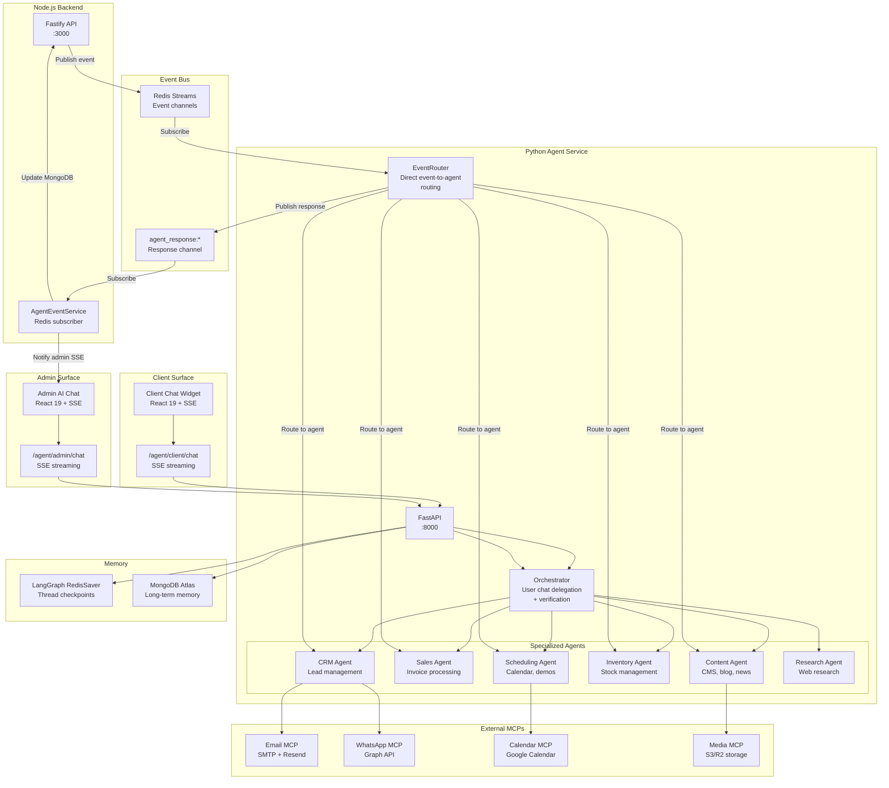

# Bark Technologies — AI Agent Architecture

## System Overview

The Bark Technologies AI agent system is a dual-surface enterprise architecture serving both external customers (client-facing) and internal administrators (admin-facing). It uses an event-driven architecture with specialized agents, an orchestrator for user chat, and direct event routing for backend-initiated tasks.

## Architecture Diagram



## Two Interaction Paths

### 1. Event-Direct Routing (Backend-initiated)

When the Node.js backend detects a state change (e.g., invoice paid, lead created), it publishes an event to Redis Streams. The EventRouter subscribes to these events and routes them directly to the appropriate specialized agent, bypassing the Orchestrator.

**Flow:**
1. Node.js backend publishes event to Redis Stream (e.g., `InvoicePaid`)
2. EventRouter receives the event
3. EventRouter routes to the specialized agent (e.g., SalesAgent)
4. Agent processes the event and returns a structured response
5. EventRouter publishes the response to `agent_response:*` channel
6. AgentEventService (Node.js) subscribes and processes the response
7. Response is stored in MongoDB and admin UI is notified via SSE

**Event Routing Table:**

| Event Type | Agent | Response Channel |
|------------|-------|------------------|
| InvoicePaid | SalesAgent | agent_response:InvoicePaid |
| LeadCreated | CRMAgent | agent_response:LeadCreated |
| ContentPublished | ContentAgent | agent_response:ContentPublished |
| ProductStockLow | InventoryAgent | agent_response:StockLow |
| InstallationScheduled | SchedulingAgent | agent_response:InstallationScheduled |

### 2. Orchestrator for User Chat (User-initiated)

When a user interacts with the AI chat interface, the Orchestrator manages the conversation, delegates tasks to specialized agents, verifies their responses, and composes the final response.

**Flow:**
1. User sends message via chat interface
2. Orchestrator analyzes the request
3. Orchestrator delegates to appropriate agent(s)
4. Agent processes the request and returns a structured response
5. Orchestrator verifies the response (checks for structured XML tags)
6. If multiple agents were called, Orchestrator composes a MULTI_RESULT response
7. Final response is sent to the user via SSE streaming

**Orchestrator Responsibilities:**
- Intent classification and routing
- Task delegation to specialized agents
- Response verification (structured XML validation)
- Multi-agent response composition
- HITL (Human-in-the-loop) flagging for destructive operations

## Structured Response System

All agent responses use structured XML tags for consistent rendering on the frontend. The response types include:

### Product & Inventory
- `<PRODUCT_CARD>` - Single product display
- `<PRODUCT_LIST>` - Multiple products
- `<STOCK_ALERT>` - Low stock notification
- `<TABLE_VIEW>` - Tabular data display

### Sales & Finance
- `<INVOICE_CARD>` - Single invoice display
- `<INVOICE_LIST>` - Multiple invoices

### CRM & Leads
- `<LEAD_CARD>` - Single lead display
- `<LEAD_LIST>` - Multiple leads

### Content
- `<BLOG_LAYOUT>` - Blog post preview
- `<NEWS_LAYOUT>` - News article preview
- `<CASE_STUDY_LAYOUT>` - Case study preview

### Communications
- `<EMAIL_LAYOUT>` - Email preview
- `<WHATSAPP_CONFIRM>` - WhatsApp send confirmation

### Scheduling
- `<CALENDAR_EVENT>` - Calendar event display

### Safety & Control
- `<HITL_CONFIRM>` - Human-in-the-loop confirmation
- `<DELETE_CONFIRM>` - Deletion confirmation
- `<STATS_CHART>` - Statistics and metrics
- `<MULTI_RESULT>` - Combined results from multiple agents

## Memory Architecture

### Short-term Memory (Redis)
- Thread-scoped conversation checkpoints
- Managed by LangGraph RedisSaver
- Enables conversation persistence across server restarts
- Isolated by `thread_id` for each session

### Long-term Memory (MongoDB Atlas)
- Cross-session memory storage
- Vector embeddings for semantic search
- Episodic memory for past interactions
- Procedural memory for learned workflows

## Agent Specifications

### Orchestrator
- **Model**: xiaomi/mimo-v2.5 (high-reasoning)
- **Role**: User chat delegation, verification, multi-agent composition
- **Max turns**: 8 per conversation
- **Verification**: Checks structured XML tags in agent responses

### EventRouter
- **Role**: Direct event-to-agent routing (no supervisor overhead)
- **Events**: Subscribes to Redis Streams for backend-initiated events
- **Response**: Publishes to `agent_response:*` channel

### CRM Agent
- **Tools**: manage_subscriber, trigger_sequence, get_email_stats
- **MCPs**: Email, WhatsApp, Memory, Fetch
- **Structured Output**: LEAD_CARD, LEAD_LIST, EMAIL_LAYOUT

### Sales Agent
- **Tools**: create_invoice, update_invoice, get_invoice
- **MCPs**: Invoice MCP, Email
- **Structured Output**: INVOICE_CARD, INVOICE_LIST, TABLE_VIEW

### Content Agent
- **Tools**: create_content, update_content, publish_content
- **MCPs**: Media MCP, Email, Web Research
- **Structured Output**: BLOG_LAYOUT, NEWS_LAYOUT, CASE_STUDY_LAYOUT

### Inventory Agent
- **Tools**: query_stock, update_stock, check_low_stock
- **MCPs**: Stock MCP, Email
- **Structured Output**: STOCK_ALERT, TABLE_VIEW, STATS_CHART

### Scheduling Agent
- **Tools**: create_event, update_event, list_events
- **MCPs**: Calendar MCP, Email, WhatsApp
- **Structured Output**: CALENDAR_EVENT, EMAIL_LAYOUT

### Research Agent
- **Tools**: web_search, fetch_url, analyze_content
- **MCPs**: Web Research, Memory
- **Structured Output**: TABLE_VIEW, BLOG_LAYOUT

## MCP Integration

### Free MCPs (Integrated)
- **Memory MCP**: Long-term memory storage and retrieval
- **Fetch MCP**: URL fetching and content extraction
- **Time MCP**: Timezone-aware date/time operations
- **GitHub MCP**: Repository access and management

### Custom MCPs (FastMCP)
- **Invoice MCP**: GST calculation, PDF generation
- **Stock MCP**: Inventory queries and updates
- **Email MCP**: SMTP + Resend fallback
- **WhatsApp MCP**: Graph API integration
- **Calendar MCP**: Google Calendar operations

## Safety & Guardrails

### Human-in-the-Loop (HITL)
- Destructive operations require confirmation
- Bulk email dispatch requires approval
- Ad campaign publishing requires approval
- Product deletion requires confirmation

### Turn Limits
- Max 8 turns per conversation
- Prevents infinite routing loops
- Graceful error recovery

### Tool Exception Containment
- MCP server failures are caught
- Error payloads returned to Orchestrator
- Service process remains stable

## Environment Variables

### Required
- `MONGODB_URI` - MongoDB Atlas connection string
- `REDIS_URL` - Upstash Redis connection string
- `OPENROUTER_API_KEY` - OpenRouter API key
- `JWT_SECRET` - JWT signing secret

### Optional (Feature-specific)
- `SMTP_HOST`, `SMTP_PORT`, `SMTP_USER`, `SMTP_PASS` - Email sending
- `WHATSAPP_BUSINESS_TOKEN`, `WHATSAPP_PHONE_NUMBER_ID` - WhatsApp
- `GOOGLE_CLIENT_ID`, `GOOGLE_CALENDAR_API_KEY` - Calendar
- `RESEND_API_KEY` - Resend email fallback

## Development

### Start Services
```bash
# Backend (Node.js)
cd BarkTech/backend && npm run dev

# Frontend (React)
cd BarkTech/frontend && npm run dev

# Agent Service (Python)
cd BarkTech/agent && uvicorn app.main:app --reload --port 8000
```

### Run Tests
```bash
# Agent tests
cd BarkTech/agent && pytest tests/ -v

# Backend type check
cd BarkTech/backend && npx tsc --noEmit

# Frontend build
cd BarkTech/frontend && npm run build
```
