# Bark Technologies — Node.js Backend System Architecture

## Overview

This document defines the complete backend architecture for Bark Technologies' web application. It covers the **Node.js backend** that handles all traditional web operations — authentication, product catalog management, leads/RFQ processing, invoicing, inventory, CMS, analytics, email automation, and audit logging.

**Important**: The AI agent layer (LangGraph + native tools + **external MCP** + FastAPI) is documented separately in `python_ai_agent_architecture.md`. This document covers ONLY the Node.js backend. Both systems share the same MongoDB database, Redis, and S3/R2. External MCP (WhatsApp, Email, Media, Calendar, Ads, Canvas, Web Research) is owned by the Python agent; Node.js stores API tokens/scopes and triggers campaigns via the agent.

---


## Table of Contents

1. [Architecture Principles](#1-architecture-principles)
2. [Technology Stack](#2-technology-stack)
3. [System Architecture Diagram](#3-system-architecture-diagram)
4. [Layered Architecture](#4-layered-architecture)
5. [Authentication & Authorization](#5-authentication--authorization)
6. [Product Catalog Module](#6-product-catalog-module)
7. [Leads & RFQ Module](#7-leads--rfq-module)
8. [Invoicing Module](#8-invoicing-module)
9. [Stock & Inventory Module](#9-stock--inventory-module)
10. [CMS & Content Module](#10-cms--content-module)
11. [Installations Module](#11-installations-module)
12. [Campaigns Module](#12-campaigns-module) *(includes Social Media Platform Integration)*
13. [Analytics Module](#13-analytics-module)
14. [Email Automation Module](#14-email-automation-module)
15. [CRM Integration Module](#15-crm-integration-module)
16. [Chat Integration Module](#16-chat-integration-module)
17. [Audit Module](#17-audit-module)
18. [File Storage Architecture](#18-file-storage-architecture)
19. [Queue & Background Jobs](#19-queue--background-jobs)
20. [Security Architecture](#20-security-architecture)
21. [Sequence Diagrams](#21-sequence-diagrams)
22. [Data Flow Diagrams](#22-data-flow-diagrams)
23. [Project Directory Structure](#23-project-directory-structure)
24. [API Endpoint Reference](#24-api-endpoint-reference)
25. [Deployment Architecture](#25-deployment-architecture)
26. [Integration with Python Agent System](#26-integration-with-python-agent-system)
27. [Implementation Roadmap](#27-implementation-roadmap)

---


## 1. Architecture Principles


### Core Design Decisions


| Principle                | Decision                                            | Rationale                                                              |
| ------------------------ | --------------------------------------------------- | ---------------------------------------------------------------------- |
| **Architecture Pattern** | Layered (Route → Controller → Service → Repository) | Testability, separation of concerns, team scalability                  |
| **Runtime**              | Node.js 22 LTS + TypeScript (strict mode)           | Type safety, modern JS features, long-term support                     |
| **Framework**            | Fastify (primary)                                   | 2-3x faster than Express, schema-based validation, plugin architecture |
| **ODM**                  | Mongoose                                            | Schema-based MongoDB models, validation, TypeScript types, mature DX   |
| **Auth**                 | JWT with family-based rotation                      | Stateless, scalable, secure against token theft                        |
| **RBAC**                 | Middleware-based with granular permissions          | Fine-grained access control, resource:action format                    |
| **Validation**           | Zod at the boundary                                 | Runtime type checking, auto-generated error messages                   |
| **Logging**              | Pino (structured JSON)                              | Fast, machine-parseable, request context propagation                   |
| **Queue**                | BullMQ + Redis                                      | Reliable background jobs, delayed tasks, retries                       |
| **File Storage**         | S3 / Cloudflare R2                                  | Scalable, cost-effective, presigned URLs for secure access             |


### Why Fastify Over Express

- **Performance**: Fastify handles 2-3x more requests per second than Express
- **Schema Validation**: Built-in JSON Schema validation eliminates need for separate validation middleware
- **TypeScript**: First-class TypeScript support with async/await throughout
- **Plugin System**: Encapsulated plugins with clear dependency injection
- **Logging**: Built-in Pino integration with request context
- **Ecosystem**: Growing plugin ecosystem, Express middleware compatible via fastify-express


### Why Mongoose for MongoDB

- **Schema validation**: Define collections with typed schemas and middleware
- **MongoDB-native**: Documents match how Bark stores products, invoices, and nested line items
- **Relations**: Populate refs when needed; embed when it fits the domain (invoice line items)
- **Validation**: Works alongside Zod at the API boundary
- **TypeScript**: Strong typing via mongoose + TypeScript interfaces
- **Mature ecosystem**: Widely used with Fastify/Express Node backends


### Layered Architecture Rationale

Every request flows through exactly four layers:

```
HTTP Request
    │
    ▼
Route Layer ──── Validates request format, extracts JWT, attaches user context
    │
    ▼
Controller Layer ── Thin HTTP handler, calls service, formats response
    │
    ▼
Service Layer ──── Business logic, orchestration, external service calls
    │
    ▼
Repository Layer ── Database queries only, no business logic
    │
    ▼
MongoDB Database
```

**Why this matters**:

- Services are unit-testable without HTTP
- Repositories can be swapped (Mongoose → native MongoDB driver) without touching business logic
- Controllers stay thin (5-10 lines each)
- Business rules live in ONE place (service layer)
- Database queries are centralized and optimizable

---


## 2. Technology Stack


### Core Dependencies


| Category         | Package            | Version | Purpose                     |
| ---------------- | ------------------ | ------- | --------------------------- |
| **Runtime**      | Node.js            | 22 LTS  | JavaScript runtime          |
| **Language**     | TypeScript         | 5.x     | Type safety                 |
| **Framework**    | Fastify            | 5.x     | HTTP server                 |
| **ODM**          | Mongoose           | 8.x     | MongoDB document access     |
| **Validation**   | Zod                | 3.x     | Request/response validation |
| **Auth**         | jsonwebtoken       | 9.x     | JWT creation/verification   |
| **Password**     | bcrypt             | 5.x     | Password hashing            |
| **Cache**        | ioredis            | 5.x     | Redis client                |
| **Queue**        | bullmq             | 5.x     | Background job processing   |
| **Logging**      | pino               | 9.x     | Structured logging          |
| **File Storage** | @aws-sdk/s3-client | 3.x     | S3/R2 operations            |
| **PDF**          | Python WeasyPrint (via FastAPI) | — | Tax invoice PDF (see bark `InvoiceService`) |
| **Email**        | resend             | 3.x     | Transactional email         |
| **HTTP Client**  | undici             | 6.x     | Outbound HTTP requests      |
| **Testing**      | vitest             | 2.x     | Unit/integration tests      |
| **API Docs**     | @fastify/swagger   | 5.x     | OpenAPI documentation       |


### Dev Dependencies


| Package     | Purpose                  |
| ----------- | ------------------------ |
| tsx         | TypeScript execution     |
| mongoose    | ODM (bundled with app)   |
| @types/node | Node.js type definitions |
| eslint      | Code linting             |
| prettier    | Code formatting          |
| supertest   | HTTP testing             |


### Environment Variables

```bash
# ── Application ──────────────────────────────────────
APP_ENV=development              # development | staging | production
APP_PORT=3000
APP_HOST=0.0.0.0
ALLOWED_ORIGINS=http://localhost:3000,http://localhost:8000

# ── Database (MongoDB) ───────────────────────────────
MONGODB_URI=mongodb://localhost:27017/bark
MONGODB_DB=bark

# ── Redis ────────────────────────────────────────────
REDIS_URL=redis://localhost:6379/0

# ── JWT Authentication ──────────────────────────b────
JWT_SECRET=your-super-secret-key
JWT_ALGORITHM=HS256
JWT_ACCESS_EXPIRY=30m            # 30 minutes
JWT_REFRESH_EXPIRY=7d            # 7 days

# ── File Storage (S3 / Cloudflare R2) ──────────────
S3_ENDPOINT=https://your-endpoint.r2.cloudflarestorage.com
S3_BUCKET=bark-media
S3_ACCESS_KEY=your-access-key
S3_SECRET_KEY=your-secret-key
S3_REGION=auto
S3_PUBLIC_URL=https://media.barktechnologies.in

# ── Email (Resend) ──────────────────────────────────
RESEND_API_KEY=re_your-key
EMAIL_FROM=noreply@barktechnologies.in

# ── Google OAuth ─────────────────────────────────────
GOOGLE_CLIENT_ID=your-google-client-id
GOOGLE_CLIENT_SECRET=your-google-client-secret
GOOGLE_CALLBACK_URL=http://localhost:3000/api/v1/auth/google/callback

# ── Python Agent System ─────────────────────────────
AGENT_BASE_URL=http://localhost:8000
AGENT_API_KEY=internal-agent-key

# ── External Services (credentials mirrored for Node workers + agent MCP) ──
WHATSAPP_BUSINESS_TOKEN=your-whatsapp-token
WHATSAPP_PHONE_NUMBER_ID=your-phone-id
# Email / S3 already above (RESEND_*, S3_*) — also used by Email MCP + Media MCP in Python
# Calendar / Ads / Canvas keys live primarily in the Python agent .env

# ── Social Media APIs ──────────────────────────────────────────────────────
# Instagram + Facebook (Meta Graph API — single app covers both)
META_ACCESS_TOKEN=your-meta-access-token
META_APP_ID=your-meta-app-id
META_APP_SECRET=your-meta-app-secret
META_PAGE_ID=your-facebook-page-id
INSTAGRAM_BUSINESS_ACCOUNT_ID=your-ig-business-account-id

# LinkedIn (LinkedIn Marketing/Share API — separate developer app)
LINKEDIN_ACCESS_TOKEN=your-linkedin-access-token
LINKEDIN_ORGANIZATION_URN=your-linkedin-org-urn

# Twitter/X (Twitter API v2)
TWITTER_ACCESS_TOKEN=your-twitter-access-token
TWITTER_ACCESS_SECRET=your-twitter-access-secret
TWITTER_CONSUMER_KEY=your-twitter-consumer-key
TWITTER_CONSUMER_SECRET=your-twitter-consumer-secret

# Reddit (PRAW — OAuth 2.0)
REDDIT_ACCESS_TOKEN=your-reddit-access-token
REDDIT_CLIENT_ID=your-reddit-client-id
REDDIT_CLIENT_SECRET=your-reddit-client-secret

# ── CRM Integration ────────────────────────────────────────────────────────
# Zoho CRM (preferred for India) or HubSpot free tier
ZohoCRM_ACCESS_TOKEN=your-zoho-crm-token
# HUBSPOT_ACCESS_TOKEN=your-hubspot-token
CRM_PROVIDER=zoho  # zoho | hubspot
CRM_WEBHOOK_SECRET=your-webhook-secret
```

---


## 3. System Architecture Diagram

```mermaid
graph TB
    subgraph "Frontend Layer"
        Browser["Browser<br/>Jinja2 + Vanilla JS"]
        StaticAssets["Static Assets<br/>CSS / JS / Images"]
    end

    subgraph "API Gateway / Middleware"
        RateLimit["Rate Limiter<br/>Redis-backed<br/>Per-IP / Per-User"]
        JWTAuth["JWT Auth Middleware<br/>Token Verification<br/>User Context"]
        RBAC["RBAC Middleware<br/>Role Check<br/>Permission Scope"]
        Validation["Zod Validation<br/>Request Schema<br/>Reject Unknown Fields"]
        CORS["CORS<br/>Configurable Origins"]
        AuditMiddleware["Audit Middleware<br/>Log Mutations<br/>IP + User Agent"]
    end

    subgraph "Node.js Backend — Fastify + TypeScript"
        subgraph "Auth Module"
            AuthRoutes["Auth Routes"]
            AuthController["Auth Controller"]
            AuthService["Auth Service<br/>JWT Generation<br/>Token Rotation<br/>Password Hashing"]
            AuthRepo["Auth Repository"]
        end

        subgraph "Products Module"
            ProductRoutes["Product Routes"]
            ProductController["Product Controller"]
            ProductService["Product Service<br/>CRUD + Review Workflow<br/>Slug Generation"]
            ProductRepo["Product Repository"]
        end

        subgraph "Inquiries Module"
            InquiryRoutes["Inquiry Routes"]
            InquiryController["Inquiry Controller"]
            InquiryService["Inquiry Service<br/>Lead Workflow<br/>UTM Tracking<br/>Assignment"]
            InquiryRepo["Inquiry Repository"]
        end

        subgraph "Invoices Module"
            InvoiceRoutes["Invoice Routes"]
            InvoiceController["Invoice Controller"]
            InvoiceService["Invoice Service<br/>Admin-filled Invoices<br/>LLM Validation<br/>PDF Generation<br/>Manual Payment Status"]
            InvoiceRepo["Invoice Repository"]
        end

        subgraph "Stock Module"
            StockRoutes["Stock Routes"]
            StockController["Stock Controller"]
            StockService["Stock Service<br/>Inventory CRUD<br/>Reservation<br/>Stock Logs"]
            StockRepo["Stock Repository"]
        end

        subgraph "CMS Module"
            CMSRoutes["CMS Routes"]
            CMSController["CMS Controller"]
            CMSService["CMS Service<br/>Case Studies<br/>News / Blog<br/>FAQs / Pages"]
            CMSRepo["CMS Repository"]
        end

        subgraph "Other Modules"
            AnalyticsModule["Analytics<br/>Events + Dashboard"]
            EmailModule["Email<br/>Subscribers + Sequences"]
            ChatModule["Chat<br/>Proxy to Agent<br/>History API"]
            AuditModule["Audit<br/>Activity Logs"]
            CampaignModule["Campaigns<br/>Content Posts"]
            InstallModule["Installations<br/>Showcase"]
        end
    end

    subgraph "Shared Services"
        FileStorage["File Storage<br/>S3 / Cloudflare R2<br/>Presigned URLs"]
        PDFGen["PDF Generator<br/>Python WeasyPrint<br/>Tax Invoice Format"]
        EmailClient["Email Client<br/>Resend<br/>Transactional Email"]
        Queue["Job Queue<br/>BullMQ + Redis<br/>Background Jobs"]
        MongooseClient["Mongoose ODM<br/>Connection Pool<br/>Typed Models"]
    end

    subgraph "Infrastructure"
        MongoDB[("MongoDB<br/>Collections<br/>Primary Database")]
        Redis[("Redis<br/>Cache / Sessions<br/>Rate Limit / Queue")]
        S3Bucket[("S3 / R2<br/>Media / PDFs<br/>Documents")]
    end

    subgraph "External Integrations"
        PythonAgent["Python Agent<br/>FastAPI :8000<br/>Native tools + External MCP"]
        WhatsAppAPI["WhatsApp MCP<br/>:8020 Notifications"]
        EmailMCP["Email MCP (Resend)<br/>:8021"]
        MediaMCP["Media MCP (S3/R2)<br/>:8022"]
        CalendarMCP["Calendar MCP<br/>:8023 Installations"]
        WebMCP["Web Research MCP<br/>:8024 RFQ research"]
        ClaudeAds["Claude Ads MCP<br/>:8030 Campaigns"]
        CanvaMCP["Canvas MCP<br/>:8040 Creatives"]
        EmailService["Resend API<br/>(also via Node email workers)"]
    end

    %% Frontend to API Gateway
    Browser --> RateLimit
    StaticAssets --> Browser

    %% API Gateway flow
    RateLimit --> JWTAuth
    JWTAuth --> RBAC
    RBAC --> Validation
    Validation --> CORS
    CORS --> AuditMiddleware

    %% Middleware to modules
    AuditMiddleware --> AuthRoutes
    AuditMiddleware --> ProductRoutes
    AuditMiddleware --> InquiryRoutes
    AuditMiddleware --> InvoiceRoutes
    AuditMiddleware --> StockRoutes
    AuditMiddleware --> CMSRoutes
    AuditMiddleware --> AnalyticsModule
    AuditMiddleware --> EmailModule
    AuditMiddleware --> ChatModule
    AuditMiddleware --> AuditModule
    AuditMiddleware --> CampaignModule
    AuditMiddleware --> InstallModule

    %% Module internal flow
    AuthRoutes --> AuthController
    AuthController --> AuthService
    AuthService --> AuthRepo

    ProductRoutes --> ProductController
    ProductController --> ProductService
    ProductService --> ProductRepo

    InquiryRoutes --> InquiryController
    InquiryController --> InquiryService
    InquiryService --> InquiryRepo

    InvoiceRoutes --> InvoiceController
    InvoiceController --> InvoiceService
    InvoiceService --> InvoiceRepo

    StockRoutes --> StockController
    StockController --> StockService
    StockService --> StockRepo

    CMSRoutes --> CMSController
    CMSController --> CMSService
    CMSService --> CMSRepo

    %% Repos to Mongoose
    AuthRepo --> MongooseClient
    ProductRepo --> MongooseClient
    InquiryRepo --> MongooseClient
    InvoiceRepo --> MongooseClient
    StockRepo --> MongooseClient
    CMSRepo --> MongooseClient

    %% Mongoose to Database
    MongooseClient --> MongoDB

    %% Services to shared services
    AuthService --> Redis
    ProductService --> FileStorage
    InvoiceService --> PDFGen
    InvoiceService --> FileStorage
    InvoiceService --> EmailClient
    EmailModule --> Queue
    AnalyticsModule --> Queue
    StockService --> Queue

    %% Queue to Redis
    Queue --> Redis

    %% File storage
    FileStorage --> S3Bucket

    %% Chat to Agent
    ChatModule -->|"Internal API"| PythonAgent

    %% External integrations (MCP primarily via Python agent; Node may call Resend directly for workers)
    EmailClient --> EmailService
    EmailModule -->|"sequences / transactional"| EmailMCP
    CampaignModule --> ClaudeAds
    CampaignModule --> CanvaMCP
    CampaignModule --> MediaMCP
    InstallModule --> CalendarMCP
    ChatModule -->|"agent uses"| WhatsAppAPI
    ChatModule -->|"agent uses"| WebMCP

    %% Styling
    classDef frontendStyle fill:#e8f5e9,stroke:#2e7d32,stroke-width:2px
    classDef middlewareStyle fill:#fff3e0,stroke:#ef6c00,stroke-width:2px
    classDef backendStyle fill:#e3f2fd,stroke:#1565c0,stroke-width:2px
    classDef serviceStyle fill:#f3e5f5,stroke:#7b1fa2,stroke-width:2px
    classDef infraStyle fill:#fce4ec,stroke:#c62828,stroke-width:2px
    classDef externalStyle fill:#e0f7fa,stroke:#00838f,stroke-width:2px

    class Browser,StaticAssets frontendStyle
    class RateLimit,JWTAuth,RBAC,Validation,CORS,AuditMiddleware middlewareStyle
    class AuthRoutes,AuthController,AuthService,AuthRepo,ProductRoutes,ProductController,ProductService,ProductRepo,InquiryRoutes,InquiryController,InquiryService,InquiryRepo,InvoiceRoutes,InvoiceController,InvoiceService,InvoiceRepo,StockRoutes,StockController,StockService,StockRepo,CMSRoutes,CMSController,CMSService,CMSRepo,AnalyticsModule,EmailModule,ChatModule,AuditModule,CampaignModule,InstallModule backendStyle
    class FileStorage,PDFGen,EmailClient,Queue,MongooseClient serviceStyle
    class MongoDB,Redis,S3Bucket infraStyle
    class PythonAgent,WhatsAppAPI,EmailMCP,MediaMCP,CalendarMCP,WebMCP,ClaudeAds,CanvaMCP,EmailService externalStyle
```


### Flow Explanation

1. **Frontend → API Gateway**: Every request passes through rate limiting → JWT auth → RBAC → Zod validation → CORS → audit logging
2. **Module Routing**: Validated requests are routed to the appropriate module (auth, products, invoices, etc.)
3. **Layered Processing**: Each module follows Route → Controller → Service → Repository → Database
4. **Shared Services**: File storage, PDF generation, email, and queue are shared across modules
5. **External Integrations**: Python agent owns MCP (WhatsApp, Email, Media, Calendar, Ads, Canvas, Web Research). Node.js may still call Resend/S3 directly for background workers; campaign publish & AI-driven notify go through the agent MCP layer

---


## 4. Layered Architecture


### Request Lifecycle

Every HTTP request follows this exact path:

```
Client Request
    │
    ▼
Fastify Server
    │
    ▼
┌─────────────────────────────────────────┐
│  MIDDLEWARE PIPELINE (in order)         │
│                                         │
│  1. Rate Limiter (Redis-backed)         │
│     → Check IP/user request count       │
│     → Reject if exceeded (429)          │
│                                         │
│  2. CORS Handler                        │
│     → Check Origin header               │
│     → Set Access-Control headers        │
│                                         │
│  3. JWT Auth (optional per route)       │
│     → Extract Bearer token              │
│     → Verify signature + expiry         │
│     → Attach user to request            │
│                                         │
│  4. RBAC Check (optional per route)     │
│     → Check user role                   │
│     → Check permission scope            │
│     → Reject if insufficient (403)      │
│                                         │
│  5. Zod Validation                      │
│     → Validate request body/params      │
│     → Reject if invalid (400)           │
│                                         │
│  6. Audit Logger                        │
│     → Log request metadata              │
│     → Capture before state (mutations)  │
└─────────────────────────────────────────┘
    │
    ▼
Route Handler → Controller → Service → Repository → Database
```


### Layer Responsibilities

**Route Layer**: Defines HTTP method + URL pattern. Attaches middleware. Maps URL params to controller method. No logic beyond routing.

**Controller Layer**: Extracts validated data from request. Calls appropriate service method. Formats HTTP response. Handles no business logic — purely HTTP concerns.

**Service Layer**: Contains ALL business logic. Orchestrates multiple repository calls. Manages database transactions. Calls external services. Validates business rules. Returns domain objects, not HTTP responses.

**Repository Layer**: Pure database access via Mongoose. No business logic. Returns plain TypeScript objects. Handles query building and execution.

---


## 5. Authentication & Authorization


### Auth Architecture Overview

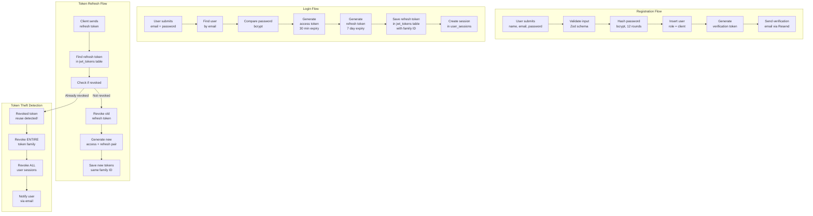


### JWT Token Structure

**Access Token Payload**: user_id (integer), email, role name, scopes (permission codes array), iat, exp (30 minutes)

**Refresh Token Payload**: user_id, token_family (UUID grouping related tokens), token_version (incremented on rotation), iat, exp (7 days)

### Token Family Rotation

1. **Login**: Access + refresh tokens issued, both saved in jwt_tokens table with same token_family UUID
2. **Normal Refresh**: Old refresh revoked, new pair issued (same family)
3. **Theft Detection**: If revoked token is reused → entire family revoked → all user sessions terminated → user notified via email


### RBAC Permission Model

Permissions follow `resource:action` format: product:create, product:read, invoice:delete, user:manage, etc.

**Role Assignments**:

- **admin**: All permissions across all modules
- **client**: product:read, inquiry:create, inquiry:read (own only), invoice:read (own only), cms:read


### Google OAuth

1. User clicks "Login with Google" → redirected to Google consent screen
2. Google redirects back with authorization code
3. Backend exchanges code for Google access token → fetches user profile
4. Backend checks if user exists by google_id or email
5. If new user → creates account with google_id set
6. Issues JWT tokens (same as regular login)


### Forgot Password + Reset Password

This is a complete two-step flow:

**Step 1: Forgot Password (Request Reset Link)**

1. User clicks "Forgot Password" on login page
2. User enters their registered email address
3. Backend looks up user by email (never reveals if email exists — returns generic message)
4. If user found: deletes all old reset tokens for that user, generates a new secure random token (crypto.randomBytes), stores SHA-256 hash in verification_tokens table (type: password_reset, expires_at: now + 10 minutes)
5. Sends password reset email with link containing raw token
6. User receives email with reset link

**Step 2: Reset Password (Set New Password)**

1. User clicks link in email → frontend shows new password form
2. User enters new password + confirmation
3. Backend validates: token exists in DB, not expired, not already used
4. Backend hashes new password (bcrypt, 12 rounds)
5. Backend updates users.password_hash
6. Backend marks token as used (used_at = now)
7. Backend revokes ALL existing JWT tokens for this user (forces re-login on all devices)
8. Backend deletes ALL user_sessions for this user
9. Backend sends "password changed" confirmation email
10. User redirected to login page to log in with new password

**Security Rules:**

- Never reveal whether email exists (prevents email enumeration)
- Token expires in 10 minutes
- Single-use tokens (marked used after use)
- Old tokens deleted when new reset requested
- All sessions revoked after password change
- Token stored as SHA-256 hash, raw token only in email
- Rate limited: 3 requests per IP per hour on forgot-password endpoint


### API Tokens for External Integrations

The `api_tokens` collection stores tokens for external MCP consumers (Claude Ads, Canvas, and optional service accounts for Email/Media/Calendar). Each token has name, token_hash, optional user_id/role_id, IP whitelists, rate limits, and scope-based access via `api_token_scopes`.

---


## 6. Product Catalog Module


### Product Lifecycle

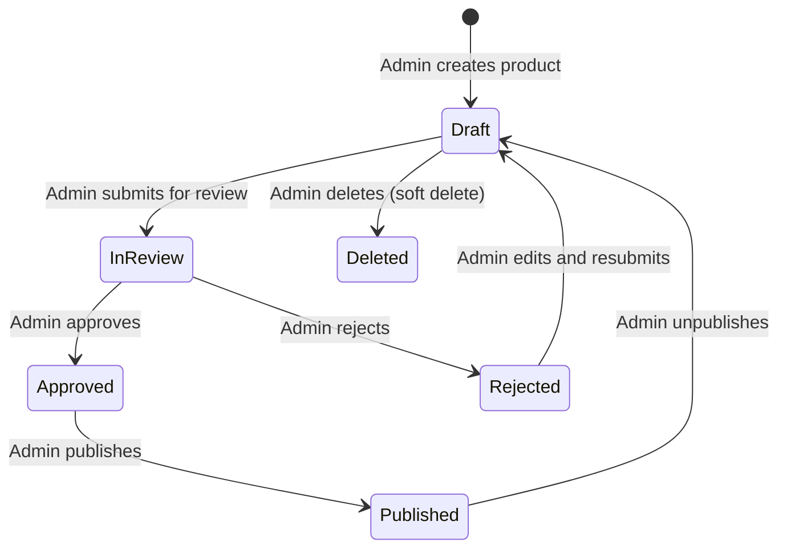


### Product Fields

Core: name, slug (auto-generated), models, summary, description. SEO: meta_title, meta_description. Business: lead_time_days, warranty_months. Workflow: review_status (draft|in_review|approved|rejected), review_notes, reviewed_by, reviewed_at. AI: llm_extracted_data (JSON for agent-extracted specs). Audit: created_by, created_at, updated_at.

### Category Hierarchy

Categories support unlimited nesting via parent_id. The service layer handles building tree structures from flat rows, preventing circular references, and cascade operations.

### Product Specifications

Stored as key-value pairs in product_specs: spec_key (name), spec_value (value), unit (optional), sort_order (display order). Flexible model allows any product to have any number of specs without schema changes.

### Product Media

Supports image/video types with providers: upload (S3/R2), youtube, vimeo. Fields: url, thumbnail_url, title, alt_text, duration_seconds, is_primary, sort_order, is_active.

### Product Documents

Types: datasheet, manual, brochure, certificate. Fields: title, file_url, doc_type, file_size_bytes, language, download_count.

### Review Workflow

Products, blog posts, and content posts follow draft → in_review → approved/rejected. Each transition updates review_status, records reviewed_by, reviewed_at, review_notes, and creates audit log entry.

---


## 7. Leads & RFQ Module


### Inquiry Lifecycle

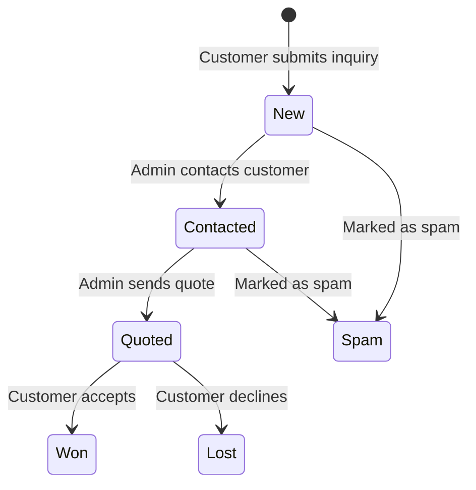


### Inquiry Sources

web_form (website form), rfq (RFQ submission), ai_chat (AI chatbot interaction), whatsapp, phone, email, ad_campaign (from Claude Ads). Each source has different auto-assignment rules.

### UTM Tracking

When inquiries come from ad campaigns, UTM parameters are captured: utm_source (traffic source), utm_medium (marketing medium), utm_campaign (campaign name). Stored for ROI analysis.

### RFQ Items

Customers can specify multiple products per inquiry. Items can reference existing products (product_id) or have custom product names (product_name) for products not in the catalog.

### Auto-Assignment Logic

1. Check if assigned_to is already set
2. If not, use round-robin among available sales staff
3. Round-robin considers: active workload, last assignment time
4. High-priority inquiries (priority: urgent) skip round-robin → assigned to manager


### Status Workflow Rules

new → contacted (admin), new → spam (admin), contacted → quoted (admin), contacted → spam (admin), quoted → won (admin), quoted → lost (admin). Each change creates audit log entry. Status → won triggers email notification.

---


## 8. Invoicing Module


### Invoice Creation Workflow

The invoice process is **admin-driven** — the admin fills in every detail manually. An LLM then processes the invoice for validation and formatting, the admin reviews it, and a PDF is generated on demand. There is **no payment gateway**. Invoices are created and tracked natively; payment status (paid / partially_paid / overdue) is recorded manually by admin (typically cash or bank transfer).

### Invoice Lifecycle

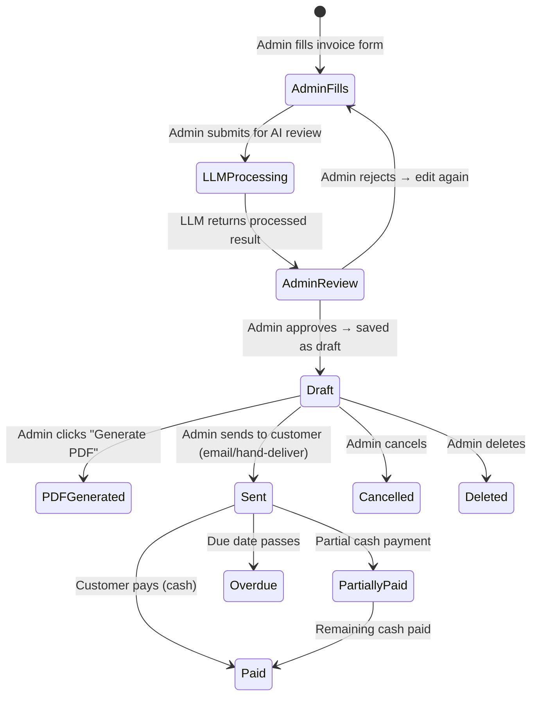


### Step-by-Step Flow

**Step 1: Admin Fills Invoice Form**

- Admin manually enters ALL invoice details:
  - Customer name, email, phone, company, address, GST number
  - Ship-to address, mode of delivery, dispatch location, transport details
  - Bank details (bank name, address, account no, IFSC, SWIFT)
  - Invoice date, due date, currency (default INR)
  - Notes, terms and conditions
- Admin enters unique invoice number (manually chosen, e.g., BARK2627S120)
- Admin adds line items: each with description, HSN code, quantity, unit price, GST rate
- The system auto-calculates: amount per item, subtotal, GST amount, total
- The system auto-generates: amount in words (Indian numbering)

**Step 2: LLM Processing (AI Review)**

- Admin clicks "Submit for AI Review"
- Backend sends invoice data to the Python agent's LLM
- LLM performs:
  - **Validation**: Checks for missing fields, inconsistent data, unusual amounts
  - **GST compliance**: Verifies HSN codes match product descriptions, GST rates are valid
  - **Formatting**: Ensures consistent formatting of addresses, phone numbers, amounts
  - **Duplicate detection**: Checks if a similar invoice already exists
  - **Suggestion**: Suggests corrections or improvements (e.g., "GST rate 12% is unusual for this HSN code — typically 18%")
- LLM returns a structured review with: validation results, warnings, suggestions, corrected data

**Step 3: Admin Review**

- Admin sees LLM's review results on screen
- Admin can:
  - Accept LLM suggestions (auto-apply corrections)
  - Reject suggestions and keep original data
  - Edit any field manually
  - Submit again for re-review
- Once satisfied → Admin clicks "Save Invoice" → saved as draft

**Step 4: PDF Generation (On Demand)**

- Admin clicks "Generate PDF" at any time after saving (or asks the AI agent → native `generate_invoice_pdf` tool)
- Python FastAPI `InvoiceService.generate_pdf` renders Jinja2 tax-invoice template (matches Bark TAX INVOICE layout) via **WeasyPrint**
- Layout includes: BILL TO / FROM / SHIP TO, Details/Mode, line table (HSN, RATE/PC, QTY), GST, bank/beneficiary block, amount in words
- Optional: PDF uploaded to S3/R2 at `invoices/{id}/pdf/{invoice_number}.pdf`
- Admin can download the PDF immediately
- PDF can be printed directly or emailed to customer

**Step 5: Payment (Cash)**

- Payment is recorded manually (cash / bank transfer) — **no payment gateway**
- Admin records payment manually:
  - Full payment → status changes to "paid"
  - Partial payment → status changes to "partially_paid" with amount recorded
- Admin can mark as "sent" when handing over invoice to customer
- Overdue tracking: if due_date passes without payment, status auto-changes to "overdue"


### Invoice Number (Admin-Assigned Unique ID)

Each invoice has a **unique invoice number assigned by the admin**:

- Format: BARK{YEAR}{S}{SEQUENCE} (e.g., BARK2627S120)
- Admin can choose any unique number within the format
- System validates uniqueness before saving
- The `invoice_sequences` table tracks the last used sequence per year
- If admin uses a custom number, the sequence is updated accordingly
- This ensures every invoice has a unique, human-readable identifier


### GST Calculation

Each line item has gst_rate. Amount = quantity × unit_price. GST per item = amount × (gst_rate / 100). Invoice subtotal = sum of all item amounts. Invoice gst_amount = sum of all item GST amounts. Invoice total = subtotal + gst_amount. All amounts stored as DECIMAL(12,2) for precision.

### Amount in Words

Converts total amount to Indian numbering system: lakhs and crores. Example: ₹1,25,000 → "One Lakh Twenty Five Thousand Rupees Only". Generated automatically when invoice is saved.

### Bank Details

Admin enters company bank details for customer payment reference: bank_name, bank_address, bank_account_no, bank_ifsc_code, bank_swift_code. Displayed on the PDF.

### Cash Payment Recording

Since payments are cash-based, the admin manually records:

- **Full payment**: Admin clicks "Mark as Paid" → records paid_at timestamp
- **Partial payment**: Admin enters amount paid → status becomes "partially_paid", tracks remaining balance
- **No payment gateway**: No Stripe/Razorpay/etc. Admin records paid/partial status only


### Invoice Fields (Admin-Filled)


| Field             | Filled By           | Auto-Calculated             |
| ----------------- | ------------------- | --------------------------- |
| invoice_number    | Admin (unique ID)   | Uniqueness validated        |
| customer_name     | Admin               | —                           |
| customer_email    | Admin               | —                           |
| customer_phone    | Admin               | —                           |
| customer_company  | Admin               | —                           |
| customer_address  | Admin               | —                           |
| customer_gst      | Admin               | —                           |
| ship_to_address   | Admin               | —                           |
| mode_of_delivery  | Admin               | —                           |
| dispatch_from     | Admin               | —                           |
| transport_details | Admin               | —                           |
| currency          | Admin (default INR) | —                           |
| due_date          | Admin               | —                           |
| notes             | Admin               | —                           |
| terms             | Admin               | —                           |
| bank_name         | Admin               | —                           |
| bank_address      | Admin               | —                           |
| bank_account_no   | Admin               | —                           |
| bank_ifsc_code    | Admin               | —                           |
| bank_swift_code   | Admin               | —                           |
| line items[]      | Admin               | amount = qty × unit_price   |
| subtotal          | —                   | Sum of item amounts         |
| gst_amount        | —                   | Sum of item GST             |
| total             | —                   | subtotal + gst_amount       |
| amount_in_words   | —                   | Indian numbering conversion |


### LLM Integration for Invoice Processing

The LLM (via Python agent) assists the admin with:

1. **Field Validation**: Checks all required fields are filled, formats are correct (email, phone, GST number format)
2. **GST Compliance**: Verifies HSN codes against product descriptions, validates GST rates
3. **Amount Verification**: Cross-checks line item amounts, verifies subtotal/gst/total arithmetic
4. **Duplicate Detection**: Searches existing invoices for similar customer + date + amount combinations
5. **Formatting Suggestions**: Standardizes address formatting, phone number formats, company names
6. **Risk Flags**: Flags unusually large amounts, missing bank details for large invoices, expired GST numbers

The LLM returns a structured response:

```
{
  "validation": { "passed": true/false, "errors": [...] },
  "warnings": [{ "field": "...", "message": "...", "severity": "low|medium|high" }],
  "suggestions": [{ "field": "...", "current": "...", "suggested": "...", "reason": "..." }],
  "corrected_data": { ... }  // auto-corrected fields
}
```

Admin can accept or reject each suggestion individually.

### PDF Generation

1. Admin clicks "Generate PDF" button (or agent tool returns download URL)
2. Python renders Bark **TAX INVOICE** HTML template (Bill To / From / Ship To, mode, HSN table, bank block)
3. **WeasyPrint** converts HTML to PDF (not Puppeteer)
4. Optional: PDF uploaded to S3/R2 at `invoices/{id}/pdf/{invoice_number}.pdf`
5. Admin gets download / presigned URL
6. Admin can print directly or email to customer
7. PDF includes: amount in words, GST %, beneficiary bank details, authorised signatory block


### Invoice API Endpoints


| Method | Endpoint                                 | Auth  | Description                                  |
| ------ | ---------------------------------------- | ----- | -------------------------------------------- |
| GET    | /api/v1/invoices                         | Admin | List invoices (filter by status, date range) |
| GET    | /api/v1/invoices/:id                     | Admin | Get invoice with line items                  |
| POST   | /api/v1/invoices                         | Admin | Create invoice (admin fills all fields)      |
| PUT    | /api/v1/invoices/:id                     | Admin | Update invoice (draft only)                  |
| POST   | /api/v1/invoices/:id/validate            | Admin | Send to LLM for AI review                    |
| POST   | /api/v1/invoices/:id/approve-review      | Admin | Accept LLM suggestions                       |
| POST   | /api/v1/invoices/:id/submit              | Admin | Mark as sent to customer                     |
| POST   | /api/v1/invoices/:id/mark-paid           | Admin | Record full cash payment                     |
| POST   | /api/v1/invoices/:id/partial-payment     | Admin | Record partial cash payment                  |
| POST   | /api/v1/invoices/:id/cancel              | Admin | Cancel invoice                               |
| GET    | /api/v1/invoices/:id/pdf                 | Admin | Generate/download PDF                        |
| GET    | /api/v1/invoices/next-number             | Admin | Get next available invoice number            |
| GET    | /api/v1/invoices/stats                   | Admin | Revenue stats (by month, status)             |
| GET    | /api/v1/invoices/validate-number/:number | Admin | Check if invoice number is unique            |


---


## 9. Stock & Inventory Module


### Stock Actions


| Action  | Description                 | When Used              |
| ------- | --------------------------- | ---------------------- |
| add     | Increase quantity           | New inventory received |
| remove  | Decrease quantity           | Manual adjustment      |
| adjust  | Set to specific quantity    | Inventory audit        |
| reserve | Reserve for pending invoice | Invoice created        |
| release | Release reservation         | Invoice cancelled      |


### Stock Reservation Flow

When invoice created: check sufficient stock → decrement quantity in product_stocks → create stock_log (action: reserve). When invoice cancelled: increment quantity back (action: release).

### Low Stock Alerts

Monitor quantity against min_stock threshold. When below → trigger BullMQ job → email notification to admin. Dashboard shows products with low stock.

---


## 10. CMS & Content Module


### Content Types


| Content Type  | Table         | Review Workflow                    | Visibility               |
| ------------- | ------------- | ---------------------------------- | ------------------------ |
| Case Studies  | case_studies  | No                                 | published + published_at |
| News Articles | news_articles | No                                 | published + published_at |
| Blog Posts    | blog_posts    | Yes (draft → in_review → approved) | published + published_at |
| FAQs          | faqs          | No                                 | is_active                |
| Offices       | offices       | No                                 | is_active                |
| Pages         | pages         | No                                 | published                |


### Product Associations

Content linked to products via junction tables: case_study_products, news_article_products. Enables "Related Products" on content pages and "Case Studies" on product pages.

### Slug Generation

Auto-generated from title, slugified (lowercase, hyphens), unique per content type. Example: "Top 5 Sealing Machines for 2026" → "top-5-sealing-machines-for-2026".

---


## 11. Installations Module

Showcases completed installations. Fields: title, description, location, client_name, installed_on, cover_image_url, video_url, video_type (youtube|vimeo|upload), product_id, sort_order, is_active. Each installation can have multiple media items in installation_media (image/video with caption and sort_order).

---


## 12. Campaigns Module

Content posts for social media and ad campaigns. Post types: new_product, new_machine, installation_complete, news, case_study, blog, general. Lifecycle: Draft → InReview → Approved → Published (via **Claude Ads MCP**). Creatives may be generated via **Canvas MCP**; assets stored via **Media MCP** (S3/R2). Publishing is handled by the Python agent's MCP integrations.

### Social Media Platform Integration

The system publishes content to multiple social media platforms using the **Adapter Pattern** with both native APIs and a unified API fallback. The Claude Ads MCP (`:8030`) handles the publishing orchestration.

| Platform | API | Auth | Post Types | Notes |
|----------|-----|------|------------|-------|
| **Instagram** | Meta Graph API (`graph.facebook.com/v18.0`) | Meta App access token (Business/Creator account linked to Facebook Page) | Images, Videos, Carousels | Uses `instagram-content-publishing` endpoint. Requires Facebook Page linked to IG Business account. |
| **Facebook** | Meta Graph API (same as Instagram) | Same Meta App token | Page posts, Links, Images | Only for Facebook **Pages** (not personal profiles — Meta doesn't allow API posting to personal accounts). |
| **LinkedIn** | LinkedIn Marketing/Share API | LinkedIn Developer App + OAuth 2.0 | Posts, Articles, Documents | Posts via `ugcPosts` or newer `posts` endpoint. Works for personal profiles and Company Pages. |
| **WhatsApp** | WhatsApp Business Platform API (Meta) | WhatsApp Business Account token | Broadcast messages, Templates | Messaging only (no public feed API). Free tier: 1,000 conversations/month, then paid. |
| **Twitter/X** | Twitter API v2 | OAuth 2.0 Bearer Token | Tweets, Media tweets | Limited free tier. |
| **Reddit** | Reddit API (PRAW) | OAuth 2.0 | Posts with flair | Community-oriented, uses subreddit flairs instead of hashtags. |

**Setup Summary:**

| Platform | App/Account Required | One-time Setup |
|----------|---------------------|----------------|
| Instagram + Facebook | Meta App at `developers.facebook.com` | Single app + single token covers both IG and FB |
| LinkedIn | LinkedIn Developer App | Separate app + OAuth flow |
| WhatsApp | Meta Business/WhatsApp API App | Separate app, messaging not posting |

### Social Media Publishing Flow

```
Admin creates content post → Approval workflow (Auto/Manual/Hybrid)
    → AI caption generator (platform-specific optimization)
    → Platform adapter factory selects correct adapter
    → Adapter publishes to platform API
    → Result logged (post_id, post_url, metrics)
    → Optional: Paid promotion trigger
```

### Platform-Specific Caption Guidelines

| Platform | Tone | Structure | Hashtag Count | Max Length |
|----------|------|-----------|---------------|------------|
| LinkedIn | Professional, authoritative | Hook → Value prop → CTA | 3-5 | 3,000 chars |
| Instagram | Visual, engaging, hashtag-heavy | Attention grabber → Details → Hashtags | 20-30 | 2,200 chars |
| Facebook | Conversational, community-focused | Story → Features → Engagement question | 3-5 | 63,206 chars |
| WhatsApp | Broadcast, informative, direct | Greeting → Key info → Contact | None | 4,096 chars |
| Twitter | Concise, punchy, link-friendly | Hook → Key stat → Link/CTA | 2-3 | 280 chars |
| Reddit | Informative, technical | Title → Technical details → Discussion | None (flairs) | 40,000 chars |

### Content Post Schema

```
content_posts {
  id              INT           PK
  title           VARCHAR(300)  *
  slug            VARCHAR(300)  UQ *
  post_type       ENUM          *  (new_product|new_machine|installation_complete|news|case_study|blog|general)
  body            TEXT          *
  excerpt         VARCHAR(500)  ??
  featured_image  VARCHAR(500)  ??
  media_urls      JSON          ??  (array of additional images/videos)
  product_id      INT           FK  [ref: > products.id] ??
  status          ENUM          *  (draft|in_review|approved|published|scheduled|failed)
  published_at    DATETIME      ??
  scheduled_at    DATETIME      ??
  author_id       INT           FK  [ref: > users.id] *
  review_notes    TEXT          ??
  seo_title       VARCHAR(200)  ??
  seo_description VARCHAR(500)  ??
  created_at      DATETIME      *  [default: now()]
  updated_at      DATETIME      *  [default: now()]
}

// Social media publish log
social_publish_logs {
  id              INT           PK
  post_id         INT           FK  [ref: > content_posts.id] *
  platform        VARCHAR(30)   *  (linkedin|instagram|facebook|whatsapp|twitter|reddit)
  platform_post_id VARCHAR(200) ??  (ID returned by platform API)
  platform_post_url VARCHAR(500) ?? (URL of published post)
  status          ENUM          *  (pending|published|failed|deleted)
  error_message   TEXT          ??
  published_at    DATETIME      ??
  created_at      DATETIME      *  [default: now()]
}
```

---


## 13. Analytics Module


### Event Tracking

Events stored in analytics_events: event_type (page_view, click, form_submit, search, download), event_category, event_action, event_label, event_value, page_url, referrer, user_agent, ip_address, session_id, user_id, extra_data, created_at.

### Search Logging

Search queries tracked in search_logs: query, results_count, source (header, product_list, search_page), ip_hash (privacy), created_at.

### Dashboard Aggregation

Admin dashboard aggregates: page views (total, unique, by page), product views (most viewed, over time), lead sources (by inquiry source), search trends (top queries, zero-result searches), conversion funnel (views → inquiries → quotes → wins).

---


## 14. Email Automation Module

### Overview

Automated nurture system for long B2B sales cycles. Uses **Resend** (`:8021` MCP) for transactional email and optional **Zoho Campaigns** or **Mailchimp** for marketing sequences. The Node.js backend manages subscriber data, sequence triggers, and scheduling. Actual sending is delegated to the Email MCP (Python agent) or Resend API directly.

### Subscriber Management

email_subscribers tracks: email (unique), name, source, status (active|unsubscribed|bounced), double_opt_in timestamp, unsubscribed_at.

### Email Sequences

| Trigger | Sequence | Emails |
|---------|----------|--------|
| RFQ submitted | RFQ Acknowledgment | Instant ack + "what happens next" |
| Datasheet download | Nurturing | Day 3: case study; Day 7: book demo call |
| Newsletter signup | Welcome + Digest | Welcome → monthly product news (blog CMS) |

### Sequence Execution

Event occurs → lookup matching sequence → for each step: calculate scheduled_at → create email_sequence_log (pending) → BullMQ worker picks up → sends via Resend → update status (sent/failed) → retry on failure (3 attempts, exponential backoff).

### Email Types

| Type | Purpose | Sending Method |
|------|---------|---------------|
| **Transactional** | RFQ ack, password reset, email verification | Resend API (direct or Email MCP) |
| **Drip sequences** | Nurture leads over time | BullMQ scheduled jobs → Resend |
| **Invoice PDF** | Send generated PDF to customer | Email MCP `send_template_email` |
| **Campaign alerts** | Notify admin of publish results | Email MCP `send_email` |

### Compliance

- **Double opt-in** for newsletter subscribers (email verification flow)
- **Unsubscribe link** in every marketing email (required by law)
- **GDPR**: Store consent timestamp, honor deletion requests
- **Bounce handling**: Auto-update subscriber status on hard/soft bounces

### Email Subscriber Schema

```
email_subscribers {
  id              INT           PK
  email           VARCHAR(200)  UQ *
  name            VARCHAR(200)  ??
  source          VARCHAR(50)   *  (website|rfq|datasheet|newsletter|referral)
  status          ENUM          *  (active|unsubscribed|bounced)
  double_opt_in   DATETIME      ??  (null = not verified)
  unsubscribed_at DATETIME      ??
  created_at      DATETIME      *  [default: now()]
  updated_at      DATETIME      *  [default: now()]
}

email_sequences {
  id              INT           PK
  name            VARCHAR(200)  *
  trigger_event   VARCHAR(50)   *  (rfq_submit|datasheet_download|newsletter_signup)
  is_active       BOOLEAN       *  [default: true]
  created_at      DATETIME      *  [default: now()]
}

email_sequence_steps {
  id              INT           PK
  sequence_id     INT           FK  [ref: > email_sequences.id] *
  step_order      INT           *
  delay_days      INT           *  (days after trigger)
  subject_template VARCHAR(300) *
  body_template   TEXT          *
  created_at      DATETIME      *  [default: now()]
}

email_sequence_logs {
  id              INT           PK
  sequence_id     INT           FK  [ref: > email_sequences.id] *
  subscriber_id   INT           FK  [ref: > email_subscribers.id] *
  step_id         INT           FK  [ref: > email_sequence_steps.id] *
  status          ENUM          *  (pending|sent|failed|bounced)
  sent_at         DATETIME      ??
  error_message   TEXT          ??
  created_at      DATETIME      *  [default: now()]
}
```

---


## 15. CRM Integration Module

### Overview

Every digital lead auto-creates a CRM record with full context. Uses **Zoho CRM** (India pricing, UDYAM businesses) or **HubSpot** free tier to start.

### CRM Webhook Mapping

| Website Field | Zoho/HubSpot Field |
|---------------|-------------------|
| name | Lead Name |
| email | Email |
| phone | Phone |
| productSlug | Product Interest (custom) |
| message | Description |
| sourcePage | Lead Source |
| utm_campaign | Campaign |

### Lead Assignment Rules

- **Auto-assign by city**: Ghaziabad vs Noida vs Ahmedabad
- **SLA**: First contact within 4 business hours
- **Lost reason codes** for reporting (price, timing, competitor, no-budget, etc.)

### Integration Flow

```
Inquiry form submitted → Node.js API creates lead in MongoDB
    → Webhook fires to Zoho CRM (or HubSpot)
    → CRM creates/updates contact + lead record
    → UTM parameters attached for campaign attribution
    → Lead assigned by city/territory rules
    → Follow-up sequence triggered (email automation)
```


## 16. Chat Integration Module


### How Chat Works

The Node.js backend does NOT run the AI agent or MCP servers. It provides: chat history API (reads from chat_turn_logs and tool_call_logs — including MCP tool names like `send_email`, `presign_upload`), auth proxy (validates JWT before frontend connects to Python agent), observability proxy (admin dashboard reads agent traces). External MCP (WhatsApp/Email/Media/Calendar/Ads/Canvas/Web Research) is documented in `python_ai_agent_architecture.md`.

### Chat Turn Logs

chat_turn_logs stores: session_id, user_message, assistant_reply, language, intent, latency_ms, token_count_prompt, token_count_completion, tool_calls_summary, matched_product_ids, created_at.

### Tool Call Logs

tool_call_logs stores: session_id, turn_id, tool_name, tool_input, tool_output, latency_ms, success, created_at.

---


## 17. Audit Module

Logs every mutation: user_id, action (create|update|delete|login|export|publish), resource_type, resource_id, details (JSON with before/after), ip_address, user_agent, created_at. Applied to: users, products, categories, inquiries, invoices, stock, CMS content, campaigns.

---


## 18. File Storage Architecture


### Storage Paths


| Content Type        | Path Pattern                       | Access                |
| ------------------- | ---------------------------------- | --------------------- |
| Product media       | products/{id}/media/{filename}     | Public (CDN)          |
| Product documents   | products/{id}/documents/{filename} | Admin (presigned URL) |
| Invoice PDFs        | invoices/{id}/pdf/{number}.pdf     | Admin + customer      |
| User avatars        | users/{id}/avatar/{filename}       | Public (CDN)          |
| CMS images          | cms/{type}/{id}/{filename}         | Public (CDN)          |
| Installation images | installations/{id}/{filename}      | Public (CDN)          |


### Upload Flow

Frontend requests presigned upload URL → backend generates URL (5 min expiry) → frontend uploads directly to S3/R2 → frontend notifies backend → backend saves metadata in database.

### Download Flow

Frontend requests download URL → backend verifies permission → generates presigned URL (15 min expiry) → frontend redirects to URL → file served from S3/R2.

### File Validation

Validate MIME type + extension, check file size (10MB images, 50MB docs, 100MB videos), strip EXIF data from images, generate thumbnails.

---


## 19. Queue & Background Jobs


### Queue Architecture


| Queue          | Purpose                 | Worker              |
| -------------- | ----------------------- | ------------------- |
| email          | Transactional emails    | emailWorker         |
| email-sequence | Sequence steps          | emailSequenceWorker |
| analytics      | Event aggregation       | analyticsWorker     |
| stock-alert    | Low stock notifications | stockAlertWorker    |
| pdf-generation | Invoice PDFs            | pdfWorker           |


### Job Processing

Service adds job to queue → Redis stores job → Worker picks up → Process → Update status. Retry on failure: 3 attempts with exponential backoff.

---


## 20. Security Architecture


### Security Layers

```
Layer 1: Edge (Cloudflare) — DDoS protection, SSL/TLS, basic rate limiting
Layer 2: Application (Fastify) — Helmet headers, CORS, rate limiting, JWT, RBAC, Zod validation, parameterized queries
Layer 3: Data (MongoDB + Redis) — ODM queries, connection pooling, encryption at resting, encryption at rest
Layer 4: Infrastructure — Environment variables, Docker non-root user, Kubernetes network policies
```


### Rate Limiting Tiers


| Tier | Scope              | Limit      | Window |
| ---- | ------------------ | ---------- | ------ |
| Edge | Per IP (global)    | 1000 req   | 1 min  |
| App  | Per IP (per route) | 100 req    | 1 min  |
| Auth | Per IP (login)     | 5 attempts | 15 min |
| API  | Per user (general) | 200 req    | 1 min  |


### Password Security

bcrypt with salt rounds 12. Minimum 8 characters. Password reset tokens expire in 10 minutes, single-use.

### CORS

Allowed origins configurable via environment. Allow credentials: true. Max age: 86400 (24 hours preflight cache).

### Secrets Management

All secrets in environment variables, never in code. .env.example committed with placeholders. .env in .gitignore. Rotate keys every 90 days.

---


## 21. Sequence Diagrams


### User Registration + Login Flow

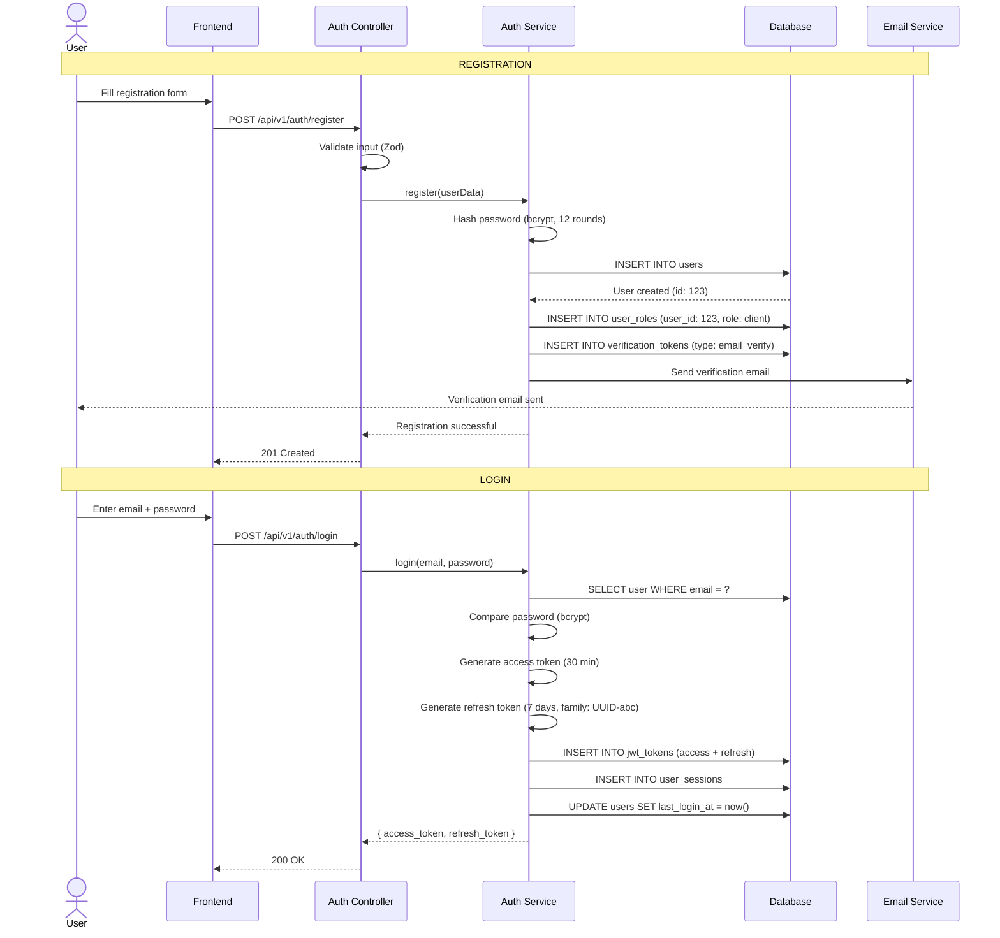


### Forgot Password + Reset Password Flow

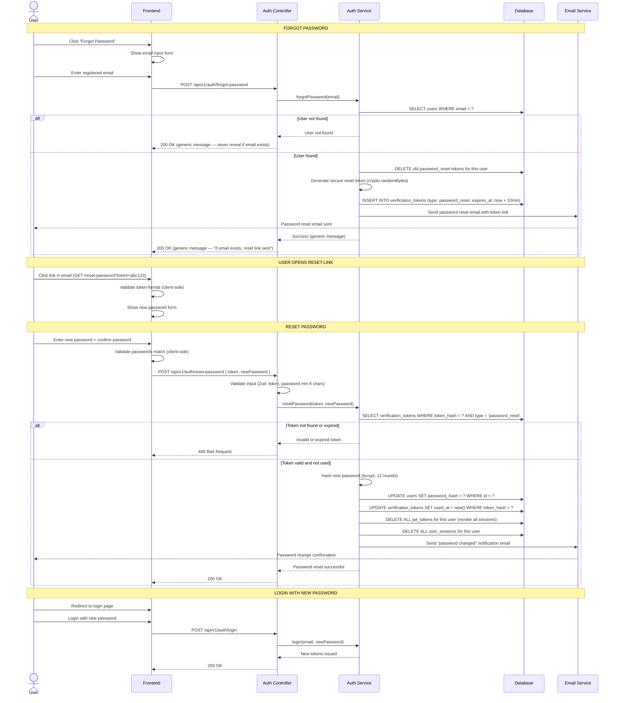


### Password Reset — Security Rules

1. **Never reveal whether an email exists** — Always return the same generic message ("If an account with that email exists, a reset link has been sent") whether the email is found or not. This prevents email enumeration attacks.
2. **Token expiry: 10 minutes** — Reset tokens expire after 10 minutes. After expiry, the user must request a new link.
3. **Single-use tokens** — Once a reset token is used, it's marked as `used_at`. Reusing it returns an error.
4. **Old tokens deleted** — When a new reset is requested, all previous reset tokens for that user are deleted. Only the latest link works.
5. **All sessions revoked** — After a successful password reset, ALL existing JWT tokens and sessions for that user are revoked. The user must log in again on all devices.
6. **Notification email sent** — After password is changed, a confirmation email is sent to the user ("Your password was changed. If you didn't do this, contact support immediately.").
7. **Token stored as hash** — The raw token is sent to the user via email. Only the hash is stored in the database (SHA-256). This means even if the database is compromised, the reset links can't be forged.
8. **Rate limiting** — The forgot-password endpoint is rate-limited to 3 requests per IP per hour to prevent abuse.


### Password Reset — Data Flow

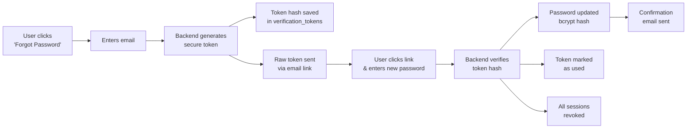


### Product CRUD with Review Workflow

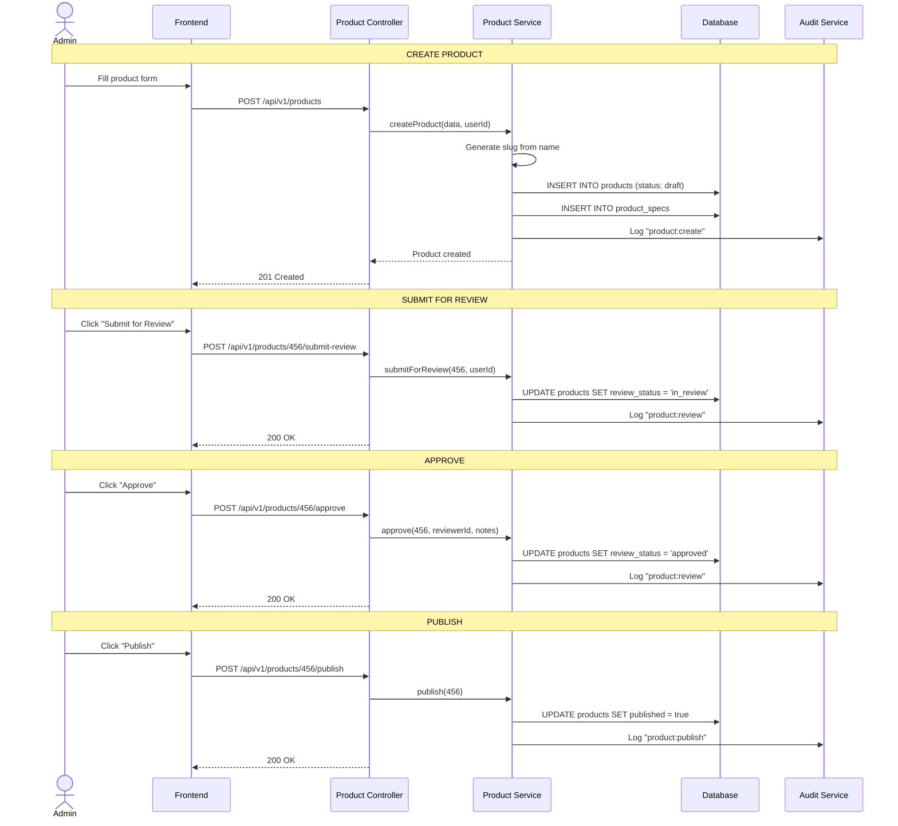


### Invoice Creation + LLM Review + PDF Generation

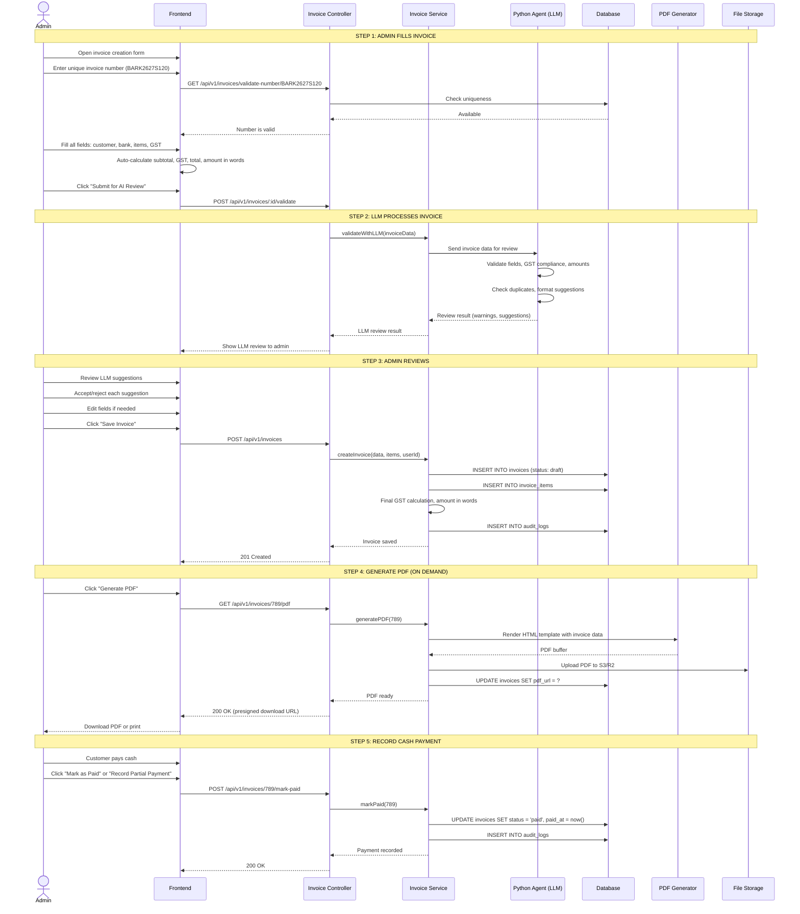


### Frontend ↔ Agent Chat Integration

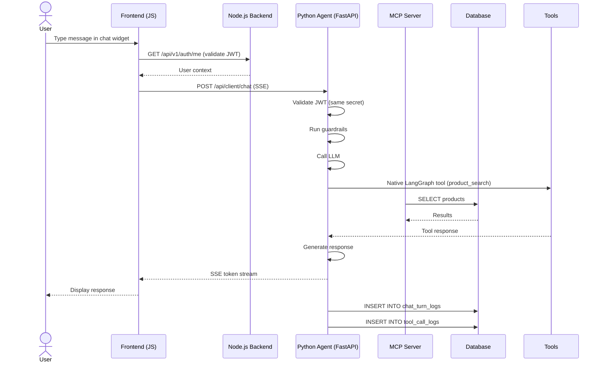


---


## 22. Data Flow Diagrams


### DFD Level 1

```mermaid
graph TD
    subgraph "External Entities"
        Customer["Customer"]
        Admin["Admin User"]
        Agent["Python Agent"]
        EmailProvider["Resend API"]
    end

    subgraph "Processes"
        P1["1.0 Auth & User Management"]
        P2["2.0 Product Catalog"]
        P3["3.0 Lead & RFQ Processing"]
        P4["4.0 Invoice Management"]
        P5["5.0 Stock & Inventory"]
        P6["6.0 CMS & Content"]
        P7["7.0 Analytics"]
        P8["8.0 Email Automation"]
        P9["9.0 Chat Integration"]
        P10["10.0 Audit Logging"]
    end

    subgraph "Data Stores"
        DS1[("users, roles<br/>jwt_tokens, sessions")]
        DS2[("products, categories<br/>specs, media, documents")]
        DS3[("inquiries<br/>rfq_items")]
        DS4[("invoices<br/>invoice_items, sequences")]
        DS5[("product_stocks<br/>stock_logs")]
        DS6[("case_studies, news<br/>blog, faqs, pages")]
        DS7[("analytics_events<br/>search_logs")]
        DS8[("email_subscribers<br/>email_sequences")]
        DS9[("chat_turn_logs<br/>tool_call_logs")]
        DS10[("audit_logs")]
    end

    Customer -->|"Register/Login"| P1
    Customer -->|"Browse products"| P2
    Customer -->|"Submit inquiry"| P3
    Customer -->|"Subscribe"| P8
    Customer -->|"Chat"| P9

    Admin -->|"Manage all"| P1
    Admin -->|"CRUD products"| P2
    Admin -->|"Manage leads"| P3
    Admin -->|"Create invoices"| P4
    Admin -->|"Manage stock"| P5
    Admin -->|"Manage content"| P6
    Admin -->|"View dashboard"| P7

    Agent -->|"Read products"| P2
    Agent -->|"Read FAQs"| P6
    Agent -->|"Write chat logs"| P9

    P1 --> DS1
    P2 --> DS2
    P3 --> DS3
    P4 --> DS4
    P4 --> DS5
    P5 --> DS5
    P6 --> DS6
    P7 --> DS7
    P8 --> DS8
    P8 --> EmailProvider
    P9 --> DS9
    P10 --> DS10
```


### Inquiry to Invoice Flow

```mermaid
graph LR
    A["Customer submits inquiry"] --> B["Inquiry created: new"]
    B --> C["Auto-assigned"]
    C --> D["Admin contacts: contacted"]
    D --> E["Admin fills invoice form"]
    E --> F["LLM validates & suggests"]
    F --> G["Admin reviews LLM output"]
    G --> H["Invoice saved: draft"]
    H --> I["Admin generates PDF"]
    I --> J["Invoice sent to customer"]
    J --> K["Customer pays cash"]
    K --> L["Admin records payment: paid"]
    L --> M["Inquiry: won"]
```


### Product Publishing Flow

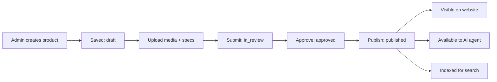


---


## 23. Project Directory Structure

```
bark-backend/
├── src/
│   ├── config/
│   │   ├── database.ts          # Mongoose client, connection pool
│   │   ├── redis.ts             # Redis client setup
│   │   ├── storage.ts           # S3/R2 client setup
│   │   ├── env.ts               # Zod-validated env vars
│   │   └── logger.ts            # Pino logger
│   ├── middleware/
│   │   ├── auth.ts              # JWT verification
│   │   ├── rbac.ts              # Role-based access control
│   │   ├── rateLimit.ts         # Redis-backed rate limiting
│   │   ├── validate.ts          # Zod validation middleware
│   │   ├── errorHandler.ts      # Global error handler
│   │   ├── audit.ts             # Audit logging middleware
│   │   └── cors.ts              # CORS configuration
│   ├── modules/
│   │   ├── auth/                # auth.routes, controller, service, repository, validation
│   │   ├── products/            # products.routes, controller, service, repository, validation
│   │   ├── categories/          # categories.routes, controller, service, repository
│   │   ├── inquiries/           # inquiries.routes, controller, service, repository, validation
│   │   │   └── rfq/             # rfq.routes, service, repository
│   │   ├── invoices/            # invoices.routes, controller, service, repository, validation
│   │   ├── stock/               # stock.routes, controller, service, repository
│   │   ├── cms/
│   │   │   ├── case-studies/    # case-studies.routes, service, repository
│   │   │   ├── news/            # news.routes, service, repository
│   │   │   ├── blog/            # blog.routes, service, repository
│   │   │   ├── faqs/            # faqs.routes, service, repository
│   │   │   ├── offices/         # offices.routes, service
│   │   │   └── pages/           # pages.routes, service
│   │   ├── installations/       # installations.routes, service, repository
│   │   ├── campaigns/           # campaigns.routes, service, repository
│   │   ├── analytics/           # analytics.routes, service, repository
│   │   ├── email/               # email.routes, service, repository
│   │   ├── chat/                # chat.routes, service, repository
│   │   ├── users/               # users.routes, controller, service, repository
│   │   └── audit/               # audit.routes, service, repository
│   ├── services/                # Shared: fileStorage, pdfGenerator, emailClient, queue
│   ├── workers/                 # emailWorker, analyticsWorker, stockAlertWorker, pdfWorker
│   ├── utils/                   # slug, gst, amountInWords, invoiceNumber, date, pagination
│   ├── types/                   # TypeScript type definitions
│   ├── plugins/                 # Fastify plugins (auth, swagger, error)
│   └── app.ts                   # Fastify app setup
├── models/
│   ├── index.ts               # Export all models
│   ├── migrations/              # Migration files
│   └── seed.ts                  # Seed data
├── tests/
│   ├── unit/                    # Service tests
│   ├── integration/             # API endpoint tests
│   └── fixtures/                # Test data factories
├── docker/
│   ├── Dockerfile               # Multi-stage build
│   └── docker-compose.yml       # Local development
├── .env.example
├── package.json
├── tsconfig.json
└── README.md
```

---


## 24. API Endpoint Reference


### Auth — /api/v1/auth


| Method | Endpoint         | Auth          | Description               |
| ------ | ---------------- | ------------- | ------------------------- |
| POST   | /register        | Public        | Register new user         |
| POST   | /login           | Public        | Login (returns tokens)    |
| POST   | /refresh         | Public        | Refresh access token      |
| POST   | /logout          | Authenticated | Revoke refresh token      |
| POST   | /verify-email    | Public        | Verify email with token   |
| POST   | /forgot-password | Public        | Request password reset    |
| POST   | /reset-password  | Public        | Reset password with token |
| GET    | /me              | Authenticated | Get current user profile  |
| GET    | /google          | Public        | Redirect to Google OAuth  |
| GET    | /google/callback | Public        | Google OAuth callback     |


### Users — /api/v1/users


| Method | Endpoint  | Auth  | Description      |
| ------ | --------- | ----- | ---------------- |
| GET    | /         | Admin | List all users   |
| GET    | /:id      | Admin | Get user by ID   |
| PUT    | /:id      | Admin | Update user      |
| PUT    | /:id/role | Admin | Change user role |
| DELETE | /:id      | Admin | Deactivate user  |


### Products — /api/v1/products


| Method | Endpoint                       | Auth   | Description                                |
| ------ | ------------------------------ | ------ | ------------------------------------------ |
| GET    | /                              | Public | List products (pagination, search, filter) |
| GET    | /:slug                         | Public | Get product by slug                        |
| POST   | /                              | Admin  | Create product                             |
| PUT    | /:id                           | Admin  | Update product                             |
| DELETE | /:id                           | Admin  | Soft delete                                |
| POST   | /:id/submit-review             | Admin  | Submit for review                          |
| POST   | /:id/approve                   | Admin  | Approve                                    |
| POST   | /:id/reject                    | Admin  | Reject with notes                          |
| POST   | /:id/publish                   | Admin  | Publish                                    |
| POST   | /:id/unpublish                 | Admin  | Unpublish                                  |
| GET    | /:id/specs                     | Public | Get specifications                         |
| POST   | /:id/specs                     | Admin  | Add specification                          |
| PUT    | /:id/specs/:specId             | Admin  | Update specification                       |
| DELETE | /:id/specs/:specId             | Admin  | Delete specification                       |
| POST   | /:id/media                     | Admin  | Upload media                               |
| PUT    | /:id/media/:mediaId            | Admin  | Update media                               |
| DELETE | /:id/media/:mediaId            | Admin  | Delete media                               |
| POST   | /:id/documents                 | Admin  | Upload document                            |
| GET    | /:id/documents/:docId/download | Admin  | Download document                          |
| DELETE | /:id/documents/:docId          | Admin  | Delete document                            |
| GET    | /:id/related                   | Public | Get related products                       |


### Categories — /api/v1/categories


| Method | Endpoint | Auth   | Description                |
| ------ | -------- | ------ | -------------------------- |
| GET    | /        | Public | List categories (tree)     |
| GET    | /:id     | Public | Get category with products |
| POST   | /        | Admin  | Create category            |
| PUT    | /:id     | Admin  | Update category            |
| DELETE | /:id     | Admin  | Delete category            |


### Inquiries — /api/v1/inquiries


| Method | Endpoint               | Auth   | Description              |
| ------ | ---------------------- | ------ | ------------------------ |
| POST   | /                      | Public | Submit inquiry           |
| GET    | /                      | Admin  | List inquiries (filters) |
| GET    | /:id                   | Admin  | Get inquiry details      |
| PUT    | /:id                   | Admin  | Update inquiry           |
| PUT    | /:id/status            | Admin  | Change status            |
| PUT    | /:id/assign            | Admin  | Assign to user           |
| GET    | /:id/rfq-items         | Admin  | Get RFQ items            |
| POST   | /:id/rfq-items         | Admin  | Add RFQ item             |
| DELETE | /:id/rfq-items/:itemId | Admin  | Remove RFQ item          |
| GET    | /stats                 | Admin  | Dashboard stats          |


### Invoices — /api/v1/invoices


| Method | Endpoint                 | Auth  | Description                             |
| ------ | ------------------------ | ----- | --------------------------------------- |
| GET    | /                        | Admin | List invoices                           |
| GET    | /:id                     | Admin | Get invoice with items                  |
| POST   | /                        | Admin | Create invoice (admin fills all fields) |
| PUT    | /:id                     | Admin | Update invoice (draft only)             |
| POST   | /:id/validate            | Admin | Send to LLM for AI review               |
| POST   | /:id/approve-review      | Admin | Accept LLM suggestions                  |
| POST   | /:id/submit              | Admin | Mark as sent to customer                |
| POST   | /:id/mark-paid           | Admin | Record full cash payment                |
| POST   | /:id/partial-payment     | Admin | Record partial cash payment             |
| POST   | /:id/cancel              | Admin | Cancel invoice                          |
| GET    | /:id/pdf                 | Admin | Generate/download PDF                   |
| GET    | /next-number             | Admin | Get next available invoice number       |
| GET    | /validate-number/:number | Admin | Check if invoice number is unique       |
| GET    | /stats                   | Admin | Revenue stats                           |


### Stock — /api/v1/stock


| Method | Endpoint            | Auth   | Description           |
| ------ | ------------------- | ------ | --------------------- |
| GET    | /                   | Admin  | List stock levels     |
| GET    | /:productId         | Admin  | Get stock for product |
| PUT    | /:productId         | Admin  | Update stock          |
| POST   | /:productId/add     | Admin  | Add stock             |
| POST   | /:productId/remove  | Admin  | Remove stock          |
| POST   | /:productId/adjust  | Admin  | Set stock quantity    |
| POST   | /:productId/reserve | System | Reserve for invoice   |
| POST   | /:productId/release | System | Release reservation   |
| GET    | /:productId/logs    | Admin  | Stock change history  |
| GET    | /low                | Admin  | Low stock products    |


### CMS — /api/v1/{content-type}

Standard CRUD for each content type (case-studies, news, blog, faqs, offices, pages) plus publish/unpublish and review workflow endpoints for blog posts.

### Installations — /api/v1/installations


| Method | Endpoint            | Auth   | Description  |
| ------ | ------------------- | ------ | ------------ |
| GET    | /                   | Public | List active  |
| GET    | /:id                | Public | Get details  |
| POST   | /                   | Admin  | Create       |
| PUT    | /:id                | Admin  | Update       |
| DELETE | /:id                | Admin  | Delete       |
| POST   | /:id/media          | Admin  | Add media    |
| DELETE | /:id/media/:mediaId | Admin  | Remove media |


### Campaigns — /api/v1/campaigns


| Method | Endpoint                 | Auth  | Description            |
| ------ | ------------------------ | ----- | ---------------------- |
| GET    | /posts                   | Admin | List posts             |
| POST   | /posts                   | Admin | Create post            |
| PUT    | /posts/:id               | Admin | Update post            |
| DELETE | /posts/:id               | Admin | Delete post            |
| POST   | /posts/:id/submit-review | Admin | Submit for review      |
| POST   | /posts/:id/approve       | Admin | Approve                |
| POST   | /posts/:id/reject        | Admin | Reject                 |
| POST   | /posts/:id/publish       | Admin | Publish via Claude Ads |
| POST   | /posts/:id/publish-social | Admin | Publish to social media platforms |
| GET    | /posts/:id/publish-logs  | Admin | Get social publish history |


### Social Media — /api/v1/social


| Method | Endpoint                          | Auth  | Description                           |
| ------ | --------------------------------- | ----- | ------------------------------------- |
| GET    | /platforms                        | Admin | List connected platforms + status     |
| POST   | /platforms/:platform/connect      | Admin | Connect platform (OAuth flow)         |
| DELETE | /platforms/:platform/disconnect   | Admin | Disconnect platform                   |
| POST   | /publish                          | Admin | Publish to multiple platforms at once |
| POST   | /publish/batch                    | Admin | Batch publish (scheduled)             |
| GET    | /publish/:id/status               | Admin | Check publish status per platform     |
| DELETE | /publish/:id                      | Admin | Delete/unpublish post                 |
| GET    | /analytics/:platform              | Admin | Platform-specific metrics             |
| GET    | /analytics/overview               | Admin | Cross-platform analytics dashboard    |
| POST   | /caption/generate                 | Admin | AI-generate caption for platform      |
| GET    | /settings                         | Admin | Platform config + approval workflow   |
| PUT    | /settings                         | Admin | Update publish settings               |


### Analytics — /api/v1/analytics


| Method | Endpoint             | Auth   | Description    |
| ------ | -------------------- | ------ | -------------- |
| POST   | /events              | Public | Track event    |
| GET    | /dashboard           | Admin  | Dashboard data |
| GET    | /events              | Admin  | List events    |
| GET    | /events/top-pages    | Admin  | Top pages      |
| GET    | /events/top-products | Admin  | Top products   |
| GET    | /search              | Admin  | Search logs    |
| GET    | /search/trends       | Admin  | Search trends  |


### Email — /api/v1/email


| Method | Endpoint            | Auth   | Description      |
| ------ | ------------------- | ------ | ---------------- |
| POST   | /subscribe          | Public | Subscribe        |
| DELETE | /subscribe          | Public | Unsubscribe      |
| GET    | /subscribers        | Admin  | List subscribers |
| GET    | /sequences          | Admin  | List sequences   |
| POST   | /sequences          | Admin  | Create sequence  |
| PUT    | /sequences/:id      | Admin  | Update sequence  |
| GET    | /sequences/:id/logs | Admin  | Sequence logs    |


### Chat — /api/v1/chat


| Method | Endpoint            | Auth   | Description         |
| ------ | ------------------- | ------ | ------------------- |
| GET    | /history/:sessionId | Client | Chat history        |
| GET    | /turns              | Admin  | List turns          |
| GET    | /turns/:id          | Admin  | Turn details        |
| GET    | /stats              | Admin  | Statistics          |
| GET    | /stats/daily        | Admin  | Daily volume        |
| GET    | /stats/intents      | Admin  | Intent distribution |


### Audit — /api/v1/audit


| Method | Endpoint                 | Auth  | Description      |
| ------ | ------------------------ | ----- | ---------------- |
| GET    | /logs                    | Admin | List audit logs  |
| GET    | /logs/:id                | Admin | Audit detail     |
| GET    | /logs/user/:userId       | Admin | User actions     |
| GET    | /logs/resource/:type/:id | Admin | Resource history |
| GET    | /export                  | Admin | Export CSV       |


### Health — /api/v1/health


| Method | Endpoint | Auth   | Description            |
| ------ | -------- | ------ | ---------------------- |
| GET    | /        | Public | Health check           |
| GET    | /ready   | Public | Readiness (DB + Redis) |


---


## 25. Deployment Architecture


### Docker

Multi-stage Dockerfile: Stage 1 (Build) — install deps, compile TypeScript, Mongoose models compile. Stage 2 (Production) — copy built files, Alpine image, non-root user.

docker-compose.yml: MongoDB 16 Alpine, Redis 7 Alpine, Node.js app with hot-reload, volume mounts for persistence.

### Kubernetes

Namespace: bark-production. Deployments: bark-backend (3 replicas, HPA), email-worker (2 replicas), analytics-worker (1 replica), stock-alert-worker (1 replica). Service: ClusterIP. Ingress: barktechnologies.in → bark-backend. ConfigMap + Secret for configuration. HPA: min 3, max 10 replicas.

### CI/CD

GitHub Push → GitHub Actions → Lint (ESLint) → Type Check (TypeScript) → Unit Tests (Vitest) → Integration Tests → Build Docker → Push to Registry → Deploy to Staging → Smoke Tests → Deploy to Production (manual approval).

---


## 26. Integration with Python Agent System


### How the Two Systems Coexist

```
┌──────────────────────────────────────────────────────────┐
│                      Frontend                            │
│  Jinja2 Templates + Vanilla JS + Fetch API               │
│                                                          │
│  ┌──────────────────┐    ┌──────────────────────────┐   │
│  │  REST API Calls   │    │  SSE (AI Chat Stream)    │   │
│  │  to Node.js       │    │  to Python Agent         │   │
│  └────────┬─────────┘    └──────────┬───────────────┘   │
└───────────┼──────────────────────────┼───────────────────┘
            │                          │
            ▼                          ▼
┌───────────────────┐    ┌─────────────────────────────┐
│  Node.js Backend  │    │  Python Agent (FastAPI)      │
│  Port 3000        │    │  Port 8000                   │
│                   │    │                               │
│  Auth, Products,  │    │  Client Agent (DeepSeek)      │
│  Invoices, Leads, │    │  Admin Agent (MiMo)           │
│  Stock, CMS,      │    │  Native @tools (MongoDB)      │
│  Email, Analytics,│    │  External MCP (7 servers)     │
│  Audit            │    │  Guardrails + Observability    │
└────────┬──────────┘    └──────────┬──────────────────┘
         │                          │
         ▼                          ▼
┌──────────────────────────────────────────────────────────┐
│  MongoDB ─── Both read/write same collections            │
│  Redis ──────── Both use for sessions, rate limiting     │
│  S3/R2 ──────── Node workers + Media MCP                 │
│  JWT Secret ─── Same secret, same token format          │
└──────────────────────────────────────────────────────────┘
```

### External MCP map (owned by Python agent; Node triggers via chat / internal API)

| MCP | Port | Bark need | Node.js touchpoint |
|-----|------|-----------|--------------------|
| WhatsApp | 8020 | RFQ / login alerts | Inquiry create → agent notify; Chat module |
| Email (Resend) | 8021 | Inquiry ack, invoice email, sequences | Email module + agent `send_email` |
| Media (S3/R2) | 8022 | Product media, datasheets, PDF objects | Presigned upload API + Media MCP |
| Calendar | 8023 | Installation / demo scheduling | Installations module |
| Web Research | 8024 | Read-only RFQ research | Lead agent only (no Node REST) |
| Claude Ads | 8030 | Publish campaigns | Campaigns `POST .../publish` |
| Canvas | 8040 | Creatives / brochures | Campaigns + product media |

Core catalog / invoice / FAQ stay **native LangGraph tools** (not MCP). No payment-gateway MCP.

### Integration Points

1. **Shared Database**: Both connect to same MongoDB. Agent reads products/FAQs via **native tools** (not MCP). Agent writes chat logs. Node.js reads chat logs for admin dashboard.
2. **JWT Auth**: Node.js issues tokens. Python agent verifies with same JWT_SECRET. Frontend validates JWT with Node.js, then uses same token for agent SSE.
3. **Chat History**: Agent writes to chat_turn_logs/tool_call_logs. Node.js exposes /api/v1/chat/* endpoints reading these collections.
4. **Observability**: Agent traces in MongoDB (including MCP tool calls). Node.js provides /api/v1/admin/observability/* for admin dashboard.
5. **File Storage**: Same S3/R2 bucket — Node issues REST presigns; admin agent can also use **Media MCP**.
6. **External MCP**: WhatsApp, Email, Media, Calendar, Ads, Canvas, Web Research run beside the FastAPI agent; Node does not host MCP processes.

---


## 27. Implementation Roadmap


### Phase 1: Foundation (Weeks 1-2)

Project setup (Node.js, TypeScript, Fastify, Mongoose), MongoDB collections, environment config, auth module (JWT, login, register, refresh, logout), RBAC middleware, global error handler, audit middleware, Docker setup.

### Phase 2: Core Modules (Weeks 3-4)

Products CRUD (specs, media, docs), categories (hierarchical), product review workflow, file storage (S3/R2, presigned URLs), inquiries CRUD (UTM tracking), inquiry status workflow, auto-assignment.

### Phase 3: Business Logic (Weeks 5-6)

Invoices CRUD (admin fills all fields including ship-to / delivery mode, unique invoice number `BARK26-27S001`), LLM invoice processing (validate fields, GST compliance, duplicate detection, formatting suggestions via Python agent), invoice review workflow (admin reviews LLM output), PDF generation (Python WeasyPrint tax-invoice template, on-demand; agent uses native tools), manual payment status recording (paid/partial — no payment gateway), stock management (CRUD, reservation, release, logs), low stock alerts (BullMQ), amount in words (Indian numbering).

### Phase 4: Content & Marketing (Weeks 7-8)

CMS modules (case studies, news, blogs, FAQs, pages, offices), blog review workflow, installations showcase (Calendar MCP for demos), campaigns (Claude Ads MCP + Canvas MCP + Media MCP), email module (subscribers, sequences; Email MCP for agent-driven sends), email workers.

### Phase 5: Analytics & Integration (Weeks 9-10)

Analytics tracking (events from frontend), search logging, dashboard aggregation, chat integration (history API, observability proxy including MCP tool chains), WhatsApp/Email/Media/Calendar/Web Research MCP wiring via Python agent, audit export, admin dashboard API.

### Phase 6: Security & Production (Weeks 11-12)

Rate limiting (Redis-backed, 3 tiers), input validation (Zod on all endpoints), security headers (Helmet), CORS hardening, API documentation (Swagger), load testing, deployment (Docker + Kubernetes), monitoring (health checks).

### Phase 7: Testing & Polish (Weeks 13-14)

Unit tests (service layer), integration tests (API endpoints), E2E tests (critical flows), error handling (edge cases), documentation, performance optimization.

---


## Appendix A: MongoDB Collection Summary


| Module        | Collections                                                                                                                                | Key Relationships                                   |
| ------------- | ------------------------------------------------------------------------------------------------------------------------------------- | --------------------------------------------------- |
| Auth          | roles, permissions, role_permissions, users, user_roles, user_sessions, jwt_tokens, verification_tokens, api_tokens, api_token_scopes | users → roles (M:M), users → sessions (1:M)         |
| Products      | categories, products, product_specs, product_media, product_documents, related_products, site_settings                                | products → categories (M:1), products → specs (1:M) |
| Leads         | inquiries, rfq_items                                                                                                                  | inquiries → rfq_items (1:M)                         |
| Invoices      | invoices, invoice_items, invoice_sequences                                                                                            | invoices → invoice_items (1:M)                      |
| Stock         | product_stocks, stock_logs                                                                                                            | product_stocks → products (1:1)                     |
| CMS           | case_studies, case_study_products, news_articles, news_article_products, blog_posts, faqs, offices, pages                             | case_studies → products (M:M)                       |
| Installations | product_installations, installation_media                                                                                             | installations → media (1:M)                         |
| Campaigns     | content_posts                                                                                                                         | content_posts → products (M:1)                      |
| Analytics     | analytics_events, search_logs                                                                                                         | —                                                   |
| Email         | email_subscribers, email_sequences, email_sequence_logs                                                                               | email_sequence_logs → subscribers (M:1)             |
| Chat          | chat_turn_logs, tool_call_logs                                                                                                        | tool_call_logs → chat_turn_logs (M:1)               |
| Audit         | audit_logs                                                                                                                            | —                                                   |


---


## Appendix B: Glossary


| Term                      | Definition                                                    |
| ------------------------- | ------------------------------------------------------------- |
| **Fastify**               | High-performance Node.js web framework                        |
| **Mongoose**              | TypeScript-friendly ODM for MongoDB                        |
| **Zod**                   | TypeScript schema validation library                          |
| **JWT**                   | JSON Web Token for stateless authentication                   |
| **RBAC**                  | Role-Based Access Control                                     |
| **BullMQ**                | Redis-based job queue for background processing               |
| **Pino**                  | Fast JSON logger for Node.js                                  |
| **WeasyPrint**            | Python HTML/CSS → PDF for Bark TAX INVOICE layout             |
| **Presigned URL**         | Temporary URL for direct S3/R2 access                         |
| **Family-based rotation** | JWT refresh token rotation that detects theft via token reuse |
| **GST**                   | Goods and Services Tax (Indian tax system)                    |
| **HSN**                   | Harmonized System of Nomenclature (product classification)    |
| **UTM**                   | Urchin Tracking Module parameters for campaign attribution    |


---

*Document version: 1.0 | Last updated: 2026-07-17*
*See also:* `python_ai_agent_architecture.md` *for the AI agent layer*
*See also:* `databse_schema.txt` *for complete database schema*